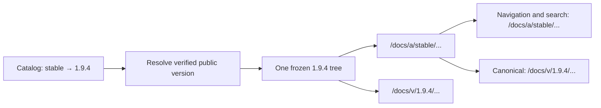

# Design: Catalog-managed documentation version aliases

Generated by /office-hours on 2026-10-07
Branch: main
Repo: forge-trust/AppSurface
Issue: [#176](https://github.com/forge-trust/AppSurface/issues/176)
Status: APPROVED
Mode: Builder (open source / research)

## Problem Statement

[AppSurface Docs versioning](../../Web/ForgeTrust.AppSurface.Docs/README.md#published-version-catalog) currently exposes one catalog-selected release at the route-family root, with separate exact release archives and live source docs. Maintainers need any number of named release entries, such as `preview`, `stable`, `lts`, or `v2`, without assigning those words special behavior in the runtime.

The user's central requirement was: “ideally anyone should be able to define any number of labels here right?” Their preferred example conventions are `preview` for the latest published prerelease and `stable` for the latest stable release. Maintainers or their release automation select those exact targets. The runtime does not decide what “latest,” “stable,” or “supported” means.

## What Makes This Useful

A team can publish a moving `v2` entry for the major line its readers run, or a `training` entry used in course material, while preserving the exact version behind every page. Changing a catalog pointer changes the friendly entry after the host restarts; it does not rebuild or modify the older release tree. These are possible uses, not evidence of existing customer demand.

## Approved Decisions and Constraints

- Use Approach B: alias records under `{RouteRootPath}/a/{name}`. Records make targets, display metadata, and visibility explicit; one namespace prevents every alias from becoming a reserved document slug.
- Extend the existing [published-tree and canonical URL contract](../../Web/ForgeTrust.AppSurface.Docs/README.md#route-contract). Serve alias pages at alias URLs, keep navigation and search in that tree, and identify the exact release in canonical metadata.
- Preserve `recommendedVersion` as the independent selector for the route-family root. Defining `stable` does not automatically change `/docs`.
- Preserve live source docs at the configured `DocsRootPath` (`/docs/next` by default), the archive at `{RouteRootPath}/versions`, and exact releases at `{RouteRootPath}/v/{version}`.
- Any number of labels may be authored. There is no built-in label set or alias-count ceiling. Individual names are bounded for safe routing.
- A label targets one exact entry from `versions[]`. No alias chains, semantic-version ranking, runtime Git, network fetches, or fallback to another release.
- Aliases cannot expose a hidden or unavailable release. Existing [archive verification](../../Web/ForgeTrust.AppSurface.Docs/README.md#availability-and-failure-behavior) and trusted-root rules remain the authority.
- Catalogs load once for a host lifetime today. Catalog edits require a restart or redeploy; hot reload is outside this issue.

The user explicitly approved these premises and the archive presentation below. The user approved the complete reviewed design on 2026-10-07 (D8/A).

## Cross-Model Perspective

A fresh Codex subagent supported the general alias-to-exact-version model and suggested `v2` as another useful convention. It recommended an alias-record array, the dedicated namespace, preserving the resolved catalog's existing constructor/deconstruction API, and terminal failure for requests that cannot be served by the selected tree. It challenged none of the approved premises. The URL namespace was an assumption in its opinion and was subsequently chosen by the user.

[mike](https://github.com/jimporter/mike#adding-a-new-version-alias) provides a comparable maintainer-controlled alias concept; its MkDocs publishing machinery is not a dependency to import. [Material for MkDocs](https://squidfunk.github.io/mkdocs-material/setup/setting-up-versioning/#version-alias) supports displaying alias and version together. [Read the Docs](https://docs.readthedocs.com/platform/stable/versions.html#versions-are-git-tags-and-branches) reserves particular label semantics, which AppSurface deliberately leaves to consuming applications.

## Approaches Considered

- A, small name-to-version map: not selected because per-alias display metadata and visibility would require later schema expansion.
- B, alias records in one dedicated namespace: selected for the complete metadata contract and predictable route ownership.
- C, alias records directly under the route root: not selected because arbitrary labels could shadow documents, built-in routes, or custom live roots.

## Catalog and Public API Contract

Add `List<AppSurfaceDocsVersionAlias> Aliases` to [AppSurfaceDocsVersionCatalog](../../Web/ForgeTrust.AppSurface.Docs/AppSurfaceDocsVersionCatalog.cs), defaulting to an empty list. The new public descriptor has these fields:

| JSON / C# property | Behavior and default |
| --- | --- |
| `name` / `Name` | Required URL label. Trim and lowercase invariantly. Length 1–64. Start and end with an ASCII letter or digit; interior characters may also include dot, underscore, or hyphen. Single-character labels are allowed. Reject slashes, backslashes, percent escapes, spaces, query/fragment delimiters, and dot segments. |
| `version` / `Version` | Required exact catalog version identifier, trimmed and matched using the existing ordinal-ignore-case version comparison. It is looked up only in `versions[]`, never in `aliases[]`. |
| `label` / `Label` | Optional reader-facing display text; blank or absent defaults to the normalized name. |
| `summary` / `Summary` | Optional descriptive text; blank or absent means no summary. Render both text fields through normal Razor encoding. |
| `visibility` / `Visibility` | `Public` by default, or `Hidden`, using the existing explicit [version visibility values](../../Web/ForgeTrust.AppSurface.Docs/AppSurfaceDocsVersionCatalog.cs). Hidden means neither mounted nor listed through the alias; it is not an access-control feature. An unknown value invalidates that alias. |

For example, this fragment can be added to a catalog that already contains verified public entries for the referenced versions:

```json
{
  "aliases": [
    {
      "name": "preview",
      "version": "2.0.0-rc.1",
      "label": "Preview",
      "summary": "Latest published prerelease",
      "visibility": "Public"
    },
    {
      "name": "stable",
      "version": "1.9.4",
      "label": "Stable",
      "summary": "Latest stable release",
      "visibility": "Public"
    },
    {
      "name": "lts",
      "version": "1.8.7",
      "label": "Long-term support"
    }
  ]
}
```

These versions are illustrative. The aliases do not manufacture version entries, archive paths, or manifest pins. A label such as `v2` may point to any exact version the maintainer chooses; AppSurface does not validate the semantic meaning of its spelling.

Extend [AppSurfaceDocsResolvedVersionCatalog](../../Web/ForgeTrust.AppSurface.Docs/Services/AppSurfaceDocsVersionCatalogService.cs) with additive, non-positional properties for resolved aliases and whether the alias namespace is active. Keep its existing four-argument constructor, deconstruction, and sentinel behavior available. Old callers obtain an empty alias collection and inactive namespace by default.

Introduce a resolved alias read model with normalized name, display metadata, visibility, configured exact target, resolved public target when eligible, alias root URL, availability, and a stable diagnostic code plus sanitized explanation. Host-side catalog consumers may inspect configuration errors; the reader-facing archive projection must not expose hidden release identifiers or filesystem paths. Preserve authored order among unique names. Alias metadata does not override the target release's support or advisory state.

Add URL-builder methods for an alias root and alias-local document URL, analogous to [BuildVersionRootUrl and BuildVersionDocUrl](../../Web/ForgeTrust.AppSurface.Docs/Services/DocsUrlBuilder.cs). Validate and normalize names using the same helper as the catalog; use the configured route family rather than a literal `/docs`.

### Parsing and resolution

Parse alias declaration state before trusted-root or target verification so a configured namespace remains owned even if every target is unavailable. Resolution rules:

1. Missing `aliases`, `null`, or an empty array means inactive alias routing and an empty alias list.
2. A nonempty array activates namespace ownership, including when every item is invalid or hidden. A non-array payload also activates ownership but disables all alias entries with a collection diagnostic. Existing version parsing and healthy exact/recommended mounts continue independently.
3. A malformed item invalidates only that item. Preserve recoverable valid names in the operator read model; never invent a public visibility value or route for a malformed name. For a fully valid descriptor, omitted or null visibility receives the documented Public default. For an invalid descriptor, that default is not evidence that its recovered fields may be shown publicly; use the archive projection rules below.
4. Duplicate normalized names disable all definitions in that group; catalog order never chooses a winner. Report one conflict for that label and retain operator evidence of the conflicting entries. The archive shows at most one unavailable row for a group containing a valid Public definition, using the name as its display text and omitting target and summary. A group containing only hidden or invalid-visibility definitions is omitted.
5. A public alias mounts only when the exact target is present, Public, available, and verified. A hidden alias is never mounted, even when its target is public.
6. Missing, hidden, or unavailable targets do not become another target. Public aliases with a valid definition remain informational in the archive; hidden-target and unknown-target details are suppressed there. If a public target is known but unavailable, its already-public version identifier may be shown.
7. An exact version identifier may equal an alias name. Resolution still uses the exact-version dictionary only; the namespaces remain separate.

Keep alias validity separate from the existing version catalog status. Bad aliases must not poison otherwise healthy release entries. A completely unreadable catalog has no discoverable alias declarations and follows the existing unavailable-catalog behavior; it mounts no published release tree.

### Public archive projection of invalid entries

An invalid object is eligible for one informational row only when it has both a recoverable name that passes the complete name validator and an explicitly supplied, valid `Public` visibility. Missing, null, unknown, or incorrectly typed visibility does not qualify an invalid object. Non-object items and objects with invalid or unrecoverable names never appear in the public archive; they still produce operator diagnostics. Hidden entries remain omitted.

For that invalid row, display only the normalized name and the generic explanation “This release entry is not configured correctly.” Omit recovered label, summary, configured version, target, support/advisory metadata, and link. Those fields are not trusted merely because another field was recoverable. Razor-encode the name and explanation. Duplicate groups follow rule 4 above: a fully valid Public definition qualifies the group for one name-only conflict row; no conflicting target, label, or summary is displayed. A group with no valid Public definition is omitted, even if an invalid member has explicit Public visibility.

A valid Public descriptor whose target cannot be served is a different case: keep its validated label and summary, show a generic availability explanation, and show the exact identifier and support/advisory metadata only if the target is an existing Public version. Unknown or hidden targets contribute no target metadata. Neither case has a link. These rules determine archive inclusion independently of the namespace remaining active.

## Route Ownership and Failure Behavior

| Surface | Default URL | Behavior |
| --- | --- | --- |
| Recommended entry | `/docs` | Existing `recommendedVersion` behavior, including its archive recovery fallback. |
| Live source docs | `/docs/next` | Mutable source-backed docs; not the published `preview` alias. |
| Alias namespace | `/docs/a/{name}` | Selected frozen public release tree, or a terminal alias failure. |
| Exact release | `/docs/v/{version}` | Existing exact-release behavior. |
| Archive | `/docs/versions` | Existing exact entries plus public alias discovery. |

The whole `a` segment and its descendants are owned once alias routing is active. Match on route segments, so `/docs/apple` is unaffected. Determine ownership before published-mount selection, route/file normalization, or a handler can return control to another endpoint. Ownership is sticky for the rest of that request.

- Healthy GET and HEAD requests reuse the selected published tree. Missing pages, unknown/hidden aliases, and unavailable targets return 404 with no content from another tree. GET receives a generic Docs recovery presentation linking to the family's archive; HEAD has the same status/headers without a body. Error copy does not identify hidden targets.
- Unsupported methods under the active namespace return 405 with `Allow: GET, HEAD`; they do not fall through to another handler.
- The namespace root `/docs/a` also returns the generic 404 recovery presentation; it does not redirect to an inferred preferred alias.
- Missing files and per-request archive-integrity refusals must retain namespace ownership. Existing archive-integrity diagnostics remain in force; an unavailable alias response cannot be replaced by the recommended release.
- Instantiate alias ownership/failure handling even when there are zero healthy mounts. Update both the default web module and [named-instance runtime construction](../../Web/ForgeTrust.AppSurface.Docs/AppSurfaceDocsInstances.cs), whose current zero-mount fast paths would otherwise skip the handler.

### Raw request paths and unsafe requests

ASP.NET Core exposes the received request target through `IHttpRequestFeature.RawTarget`; `Request.Path` is decoded except for encoded slashes. Check both representations rather than relying on the decoded path alone. See the [request-feature contract](https://learn.microsoft.com/en-us/dotnet/api/microsoft.aspnetcore.http.features.ihttprequestfeature?view=aspnetcore-10.0). Reuse the escaped-target extraction pattern in [DocsController](../../Web/ForgeTrust.AppSurface.Docs/Controllers/DocsController.cs) instead of using `Uri.AbsolutePath`, which can erase the evidence that validation needs.

1. Extract the escaped path from the raw origin-form or HTTP(S) absolute-form target without URI normalization; remove the query, retaining path segments exactly as received. Compare in application-relative coordinates, accounting for `PathBase` once. Take a separate, single percent-decoded validation view; it is never a route lookup or filesystem path.
2. If the raw path, its single-decoded view, or `Request.Path` has the active alias namespace as a segment prefix, record ownership. Do this before collapsing dot segments or interpreting a suffix. Thus a raw `/docs/a/stable/../guide` remains owned even when the framework path is `/docs/guide`. A decoded prefix such as `/docs/%61/stable` also identifies an alias candidate; encoding is subsequently checked, not treated as a way around ownership. The equivalent rules apply with custom roots, root mounting, named instances, and `PathBase`.
3. For an owned request, reject malformed percent escapes, encoded `/` or `\\`, backslashes, control characters, literal or decoded `.`/`..` segments, and residual percent escapes after the single decode. Require the raw alias-name segment to use the descriptor's allowed ASCII characters; percent-encoded names fail even if they decode to a valid name. Validate the framework path as well, and reject disagreement between its segments and the accepted raw-path view. Do not recursively decode, trim away unsafe segments, rewrite `Request.Path`, or choose a broader mount. Encoded ordinary document characters may use the established content-path rules only after these checks pass.
4. An unsafe owned GET or HEAD returns the same generic 404 recovery response as an unknown alias, with a family-archive link for GET and no body for HEAD. Do not echo the rejected path or configuration details. Unsupported methods take precedence and return 405 with `Allow: GET, HEAD`, even for an unsafe candidate. If `RawTarget` is absent or its path cannot be recovered but `Request.Path` identifies the alias namespace, fail with that same 404/405 response and an operator diagnostic instead of guessing.

This boundary protects the target received by the application. A client or upstream proxy that removes segments before forwarding them has removed evidence the application cannot recover. Hosts must retain the received raw target until this ownership check; server-level rejection before AppSurface runs retains the server's response.

### Collision checks and compatibility

Enabling aliases is explicit opt-in to the new subtree. Before serving:

- Reject overlap between `{RouteRootPath}/a` and the configured live source root in either ancestor direction.
- Reject existing recommended-tree public routes or handler-servable files that occupy `a` or `a/...` relative to the route root. Check the verified file inventory and frozen route identities, including source-shaped and declared redirect aliases; a directory-existence check alone is insufficient. Routes in exact trees under `/v/{version}/a` remain legitimate.
- A detected Docs-owned collision is a startup configuration failure with the conflicting path and a corrective action. Do not silently give the alias or the older document priority. A later catalog target change reruns these checks after restart.
- The library owns the namespace after opt-in. Hosts must relocate custom endpoints under it before enabling aliases; automatic discovery of every arbitrary host route pattern is not promised.
- Existing named-instance root-overlap validation still applies. Each instance resolves aliases through its own catalog and URL builder; no ambient default-instance state is reused.
- Catalogs with absent, null, or empty aliases do not reserve `a`, so existing content, custom live roots, and host endpoints there retain current behavior.

Custom `RouteRootPath=/foo/bar` produces `/foo/bar/a/stable`; root-mounted Docs produces `/a/stable`. Define and compare app-relative roots without `PathBase`. Browser-facing URLs add the request's `PathBase` once, following existing behavior. Preserve the existing origin-only [PublicOrigin contract](../../Web/ForgeTrust.AppSurface.Docs/README.md#route-contract).

## Mounting, Navigation, and Search

Reuse [BuildPublishedTreeMounts](../../Web/ForgeTrust.AppSurface.Docs/AppSurfaceDocsWebModule.cs), [published-tree handling](../../Web/ForgeTrust.AppSurface.Docs/Services/AppSurfaceDocsPublishedTreeHandler.cs), and the existing content rewriter.



Aliases sharing a target reuse its physical provider and frozen-route cache within the existing instance lifetime. They do not reverify or reexport the same tree per label. Aliases have their own mount roots and use the target's exact root as `CanonicalRootPath`.

Rebase ordinary document links, assets, client configuration, search-index document URLs, and frozen-manifest redirects to the alias mount. Preserve query strings in redirects and existing fragment behavior. Canonical links identify the exact target using the current `PublicOrigin` and `PathBase` rules. Do not canonicalize live source pages to a published alias. Operational archive/live-source links, where present, keep their configured family roots rather than becoming alias-local document URLs.

Retargeting a label changes its mounted content and exact canonical metadata together after restart. Old exact URLs, search payloads, and archive bytes remain untouched. Availability in the archive is the startup-resolved catalog state, not a live health monitor; per-request integrity checks can still refuse a file subsequently changed on disk.

## Reader Presentation

The approved sketch extends the current [version archive](../../Web/ForgeTrust.AppSurface.Docs/Views/Docs/Versions.cshtml):


- Show public aliases before the existing exact-release list, in authored order.
- Show display label, normalized name, optional summary, exact public target when known, and availability together. Carry through the target's existing support/advisory information so an alias does not hide a warning.
- Link only healthy aliases. Invalid or unavailable public definitions are informational rows with sanitized explanations. Hidden aliases are omitted.
- Keep the existing exact-release list and recommended marker independent of alias names.
- Label the source-backed action “Open live source docs,” separating it from a catalog label named `preview`.
- With no public alias rows, omit that section entirely and keep the existing archive.
- Long display text wraps within the archive rather than changing the layout width. All metadata is encoded, and normal links remain keyboard accessible.

This issue updates the existing archive selection surface and alias-local navigation/search. It does not retrofit a new global switcher into historical frozen HTML or modify those archives on disk. The sketch's direct-request recovery state defines the generic 404 presentation, not a link to a different release's page.

## Diagnostics and Documentation

Use a stable new `ASDOCSALIAS###` family for alias collection shape, invalid names/metadata, duplicate names, missing target, hidden target, unavailable target, and namespace collision. Operator logs include the catalog entry/group and corrective action. Reader-facing messages omit physical paths and hidden target details. Preserve existing `ASDOCSARCHIVE###` diagnostics for archive trust failures. Allocate and document exact numeric codes during engineering planning; callers should consume a code and structured state, not parse log prose.

Document every new public descriptor, resolved property, URL-builder method, and internal mounting/ownership seam. Update:

- [Docs package reference](../../Web/ForgeTrust.AppSurface.Docs/README.md#published-version-catalog): fields, defaults, ordering, visibility, target constraints, failure statuses, collision checks, restart requirement, and examples.
- [Consumer guide](../../Web/ForgeTrust.AppSurface.Docs/use-appsurface-docs.md): author `preview` and `stable`, add a custom label, retarget safely, and distinguish aliases from exact URLs and live source docs.
- [Repository package entry](../../README.md): link the feature where consumers discover Docs.
- [Append-only release notes](../../releases/README.md#append-only-unreleased-entries): add a feature entry under `releases/unreleased.entries/` when implementation changes behavior.

Pitfalls must be explicit: alias-hidden does not hide an otherwise public exact release; public aliases do not expose hidden versions; label names are not semantic-version selectors; duplicate names have no winner; enabling aliases reserves `a/`; the catalog is not hot-reloaded; alias URLs move and exact URLs should be used for durable citations.

## Verification and Success Criteria

All checks below are planned for implementation; this design session has not changed or tested production code.

| Area | Required behavioral proof |
| --- | --- |
| Parsing | Omitted/null/empty compatibility; multiple arbitrary labels; case and whitespace normalization; length boundaries; unsafe names; null/non-object items; malformed collection; unknown visibility; optional display defaults; authored ordering. |
| Resolution | Multiple labels to one version and labels to different versions; missing, hidden, unavailable, unpinned, and verified public targets; hidden alias to public target; a version identifier equal to an alias name; duplicate case-normalized definitions disabled regardless of order. |
| Ownership | Unknown/hidden aliases, unavailable target, absent page, unsafe request, and zero healthy mounts return alias-local failures; no recommended-tree or host fallback; GET/HEAD and 405 method behavior; `a` versus `apple` segment boundaries. Test raw dot segments with an already-normalized framework path, encoded namespace/name/separators, malformed and residual escapes, raw/framework disagreement, and absent RawTarget, including custom roots and PathBase. |
| Collisions | Live roots that equal, contain, or sit beneath the namespace; recommended-tree canonical/source/redirect routes and servable files under `a`; no namespace reservation when aliases are disabled; named-instance root isolation. |
| Content | Real exported artifacts through alias and exact mounts: HTML navigation, assets, search results, canonical metadata, manifest redirects, query strings, fragments, custom roots, root mounting, `PublicOrigin`, and `PathBase`. |
| UI | Healthy and unavailable public rows; invalid objects included only with a valid name and explicit Public visibility; invalid-name/non-object/defaulted-visibility rows omitted; name-only invalid/conflict rows; hidden rows and hidden target details suppressed; empty section omitted; encoded hostile display text; long labels; public support/advisory warnings retained; live source wording. |
| Compatibility | Compile/use the old resolved-catalog constructor and deconstruction; existing sentinel defaults and recommended fallback; live source and exact-version routes retain behavior; retarget one alias after restart while previous exact content remains available. |
| Resources | Same-target alias mounts share one provider/cache in the instance; instances remain isolated; normal lifetime disposal includes aliases. |

Use public APIs and the established internal test seams, never reflection into private members. Extend the relevant [Docs tests](https://github.com/forge-trust/AppSurface/tree/main/Web/ForgeTrust.AppSurface.Docs.Tests), especially catalog, URL builder, published handler/rewriter, module regressions, archive controller, options, and named instances. Verify branch coverage near 100% for the new parser/resolver/ownership code, then run [solution coverage](https://github.com/forge-trust/AppSurface/blob/main/scripts/coverage-solution.sh) when practical. Format code and resolve introduced compiler, analyzer, and documentation warnings before pushing.

The acceptance proof is two verified exports with distinct page/search content. Read `stable` and `preview` through the alias URLs; confirm matching exact canonicals and alias-local results. Retarget one alias, restart, and confirm only that moving entry changed. Exercise a missing page that exists in the recommended tree and prove it returns 404 rather than that other page.

## Distribution Plan

Ship the additive API through the existing [ForgeTrust.AppSurface.Docs package](../../Web/ForgeTrust.AppSurface.Docs/ForgeTrust.AppSurface.Docs.csproj) and coordinated release process, using the existing [stable](https://github.com/forge-trust/AppSurface/blob/main/.github/workflows/nuget-stable-publish.yml) or [prerelease](https://github.com/forge-trust/AppSurface/blob/main/.github/workflows/nuget-prerelease-publish.yml) NuGet publication lane. A feature merge does not itself publish a package. [Release Publish](https://github.com/forge-trust/AppSurface/blob/main/.github/workflows/release-publish.yml) remains the docs-artifact publishing path.

Upgrade the Docs runtime before adding aliases to a deployed catalog; an older runtime does not implement the new namespace. Alias-free catalogs need no migration. Publish and verify exact artifacts first, update explicit catalog targets atomically, and restart/redeploy the host. Roll back by restoring a prior catalog and restarting; exact releases stay available under their existing immutable URLs.

Provide examples for convention-driven automation, but this issue does not add automatic `preview`/`stable` promotion or change the existing `recommendedVersion` promotion workflow.

## Next Steps and Assignment

1. Engineering review should lock the additive API names, numeric diagnostics, startup ownership checks, and generic recovery rendering using the behavior above.
2. Implement parser/resolution and compatibility tests; then mount ownership and content behavior; then archive projection/UI and documentation.
3. Run the focused behavioral proof, formatting/warning checks, and coverage before creating the feature PR linked to #176.

**The assignment:** choose one real published stable archive and one real published prerelease archive, and prepare a small acceptance catalog with `stable`, `preview`, and one custom label such as `v2`. Record the expected exact URL, alias-local search result, and missing-page outcome before implementation. That fixture gives the engineering review a concrete reader contract to prove.

## What I noticed about how you think

- You moved from “latest and stable” to “preview = latest pre-release” and “stable = latest stable release.” That separates two reader promises instead of leaving “latest” ambiguous.
- Your question about “any number of labels” changed the design from two named features to a general catalog contract. The same mechanism now supports those examples and consumers' own labels.

## Evidence and Related Work

Source inspected at `40de2ef62ad9e697929ef4bd56f0bfda2d813d72`. On 2026-10-07, GitHub main was `3bce0bdbef5e7ae3137f0bb90dbd3d0ff9f08183`; its one additional commit had no Docs production changes. Recheck relevant source when engineering work begins.

The existing [#355 canonical alias design](https://github.com/forge-trust/AppSurface/issues/355) supplies the implemented mount/canonical separation; [#142](https://github.com/forge-trust/AppSurface/issues/142) supplies versioning's reduced first phase. This is the first design for #176 and extends those contracts rather than replacing unrelated branch designs.

Remaining discovery: no specific external adopter or measured label count was supplied in this session. Neither is needed to commit to the generic API; do not invent demand evidence.

<!-- gstack:office-hours:concerns:start -->
## Reviewer Concerns

Disposition: COMPLETED

Stop: PASS

No unresolved findings.
<!-- gstack:office-hours:concerns:end -->
