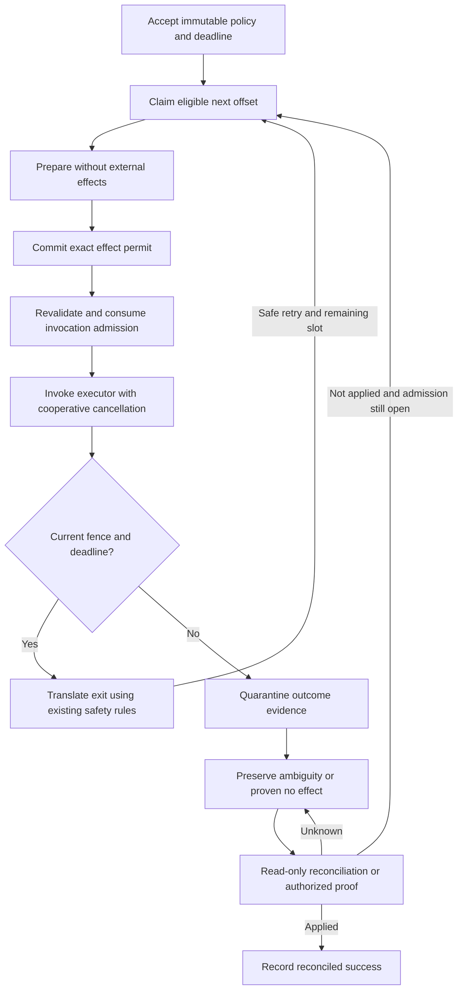

<!-- /autoplan restore point: "/Users/andrew/.gstack/projects/forge-trust-Runnable/codex-make-it-so-845-runtime-preflight-autoplan-restore-20261003-765-b950b90b.md" -->
## Implementation plan
# Design: Deterministic Durable retry plans and execution deadlines

Generated by /office-hours on 2026-10-03 (America/New_York)
Repository: `forge-trust/AppSurface`
Issue: [#765](https://github.com/forge-trust/AppSurface/issues/765)
Inspected branch: `codex/make-it-so-845-runtime-preflight` at `9612cdeb`
Status: APPROVED
Approved: 2026-10-03, user selection D7/A, with the specification-review limitation acknowledged
Mode: Builder, open source
Builds on: [typed Work exits](issue-783-durable-work-exits.md), [immutable typed Work definitions](issue-800-typed-work-definitions.md), and the [executable-contract adoption rail](durable-executable-contract-adoption-rail.md).

## Problem and intended outcome

Durable already freezes retry and lease settings when it accepts Work. The [PostgreSQL Work store](../../Durable/ForgeTrust.AppSurface.Durable.PostgreSql/PostgreSqlDurableWorkStore.cs) nevertheless calculates each retry eligibility time from completion time. Slow execution shifts the recovery circuit. The elapsed retry horizon also does not independently fence a still-current effect permit or normal completion against an immutable application deadline.

An adopter should be able to accept a new Work version with the exact eligibility offsets `0, 5, 20, 60, 180` minutes and a fixed UTC deadline, then inspect why a claim, effect, or retry was refused. Later configuration, duplicate enqueue, operator release, and reconciliation must not move those offsets or extend the deadline.

The reusable capability is a closed execution-policy contract shared by authoring, acceptance, provider execution, observations, and tests. PostgreSQL remains the first implementation and sole persisted authority. This session creates a design; implementation starts from current main in a separate branch, since the inspected branch belongs to #845.

## What makes this useful

An adopter can demonstrate a deadline-bound maintenance window: accept a credential rotation, lose the worker around the external call, stop admitting effects when the approved window closes, and reconcile the provider afterward. A deterministic failure lab can show the five planned offsets and exact permit evidence rather than requiring an operator to infer safety from an exception.

These are generic examples, not product demand measurements. The issue identifies a real gap in the existing execution mechanics; this session established no named adopter or measured time-to-first-completion target.

## Decisions, premises, and scope

- **D1:** User selected “Open Source”; portable contracts, compatibility, documentation, and conformance evidence guide the design.
- **D2:** Build on existing designs. Executors report local facts; providers own transitions, permits, fences, and retry eligibility.
- **D3:** Generalized category research was authorized. Research used official sources because Aside was unavailable.
- **D4:** User accepted additive adoption, fixed earliest eligibility, authoritative admission checks, and preservation of late effect evidence. The literal issue claim that no external invocation can occur after a deadline is qualified below.
- **D5:** User requested an independent opinion; a native `combo/sub` subagent completed it. The configured external review CLI was unavailable. Its advice on overdue slots, late evidence, and database clock tests is incorporated.
- **D6:** User chose **B, shared immutable execution-policy contract**, including sequential offsets, immediate eligibility for an overdue next slot after a safe retry decision, and an exclusive cutoff.
- **D7:** User approved this design with **A**. The specification review remains UNREVIEWED because the reviewer could not complete its required tool contract. Engineering plan review is the proposed next stage.
- Approach A, narrow extensions to existing types, was not selected because it leaves timing composition spread across types. Approach C, materialized slot rows, was not selected because additional slot storage and lifecycle proofs exceed the present need.

Existing Work retains its legacy semantics. Adoption uses a new immutable Work contract version. Scope includes all acceptance and release paths for opted-in Work, diagnostics, test helpers, API references, migration guidance, and packed-consumer proof. It excludes domain retention/source policy, a management UI, new authorization rules, automatic DDL, new executors for other safety classes, and a second effect ledger. No new NuGet package is needed.

## Public contract and compatibility

Types live in [ForgeTrust.AppSurface.Durable](../../Durable/ForgeTrust.AppSurface.Durable/README.md). The following describes proposed API surface, not implemented code.

| Type/member | Contract |
| --- | --- |
| `DurableAttemptPlan(string version, IEnumerable<TimeSpan> elapsedOffsets, TimeSpan maximumCircuitDuration)` | Immutable, defensively copied schedule. Exposes `Version`, `ElapsedOffsets`, `MaximumCircuitDuration`. |
| `DurableExecutionDeadline(DateTimeOffset notAfterUtc)` | Immutable UTC instant. Exposes `NotAfterUtc`; equality compares the normalized instant. |
| `DurableWorkExecutionPolicy.FromRetryPolicy(DurableWorkRetryPolicy retryPolicy)` | Legacy timing projection with no attempt plan. |
| `DurableWorkExecutionPolicy.ForAttemptPlan(DurableWorkRetryPolicy retryPolicy, DurableAttemptPlan attemptPlan)` | Validated composition of existing retry/lease settings and an explicit plan. Exposes `RetryPolicy` and nullable `AttemptPlan`. |
| `DurableWork.DefineWithExecutionPolicy<TWork,TResult>(name, version, workCodec, resultCodec, providerSafety, defaultExecutionPolicy)` | Named additive factory sharing the existing immutable codec/contract snapshot. |
| `DurableWorkDefinition<TWork,TResult>.DefaultExecutionPolicy` | The definition's validated default; existing `DefaultRetryPolicy` projects its `RetryPolicy`. |
| `DurableWorkRequest.CreateWithExecutionPolicy(scopeId, commandId, idempotencyKey, workName, workVersion, payload, providerSafety, executionPolicy, executionDeadline = null, dueAtUtc = null)` | Named direct request factory; policy is required. Adds get-only `ExecutionPolicy` and nullable `ExecutionDeadline` properties. |
| `definition.CreateRequestWithExecutionPolicy(scopeId, commandId, idempotencyKey, work, executionPolicy = null, executionDeadline = null, dueAtUtc = null)` | Encodes input once; null policy selects the definition default. Caller validation precedes encoding, as in the existing typed request API. |

All new policy types are closed, sealed, immutable types with validated construction, structural value equality, and no mutable `init`, unsafe copy constructor, arbitrary dictionary, or provider callback. The plan's collection is a read-only snapshot; neither the input enumerable nor an exposed array can mutate it.

Plan v1 accepts 1–256 offsets, starts at zero, is strictly increasing, and has a positive circuit duration strictly greater than the final offset. Version uses the existing bounded identifier rule (100 characters). Durations and planned deadlines have microsecond precision, matching PostgreSQL storage; reject sub-microsecond input rather than silently rounding fingerprinted values. Require checked arithmetic and timestamps representable by both .NET and PostgreSQL. A one-slot plan permits one execution and no retry.

For a planned policy, `retryPolicy.MaximumAttempts` must equal the offset count, and `retryPolicy.MaximumElapsedTime` must be at least the circuit duration. Reject disagreement rather than silently changing supplied settings. The plan replaces the backoff delay calculation; initial/max retry delay and the legacy algorithm remain available as a compatibility projection, but do not add another wait or jitter. Existing lease settings still govern leases. PostgreSQL accepts only supported policy/plan versions and supported underlying retry policy; unknown versions fail closed before acceptance or invocation.

Preserve the exact existing constructors, methods, virtual seams, and binary signatures. The old request constructor creates a legacy policy and retains its current fingerprint. Existing `Define` captures a legacy default. Existing `CreateRequest` retains exact behavior for legacy definitions. On a planned definition, it uses the planned default when no retry override is supplied; a legacy retry override is rejected with guidance to use the named policy method, rather than discarding the plan. `dueAtUtc` is rejected for planned requests, because slot zero is anchored to acceptance. Deadline-only requests with a legacy policy may retain `dueAtUtc`; their absolute deadline is enforced using the new opt-in path.

The definition default is request-authoring data, not authority to reinterpret accepted Work. Explicit request overrides remain possible through the named policy API. The registration/registry snapshot exposes the default execution policy for derived requests and testing, while the accepted request is authoritative for its actual settings. Keep [ReconcileBeforeRetry registration](../../Durable/ForgeTrust.AppSurface.Durable/README.md) and the existing binding matrix intact; no typed-exit widening to other safety classes is required.

### Derived Work and provider boundaries

[Flow](../../Durable/README.md) child acceptance and Schedule Work materialization must use the resolved registration's captured execution-policy default for the new Work version. Legacy registrations retain their existing construction and fingerprint behavior, including the historical default behavior of these paths. A planned default must never fall back to `DurableWorkRetryPolicy.Default` in a derived request. Each child/occurrence has its own acceptance anchor. This issue adds no Flow/Schedule deadline expression language: an absolute request deadline is supported for direct Work submission; derived Work uses its plan's circuit bound unless an existing request-producing path explicitly supplies a deadline.

In [ForgeTrust.AppSurface.Durable](../../Durable/ForgeTrust.AppSurface.Durable/README.md), add a closed `DurableWorkExecutionSnapshot` containing the accepted policy, deadline, acceptance instant, next eligibility, and admission cutoff. The [Provider package](../../Durable/ForgeTrust.AppSurface.Durable.Provider/README.md) consumes this Core type. Preserve the existing `DurableClaimedWork` and `DurableWorkSnapshot` constructors; add named factories with a required execution snapshot and nullable get-only `Execution` properties for legacy/provider compatibility. Carry it through `DurableWorkExecutionContext` and the prepared invocation without adding metadata to the shared [Workers envelope](../../Workers/ForgeTrust.AppSurface.Workers/DurableWorkerEnvelope.cs). The snapshot describes facts; it grants no execution capability. PostgreSQL still performs authoritative checks.

Add a nullable execution snapshot projection to the existing authorized Work inspection API. A legacy row projects no opt-in snapshot. Planned inspection exposes times and policy identifiers through the scoped API; public diagnostic logs and metrics remain payload-free and do not expose scope IDs, Work IDs, provider keys, input, result, or exception text.

## Timing semantics

Let `A` be the authoritative timestamp stored when acceptance is inserted, `O[i]` the zero-based offset, `C` the circuit duration, and `D` the optional absolute deadline.

```text
slot i earliest eligibility = A + O[i]
execution attempt number   = i + 1
planned admission cutoff   = min(A + C, A + MaximumElapsedTime, D if present)
deadline-only cutoff      = min(A + MaximumElapsedTime, D)
eligible new admission    = due <= authoritative_now < cutoff
```

The example uses offsets `0, 5, 20, 60, 180` minutes and a **240-minute** circuit duration, with `MaximumAttempts = 5` and `MaximumElapsedTime >= 240 minutes`. Choosing 180 minutes as an exclusive circuit cutoff would prevent the last slot from running and is invalid. A deadline before a later slot may intentionally truncate the circuit; acceptance does not require every slot to fit before that deadline.

`AttemptNumber` continues to count actual claims, including reclaimed pre-effect lease failures; an acceptance has zero and the first claim advances it to one. A refusal does not consume a slot. Recovering a lost attempt requires a safe new claim and consumes the next offset; duplicate delivery of the same exact claim does not create another execution. All attempts remain sequential under the Work fence.

After a safe retry decision for attempt `n`, the next due time is `A + O[n]`, not completion time plus backoff. If overdue, it is immediately eligible. Offsets are not skipped and are never rebased to recovery time. Downtime alone does not execute missed slots; each additional claim requires the ordinary safe retry/recovery transition. Existing pump item/time/concurrency bounds still apply. A succession of fast failures can consume several overdue slots quickly; this explicit behavior is the cost of retaining fixed earliest eligibility. Applications needing spaced retries after each failure should choose the existing backoff policy.

The circuit/elapsed cutoff closes new claims, permits, retry releases, and invocation admission. Renewals for an already admitted attempt remain bounded by its original lease lifetime and any absolute execution deadline, rather than the plan circuit cutoff. It does not censor a result from an already admitted attempt solely because the last plan slot is now past: normal completion still requires current fences and, when supplied, `now < D`. Lease validity and absolute execution deadline are separate checks. Side-effect-free reconciliation and authorized proof recording may occur after either cutoff.

### Deadline guarantee and its limit

The linearization point is the provider's post-lock authorization decision using its authoritative clock. A transaction can finish committing after that instant; this is not a guarantee that every transaction completes before the wall-clock cutoff. No new authorization decision may pass at or after the cutoff.

Immediately before entering the prepared executor, PostgreSQL revalidates the current permit/fence/deadline in a short transaction. The runtime also forwards a deadline-bounded cancellation token and performs an advisory local check immediately before invocation. Local timing never substitutes for the store check. Arbitrary code can be paused after the check, ignore cancellation, or start further calls inside an already admitted executor. The generic runtime cannot promise that no network byte is sent after the deadline. A stronger external-effect guarantee requires a provider that enforces the deadline or fencing identity itself.

This qualifies #765's literal provider-invocation acceptance criterion, with the user's D4 approval. Tests prove refusal when authoritative expiry is observed at claim, permit, invocation admission, retry release, and normal-completion boundaries, and include an already-admitted call crossing the cutoff. They do not claim arbitrary-process preemption or rollback of an external effect.

## Authoritative PostgreSQL protocol

Use the [Work protocol's canonical lock order](../../Durable/work-protocol-v1.md): scope → Work → dispatch → permit → history. Preparation and provider I/O stay outside store transactions. All new paths preserve runtime epoch, scope generation, lease owner/generation, attempt identity, and revision checks.



### Acceptance and identity

Freeze the policy and deadline in the caller's existing transaction with domain data. Planned acceptance explicitly uses one database clock sample for `accepted_at`, initial `due_at`, and cutoff calculations; do not let independent defaults give slot zero a different anchor. The anchor is acceptance insertion time, not transaction commit time or request creation time. A long caller transaction consumes part of the window before workers can see Work; document this ordering pitfall.

Retain legacy fingerprint schema `appsurface.durable.work.enqueue.v1` byte-for-byte for a legacy policy without a deadline. Opt-in requests use `appsurface.durable.work.enqueue.v2`, hashing the existing semantic fields, full retry/lease snapshot, plan version/count/ordered offsets/circuit bound, nullable UTC deadline, and permitted initial due time. Canonicalization is closed and culture-independent. Never hash a server-generated acceptance instant into the request identity.

The existing scope/command/idempotency matrix remains authoritative. An identical duplicate returns the original acceptance even after expiry; changed policy, offset, version, duration, due time, or deadline conflicts. Concurrent duplicates still yield one Work and one dispatch record. Do not reject an identical persisted duplicate because today's time is later. A new request whose deadline is already reached fails with the deadline diagnostic and creates no Work/dispatch row. Checked timestamp arithmetic failures return the validation diagnostic before mutation. These domain rejections keep a caller-owned transaction committable; database failures retain its existing rollback requirements.

### Storage and migration

Append one explicit migration after current main's migration catalog. The inspected branch ends at schema 11; do not reserve a migration number across concurrent work. Add nullable opt-in columns on Work: execution-policy schema, attempt-plan version, bounded `bigint[]` offsets in microseconds, circuit duration in microseconds, and UTC `execution_not_after`. Existing retry/lease columns remain their single persisted representation. Validate all-or-none plan fields, precision, ordering, count, policy relationships, and the supported schema. Legacy rows keep null opt-in fields and are not assigned a plan/deadline.

Add nullable `invocation_admitted_at` to the existing effect permit. For opted-in Work, a current, timely admission atomically sets it once. An exact duplicate cannot enter the executor again. A crash after this marker commits is potentially effectful even when the executor had not actually started; conservative uncertainty is required. A permit with no admission marker can be proven pre-invocation only by the matching locked provider transition, not by an arbitrary caller asserting absence. Historical permits preserve legacy handling.

Use existing Work history to quarantine a late/stale encoded result with its exact old fence, codec, digest, classification, and safe reason. Carry its retention-policy identity using an additive history column so a quarantined result does not lose existing payload metadata. Normal Work inspection returns no quarantined payload and Work's terminal result stays unset. This adds no retention engine or alternate result/effect ledger.

The migration establishes a package compatibility floor at its version for readers and writers. Existing older workers must be rejected before processing the new schema, including workers with an identically named registration. The schema manager's current metadata stamping and generated deployment SQL hard-code minimum versions to 1; update both to preserve the migration's floor, and ensure later migrations do not lower it. A Work version name alone is insufficient protection from an old binary that ignores new columns.

Existing [role bootstrap](https://github.com/forge-trust/AppSurface/blob/codex/make-it-so-765-retry-deadlines/Durable/configure-postgresql-roles.sql), forced RLS, schema checksums, and explicit schema manager remain the deployment path. Applying DDL does not start a worker. No row data is backfilled into new timing behavior. After schema upgrade all producers/readers/workers sharing the store must use compatible packages, while legacy rows on those packages retain their previous semantics.

### Checks and transitions

| Boundary | Required opted-in behavior |
| --- | --- |
| Discovery | Remains a payload-free hint; scoped authoritative classification closes expired/exhausted candidates even when their due time is still in the future. Avoid permanently available expired dispatch rows. |
| Claim | Lock, sample time, validate policy/next offset/current safety and cutoff, then advance attempt/fence once. An expired unpermitted item fails terminal with a timing reason. An unresolved prior permit suspends according to safety. |
| Renewal | Revalidate the same fence. Cap lease expiry by original maximum lease lifetime and any absolute execution deadline; never extend the persisted policy. A circuit cutoff alone does not revoke an already admitted attempt. At lease/deadline expiry request cooperative cancellation. |
| Permit, including exact-permit lookup | Recheck active scope/epoch/lease/current attempt and cutoff before returning or granting a permit. Expired cached permits are not usable capabilities. |
| Invocation admission | Recheck after permit commit and acquire the one-use admission marker. On refusal, invoke no executor. Prove no invocation only when the exact marker remains absent; otherwise preserve uncertainty. |
| Safe retry completion/recovery | Use the next stored offset. If slots/cutoff are exhausted and no effect is uncertain, fail terminal; if an effect is uncertain, suspend. |
| Ordinary successful completion | Require current exact fence/permit and a deadline check after lock. At/after the absolute deadline, quarantine the result and preserve effect truth, rather than setting normal success. |
| Stale completion | Append quarantined evidence under the old identity without changing the winning Work, permit, or terminal fact. |
| Operator release | Revalidate immutable cutoff and next slot for retry-safe, recovery release, manual NotApplied, and reconciler NotApplied paths. Never set planned due time to `now` or bypass exhaustion. |

Prefer one closed internal timing decision model with a portable pure evaluator and explicit PostgreSQL mappings. It returns next eligibility/admission cutoff and a bounded decision kind; it cannot set Work state, run a callback, or decide whether an effect happened. The provider applies existing cancellation/safety rules and projects Work, dispatch, history, Flow, and Schedule together in the same transaction. No public method accepts a caller-supplied “current time” as authorization.

### Outcome truth after cutoff

| Evidence | Before cutoff | After cutoff |
| --- | --- | --- |
| No permit, or exact unconsumed admission proven by runtime | Eligible next slot may be claimed. | Terminal timing failure; no provider invocation. |
| Current explicit proven-no-effect exit | Existing safe retry/cancellation rules plus next offset. | Terminal timing failure or cancellation; record the permit proof. |
| Admitted call returned after a timing boundary | Normal success only if the exact fence/lease and any absolute deadline pass. | Circuit-only closure permits normal success for that already admitted current attempt; reached absolute deadline or stale fence quarantines encoded evidence and preserves effect truth, with safety-specific suspension for unknown current outcome. |
| Exception/cancellation/lease loss after invocation admission | Existing provider safety applies; no inference of absence. | Same ambiguity preservation; no mutating retry even for safe-repeat classes. |
| Side-effect-free reconciliation: Applied | Reconciled success with validated encoded result. | Reconciled success is allowed to establish existing effect truth; it grants no new execution. |
| Reconciliation or authorized proof: NotApplied | Release for next persisted offset if still eligible; otherwise fail safely. | Record proof and fail timing/cancel as applicable; do not release to retry. |
| Reconciliation: Unknown | Keep suspended with exact ambiguous permit. | Keep suspended; deadline does not turn Unknown into failure/no effect. |

For `ReconcileBeforeRetry`, reuse the registered reconciler and existing command/revision validation. `ManualResolution` retains authorized manual proof. For `Idempotent`/`ProviderKeyed` Work whose admission is permanently closed with an exact ambiguous permit, extend the existing audited manual-resolution eligibility narrowly to this timing-closed state; its current eligibility for those safety classes is cancellation-specific. An authorized Applied/NotApplied proof can close truth without reopening execution. Keep actor/scope authorization application-owned, result-codec validation, and command idempotency unchanged. Do not change the exit-aware registration's ProviderKeyed-only scope.

Precedence is explicit: stale identity never changes current truth; an unresolved admitted effect takes precedence over terminal timing failure; proven absence allows cancellation to win, then absolute deadline, plan exhaustion/circuit cutoff, and legacy elapsed/attempt exhaustion. Safe diagnostic details may record the other timing predicates without conflating them with the lifecycle outcome.

## Clock and failure-injection proof

Add an internal migration-owned SQL function `appsurface_durable.work_execution_now()` returning `clock_timestamp()` in production, declared VOLATILE with a fixed safe search path. It accepts no arguments and reads no session override. Producer, runtime, and dispatcher roles receive only the execution privileges needed by their opted-in operations, never ALTER or control-table write access.

Only opt-in acceptance and protocol paths use this seam; legacy statements retain their direct clock behavior. Existing database locks must be acquired in separate commands before sampling time, then the immediately following decision statement samples once and uses that sample throughout its validation and writes. Do not sample before a row-lock wait or substitute transaction-start `now()`. This defines the authorization decision instant; time can still cross a boundary during the following transaction commit.

The disposable [PostgreSQL integration fixture](../../Durable/ForgeTrust.AppSurface.Durable.PostgreSql.Tests/PostgreSqlIntegrationTestDatabase.cs) owns a test-only administrative clock table and replacement function body. Production migrations create no fake clock table or override switch. Runtime roles can only read the sampled clock through the function. Each test database is isolated; advancing one fixture cannot change another fixture or production. Test actual acceptance, lease predicates, recovery, permit lookup/grant, invocation admission, completion and every retry release with this clock. Prove that runtime/producer/dispatcher credentials cannot alter the function or modify its test clock.

Use an internal injected `TimeProvider` for cooperative runtime waits, lease-renewal scheduling, and cancellation tests. It cannot authorize a database transition. Database tests advance the store clock explicitly at checkpoints and release barriers, without wall-clock sleeps as correctness evidence.

In [ForgeTrust.AppSurface.Durable.Testing](../../Durable/ForgeTrust.AppSurface.Durable.Testing/README.md), add immutable execution-policy observations and a reusable one-shot checkpoint controller for `BeforePermit`, `AfterPermitCommit`, `BeforeInvocationAdmission`, `AfterInvocationAdmission`, `BeforeProviderCall`, `AfterProviderCall`, and `BeforeCompletion`. The controller supports observing, pausing until released, or throwing one deterministic test exception, uses bounded waits/cancellation, and reports safe checkpoint facts. It neither grants permits nor simulates success. Provider-specific hooks are internal no-op seams for real store/pump tests; an adopter's test executor explicitly calls provider-call checkpoints around its fake provider. Core cannot detect arbitrary external calls inside a consumer executor. Document that distinction and prohibit a testing package dependency in production provider packages.

Verification uses a recording provider with a stable ActivityId/provider key and mutation counter. After a simulated provider mutation followed by failure, ReconcileBeforeRetry must yield Applied with no second mutation; NotApplied may release only before cutoff; Unknown stays suspended. Include fresh-process/crash proof around committed permit/admission checkpoints, because an in-process exception does not prove process recovery.

## Diagnostics and documentation

Append stable public problem-code constants for `AttemptPlanExhausted` and `ExecutionDeadlineReached`, provisionally `ASDUR120` and `ASDUR121` (verify no collision on implementation main). Reuse `ASDUR104`/`ASDUR105` for stale claim/lease fences, `ASDUR106` for unresolved external outcomes, and `ASDUR117` when retry requires proof. Do not renumber existing identifiers. Pair a safe timing reason with the existing lifecycle outcome so deadline expiry and reconciliation-required remain distinguishable at the same time. Inspection history should name the refused boundary and immutable plan version without returning raw provider details.

Update the [Work protocol](../../Durable/work-protocol-v1.md), [Durable guide](../../Durable/README.md), all four affected package READMEs, [diagnostic catalog](../../troubleshooting/durable-diagnostics.md), [API budget](../../Durable/api-budget.md), and API baselines. Reference content covers constructors/factories, validation, precision, defaults, compatibility, boundary truth tables, and failure modes. Decision content contrasts backoff with a fixed plan and provider deadline enforcement with cooperative cancellation. Pitfall content covers late transactions, overdue bursts, due-time conflicts, last-offset/cutoff equality, already admitted calls, and immutable Work-version rollout. Add canonical links to named concepts and a complete direct Work plus reconciler example.

## Verification and acceptance criteria

| Proof | Required evidence |
| --- | --- |
| Exact circuit | With store clock fixed at acceptance A, claims occur at A, A+5m, A+20m, A+60m, A+180m, numbers 1–5. One microsecond before each offset refuses without consuming a slot. A sixth claim fails exhaustion. |
| Overdue recovery | Long execution and worker downtime do not rebase offsets; safe sequential retries can claim an overdue slot immediately. Refused/duplicate claims do not increment attempts. |
| Deadline and lock wait | At D−1µs admissible where otherwise eligible; at D and D+1µs refused at every new authority boundary. Hold the Work lock, advance clock across D, then release: post-lock check must refuse. |
| Immutable identity | Definition/config changes cannot alter accepted policy. Same semantic duplicate returns original acceptance after expiry; changed fields conflict; concurrent duplicates create one Work/dispatch. |
| Failure and truth | Pre/post permit, admission and provider-call failures, lease/epoch/scope loss, cancellation, late encoded result quarantine, current-vs-stale results and all safety classes. Assert exact provider mutation counts. |
| Reconciliation/releases | Applied, NotApplied, Unknown before/after cutoff; manual proof, retry-safe, recovery release and replayed operator commands. No planned release changes next due time to now or extends deadline. |
| Integration projection | Direct, caller-owned transaction, Flow child and Schedule target produce equivalent policy snapshots and correct terminal/suspended projections. Expired future-due dispatch is eventually closed. |
| Compatibility/roles | v1 golden fingerprint bytes; old compiled constructor/method consumer; supported/unsupported plan schema; legacy rows after migration; compatibility floor in applied and generated SQL; old binaries refused; role grants/RLS/checksums/clock isolation. |
| Distribution | Packed consumer compiles the new factories/properties and records a deterministic completed/reconciled circuit through real PostgreSQL. Missing PostgreSQL or skipped selected tests fail the gate. |

Pure contract tests cover every validation/equality/copy/overflow branch. Provider integration tests cover success, refusal, and race branches using public APIs or deliberate internal seams, without reflection. Run affected suites and existing Durable [PostgreSQL](https://github.com/forge-trust/AppSurface/blob/codex/make-it-so-765-retry-deadlines/Durable/verify-postgresql.sh) and [packed-consumer](https://github.com/forge-trust/AppSurface/blob/codex/make-it-so-765-retry-deadlines/Durable/verify-packed-consumers.sh) gates. Verify solution-level coverage with [coverage-solution.sh](https://github.com/forge-trust/AppSurface/blob/codex/make-it-so-765-retry-deadlines/scripts/coverage-solution.sh) when practical. Format before pushing and resolve introduced compiler, analyzer, and documentation warnings. No implementation checks have run during this design session.

## Distribution, rollout, and dependencies

Deliver through the existing Durable, Provider, PostgreSql and Testing NuGet packages and repository release workflow. Preserve coordinated package versions, API baselines, machine publication gates, migration resources and signed package verification. Update the existing release/runtime schema preflight proofs for the actual next schema; the #845 branch is context, not a dependency for designing #765.

Rollout sequence: build and prove package/schema support; coordinate all hosts sharing the store; drain old workers and stop new producer submissions during the compatibility-floor change; explicitly apply migration with the migration owner; deploy compatible producers/readers/workers and check schema/epoch health; register a new Work version; then enable acceptance for that version. A version or definition cannot be silently converted in place. Retain registrations for historical Work.

Rollback disables new acceptance and uses compatible code to drain/reconcile remaining Work. Old packages cannot be reintroduced once the schema floor excludes them. Do not drop new columns, clear permits, or extend deadlines to force recovery. Reversing the floor is a separate reviewed migration requiring proof that no opt-in Work can be processed unsafely.

Prerequisites are the landed [#783 Work exits](https://github.com/forge-trust/AppSurface/issues/783) and [#800 typed definitions](https://github.com/forge-trust/AppSurface/issues/800). Related doctor [#801](https://github.com/forge-trust/AppSurface/issues/801) and worker-template [#806](https://github.com/forge-trust/AppSurface/issues/806) designs may later display/demonstrate the policy; neither is expanded here. Coordinate migration numbering, API baseline budget, role bootstrap, and schema-preflight changes with current main during implementation.

## Assignment and next steps

The next concrete assignment is to implement a PostgreSQL vertical slice for a new Work version and show two artifacts: the five acceptance-relative claim timestamps, and a barrier-held claim/permit crossing the deadline that records its refusal with zero provider mutations. Use the disposable authoritative database clock, then extend the same proof through post-effect reconciliation and operator releases. This is a proposed implementation assignment, not authorization to change code in this office-hours session.

1. Start from current main in an isolated implementation branch. Add closed policy types, named authoring APIs, shared snapshot propagation, v1/v2 fingerprints and API documentation.
2. Add migration, compatibility-floor preservation, opt-in clock seam and role proofs. Preserve legacy row/timing behavior.
3. Implement the full boundary matrix, one-use invocation admission, outcome quarantine and next-offset release behavior; update Flow/Schedule projections and request propagation together.
4. Add checkpoint helpers, fake-clock integration and subprocess recovery tests, scoped diagnostics, packed adopter examples and release/schema proof changes.
5. Run formatting, affected verification and coverage; review the implementation and prepare a PR linked to #765 under the repository's normal workflow.

No product decision remains intentionally open in this design. Migration/code numbers must be rebased against implementation main and are coordination details. Engineering review should pressure-test the public API budget, SQL lock/time sampling, compatibility-floor rollout, and bounded discovery of expired future-due Work before coding.

<!-- autoplan-accepted:ceo -->
- Add one internal payload-free refusal counter named `durable.work.execution_fenced` using existing runtime instrumentation and the standard library. Its labels are closed boundary and reason values only; no user plan version, scope/Work/provider identity, payload, exception, deadline, or arbitrary string labels. It reports observations after an authoritative refusal and grants no authority. No new telemetry backend, exporter, or package is introduced. Verify each opted-in refusal path, no emission on success, and forbidden-label absence with a listener; metric-delivery failure cannot change transition truth.
- Add a compiled example comparing legacy completion-relative backoff with the new acceptance-relative plan in existing adopter documentation/proof sources. Preserve exact new API names, the five offsets, one-based attempt numbers, the 240-minute circuit, optional deadline and reconciler registration; include a one-slot validation example. Compile the documentation-linked source and verify that the example never claims a punctual execution guarantee.
- For every new plan/deadline diagnostic, document problem, cause, next safe action and the related lifecycle outcome. A permanently closed admission must never recommend extending its accepted deadline or blindly retrying an ambiguous effect. Link the canonical protocol, authorized inspection, and reconciliation guidance; verify the catalog and emitted code remain consistent and payload-free.
- Add one ASCII timeline to the main Durable guide and source-linked example covering zero-based offsets versus attempts 1–5, last offset strictly before circuit cutoff, overdue sequential eligibility, and a caller-owned transaction that consumes the window before commit. Assert these exact boundary meanings in the planned contract/fixture tests and distinguish them from observed punctual performance.
- Clarify safety-class precedence by time: before immutable admission closes, `Idempotent` and `ProviderKeyed` may use their existing exact-fence safe-repeat recovery despite an unknown prior effect; `ReconcileBeforeRetry` and `ManualResolution` still require their existing evidence. At or after admission cutoff, no safety class may obtain a mutating retry, and unknown admitted-effect truth stays suspended until read-only reconciliation or authorized proof resolves it. Deadline expiry never proves NotApplied. Verify both sides of the cutoff for all four safety classes and preserve every legacy-row behavior.
- Preserve the source design's already approved timing-closed manual-resolution extension for `Idempotent` and `ProviderKeyed`. This changes provider state-transition eligibility only, not application actor/scope authorization, credential grants, result-codec checks, command/revision idempotency or the ProviderKeyed-only exit binding. Verify authorized Applied and NotApplied resolution, invalid state, stale revision, cross-scope denial through the existing caller boundary, exact command replay, Unknown remaining suspended and zero new mutating execution after cutoff. The authority is source D7/A, not a new scope expansion.
- Emit the following closed diagnostic mapping at every opted-in acceptance, claim, permit, invocation-admission, completion/recovery and operator-release boundary where the predicate applies. Invalid or unsupported policy uses ASDUR100/validation_failed before mutation; command mismatch uses ASDUR102/command_conflict. An early next slot is a normal not_due observation with no problem code, consumes no attempt, and advises waiting for the stored eligibility. Slots exhausted and plan-circuit cutoff use proposed AttemptPlanExhausted (provisionally ASDUR120) with distinct reasons slots_exhausted and circuit_elapsed. Absolute deadline uses proposed ExecutionDeadlineReached (provisionally ASDUR121)/deadline_elapsed; deadline-only legacy elapsed exhaustion retains `retry_policy_exhausted` when effect absence is proved, or `retry_policy_exhausted_with_ambiguous_effect` with the existing safety-specific suspension when unknown, plus elapsed_exhausted reason. Exact stale revision/claim uses ASDUR104/claim_lost, lease/scope-generation loss ASDUR105/lease_lost, disabled scope ASDUR107/scope_disabled and wrong epoch ASDUR108/epoch_mismatch. An unknown admitted effect uses ASDUR106/ambiguous_effect and its safety-specific suspension even when a separate timing reason exists; ordinary operator retry uses ASDUR117/proof_required. Already-terminal Work uses ASDUR110/already_terminal; unsupported operator state uses ASDUR116/operator_rejected; stale operator revision uses ASDUR112/revision_conflict. Lifecycle precedence remains stale identity, admitted uncertainty, then proven-absence cancellation/deadline/plan/legacy exhaustion. For each mapping document problem, cause and next safe action; after permanent cutoff the action is inspect/reconcile/authorized proof, never extend/retry. Codes are verified on implementation main without renumbering. Exercise the mapping and code/lifecycle pair in the boundary matrix.
- Treat the five-timestamp and lock-wait-refusal vertical slice as checkpoint G1 only. Completion requires G2 policy/identity and old-consumer compatibility; G3 migration, persistent compatibility floor, privileged clock denial and row-policy proof; G4 all safety-class failure/late-result/reconciliation/operator paths and fresh-process crash recovery; G5 Flow/Schedule projections, diagnostic/metric privacy and expired-future-due discovery; G6 compiled docs, actual packed NuGet consumer, strict PostgreSQL gate, formatting/warnings and practical solution coverage. All G1–G6 are mandatory, and a missing database or skipped selected proof fails completion. The initial checkpoint authorizes no claim that the full feature is verified.
- Use one primary public problem code per boundary result, not two competing codes. Stale identity produces its existing fence code without changing winning truth; for a current admitted uncertain effect use ASDUR106/ambiguous_effect plus a separate closed timing reason (deadline_elapsed, circuit_elapsed, slots_exhausted, or elapsed_exhausted). Only proved-no-effect timing refusal uses ASDUR121 for absolute deadline or ASDUR120 for plan exhaustion; deadline-only legacy exhaustion preserves its existing terminal/history strings. Authorized inspection/history pairs the primary code, secondary reason and lifecycle. Catalog and matrix tests assert that pairing with simultaneous predicates, and payload-free metrics use only boundary/reason.
- Preserve the existing command-driven reconciliation lifecycle: Unknown stays suspended indefinitely until a later authorized read-only reconciliation or audited proof establishes Applied/NotApplied. No automatic terminalization, retry schedule, new retention duration or escalation service is added. Each explicit reconciliation command uses existing command/revision replay semantics, bounded execution/cancellation and an exact ambiguous permit. Operators may inspect and later issue a new reconciliation command; the runbook explains repeated Unknown and application-owned escalation. Admission remains permanently closed after cutoff even if reconciliation takes longer.
- Clarify late-result handling by cutoff kind: passing the plan circuit alone closes new admission, permits and retry releases, but does not reject normal success from an already admitted attempt with a current lease/fence and no reached absolute deadline. Reaching an absolute deadline, or losing the fence, quarantines that completion. The Outcome-truth table's after-cutoff late-success cell applies to a reached absolute deadline or stale fence, not circuit-only closure. Verify circuit-only success, D−1µs success, D/D+1µs quarantine, and stale-fence quarantine independently.
- Required proof runs in the existing Ubuntu build workflow's durable-postgresql-compatibility job via `./Durable/verify-postgresql.sh --ci`; Docker/Testcontainers provisions the digest-pinned PostgreSQL 16.5 image. A local external server uses APPSURFACE_POSTGRES_TEST_CONNECTION (16+); APPSURFACE_POSTGRES_TEST_ALLOW_SKIP must not be set for evidence or CI. Extend selected discovery/count assertions for the new fixture and fresh-process checkpoint cases; reuse the existing subprocess reference harness and record exit, fences and exact mutation counts. The existing packed-consumer job runs `./Durable/verify-packed-consumers.sh`; extend its package-only harness with the actual opted-in real-database circuit. Preserve fresh local feed byte checks, compile docs, and run strict database proofs; provisioning failures fail G6 rather than passing a missing environment.
- Keep public naming and examples explicit about earliest eligibility and admission cutoff. Add compiled delayed-claim and overdue sequential-burst examples; separately show legacy backoff, deadline-only legacy policy and planned policy, with provider-enforced deadline behavior described as a separate external guarantee. Do not claim punctual execution or generic hard stopping. Test stored timestamps/attempts and exact mutation counts, and link canonical policy/rollout documentation.
- Extend the mandatory G3 compatibility proof with two simulated hosts: stop/drain old producers/workers/operators before applying the floor, reject old binaries afterward, accept legacy rows only on compatible packages, enable a new opted-in version after health/epoch/role checks, and demonstrate rollback to compatible code with schema/floor/history retained. No safe old-worker/new-schema overlap is promised; no old package downgrade or gate waiver is allowed. Include this coordination cost prominently in adoption/rollback guidance.
- For bounded expired-future-due discovery, require an index-supported query and scoped authoritative classification within existing pass/item bounds; rerun canonical 100k-row/100-scope discovery, 32-claimer/eight-connection and 10k-scope-disable regression gates. No full-store scan per pass or deadline-bypassing cache is acceptable. Actual latency remains measured evidence, not a new production promise.
<!-- /autoplan-accepted:ceo -->

<!-- autoplan-accepted:dx -->
- Publish the feature's start-here path inside existing Durable guide/package/example surfaces: a compiled direct Work/reconciler example and the existing one-command disposable proof, with .NET10, Docker Linux containers, bash and repository/package prerequisites explicit. Show actual accepted timestamps, delayed and overdue sequential claims, deadline refusal/zero invocation and exact mutation/reconciliation evidence; no canned success. Link the canonical timeline/boundary table, three-case legacy/deadline-only/planned chooser, API references, safety and production upgrade guidance. Validate all links and compile/package-only proof sources.
- Document planned-definition legacy CreateRequest behavior next to its XML/API reference: captured planned default without retry override, rejection of a legacy retry override with exact CreateRequestWithExecutionPolicy remedy, planned dueAt rejection, deadline-only dueAt compatibility, immutable accepted settings and nullable legacy Execution snapshot. Preserve all named signatures/defaults and v1 bytes. Correct the source plan's late-success table cell to distinguish circuit-only closure from absolute-deadline/stale-fence quarantine; this is the already accepted CEO qualification, not a new result policy.
- Use the existing DurableProblem Code/Problem/Cause/Fix/DocumentationUrl/CorrelationId shape for opted-in failures; do not add a new wrapper or open metadata bag. Present primary code with safe cause/fix/docs, and use authorized execution/history observations for closed boundary/reason/lifecycle facts. Show ambiguity-plus-cutoff and pure no-effect cutoff examples; assert primary-code precedence, safe action, stable catalog link and no payload/key/exception leakage through actual public/provider callers.
- Place a concise compatibility-floor warning and package/schema support matrix before the first example. Link stop/drain/explicit-owner migration/role preflight/compatible-host/epoch-health/new-version adoption and compatible-code rollback. Preserve mandatory G3 two-host proof and no old-worker/new-schema processing promise. Follow the existing append-only migration-watch release-note entry workflow and canonical upgrade-policy links; no automatic DDL, silent deadline extension, codemod or removed signature.
- Record a2–5min TTHW target for a developer with .NET10/Docker ready and a fresh checkout/no build artifacts, including reading, provisioning, build and interpretation of real offset/refusal/effect evidence. Measure a fresh reader after implementation with image-cache state, prerequisite readiness, total time and confusing step; report blank-machine prerequisite installation separately and include it in any blank-machine total. Keep target unverified until observed;420s timeout is not a measurement. No personal telemetry, recurring audit or automatic timing release gate is introduced; operational safety/strict database/package gates remain mandatory independently.
<!-- /autoplan-accepted:dx -->

<!-- autoplan-accepted:eng -->
- Own the new closed DurableWorkExecutionSnapshot in ForgeTrust.AppSurface.Durable (Core), beside the three immutable policy/deadline values, because DurableWorkExecutionContext is Core and Provider already depends on Core. Provider's named claim/inspection factories use that Core type; carry the same immutable facts through context/prepared invocation. Preserve all existing Core/Provider constructors, virtual methods and binary signatures, nullable legacy Execution, no Workers-envelope metadata and no production Testing dependency. Update Core and Provider API baselines/budget/reference links and prove both Core-only and Provider packed consumption plus old compiled ABI; no reverse dependency or duplicate snapshot wrapper.
- Define production work_execution_now as existing migration-owner-owned VOLATILE SECURITY INVOKER, using fully qualified pg_catalog.clock_timestamp, safe fixed search_path, revoked PUBLIC execute and exact bootstrap execute grants to required role pairs. Production has no clock table/session switch. The isolated fixture replacement alone is SECURITY DEFINER, owned by a fixture-only NOLOGIN clock-reader with backing-table SELECT only, no owner-role membership for runtime, fully qualified private objects and safe path. Administration alone advances it. Prove function call succeeds while PUBLIC/direct table SELECT/write/ALTER/replacement/SET ROLE fails for actual producer/runtime/dispatcher credentials, hostile-path/temp-object resolution is harmless, parallel fixtures are isolated and deployed SQL contains no test override.
- Persist an internal, opt-in, first-closure witness on Work (nullable execution_admission_closed_at and bounded closure reason), set once under the same authoritative lock/transaction when permanent admission closure is observed. Never clear it on recovery, renewal, manual proof, reconciliation or retry release. Every new mutating admission/release tests both this witness and current frozen cutoff; already admitted circuit-only success and authorized read-only proof keep their separately approved completion rules. Keep legacy rows null and unchanged, no new public capability/state/property. Advance then move the fixture clock backward and prove all safety classes remain closed after recorded closure; command replay/projections remain atomic and deadline expiry never establishes no effect.
- Add a nullable, payload-free dispatch execution_discovery_at hint for opt-in Work, atomically maintained with transitions: available=min(next due, cutoff); leased but not admitted=min(lease expiry, cutoff); admitted current=min(lease expiry, absolute D if any), so circuit alone does not rediscover/censor a live admitted attempt. Keep actual due_at as execution eligibility; legacy null preserves due behavior. Append a partial covering Work available/leased index on COALESCE(execution_discovery_at,due_at), priority DESC, dispatch_id with current metadata/output due included, and use that identical filter/order in both WorkStore discovery entrypoints and the existing bounded scoped contract-selection function. No payload/Work grant to dispatcher or unindexed fallback; scoped locked Work and closure witness remain authoritative. Clear/exclude closed projections. Verify actual query plans, 100k rows/100 scopes, future-due expiry, selected/unsupported versions, concurrent/live-lease mixtures, bounded finite-backlog progress/no newly introduced starvation, actual RLS roles, 32-claimer/eight-connection and 10k-disable regressions, plus index/write overhead; no measured latency promise.
- Make late-result state explicit: current encoded local success at/after D is quarantined with exact old identity/codec/digest/classification/retention, Work result unset, permit unresolved/ambiguous for authorized resolution, safety-specific suspended_reconciliation_required/manual_resolution/ambiguous_external_outcome and ASDUR106 plus deadline_elapsed. It is evidence, never automatic proof promotion. Existing read-only Applied reconciliation or authorized manual Applied with validated result may establish succeeded or cancellation-aware succeeded_after_cancel_requested without another execution. Exact current ProvenNoEffect records NotApplied and terminal timing failure/ASDUR121 unless proven-absence cancellation wins; unknown/exception/null/result-encode failure remains safety-specific suspended. Stale observations never alter winning truth. Circuit-only current admitted success remains normal. Verify every row before/at/after D, C-only and stale, duplicate observation/command replay, result metadata/no exposed quarantine and zero mutating retry after cutoff/witness for all safety classes.
- Implement and verify the complete A-X unit/provider/real-DB/process/Testing/package/docs matrix in the Eng test-plan artifact as required G1–G6 proof. Extend existing value-bearing tests and fixtures rather than smoke duplicates; expand concrete branches from the implementation diff, target near-total changed-branch verification, no reflection. Retain old v1 golden bytes and exact old compiled APIs, after-lock microsecond boundaries and lock waits, one-use crash markers/stable provider key/exact mutation counts, all release/proof/fence/projection/derived paths, persistent applied/generated/future compatibility floor and two-host compatible rollback, role/clock isolation, closed diagnostics/metric noninterference, all seven bounded one-shot checkpoints, compiled canonical examples and actual fresh-feed packed consumer. Existing Ubuntu strict verify-postgresql --ci and verify-packed-consumers gates must execute selected proof with zero skipped tests; missing DB/historical required artifacts fail rather than clear G6. Format and resolve introduced warnings, run affected suites and practical coverage-solution; no LLM/browser eval or benchmark claim for this backend feature.
<!-- /autoplan-accepted:eng -->
## Review record

# Autoplan #765 review record

Autoplan status: APPROVED. User selected A (approve as-is) on 2026-10-03; approval recorded at 2026-10-03T21:10:33Z. Recommended T1/T2 are accepted, and original full scope/G1–G6 stand. Source office-hours approval and disclosed review limitations are preserved. This invocation reviews only #765, not the unrelated #845 branch diff. Source design: [approved #765](issue-765-deterministic-retry-plans.md). Restore bytes: SHA-256 `4252e47006b6103a2037cb59b10d173b6e37a42092835f0202bc357824f06d3c`.

## Intake and evidence

Base branch: `main`; current branch: `codex/make-it-so-845-runtime-preflight`, HEAD `9612cdeb`. The 52-file branch diff belongs to runtime preflight #845; no implementation from it is attributed to this plan. Three existing stashes were observed and left in place. Recent history concentrates on release preflight and package verification; #765 must rebase schema numbering and proof expectations against implementation main.

UI scope: false (zero whole-word component/screen/form/button/modal/layout/dashboard/sidebar/nav/dialog matches). DX scope: true, with 41 term occurrences plus the semantic developer-tool trigger. Full-input scope hash is the source SHA above. CEO methodology was read completely: 1–600, 601–1200, 1201–1800, 1801–2400, 2401–2525; all tool results were untruncated. The source design, repository AGENTS.md, complete TODOS.md, 30 commits, diff stat and current #765 issue body were inspected.

Outside preflight: `CODEX_MODE: not_installed` for Claude Code. This supplies no outside review, agreement or clean credit. Required native passes remain enabled. Brain product/goals/user-profile digests are unavailable; the local approved design supplies the actual problem and constraints. Recent-decisions cache is empty; the existing issue decision and user selections remain authoritative.

## CEO Step 0 — implementation-ready, SELECTIVE EXPANSION

### 0A — premise challenge

The adopter needs a fixed recovery circuit and a deadline that remains enforceable after claim. Completion-relative backoff in `PostgreSqlDurableWorkStore.ReadRetryDelayAsync` shifts elapsed eligibility, and the current permit protocol has no immutable deadline. The plan addresses those mechanics directly rather than substituting a UI or application domain policy. Doing nothing leaves each adopter to reproduce timing, stale-result and retry-release checks independently; no named adopter demand or onboarding improvement has been measured.

Four premises remain sound: accepted policy is immutable; offsets express earliest eligibility; authoritative post-lock decisions close new execution authority; expiry does not establish absence of an external effect. D4/A explicitly qualifies the issue's literal arbitrary-provider-I/O guarantee. No clearly wrong premise or supported reversal has emerged. A runtime cannot preempt arbitrary executor code after an admitted invocation, so required proof remains decision-boundary refusal plus already-admitted late-call behavior.

Landscape synthesis, 2026: [Temporal](https://docs.temporal.io/encyclopedia/retry-policies) expresses retry backoff and attempt limits; [AWS retry strategies](https://docs.aws.amazon.com/durable-execution/sdk-reference/error-handling/retries/) return delay-or-stop decisions; [Azure timers](https://learn.microsoft.com/en-us/azure/durable-task/common/durable-task-timers) supply durable waits and timeout patterns. Layer 1 is bounded retries plus explicit external-effect safety. Layer 2 confirms established systems already cover general retry scheduling. Layer 3 inference is specific to this repository: an acceptance-anchored plan is useful only when all existing authority and release paths share it; adding a standalone scheduler would leave the actual gap open. No unsupported novelty or market-superiority claim is made.

### 0B — existing code leverage and taste references

| Sub-problem | Existing source | Treatment |
| --- | --- | --- |
| Captured authoring facts | `DurableWorkDefinition.cs`, shared `DurableWorkContractSnapshot` | Extend the existing snapshot; do not create a competing definition registry. |
| Request identity | `DurableWorkContracts.cs`, `DurableCommandFingerprint.cs` | Preserve legacy fingerprints; add a closed opt-in schema. |
| Claim/permit/result safety | `PostgreSqlDurableWorkStore.cs`, `work-protocol-v1.md` | Preserve scoped canonical locks and one effect ledger. |
| Runtime lifecycle | `PostgreSqlDurableRuntimePump.cs`, `DurableWorkExecution.cs` | Reuse prepared invocation, pass bounds and fence identities. |
| Flow/Schedule children | Existing PostgreSQL Flow/Schedule processors and registrations | Project the same captured default for new opted-in versions. |
| Deployment authority | `PostgreSqlDurableRuntimeSchemaManager.cs`, role bootstrap, verify scripts | Extend compatibility floors and explicit migration; never implicit DDL. |
| Adopter proof | Existing packed consumers and PostgreSQL fixture | Add the planned circuit to the existing proof rail. |

Good references are the closed definition snapshot, passive Provider claims, and the protocol's explicit lock/identity manifest. Patterns to avoid are duplicated decision predicates across the large store methods and repeated independent `clock_timestamp()` samples in one transition. Those existing legacy semantics stay untouched; opted-in paths need one post-lock sample and one internal timing evaluator. The schema manager's minimum-reader/writer stamping to 1 is an observed compatibility trap, not a justification for weakening the new floor.

### 0C — dream-state mapping

```text
CURRENT                         THIS PLAN                       12-MONTH IDEAL
frozen backoff + permits   -->   frozen offsets + admission --> provider conformance
completion-relative due         deadline + effect evidence      reusable circuit proof
adopter-owned timing checks      scoped diagnostics              measured adopter workflow
```

The 10x ambition is removing five places where each adopter would otherwise recreate the same timing rule, not asserting 10x measured speed. One policy becomes visible in authoring, acceptance, claims, inspection and tests while PostgreSQL owns transitions. Longer-term providers may reuse the conformance matrix, but a second provider, broker, dashboard, and domain retention policy stay outside this issue.

### 0D/0E — settled decisions and complexity

| ID and owner | Contract and evidence | Current | Proposed | Status | Exact approval and scope |
| --- | --- | --- | --- | --- | --- |
| U1 / user | Open source intent | Reusable documented package contract | Unchanged | approved | D1, “Open Source” |
| U2 / user | Timing and external-effect boundary | Four qualified premises | Unchanged | approved | D4/A, #765 office-hours |
| U3 / user | Shared immutable execution policy | B, sequential overdue offsets | Unchanged | approved | D6/B |
| U4 / user | Concrete design | Full issue scope | Engineering review amendments | approved source / pending final plan | D7/A; current explicit /autoplan authorizes routine decisions |

No new approach question is required. SELECTIVE EXPANSION is mandated by /autoplan, rather than inferred from file count. Estimated implementation changes exceed 25 files once contracts, provider paths, migrations, tests, documentation and release proof are included; there are at least four public value types/projections. This triggers the complexity challenge. Keeping one evaluator, one existing snapshot and one ledger is the minimum complete structure; splitting timing checks between a scheduler and Work would reduce individual diffs while increasing maintenance and safety risk. Required tests/docs are retained, not deferred to reduce the count.

### 0F/0G — five adjacent adoption opportunities

| ID | Felt adopter improvement and proposed shape | Effort / risk | Disposition | Reason |
| --- | --- | --- | --- | --- |
| P1 | A refusal can be counted by its stable boundary and reason; add one value-free internal counter through existing instrumentation. | S, human ~2h / agent ~30m; medium | ACCEPTED, provisional Taste T1 | Fits the changed runtime/diagnostic blast radius, about 3–5 files; no new exporter/backend. |
| P2 | A developer can copy the right policy without guessing; add a compiled backoff-versus-fixed-plan example using existing adopter source. | S, human ~1h / agent ~20m; low | ACCEPTED | Two existing documentation/proof surfaces; reuses contract and fixture. |
| P3 | A refused boundary explains problem, cause and next safe action in one catalog row. | S, human ~1h / agent ~20m; low | ACCEPTED | Makes required new stable diagnostics actionable without payload disclosure. |
| P4 | A new public ExplainPolicy convenience API wraps the planned inspection snapshot. | S, human ~1h / agent ~20m; medium | SKIPPED | Duplicates the accepted snapshot and increases API budget; P4/DRY. |
| P5 | One timeline makes zero-based offsets, one-based attempts, a final offset at 180m and a 240m cutoff immediately clear. | S, human ~30m / agent ~10m; low | ACCEPTED | One guide addition and example assertion, no new scheduler or UI. |

These are five bounded candidates rather than a platform rewrite. P1 is surfaced at the final gate because a counter versus existing trace-only visibility is a reasonable maintenance tradeoff. P2/P3/P5 are auto-decided under completeness and explicitness; all required legacy, role, safety and branch tests remain mandatory. No current requirement is deferred. A management UI, extra effect ledger, automatic migration, provider-specific domain policy and deadline DSL remain explicit exclusions, with their original rationale.

<!-- AUTONOMOUS DECISION LOG -->
## Decision Audit Trail

| # | Phase | Decision | Classification | Principle | Rationale | Rejected |
| --- | --- | --- | --- | --- | --- | --- |
| A1 | Intake | Use a separate review plan and exact source restore | Mechanical | P5 | Keeps the approved source identifiable while amendments are reviewable. | Overwrite source approval as review approval |
| A2 | Intake | Developer-tool DX enabled; no UI phase | Mechanical | P1/P5 | Full-input scope and actual backend contract agree. | Invent UI scope |
| A3 | CEO | Retain full shared-policy issue scope | Mechanical | P1/P4 | All acceptance/release paths need one timing meaning; U2/U3/U4 remain governing. | Separate scheduler or reduced proof |
| A4 | CEO | Select SELECTIVE EXPANSION | Mechanical | Driver override | Explicit /autoplan mode, no user preference invented. | File-count-driven scope cut |
| A5 | CEO | Accept P1 bounded refusal counter | Taste T1 | P1/P2 | Small direct blast radius; improves operational visibility. | Trace-only alternative remains viable |
| A6 | CEO | Accept P2 compiled policy comparison | Mechanical | P1/P5 | Explains when existing backoff is preferable using actual compile proof. | Prose-only pseudo example |
| A7 | CEO | Accept P3 actionable diagnostic rows | Mechanical | P1/P5 | Safe problem/cause/fix prevents retrying permanently fenced Work. | Unexplained stable code |
| A8 | CEO | Skip P4 public ExplainPolicy wrapper | Mechanical | P4 | Existing authorized inspection supplies the facts. | Duplicate public API |
| A9 | CEO | Accept P5 timeline and attempt assertions | Mechanical | P5 | Makes the last-offset/exclusive-cutoff trap explicit. | Implied punctual scheduling |
| A10 | CEO | Move historical office-hours analysis to Review record | Mechanical | P5 | Keeps review history out of current reviewer implementation input; preserves bytes below. | Dropping source requirements |
| A11 | CEO | Clarify S1 before/after-cutoff recovery | Mechanical | P5 | Same approved truth table, no weaker safety guarantee. | Global proof-before-retry for safe-repeat classes |
| A12 | CEO | Complete S2 diagnostic mapping | Mechanical | P1 | Every required boundary has code/reason/lifecycle and next action. | Partial mapping |
| A13 | CEO | Retain S3 source-approved manual eligibility | Mechanical | P5 | D7/A includes it; application authorization remains unchanged. | Remove approved behavior on reviewer misunderstanding |
| A14 | CEO | Clarify S4 mandatory G1–G6 gates | Mechanical | P1 | Initial proof cannot be mistaken for full completion. | Stop after two demonstrations |
| A15 | CEO | Correct legacy exhaustion terminology from source | Mechanical | P5 | Verified existing terminal/history strings; no new legacy code. | Invented RetryExhausted API |
| A16 | CEO | C2: show delayed and overdue execution without punctual/hard-stop claims | Mechanical | P1/P5 | Completes the approved earliest-eligibility/admission distinction. | Renaming approved APIs or promising preemption |
| A17 | CEO | C3: prove coordinated two-host upgrade and compatible rollback | Mechanical | P1 | Mandatory floor proof includes coordination cost and old-binary refusal. | Old-worker/new-schema overlap or floor reversal |
| A18 | CEO | C4: provide legacy, deadline-only and planned adoption examples | Mechanical | P5 | The shared contract serves distinct jobs; each example is compiled. | Silently narrow to deadline-only |
| A19 | CEO | C5: retain explicit backoff, narrow-extension and slot-row comparison | Mechanical | P5 | Makes rejected approaches and their costs assessable. | Dismiss alternatives without analysis |
| A20 | CEO | Use one primary problem code with a separate closed timing reason | Mechanical | P1/P5 | Ambiguous effect truth takes precedence over no-effect timing failure. | Competing codes or expiry proving absence |
| A21 | CEO | Keep Unknown command-driven and indefinitely suspended | Mechanical | P1/P5 | Existing reconciliation commands preserve unresolved effect truth. | New escalation timer or automatic terminalization |
| A22 | CEO | Distinguish circuit-only admitted success from D/stale quarantine | Mechanical | P5 | Admission closure and normal-completion conditions are separate. | Censor a current admitted success merely at circuit cutoff |
| A23 | CEO | Use strict existing PostgreSQL/process/package proof gates | Mechanical | P1/P3 | Actual fixtures and selected test counts prevent false completion. | Missing database or skipped proof treated as success |
| A24 | CEO | Require bounded indexed discovery and existing scale regression proof | Mechanical | P1/P3 | Expired future-due Work cannot disappear or force full-store scans. | Deadline-bypassing cache or unbounded scan |
| A25 | CEO | Stop the spec loop at two consecutive repeated unresolved launches | Mechanical | Driver stop rule | Retain latest 6/10 FAIL and no fresh verifier-clear claim. | Treat parent amendments as independent spec confirmation |
| A26 | DX | D1: link the existing disposable proof as the start-here journey | Mechanical | P1/P3/P5 | Real offset/refusal/effect evidence fits existing example surfaces. | New hosted playground or canned success |
| A27 | DX | D2: document three policies and exact default/override/due remedies | Mechanical | P5 | Preserves named APIs, old signatures and accepted settings. | API renaming or silently dropping a planned default |
| A28 | DX | D3: use one canonical timeline and boundary table | Mechanical | P4/P5 | Other references link to shared semantics and compiled examples. | Divergent or implied punctual timing descriptions |
| A29 | DX | D4: reuse the six-field DurableProblem shape | Mechanical | P3/P4 | Authorized observations carry boundary/reason/lifecycle safely. | New wrapper or open metadata dictionary |
| A30 | DX | D5: put compatibility-floor warning before the first example | Mechanical | P1/P5 | Readers see coordinated upgrade cost before opting in. | Bury migration constraints after the example |
| A31 | DX | Select an unmeasured 2–5min ready-toolchain TTHW target | Mechanical | P1/P5 | Declared clock includes reading, provisioning, build and interpretation. | Claim achieved timing or add an automatic release timing gate |
| A32 | Eng | E-A1: place the portable execution snapshot in Core | Mechanical | P3/P4/P5 | Core owns execution context and Provider already depends on Core. | Reverse dependency or duplicate wrapper |
| A33 | Eng | E-A2: constrain production invoker and fixture-only definer clock roles | Mechanical | P1/P5 | Actual role and hostile-path tests implement the approved trust boundary. | Runtime table privileges or a production override switch |
| A34 | Eng | E-Q1: specify current late success/no-effect/unknown/stale lifecycle | Mechanical | P1/P5 | Existing states, quarantine metadata and authorized proof preserve truth. | Automatic promotion of late local success or unsafe terminalization |
| A35 | Eng | E-Q2: persist the first permanent-admission-closure witness | Mechanical | P1/P5 | A backward clock correction cannot reopen recorded closure. | Repeated time comparison without persistent closure |
| A36 | Eng | E-P1: use an atomic dispatch hint plus covering expression index | Taste T2 | P3/P5 | One bounded existing discovery query stays payload-free. | Separate indexed cutoff/due streams remain viable |
| A37 | Eng | Keep one pure internal timing evaluator with explicit provider mappings | Mechanical | P3/P4/P5 | Shares frozen timing facts without owning authorization or effect truth. | General scheduler callbacks or duplicated timing formulas |
| A38 | Eng | Preserve all existing value-bearing tests and deliberate internal seams | Mechanical | P1/P3 | No obsolete tests or reflection are needed for the new contract. | Smoke duplicates, private reflection or production Testing dependency |
| A39 | Eng | Sequence shared schema/store work and allow two disjoint implementation lanes | Mechanical | P3/P6 | Testing and provider work meet at a frozen observation contract. | Concurrent edits to the same store/migration module |
| A40 | Eng | Add zero deferred expansions to TODOS.md | Mechanical | P1/P4 | No accepted obligation was deferred; exclusions remain exclusions. | Convert original G1–G6 or UC1 advice into a deferred task |
| A41 | Eng | Test family A: add the required opt-in branch proof | Mechanical | P1 / source D7-A | New DurableExecutionPolicyTests: null enumeration/elements semantics, empty/count bounds, zero start, duplicates/descending, negative/positive durations, final<C, version grammar/max, defensive input/output copy, equality/hash, 1us and subus, overflow/range. | Defer the gap or substitute a smoke assertion |
| A42 | Eng | Test family B: add the required opt-in branch proof | Mechanical | P1 / source D7-A | Same new unit fixture: matching/mismatched counts/elapsed<C, deadline UTC instant equality, microsecond and min/max UTC representability, nullable D, unknown policy version fails closed. | Defer the gap or substitute a smoke assertion |
| A43 | Eng | Test family C: add the required opt-in branch proof | Mechanical | P1 / source D7-A | Extend those tests: old published v1 golden bytes independent of new computation; named direct/typed v2 equality and every field conflict; planned old factory captured default/rejected retry override/due; deadline-only due retained; encode once/not invoked on caller errors; old precompiled consumer ABI. | Defer the gap or substitute a smoke assertion |
| A44 | Eng | Test family D: add the required opt-in branch proof | Mechanical | P1 / source D7-A | Extend core/provider tests: exact snapshot throughout registry/claim/context/prepared/authorized inspection, no recapture, legacy null, constructor invariants, no public authorize(now) seam or Workers-envelope metadata. Core-only and Provider packaged compile. | Defer the gap or substitute a smoke assertion |
| A45 | Eng | Test family E: add the required opt-in branch proof | Mechanical | P1 / source D7-A | Extend DB tests: accepted_at=slot0 due from one sample, late caller commit consumes window, new expired/overflow rejects without rows and transaction still committable, DB exception rollback semantics unchanged. | Defer the gap or substitute a smoke assertion |
| A46 | Eng | Test family F: add the required opt-in branch proof | Mechanical | P1 / source D7-A | Extend exact replay after D/C/terminal/suspension; changed plan/order/duration/deadline/lease/due conflict; concurrent command/key matrices one Work+dispatch+stable response. | Defer the gap or substitute a smoke assertion |
| A47 | Eng | Test family G: add the required opt-in branch proof | Mechanical | P1 / source D7-A | Extend current scale and DB fixtures: new coalesced hint index/query, future-due expired candidates, unsupported selection excluded, maximum1/1000 bounds, high-priority/held-lease mixtures no newly introduced starvation, actual bootstrap/RLS credentials, no payload. | Defer the gap or substitute a smoke assertion |
| A48 | Eng | Test family H: add the required opt-in branch proof | Mechanical | P1 / source D7-A | New PostgreSqlDurableExecutionPolicyTests: lock first then sampled D-1us/D/D+1us and C/elapsed; duplicate/overdue distinctions; simultaneous reason precedence; persist first closure once and refuse after backward clock step. | Defer the gap or substitute a smoke assertion |
| A49 | Eng | Test family I: add the required opt-in branch proof | Mechanical | P1 / source D7-A | Extend new fixture/process host: exact offsets 0/5/20/60/180, attempts1–5/sixth exhaust, one-slot, each O-1us early/no slot, overdue sequential burst, crash recovery consumes next, exact duplicate not a new invocation. | Defer the gap or substitute a smoke assertion |
| A50 | Eng | Test family J: add the required opt-in branch proof | Mechanical | P1 / source D7-A | Extend table-driven DB fence rows: stale claim/revision/lease/epoch/generation, disabled scope, competing winner and cross-scope caller; correct existing code, zero unauthorized transition/invocation. | Defer the gap or substitute a smoke assertion |
| A51 | Eng | Test family K: add the required opt-in branch proof | Mechanical | P1 / source D7-A | Extend pump/store fixture: preparation decode/DI failures emit contract outcome without mutation; exact cached permit at cutoff not usable; refusal marker absent => proved pre-invocation; all predicates checked after locks. | Defer the gap or substitute a smoke assertion |
| A52 | Eng | Test family L: add the required opt-in branch proof | Mechanical | P1 / source D7-A | Extend fresh-process checkpoint host at pre/post permit/admission/provider mutation; atomically set marker once, return correct current fence, exact replay cannot execute again, marker commit before call remains conservative, bounded timeout/tree cleanup. | Defer the gap or substitute a smoke assertion |
| A53 | Eng | Test family M: add the required opt-in branch proof | Mechanical | P1 / source D7-A | Extend FakeTimeProvider runtime tests plus actual store: original lifetime cap and D cap; C alone no revocation; D cancels; both cancellation-honoring and finite cancellation-ignoring executor; DB decisions remain independent of local clock. No arbitrary-code preemption assertion. | Defer the gap or substitute a smoke assertion |
| A54 | Eng | Test family N: add the required opt-in branch proof | Mechanical | P1 / source D7-A | Extend across all four safety classes before/after cutoff: succeeded/retry/proven-no-effect/cancellation/exception/null/encode-failure; stable provider key, exact invocation and logical mutation counts, typed-exit binding still ProviderKeyed only. | Defer the gap or substitute a smoke assertion |
| A55 | Eng | Test family O: add the required opt-in branch proof | Mechanical | P1 / source D7-A | New late-state matrix: current C-only success; D-1us success; D/D+1us quarantined localsuccess/noeffect/unknown; codec/digest/class/retention exact; result unset; old-fence stale report cannot change winner; repeated observation idempotent. | Defer the gap or substitute a smoke assertion |
| A56 | Eng | Test family P: add the required opt-in branch proof | Mechanical | P1 / source D7-A | Extend both sides of C/D/closure: Applied read-only proof succeeds; NotApplied only releases open next slot else terminal; Unknown indefinitely suspended; delayed proof, cancellation/epoch/revision changed during provider read, invalid codec/result rejected. | Defer the gap or substitute a smoke assertion |
| A57 | Eng | Test family Q: add the required opt-in branch proof | Mechanical | P1 / source D7-A | Extend all release types, timing-closed Idempotent/ProviderKeyed manual eligible only exact ambiguity, actor/scope app boundary untouched, command/revision/result fingerprint replay/conflict, no now-rebase/no closure clear/no mutating retry after closure. | Defer the gap or substitute a smoke assertion |
| A58 | Eng | Test family R: add the required opt-in branch proof | Mechanical | P1 / source D7-A | Extend real DB: one atomic Work/dispatch/history/Flow/Schedule projection for every terminal/suspended row; injected projection failure rolls back all; stale observation only old-fence history. | Defer the gap or substitute a smoke assertion |
| A59 | Eng | Test family S: add the required opt-in branch proof | Mechanical | P1 / source D7-A | Extend existing Flow/Schedule tests: planned registry default reaches child/occurrence, own A/offsets, durable history/projection, no direct deadline DSL, historic defaults/fingerprint retained. | Defer the gap or substitute a smoke assertion |
| A60 | Eng | Test family T: add the required opt-in branch proof | Mechanical | P1 / source D7-A | Extend compatibility/floor matrix to actual implementation-main N: applied/generated/future floor never lowers, old binaries refuse, legacy rows still operate compatible, two hosts and compatible-code rollback; keep exact historical release proof and actual precompiled old API proof separate. | Defer the gap or substitute a smoke assertion |
| A61 | Eng | Test family U: add the required opt-in branch proof | Mechanical | P1 / source D7-A | Extend real production-role fixture: function execute for needed role pairs; owner/PUBLIC/table/ALTER/SETROLE denies, safe paths/qualified body, fixture-only clock owner/table, no test switches in deployed migration. | Defer the gap or substitute a smoke assertion |
| A62 | Eng | Test family V: add the required opt-in branch proof | Mechanical | P1 / source D7-A | Extend diagnostic/catalog/listener tests through real caller/store boundaries: simultaneous fence/ambiguity/timing precedence, primary code+reason+lifecycle, safe next action/canonical docs, no IDs/payload/keys/exceptions/arbitrary version labels; listener throw cannot roll back transition. | Defer the gap or substitute a smoke assertion |
| A63 | Eng | Test family W: add the required opt-in branch proof | Mechanical | P1 / source D7-A | New ExecutionCheckpointTests: seven checkpoints, one-shot concurrency/observe/pause/release/throw, cancel/timeout/dispose, immutable collections and safe text; integration uses internal production no-op seam and adopter explicit fake-provider hook. | Defer the gap or substitute a smoke assertion |
| A64 | Eng | Test family X: add the required opt-in branch proof | Mechanical | P1 / source D7-A | Extend existing actual package-only Adopter proof, compiled markdown snippets/links and strict discovery counts. Current-schema release proof must get its historical artifacts; selected new tests must run, zero skip and missing DB fail. Record fresh-reader timing honestly, no synthetic success/420s-as-measurement. | Defer the gap or substitute a smoke assertion |
| A65 | CEO | UC1: preserve full shared-policy scope unless the user changes it | User Challenge (single native voice) | User authority | Demand is unmeasured; native suggests narrowing, outside unavailable. | Automatic deadline-only release or conditional G2–G6 |

<!-- autoplan-accepted:ceo -->
- Add one internal payload-free refusal counter named `durable.work.execution_fenced` using existing runtime instrumentation and the standard library. Its labels are closed boundary and reason values only; no user plan version, scope/Work/provider identity, payload, exception, deadline, or arbitrary string labels. It reports observations after an authoritative refusal and grants no authority. No new telemetry backend, exporter, or package is introduced. Verify each opted-in refusal path, no emission on success, and forbidden-label absence with a listener; metric-delivery failure cannot change transition truth.
- Add a compiled example comparing legacy completion-relative backoff with the new acceptance-relative plan in existing adopter documentation/proof sources. Preserve exact new API names, the five offsets, one-based attempt numbers, the 240-minute circuit, optional deadline and reconciler registration; include a one-slot validation example. Compile the documentation-linked source and verify that the example never claims a punctual execution guarantee.
- For every new plan/deadline diagnostic, document problem, cause, next safe action and the related lifecycle outcome. A permanently closed admission must never recommend extending its accepted deadline or blindly retrying an ambiguous effect. Link the canonical protocol, authorized inspection, and reconciliation guidance; verify the catalog and emitted code remain consistent and payload-free.
- Add one ASCII timeline to the main Durable guide and source-linked example covering zero-based offsets versus attempts 1–5, last offset strictly before circuit cutoff, overdue sequential eligibility, and a caller-owned transaction that consumes the window before commit. Assert these exact boundary meanings in the planned contract/fixture tests and distinguish them from observed punctual performance.
- Clarify safety-class precedence by time: before immutable admission closes, `Idempotent` and `ProviderKeyed` may use their existing exact-fence safe-repeat recovery despite an unknown prior effect; `ReconcileBeforeRetry` and `ManualResolution` still require their existing evidence. At or after admission cutoff, no safety class may obtain a mutating retry, and unknown admitted-effect truth stays suspended until read-only reconciliation or authorized proof resolves it. Deadline expiry never proves NotApplied. Verify both sides of the cutoff for all four safety classes and preserve every legacy-row behavior.
- Preserve the source design's already approved timing-closed manual-resolution extension for `Idempotent` and `ProviderKeyed`. This changes provider state-transition eligibility only, not application actor/scope authorization, credential grants, result-codec checks, command/revision idempotency or the ProviderKeyed-only exit binding. Verify authorized Applied and NotApplied resolution, invalid state, stale revision, cross-scope denial through the existing caller boundary, exact command replay, Unknown remaining suspended and zero new mutating execution after cutoff. The authority is source D7/A, not a new scope expansion.
- Emit the following closed diagnostic mapping at every opted-in acceptance, claim, permit, invocation-admission, completion/recovery and operator-release boundary where the predicate applies. Invalid or unsupported policy uses ASDUR100/validation_failed before mutation; command mismatch uses ASDUR102/command_conflict. An early next slot is a normal not_due observation with no problem code, consumes no attempt, and advises waiting for the stored eligibility. Slots exhausted and plan-circuit cutoff use proposed AttemptPlanExhausted (provisionally ASDUR120) with distinct reasons slots_exhausted and circuit_elapsed. Absolute deadline uses proposed ExecutionDeadlineReached (provisionally ASDUR121)/deadline_elapsed; deadline-only legacy elapsed exhaustion retains `retry_policy_exhausted` when effect absence is proved, or `retry_policy_exhausted_with_ambiguous_effect` with the existing safety-specific suspension when unknown, plus elapsed_exhausted reason. Exact stale revision/claim uses ASDUR104/claim_lost, lease/scope-generation loss ASDUR105/lease_lost, disabled scope ASDUR107/scope_disabled and wrong epoch ASDUR108/epoch_mismatch. An unknown admitted effect uses ASDUR106/ambiguous_effect and its safety-specific suspension even when a separate timing reason exists; ordinary operator retry uses ASDUR117/proof_required. Already-terminal Work uses ASDUR110/already_terminal; unsupported operator state uses ASDUR116/operator_rejected; stale operator revision uses ASDUR112/revision_conflict. Lifecycle precedence remains stale identity, admitted uncertainty, then proven-absence cancellation/deadline/plan/legacy exhaustion. For each mapping document problem, cause and next safe action; after permanent cutoff the action is inspect/reconcile/authorized proof, never extend/retry. Codes are verified on implementation main without renumbering. Exercise the mapping and code/lifecycle pair in the boundary matrix.
- Treat the five-timestamp and lock-wait-refusal vertical slice as checkpoint G1 only. Completion requires G2 policy/identity and old-consumer compatibility; G3 migration, persistent compatibility floor, privileged clock denial and row-policy proof; G4 all safety-class failure/late-result/reconciliation/operator paths and fresh-process crash recovery; G5 Flow/Schedule projections, diagnostic/metric privacy and expired-future-due discovery; G6 compiled docs, actual packed NuGet consumer, strict PostgreSQL gate, formatting/warnings and practical solution coverage. All G1–G6 are mandatory, and a missing database or skipped selected proof fails completion. The initial checkpoint authorizes no claim that the full feature is verified.
- Use one primary public problem code per boundary result, not two competing codes. Stale identity produces its existing fence code without changing winning truth; for a current admitted uncertain effect use ASDUR106/ambiguous_effect plus a separate closed timing reason (deadline_elapsed, circuit_elapsed, slots_exhausted, or elapsed_exhausted). Only proved-no-effect timing refusal uses ASDUR121 for absolute deadline or ASDUR120 for plan exhaustion; deadline-only legacy exhaustion preserves its existing terminal/history strings. Authorized inspection/history pairs the primary code, secondary reason and lifecycle. Catalog and matrix tests assert that pairing with simultaneous predicates, and payload-free metrics use only boundary/reason.
- Preserve the existing command-driven reconciliation lifecycle: Unknown stays suspended indefinitely until a later authorized read-only reconciliation or audited proof establishes Applied/NotApplied. No automatic terminalization, retry schedule, new retention duration or escalation service is added. Each explicit reconciliation command uses existing command/revision replay semantics, bounded execution/cancellation and an exact ambiguous permit. Operators may inspect and later issue a new reconciliation command; the runbook explains repeated Unknown and application-owned escalation. Admission remains permanently closed after cutoff even if reconciliation takes longer.
- Clarify late-result handling by cutoff kind: passing the plan circuit alone closes new admission, permits and retry releases, but does not reject normal success from an already admitted attempt with a current lease/fence and no reached absolute deadline. Reaching an absolute deadline, or losing the fence, quarantines that completion. The Outcome-truth table's after-cutoff late-success cell applies to a reached absolute deadline or stale fence, not circuit-only closure. Verify circuit-only success, D−1µs success, D/D+1µs quarantine, and stale-fence quarantine independently.
- Required proof runs in the existing Ubuntu build workflow's durable-postgresql-compatibility job via `./Durable/verify-postgresql.sh --ci`; Docker/Testcontainers provisions the digest-pinned PostgreSQL 16.5 image. A local external server uses APPSURFACE_POSTGRES_TEST_CONNECTION (16+); APPSURFACE_POSTGRES_TEST_ALLOW_SKIP must not be set for evidence or CI. Extend selected discovery/count assertions for the new fixture and fresh-process checkpoint cases; reuse the existing subprocess reference harness and record exit, fences and exact mutation counts. The existing packed-consumer job runs `./Durable/verify-packed-consumers.sh`; extend its package-only harness with the actual opted-in real-database circuit. Preserve fresh local feed byte checks, compile docs, and run strict database proofs; provisioning failures fail G6 rather than passing a missing environment.
- Keep public naming and examples explicit about earliest eligibility and admission cutoff. Add compiled delayed-claim and overdue sequential-burst examples; separately show legacy backoff, deadline-only legacy policy and planned policy, with provider-enforced deadline behavior described as a separate external guarantee. Do not claim punctual execution or generic hard stopping. Test stored timestamps/attempts and exact mutation counts, and link canonical policy/rollout documentation.
- Extend the mandatory G3 compatibility proof with two simulated hosts: stop/drain old producers/workers/operators before applying the floor, reject old binaries afterward, accept legacy rows only on compatible packages, enable a new opted-in version after health/epoch/role checks, and demonstrate rollback to compatible code with schema/floor/history retained. No safe old-worker/new-schema overlap is promised; no old package downgrade or gate waiver is allowed. Include this coordination cost prominently in adoption/rollback guidance.
- For bounded expired-future-due discovery, require an index-supported query and scoped authoritative classification within existing pass/item bounds; rerun canonical 100k-row/100-scope discovery, 32-claimer/eight-connection and 10k-scope-disable regression gates. No full-store scan per pass or deadline-bypassing cache is acceptable. Actual latency remains measured evidence, not a new production promise.
<!-- /autoplan-accepted:ceo -->

## Preserved office-hours history

## What I noticed about how you think

- You said “Open Source” and selected the shared contract rather than the smallest extension. The design consequently makes provider/adopter compatibility a first-class requirement.
- You chose to preserve the existing designs and accepted the qualified deadline premise. The design distinguishes expiry of execution authority from knowledge of an external effect.
- Your replies were short selections. This session does not establish named users, personal motivation, or demand measurements, so none are inferred.

## Independent perspective

The native `combo/sub` cold read proposed the maintenance-window example and recommended proving missed-slot semantics and the PostgreSQL clock seam first. It challenged no agreed premise. Its weekend prototype recommendation is an implementation order only: diagnostics and failure helpers remain in the full issue scope. A separate bounded code read confirmed the proposed SQL clock seam is feasible if every opted-in decision uses it after lock acquisition; this is design feasibility advice, not a completed conformance test.

Research supports the existing safety boundary. [Temporal's retry policy](https://docs.temporal.io/encyclopedia/retry-policies) uses backoff intervals and independent total/per-attempt [timeouts](https://docs.temporal.io/encyclopedia/detecting-activity-failures). [Azure durable timers](https://learn.microsoft.com/en-us/azure/durable-task/common/durable-task-timers) can stop waiting without ending activity execution already in progress. [AWS's idempotency guidance](https://docs.aws.amazon.com/durable-execution/patterns/best-practices/idempotency/) distinguishes per-attempt execution semantics from effects repeated across retries. The conclusion drawn here is specific to AppSurface: fixed accepted offsets add auditability, while expiry still requires preserving unknown effect truth.

<!-- gstack:office-hours:concerns:start -->
## Reviewer Concerns

Disposition: UNREVIEWED

Stop: UNREVIEWED

Unavailable reason: "Reviewer tool mismatch: prepared prompt requires Read/Write and forbids Bash/Edit; native Codex subagent lacks those named tools. Round 1 produced no valid verdict."

Findings below are retained from the last completed review; the current document remains unreviewed.

No unresolved findings.
<!-- gstack:office-hours:concerns:end -->

## CEO 0H specification review — round 1

Agent `01a10322-9406-74e3-805f-e6e78da98818` completed both full inputs. Score 7/10; overall FAIL; four reported issues (consistency, diagnostic clarity, scope attribution, checkpoint clarity). Completeness passed. None is yet reviewer-confirmed resolved.

| ID | Reported concern | Evidence and disposition | Authority |
| --- | --- | --- | --- |
| S1 | Unknown safe-repeat recovery unclear | Before/after columns already differ; added an explicit time-qualified rule and matrix proof. | U2/U4, mechanical clarification |
| S2 | Complete refusal mapping absent | Accepted P3 lacked a complete inventory; added closed predicates, lifecycle/codes and safe actions. | A7, P1 completeness |
| S3 | Timing-closed manual eligibility unapproved | It was in the D7/A source; the summary now distinguishes state eligibility from actor authorization. Retained the original behavior. | U4, factual correction |
| S4 | Vertical slice narrower than full acceptance | Numbered steps already extend it; G1–G6 now explicitly block completion. | U4, mechanical clarification |


No source requirement, test, scope exclusion, or prior accepted obligation is removed. Current amendments require another complete specification review before 0I.

Source verification: `PostgreSqlDurableWorkStore.TryTerminalizeExhaustedAsync` (lines 628–736) uses the two terminal strings above and distinguishes failed/no effect from safety-specific suspended/unknown effect. The corrective obligation explicitly supersedes the earlier placeholder without removing any required boundary or verification.

## CEO 0H specification review — round 2 and closure
Score 6/10, overall FAIL; six reported finding bullets. S3/S4 are independently resolved; S1/S2 repeat, so the specified loop stops after two launches. The parent clarified primary-code precedence, preserved command-driven Unknown (no new retention or auto-retry), removed the unsupported legacy name from the current CEO mapping, confirmed all P1 verification as provisional scope, and identified actual Docker/CI/subprocess paths. These later amendments are parent dispositions, not reviewer-confirmed fixes. Counts use the six listed issues, not the inconsistent “six new” wording; no fabricated unique count.

0H document selection: A auto-selected under autoplan P1/P5. Both inputs preserve the original decisions; final user approval remains pending.

## CEO 0I temporal interrogation
| Stage | Implementer concern and resolution | Human / Codex+gstack estimate |
| --- | --- | --- |
| Hour 1 foundations | Read approved policy, precision and API/binary compatibility; rebase migrations/codes to current main; obtain disposable real PostgreSQL and record source baseline. | ~1–2h / ~30–45m |
| Hour 2–3 core | Build contract/evaluator then G1 fake-clock proof; separate locks from the single decision clock sample; reject window changes and duplicate invocation. | ~2–3d / ~4–6h |
| Hour 4–5 integration | Propagate accepted snapshots through Flow/Schedule, all release paths, late evidence and persistent schema floors; prohibit timing from asserting effect absence. | ~2–3d / ~4–6h |
| Hour 6+ polish | Complete G2–G6 branch/race/process-loss tests, packed proof, diagnostics, compiled docs, formatting and introduced warnings. | ~2–3d / ~4–6h |
No product-policy blocker remains in these parent clarifications. Actual method names, migration number and API baselines require implementation-main coordination; no proof has executed. Estimates assume existing harness reuse and include safety review, not only code generation.
## CEO native voice and dispositions
Native reviewer Lorentz completed INPUT ceo `42217a1712520f80f1227fbd1da36887800dbcaafddcb40b936c9e8ad1281f62`, five concerns (three High, two Medium). Claude Code preflight rechecked: not_installed; no external review ran. Single native voice, not cross-model confirmation.

| ID | Finding | Decision and basis | Required evidence |
| --- | --- | --- | --- |
| C1 | Named adopter/demand absent; make G2–G6 conditional | Original full issue scope stands. Queue UC1: optional user scope reduction; never automatically waive gates. Open-source engineering value is the reported mechanics gap, not proven demand. | Show actual maintenance-window proof and exact mutation counts; demand remains unmeasured. |
| C2 | Eligibility/cutoff could imply punctual execution/hard stop | Accept explicit wording and delayed/burst compiled scenarios, P1/P5 completeness. Preserve chosen public API names and D4 limit. | Delayed claim, immediate overdue sequential claims, already-admitted call crossing D. |
| C3 | Coordinated floor rollout costly | Accept a multi-host stop/migrate/upgrade/rollback drill within already required G3 compatibility proof. No supported old-binary/new-schema processing window. | Old binary refused, compatible legacy row works; rollback compatible code only. |
| C4 | Timing and cutoff solve separate jobs | Accept separate legacy, deadline-only and planned adoption examples; retain approved shared contract B. Queue same UC1 only for deadline-only release proposal. | Each selected policy compiles and gives the intended stored snapshot. |
| C5 | Alternatives comparison too brief | Add workflow-specific tradeoff table; no market-superiority claim. Preserve prior rejection of narrow extensions/materialized rows. | Verified mechanics, documented operational costs; no invented adopter preference. |

### CEO dual voices — consensus table
| Dimension | Native in-host | Claude Code | Consensus |
| --- | --- | --- | --- |
| Premises valid | Demand unproven, mechanics gap described | Unavailable | N/A |
| Right problem | Effect admission/reconciliation is strongest story | Unavailable | N/A |
| Scope calibrated | Suggest narrower first release; UC1 | Unavailable | N/A |
| Alternatives | Needs workflow-specific comparison | Unavailable | N/A |
| Competitive risk | Retry timing alone not differentiation | Unavailable | N/A |
| Six-month trajectory | Compatibility burden may exceed adoption | Unavailable | N/A |

## CEO Section 1 — Architecture
The selected SELECTIVE EXPANSION mode preserves U2/U3/U4 and P1/P2/P3/P5; P4 is rejected and no current requirement is deferred. The architecture extends the existing definition snapshot and Provider adapter rather than creating a scheduler, executor or ledger. Observations are facts; only the current scoped PostgreSQL transaction authorizes execution. The added metric is observational and must never enter the control path.

```text
adopter / Flow / Schedule
    -> Durable: immutable definition + request policy + v2 identity
    -> PostgreSql acceptance writer [caller transaction, role + RLS]
    -> Work + dispatch + existing history (authoritative policy)
    -> discovery hint -> bounded pump -> locked claim
    -> Provider adapter / prepared invocation (facts, no authority)
    -> exact effect permit -> one-use admission -> adopter executor
    -> completion translator -> atomic Work/dispatch/Flow/Schedule/history
                        \-> stale/deadline result quarantine
operator authorization -> read-only reconciliation / proof -> same transitions
Testing checkpoint controller -> bounded observer seams only
internal trace + provisional counter <- closed transition observations
```
Before and after dependencies stay PostgreSql -> Provider -> Durable; Testing consumes those packages, never the reverse. Workers carries the existing envelope without new timing fields. PostgreSQL remains a single point of authority: outage stops admission, not a local-clock fallback; provider outage after admission remains uncertain. At 10x contention the scope lock and connection pool dominate; at 100x history/index growth dominates, so existing load gates and bounded discovery must be rerun rather than asserting latency. Rollback stops opt-in producers and uses compatible code to reconcile/drain; duration depends on unresolved effects and cannot be promised as minutes.

### Four paths and stateful objects
```text
happy: policy -> validate -> encode once -> immutable accept -> current claim -> admit -> effect -> fenced result
nil:   missing policy/codec/identity -> argument validation -> no encode/no mutation
empty: zero offsets/empty version/empty required payload -> contract validation -> no acceptance
error: DB unavailable -> typed storage error; admitted provider failure -> safe-repeat or suspended evidence

policy: unvalidated input -> closed validated value [immutable thereafter]
        bad precision/order/count/version -> reject; mutation after construction impossible
Work: pending -> leased -> [success | safe next offset -> retry_wait | suspended unknown]
      cutoff + proven absence -> failed; cutoff + unknown -> suspended
      suspended -> Applied success | NotApplied (retry if open, fail if closed) | Unknown suspended
      stale command -> no change; deadline extension/reopen after cutoff impossible
permit: absent -> granted/unconsumed -> admitted once -> outcome proof/ambiguous
        duplicate admission -> refuse; consumed marker -> never assert pre-invocation absence
checkpoint: armed -> observed -> pause/release OR one throw -> consumed
            repeat/cancel/timeout -> bounded refusal; cannot grant a permit
```
The nil/empty paths are determined by approved validation; they do not need a new permissive fallback. Every added mutation is runtime/producer/operator-role scoped, with application authorization around operator access and migration-owner-only DDL. P1 fits existing telemetry boundaries; P2/P3/P5 fit existing docs/proof surfaces. No infrastructure expansion is required to support these additions.

## CEO Section 2 — Error & Rescue Registry
All new authoring, acceptance, execution, observation and operator paths below are mapped. Catch-all logging must not swallow database failures or reinterpret provider exceptions as no-effect evidence. Store messages and diagnostics remain safe; the underlying PostgresException is retained for debugging but its uncontrolled fields must not be emitted.

| Method/codepath | Failure / exception class | Rescued and action | Adopter sees / evidence |
| --- | --- | --- | --- |
| Plan/deadline construction | ArgumentNullException, ArgumentException, ArgumentOutOfRangeException | Reject before encode/mutation; bounded validation message | Invalid field/constraint, zero rows |
| Policy composition/request factory | Mismatched retry/count, invalid due override; argument exceptions | Reject; name policy factory remedy | ASDUR100 at provider validation; constructor error remains local |
| Checked time/identity canonicalization | OverflowException, unsupported version | Fail validation before mutation, no rounding | ASDUR100, committable caller transaction |
| Encode/decode bridge | Existing codec exception / malformed payload | Preserve existing boundary; pre-effect no mutation; post-admission preserve ambiguity | Safe code, no exception text/payload |
| Acceptance/duplicate matrix | Changed command semantic identity | Return ASDUR102; identical duplicate returns original even expired | Original receipt or conflict |
| PostgreSQL command/transaction | NpgsqlException, PostgresException, timeout/cancellation | Existing safe outer store error or propagate; rollback owned transaction; caller knows abort rule | ASDUR103/safe SQLSTATE only |
| Claim/renew | Fence/scope/epoch mismatch, early slot, reached cutoff | Refuse; no new slot on refusal; exact atomic projections | Closed code/reason/state |
| Permit/admission | Expired or duplicate admission, stale lease | Refuse; zero executor entry; conservative uncertainty if marker consumed | ASDUR104/105/106 or timing code |
| Invoke executor | OperationCanceledException, adopter exception | Existing safety translation; never infer effect absence from exception | Safe-repeat while open or suspended truth |
| Completion/quarantine | Late or stale result, result encoding exception | Store evidence under old fence; winning result unchanged; preserve payload metadata | Inspection state/code, no quarantined payload |
| Reconcile/proof/release | Wrong state, stale revision, Unknown, invalid result codec | Existing audited command/revision validation; Unknown remains suspended | ASDUR112/116/117; explicit later command |
| Checkpoint/metric observer | Timeout, cancellation, one-shot exception, listener failure | Bounded tests; instrumentation cannot alter transition truth | Deterministic test failure; no authority granted |

No design rescue gap remains unowned: all twelve rows have required success/failure evidence in G1–G6. Actual exception wrapping and SQLSTATE branches must be checked during implementation, rather than introducing a new global catch policy. Null input, empty payload and codec failures must be verified at the real request/adapter caller, not only a helper.

## CEO Section 3 — Security and threat model
The new attack surface is validated policy fields, nullable timing columns, one internal clock function and scoped inspection facts. There is no new network endpoint, secret, credential type or dependency. Parameterized SQL and closed canonicalization preserve the existing injection boundary; arbitrary identifiers remain bounded values, never object names or metric labels.

| Threat | Likelihood / impact | Mitigation and verification |
| --- | --- | --- |
| Runtime alters clock to bypass cutoff | Medium / High | Migration owner controls VOLATILE fixed-search-path function; role denial proof in isolated real DB |
| Old binary ignores new columns | High / High | Persistent reader/writer floor in applied/generated SQL; startup/preflight old-package refusal |
| Cross-scope inspection/proof | Medium / High | Existing caller authorization, forced RLS + scoped commands; negative caller/role tests |
| Deadline/offset mutation via array or duplicate | Medium / High | Defensive copy, structural identity, v2 fingerprint conflict; mutation/concurrent duplicate tests |
| Payload/key leakage from metrics/history | Medium / High | Closed labels; safe public projection; existing classified/retained history metadata |
| Duplicate external invocation | Medium / High | Exact permit plus once-only admission marker; subprocess crash + duplicate handoff proof |

Each high impact threat has an explicit proof owner (provider implementation) and mandatory G2/G3/G4 evidence; this is a reviewed mitigation, not a passed security test. No new actor policy or wider typed-exit safety class is selected. The clock fixture must be admin-only and isolated per database, with no production override switch.

## CEO Section 4 — Data flow and interaction edge cases
```text
INPUT -> VALIDATE -> TRANSFORM -> PERSIST -> OUTPUT
policy  bounds/UTC  canonical v2  Work+dispatch receipt/snapshot
  nil/empty/wrong type -> local/ASDUR100 rejection, no encoder call
  too long/submicro/overflow -> reject before SQL writes
  duplicate -> locked identity match -> original receipt; conflict -> ASDUR102
  DB error -> rollback/committability rules; never partial projections
claim facts -> adapter -> committed permit -> admission -> encoded exit -> atomic completion
  missing registration -> refuse before effect; codec failure -> existing safety boundary
  lock wait -> post-lock time sample; stale fence -> no winning-state overwrite
  expired result -> exact old-fence quarantine; nil result follows existing codec contract
operator request -> caller authorization -> exact proof/command -> locked transition -> receipt
  wrong scope/revision/state -> refuse; replay -> same receipt; Unknown -> suspended
```
The invariant is no new authority at/after cutoff, no repeated exact admission, and no change to a winning fence from stale evidence. Relevant async orders require controlled real caller pauses, not helper-only assertions:
```text
order A                    order B                    shared state
claim locks                time advances beyond D     old revision, future cutoff
time sampled < D           claim locks after waiter   clock D or later
claim commits              time sampled >= D          one claim or zero claim
fresh consumer checks      fresh consumer checks      no post-expiry new admission

permit commit              cutoff crosses D            granted marker absent
admission wins < D          admission waits/resumes D   marker set once or remains null
external call can cross D   zero executor invocation    unknown if marker set; absence if unconsumed proved

completion paused          operator resolution wins    original revision
operator loses stale       completion loses stale      one winner; old result only quarantined
fresh inspect/replay        fresh inspect/replay         exact receipt/projections, no second mutation
```
Six interaction cases are mapped: identical enqueue after expiry returns original; changed enqueue conflicts; duplicate pump handoff cannot invoke twice; canceled request does not imply absent external effect; backlogged overdue slots remain sequential; expired future-due dispatch is classified and closed. All six have required G2/G4/G5 proof. UI navigation/double-click states do not apply, but their command replay equivalents do.

## CEO Section 5 — Code quality
The captured DurableWorkDefinition snapshot and existing retry columns are the reuse anchors; duplication here would create two defaults and two authorities. The portable internal evaluator should return only timing facts/closed decisions, while PostgreSQL owns lifecycle/effect truth and projection transactions. Method branches beyond five should be separated by decision kind rather than duplicated SQL time predicates; actual complexity is not yet measurable because code is unimplemented.

Two risks are resolved in the plan: derived Work must use registration policy (the Flow processor currently explicitly defaults legacy retry), and every operator release must call the same timing evaluator while retaining safety/identity checks. P4 remains rejected: an ExplainPolicy wrapper would duplicate authorized inspection. No generic scheduler strategy interface, arbitrary callback, public fake time or second settings store is justified.

## CEO Section 6 — Test review
```text
G2 unit: types -> copy/equality/validation/checked arithmetic -> v1/v2 identity golden bytes
G1 integration: accept A -> five offsets -> D/lock-wait -> exact refusals/no mutation
G3 integration/system: migration -> floor/checksum/RLS/clock privileges -> old package denied
G4 integration/system: permit/admission -> crash/new process -> four safety classes -> reconcile/proof
G5 integration: Flow/Schedule -> atomic projections -> future-due cleanup -> privacy listener
G6 package/system: fresh local feed -> package-only adopter -> real DB circuit -> compiled docs
```
Exact assertions reject common wrong implementations: claims at completion+delay, attempt count advancing on refusal, second provider mutation after Applied proof, normal success at D, or unknown becoming failed solely from expiry. D−1µs/D/D+1µs, final offset < circuit, one-slot, max256, input mutation, checked overflow and culture-independent fingerprints are required. G4's fresh process tests reject an in-process-only crash substitute, and G6 rejects project-reference-only adoption. No accepted test gap is waived or broadened into unrelated coverage.

The Friday-night proof is effect mutation -> process death -> Applied reconciliation -> exactly one mutation and correct terminal projections. Hostile QA pauses after row lock waiting across D and after admission commit before code starts; chaos terminates that process then restarts a fresh consumer. Many pure tests, fewer real-store matrix/race tests and a small package/process suite keep the pyramid sensible. Fake clock and explicit barriers avoid correctness sleeps; real database provisioning, process exit and serialization remain environmental failure modes that must fail clearly. No prompt/LLM code changes apply.

## CEO Section 7 — Performance
Three slow paths are scoped lock wait/claim, expired candidate classification and history quarantine; measured p99 is unknown and no millisecond target is invented. A 256-element bigint array is bounded to 2048 bytes before row/array overhead; policy validation and canonicalization are O(n), with no per-slot SQL rows. External provider latency stays outside the connection/transaction, and the pump retains pass/concurrency bounds.

Expired future-due selection needs an index-supported, bounded query and current authoritative classification; a full-store scan per pass is unacceptable. Reuse the 100k/100-scope discovery, 32-claimer/eight-connection and 10k-scope-disable gates from the canonical protocol. No cache can bypass current fences or deadlines; snapshot memoization is authoring-only. Adopt the required query-plan/scale check under P1 completeness rather than speculating about a new cache or broker.

## CEO Section 8 — Observability and debuggability
Inspection/history must reconstruct accepted policy, slot/attempt, refused boundary and exact lifecycle reason without returning quarantined payload or arbitrary provider text. Existing traces use closed safe fields; P1 adds only a bounded reason/boundary counter and is still provisional Taste T1. Counter failure is observational and never a failed transition, while authoritative projection/history failure aborts the transaction.

Day-one operational signals are timing refusals by reason, existing suspended/health state and schema-floor rejection; applications own alert thresholds and dashboards. No UI/exporter is added. The runbook tells operators to inspect/reconcile/prove, never extend accepted windows or infer NotApplied from expiry. Repeated Unknown can be escalated by the host while preserving indefinite suspended truth; no automatic timer or new retention policy is introduced.

## CEO Section 9 — Deployment and rollout
The migration is additive but old-binary processing is intentionally incompatible after its floor change. The plan must not label it zero downtime or imply a safe overlapping worker window. Stop all producers/workers/operators sharing that schema, drain applicable in-flight work, apply explicit owner DDL/roles, deploy compatible packages, verify epoch/schema/floor, and only then opt in a new Work version. Existing legacy rows retain behavior on compatible binaries.

```text
prove packages + generated SQL -> stop/drain all hosts -> migrate owner -> compatible hosts
 -> schema/epoch/role smoke -> enable new version -> observe exact diagnostic/health paths
broken rollout -> disable new acceptance -> stop harmful hosts -> compatible prior build
 -> inspect/reconcile/drain -> retain schema/floor/history -> reviewed forward repair
```
The first five minutes check no old host passes preflight, intended reader/writer floor and role denial, current epoch, legacy sample and one opt-in refusal. The first hour checks suspended/backlogged dispatch, mutation counts and safe diagnostic fields. G3 includes the multi-host drill, package rollback and future migration floor preservation. Real production duration remains operator/environment dependent; do not start workers merely by applying DDL.

## CEO Section 10 — Long-term trajectory
The closed policy, versioned fingerprint and accepted snapshot give future providers a reusable conformance boundary, but no additional provider is part of #765. Three debt items are deliberate: PostgreSQL clock seam consistency, migration-floor maintenance and immutable public-version evolution. Documentation and compiled examples reduce knowledge concentration; stale diagram/API-baseline checks must accompany each future change.

Reversibility is 2/5: opt-in can be disabled, but schema/accepted Work/floor cannot safely be erased or downgraded without a separately proved migration. P1/P2/P3/P5 fit the present architecture; rejected P4 is not load-bearing. The twelve-month ideal adds measured adopter outcomes and cross-provider conformance; this release provides enforceable eligibility/admission and effect-truth semantics, not punctual execution or exactly-once effects.

## CEO Section 11 — SKIPPED (no UI scope)
There are no screens, components, navigation, responsive states or design-system changes in the accepted implementation. All observable interactions are package/command/inspection contracts, covered in the applicable DX phase after CEO closes.

## NOT in scope
Deferred from accepted work: none; no new TODO. Rejected/excluded: P4 ExplainPolicy (duplicates snapshot), management UI, second effect ledger, automatic DDL, domain retention/escalation service, extra safety-class executor API, and Flow/Schedule deadline DSL. UC1 is a proposed user-directed scope change, not a deferral or accepted reduction; full G1–G6 stand.

## What already exists
| Sub-problem | Existing source reused |
| --- | --- |
| Immutable authoring/codec/default snapshot | DurableWorkDefinition.cs and registration snapshot in Durable |
| Retry settings and canonical request identity | DurableWorkContracts.cs and internal fingerprint helpers |
| Claims/leases/permits/completion/exhaustion | PostgreSqlDurableWorkStore.cs |
| Operator reconciliation/proof/idempotency | PostgreSqlDurableWorkOperatorClient.cs |
| Caller-owned acceptance | PostgreSqlDurableWorkTransactionWriter.cs |
| Flow/Schedule derived request | PostgreSqlDurableFlowProcessor.cs; PostgreSqlDurableScheduleClient.cs |
| Package/role/migration proof | verify-postgresql.sh, verify-packed-consumers.sh, schema manager and build.yml |
| Classified evidence and observability | Existing Work history/retention metadata and Durable trace instrumentation |
No existing executor or ledger is replaced; shared timing is added at those authoritative boundaries.

## Workflow alternatives
| Option | Benefit | Cost / reason for this choice |
| --- | --- | --- |
| Existing backoff | Spacing after each completion, no opt-in migration | Cannot preserve acceptance-relative offsets or immutable deadline admission |
| Deadline-only legacy policy | Window cutoff without fixed slots | Supported independent choice in the shared policy, not a release-scope cut |
| Narrow scattered extensions | Fewer new value types | User chose shared B to avoid timing meanings spread across authoring/provider/tests |
| Materialized slot rows | Explicit slot records | Extra lifecycle/storage beyond bounded immutable offsets; rejected C |
| External workflow engine | Existing retries/timers/workflow features | Separate infrastructure and provider semantics; evaluate when its workflow model fits |
The last comparison is based on official Temporal/Azure/AWS documentation already read, not a claim of market preference or identical fencing semantics. AppSurface's benefit here is PostgreSQL-authoritative admission plus retained effect evidence. No demand or superiority metric is claimed.

## Dream state delta
This plan removes divergent policy interpretation and makes failures auditable through one accepted snapshot and provider authority. The ideal still lacks measured adoption, production latency and other-provider proof; these are honest unknowns, not mandatory new features. The accepted release is complete only after all G1–G6, even if G1 demonstrates the premise early.

## Failure Modes Registry
| Codepath | Failure | Rescue | Required test | Adopter sees | Logged safely |
| --- | --- | --- | --- | --- | --- |
| Authoring | Invalid/mutable plan | Reject | Contract edges/copy | Bounded validation | No user values |
| Acceptance | Expired/new vs duplicate | Refuse/new; original/duplicate | Identity/concurrency | Code or original receipt | Boundary/reason |
| Claim | Lock wait crosses cutoff | Refuse post-lock | G1 lock barrier | No claim/slot consumed | Timing refusal |
| Permit | Exact expired permit reused | Recheck/refuse | G4 lookup path | Refusal | Fixed reason |
| Admission | Duplicate entry / crash | Once marker; unknown | Fresh subprocess | Zero second entry/suspension | Closed observation |
| Executor | Exception after effect | Preserve safety truth | Mutation then failure | Suspended/safe-repeat while open | No exception payload |
| Completion | Late/stale result | Quarantine | D/fence boundary matrix | Winning result unchanged | Metadata-only public view |
| Operator | Stale/Unknown/proof | Reject/suspend/exact transition | Replay/proof matrix | Typed receipt/problem | Audited command |
| Derived Work | Lost policy default | Captured snapshot | Flow/Schedule proof | Correct policy/projection | Safe IDs only in authorized scope |
| Discovery | Future due expired sticks | Bounded classification | 100k + eventual closure | Closed dispatch | Reason |
| Migration | Floor lowered/old binary | Fail preflight | Applied/generated/future migration | Schema refusal | Stable schema diagnostic |
| Telemetry | High cardinality/failure | Closed labels/non-authority | Listener negative cases | Transition truth unchanged | No arbitrary labels |
All twelve rows have a planned rescue and required proof; none is silently untested. This registry records design obligations, not executed results.

## Stale diagram audit
Touched documentation was inventoried: package READMEs primarily contain code fences; the Work protocol retry-v1 formula remains accurate for legacy rows and must remain labeled v1. The source design's Mermaid late-result branch needs the circuit-only versus absolute-deadline qualification already recorded. New timeline/deployment/state diagrams must be checked against both modes and compiled examples. No live diagram has been modified during this planning session.

## CEO Implementation Tasks
- [ ] **C-T1 (P1, human ~2–3d / agent ~4–6h)** — unify timing and truth boundaries — implement the accepted shared policy, identity, provider evaluator, admission and outcome rules. Surfaced by Sections 1/4/5; verify G1/G2/G4 and exact wrong-result assertions.
- [ ] **C-T2 (P1, human ~1–2d / agent ~2–4h)** — coordinated migration proof — preserve schema floors, clock/RLS roles, bounded discovery and multi-host rollout/rollback. Surfaced by Sections 3/7/9; verify G3/G5 and existing contention gates.
- [ ] **C-T3 (P2, human ~1–2d / agent ~2–4h)** — adopter explanation and operational proof — compiled delayed/burst/deadline-only examples, catalog/timeline and provisional P1 privacy listener coverage. Surfaced by C2/C4/Section8; verify G6/docs tests and listeners.
_No extra tasks from Section 11 (skipped)._ Estimates include review/integration and environment failures; they intentionally use more conservative compression than generation-only ratios.

## CEO Completion Summary
| Required field | Actual result |
| --- | --- |
| Mode / Step 0 | SELECTIVE EXPANSION; five proposals, four accepted, zero deferred; spec two rounds (latest6/10 FAIL), explicit parent dispositions; 0I saved |
| System audit | Existing #845 branch is context only; one source of policy/DB authority, floors currently hard-code1, derived defaults need propagation |
| Section1 architecture | 2 coupling/authority risks handled; full architecture/four-path/state diagrams |
| Section2 errors | 12 paths mapped, 0 unowned design gaps |
| Section3 security | 6 threats, high-impact mitigations + mandatory proof; no security test executed |
| Section4 data/interaction | 6 command/async edge cases, 0 unowned design gaps; both order diagrams |
| Section5 quality | 2 reuse risks handled; P4 rejected |
| Section6 tests | Diagram + exact assertions produced; 0 waived required proofs |
| Section7 performance | 2 risks: bounded/indexed expiry selection and lock/pool contention; p99 unknown |
| Section8 observability | 1 provisional counter decision; no logging/privacy gap unowned |
| Section9 deployment | 3 risks: old-binary floor, coordinated downtime, rollback limitation |
| Section10 future | Reversibility2/5, 3 deliberate debt items |
| Section11 design | SKIPPED no UI scope |
| NOT in scope / existing / dream delta | Written; seven rejected/excluded items, no accepted deferral |
| Registries | 12 error +12 failure rows; 0 unowned critical design gaps |
| TODOs | 0 proposed/current additions |
| CEO archive / tasks | Scope summary saved; task JSONL save pending until artifact command succeeds |
| Outside voice / consensus | Claude Code unavailable not_installed; native five findings; all six consensus dimensions N/A |
| Lake score | N/A; no scored coverage question invented |
| Diagrams | Architecture, four data paths/shadows, state machines, async orders, test map, deployment, rollback; source timeline required |
| Unresolved decisions | Taste T1 counter; UC1 optional scope reduction (single-voice challenge); final approval pending |

Approval readiness for CEO review decisions: PASS for A1–A15 and C2/C3/C4/C5/P1 completeness dispositions; T1 remains provisional and UC1 does not alter the original direction. Final amended-plan approval is pending.

Design review: SKIPPED — no UI scope detected. This is not a completed review.

## DX Step 0 — evidence and auto-decisions
Product type: Library/SDK with provider operations and documentation; inferred from repository README lines15–20 and Durable package descriptions. Mode DX POLISH is the autoplan override. Persona: .NET backend developer/platform maintainer evaluating effect-safe Work on their PostgreSQL store. They can follow C# DI and explicit database roles, expect a runnable disposable proof plus migration reference, and likely tolerate minutes for evaluation but need a deliberate production upgrade. That tolerance is a prediction, not user research.

### Developer Perspective
I arrive through the repository's Durable package link because I need to recover a provider call without guessing whether it happened. I see that the packages are previews and that contracts do not install a runtime. That helps me decide which assembly to reference, but I still need to connect the definition, registration, PostgreSQL roles and an actual worker. The local tutorial gives me one command after .NET 10, Docker and a checkout are ready. I would expect it to show a real stored result, rather than a simulated success.

For this feature I want to see the five eligibility offsets and a refusal at the deadline, then understand why a provider result can still be unknown. I may initially read “deterministic” as exact execution time. The example needs to show a delayed claim so I do not build that assumption into production. I can inspect the accepted policy, but I must learn that this snapshot gives facts and no execution permission. Before upgrading my shared store I need to know whether another host can still run old packages. The plan's compatibility floor means I must coordinate them. I predict that this is the hardest adoption step; I have not observed a new developer attempt it. A concise entry guide linking the complete rollout, error remedies and proof source would make the next action clear.

### Competitive DX benchmark
Clock: developer has .NET 10 and working Docker, starts at the Durable entry guide with a fresh checkout/no built artifacts, and finishes by understanding real PostgreSQL accepted offsets, a deadline refusal with zero provider mutations, and why unknown effects require proof. Reading, provisioning, build and interpretation are included. SDK/Docker installation is a separate prerequisite duration, unknown; image-cache state must be recorded. No measured time is available; the existing script's420s deadline is a safety bound, not a timing observation.

| Tool | Documented start → result | Time/evidence | DX choice / source |
| --- | --- | --- | --- |
| AppSurface current | Ready SDK/Docker + checkout → legacy local operational proof | Unknown; inspected source, existing420s maximum | One command, explicit disposable roles; examples/durable-postgresql/README.md |
| AppSurface amended | Same start → understood #765 offsets/refusal/reconciliation | Target2–5min; unmeasured, cold image/build may exceed | Extend existing proof, not a new service or fake result |
| Temporal .NET | .NET sample + Temporal server → sample workflow | No measured equivalent time | [Official samples](https://github.com/temporalio/samples-dotnet), separate service/worker concepts |
| Azure Durable Functions | .NET/Core Tools/Docker + samples → local chained result/status | No measured equivalent time | [Official quickstart](https://learn.microsoft.com/en-in/azure/durable-task/durable-functions/durable-functions-isolated-create-first-csharp), emulator and Azurite |
| AWS durable .NET | SDK/AWS credentials/role → deployed function result | No measured equivalent time; cloud endpoint differs | [Official quickstart](https://docs.aws.amazon.com/durable-execution/getting-started/quickstart/), IAM/package/deploy/invoke sequence |
Comparisons are about disclosed prerequisites, runnable source and interpreted results; boundaries differ, so there is no measured rank or claim that a peer finishes faster. Hall-of-Fame adoption percentages are illustrative and are not used as AppSurface forecasts. Aside unavailable; official read-only web fallback used.

0C target: competitive2–5min auto-selected under driver P5/P1, with cold provisioning/build feasibility explicitly unverified. No timing-based release gate, new telemetry or hosted sandbox is approved by selecting a target. A later fresh developer observation should report miss honestly and preserve the same endpoint. Champion<2min would likely require a different start or new infrastructure, so is not selected.

### Magical moment specification (0D)
Use the existing disposable local proof and its actual package/fixture outputs: accepted A, attempts1–5 at the chosen offsets, a barrier that crosses D, zero provider invocation on refused admission, and one mutation followed by Applied reconciliation without a second effect. Show delayed/overdue behavior and immutable inspection facts with links to the safety explanation. This extends the already approved executable adopter proof; it grants no runtime authority and makes no punctual guarantee. Prefer this to a new hosted playground/API; no such expansion is accepted.

### Nine-stage developer journey (0F)
| Stage | Actual path | Friction and disposition |
| --- | --- | --- |
| Discover | README Durable link → package chooser | Add named policy start-here link in existing guide; reference rather than duplicate |
| Evaluate | Work safety/preview/licensing guides | Compare legacy, deadline-only and fixed-plan policies; preserve current licensing, no permissive-license claim |
| Install | Coordinated NuGet packages or repository proof | Document SDK/Docker and package roles; contracts alone do not start a host |
| Hello World | bash examples/durable-postgresql/run-local-proof.sh | Extend accepted actual proof; no canned rows; target remains unmeasured |
| Integrate | Definition/binding/request + caller transaction | Captured default and accepted snapshot differ; document acceptance-before-commit |
| Debug | Authorized inspection + ASDUR catalog | Primary problem + separate reason + safe fix; no raw provider or result data |
| Upgrade | Explicit schema manager / role recipe / preflight | Stop coordinated old hosts; compatibility floor prominent; G3 drill mandatory |
| Scale | Canonical100k/claimer/scope-disable gates | Regression evidence only; applications benchmark their environment |
| Migrate/exit | Compatible code drain/reconcile + retained schema | Old package downgrade unavailable; no deadline extension/permit clearing |

### First-time developer confusion report (0G, simulated timestamps)
T+0:00: I follow README's Durable entry. The preview status is visible; named plan/deadline guidance is proposed and not implemented yet.
T+0:30: I read the local proof prerequisites. .NET10/Docker/checkout are real requirements, not a claim of zero setup.
T+1:00: I run the one-command proof. Existing source prints progress and an [ok] completion line; #765-specific evidence has not run and must be added before reuse claims.
T+2:00: I compare accepted timestamps/attempts and observe deadline refusal. This is the proposed understood result, not captured current output.
T+3:00: I inspect Unknown and the coordinated upgrade guide. Predicted confusion: expiry may sound like failure/no effect; preserve ambiguous truth and explain the next authorized command.
Timestamps are roleplay only; no invented runtime transcript or successful human benchmark.

## DX voices and disposition list
First native attempt failed full-input reading and supplies no coverage. The allowed unchanged-input retry completed INPUT dx `8ad793dd589f79e2dc510cd313de8125f7f7e863900b1bedd09ab882dad057d6`, five issues (two High, three Medium), no critical contract blocker reported. Claude Code was rechecked not_installed; no completed external result. Findings D1–D5 are accepted as docs/format clarity within existing capabilities, with no API rename, hosted playground, weaker rollout or new actor model.

| Source / current value | Proposed value | Approval and exact scope | Other fixed values |
| --- | --- | --- | --- |
| D1: large full plan; no earlier measured TTHW | Existing one-command proof as linked first-result path | Driver P1/P5;2–5min target and declared clock from0C, not achieved/gating | All G1–G6 and real DB proof |
| D2: several additive factory names | Three-case policy chooser + exact override remedy next to API reference | P5 consistency; documentation only | Named factories/signatures/legacy v1 behavior |
| D3: terms scattered | Main guide timeline/table canonical, link other surfaces to it | P5 explicitness; cutoff-kind qualification | Earliest eligibility, exclusive cutoff, no punctual promise |
| D4: diagnostic inventory | Existing DurableProblem fields + authorized boundary/reason/state projection | P1 completeness; no new public diagnostic wrapper | Payload-free fields and primary-code precedence |
| D5: rollout burden late | Compatibility callout and package/schema matrix before first example | P1 credibility; links to full G3 workflow | No old-worker/new-schema window, compatible-code rollback only |

### DX dual voices — consensus
| Dimension | Native in-host | Claude Code | Consensus |
| --- | --- | --- | --- |
| Getting started<5min | High gap; unmeasured | Unavailable | N/A |
| Naming guessable | Medium choice/discovery gap | Unavailable | N/A |
| Errors actionable | Medium presentation gap | Unavailable | N/A |
| Docs findable/complete | Medium canonical-path gap | Unavailable | N/A |
| Upgrade safe | High disclosure/adoption cost | Unavailable | N/A |
| Environment friction | Prerequisites must be explicit | Unavailable | N/A |

## DX Pass1 — Getting started:6→8/10 (plan quality)
The local tutorial already supplies a single script after .NET10, Docker and a checkout, with loopback roles and bounded cleanup; it is not an installation-free service. Extend that path with the approved direct Work/reconciler proof and show the interpreted stored outcome. The shortest path is three steps: open the quickstart/read prerequisites+compatibility note (~1min budget), run the existing proof (~1–3min desired budget, unmeasured), interpret offsets/refusal/effect count (~1min). Cold builds/images can exceed the2–5min target;420s existing timeout is not a measurement or a target override.

Ten would mean a freshly observed developer reaches this same understood result reliably in target time with errors that name the next action. The current design has not been implemented, so8 rates the plan, not the product. No account/payment is needed for the disposable proof; licensing terms still govern use. The default path avoids branching among manual setup steps, while a linked full transcript remains for the maintainer who needs to inspect roles. No new hosted sandbox or automatic production DDL is selected.

## DX Pass2 — API/CLI/SDK:7→8/10
The additive factory names are longer but intentionally avoid ambiguous overloads and binary breakage. The chooser must say: keep existing Define/CreateRequest for ordinary backoff; use FromRetryPolicy with a request deadline for deadline-only Work; use ForAttemptPlan and named policy factory for fixed eligibility. Planned definitions use their captured default without a retry override; a legacy override is rejected and points to CreateRequestWithExecutionPolicy. Request settings freeze at acceptance and registration changes cannot edit them afterward.

Ten would let the developer choose correctly from one complete C# example and IntelliSense without reading the storage protocol first. New XML references cover shape, null/defaults, precision, dueAt rejection, equality and immutable collections; checked API baselines prove old signatures remain. No API/CLI redesign or convenience wrapper is needed. Latency and offline behavior remain provider-state checks, not cached permission from a snapshot; idempotency and deadline-only escape hatch are preserved.

## DX Pass3 — Errors/debugging:7→9/10
Three concrete paths were traced. Invalid authoring currently raises bounded argument validation (for example DurableProblem rejects a non-absolute documentation URL) and the catalog's ASDUR100 describes provider validation; planned invalid offset/count/precision must similarly identify the violated constraint before encoding. Post-permit failure currently maps ASDUR106 and the catalog tells the adopter to reconcile/resolve; opted-in expiry plus uncertainty must show ASDUR106 primary with deadline_elapsed secondary and suspended lifecycle. Missing/upgrade schema uses ASDUR400/401 in the catalog with explicit owner migration; the new compatibility floor must name the supported upgrade path rather than silently running DDL.

The desired examples are specifications, not captured new runtime messages. Reuse DurableProblem.Code/Problem/Cause/Fix/DocumentationUrl/CorrelationId rather than adding a wrapper or arbitrary property bag; boundary/reason/state stay in safe scoped execution/history observations. Planned examples: invalid plan→correct count/order/precision; deadline/no effect→inspect timing closure and accept a new eligible business command only if appropriate; deadline/unknown→inspect then reconcile or authorized proof, never extend/retry. Exact new emitted words and canonical links require implementation tests. Ten would include observed developer recovery from each error;9 is the plan's actionable format coverage, not that observation. Stack/SQL/provider text remains unsuitable for public logs, even if retained privately as existing exception context.

## DX Pass4 — Documentation/learning:7→9/10
The repository README already links the Durable package chooser, local proof and operational guide; package READMEs distinguish contracts, Provider SPI and explicit PostgreSQL activation. Add the policy quickstart to those existing entry points and put the compiled direct/reconciler example before full SQL protocol detail. A three-choice decision table, canonical timeline/boundary table and nearby upgrade callout let a developer find the relevant route without searching all four package READMEs. Every named package/guide/command links to its actual canonical file/heading.

Examples must be source-linked, compile with supported package versions, show ids/auth-role context, handle typed failures and preserve real database evidence. Versioned docs say when the policy is available, distinguish current legacy tutorial output from proposed #765 output, and link historical Work version support. The existing local disposable proof is the learn-by-doing surface; no online playground is added. Ten would require a fresh reader finding the right task in under2min and succeeding without a maintainer;9 rates a complete plan with that observation still missing. Cross-link and docs-contract tests plus XML reference/baselines establish consistency, not a usability benchmark.

## DX Pass5 — Upgrade/migration:6→8/10
The preview release policy already demands coordinated versions and durable migration notes; #765 additionally enforces a database reader/writer floor. Add a package/schema matrix and stop/drain/migrate/roles/deploy/health/opt-in checklist before the first adoption example, linking the complete production procedure. Legacy APIs and rows remain compatible on new packages, but old binaries cannot process the new schema. Compatible-code rollback retains schema, floor and admitted-effect evidence.

The accepted G3 two-host drill and old compiled consumer proof test both sides of this distinction. No deprecation or codemod is required for preserved signatures, and no automatic DDL/downgrade tool is approved. Follow CONTRIBUTING with an append-only migration-watch release entry; do not edit shared unreleased.md for this ordinary feature. Ten would be a boring observed production-like upgrade with clear support matrix;8 recognizes unavoidable coordination cost and unexecuted evidence. This is a disclosed operational constraint, not a reason to weaken the floor.

## DX Pass6 — Environment/tooling:7→8/10
C# XML documentation and closed typed factories support IntelliSense; JavaScript/TypeScript types and an LSP are not applicable to this .NET library change. Existing Testing quickstart adds the coordinated packages to an xUnit net10.0 project and uses framework-neutral observations. Extend those observations/checkpoints with bounded waits and deliberate internal real-provider seams, preserving exceptions and never pretending a fake grants execution authority.

The real-store CI path is existing Ubuntu Docker/Testcontainers; the package-only proof verifies exact local feed bytes. Explain .NET10, Docker Linux containers, bash for repository scripts, external PostgreSQL16+ for integration fixture override, restricted-role setup and no-skip evidence. Do not promise that every OS/proxy/ARM setup was verified or silently add cross-platform support jobs; package-contract portability remains .NET's supported runtime contract. Ten would include observed setup across the supported environments with reproducible failure guidance;8 retains those measurements as implementation evidence. No hot-reload/watch/dry-run capability is needed for the accepted proof endpoint.

## DX Pass7 — Community/ecosystem:7→7/10
CONTRIBUTING already links bug, feature and docs/DX forms and a separate private security-reporting path. Reuse those routes in the proof guide so failed setup reports include the exact command/version/step and safe evidence. The repository exposes source and contribution rules, and licensing.md names the current PolyForm Small Business license; this review does not claim a permissive license, interpret terms or change them.

Executable maintenance-window/reconciliation examples improve useful community artifacts. Provider SPI and explicit immutable registration are the existing extension routes; adding another provider, SDK language or plugin marketplace would exceed this issue. Ten would require known responsive maintainers, measured ecosystem participation and broader reusable examples; those are not established by code or this session. No response SLA, community channel, pricing promise or recurring audit is invented to raise the score. There is no new accepted community task; the existing docs feedback link is reused.

## DX Pass8 — Measurement/feedback:5→7/10
There is no measured #765 onboarding run, developer drop-off analytics or new feedback system. The simplest planned measurement is one fresh reader using the declared0C start/end, noting reading time, prerequisite readiness, checkout/build/image-cache state, total elapsed time, the interpreted offsets/refusal/mutation result, and the first confusing step. Preserve cold prerequisite-install duration separately and include it when reporting a true blank-machine journey; a warm automation timer cannot replace either journey. Target2–5min is aspirational and unverified, with provisioning/build as named blockers.

Existing docs/DX issue forms and a post-implementation devex observation are adequate feedback channels; no personal telemetry, recurring review schedule, automatic timing release gate or response SLA is accepted. Ten would require repeated observed success and feedback-led improvement, which is outside this planning evidence. Seven reflects an honest clock, target and simple observation recipe, not collected data. The operational safety/package proof gates remain mandatory independently of whether this UX target is met.

## DX Scorecard
All scores are the parent's judgments of plan completeness; no product usability test ran. The independent native reviewer supplied findings but no numerical score. No prior matching DX record was found by the filtered review history probe; prior/trend are N/A.

| Dimension | Before | Amended | Prior / trend | What still prevents10 |
| --- | --- | --- | --- | --- |
| Getting started |6|8|N/A|Fresh developer/cold build timing unobserved |
| API/CLI/SDK |7|8|N/A|New factories not implemented or tried |
| Errors/debugging |7|9|N/A|Emitted examples/recovery not observed |
| Documentation |7|9|N/A|Under2min findability unobserved |
| Upgrade |6|8|N/A|Coordinated drill not executed |
| Environment |7|8|N/A|Supported host setup unmeasured |
| Community |7|7|N/A|Response/ecosystem evidence unknown |
| Measurement |5|7|N/A|No repeated human data |
| **Overall mean** |**6.5**|**8.0**|N/A|Plan quality only |

TTHW observed: unknown; target2–5min for the declared SDK/Docker-ready fresh-checkout journey. Competitive tier: target Competitive; measured rank unknown. Magical moment: designed via existing disposable proof. Product: Library/SDK. Mode: DX POLISH. Zero friction is partially addressed with one script after prerequisites; learn-by-doing, uncertainty, explicit overrides and code-in-context are covered in the plan. No claimed zero-prerequisite experience or achieved timing.

## DX implementation checklist
- [ ] Publish the same declared TTHW clock/target and report actual duration/cache/prerequisite state honestly.
- [ ] Keep the existing one-command disposable proof as the primary path; source-linked new result must be real, interpreted and reproducible.
- [ ] Deliver offsets, refusal/no invocation, one mutation and Applied reconciliation using the approved vehicle.
- [ ] Reuse existing DurableProblem problem/cause/fix/docs fields, safe closed boundary/reason/state observations and canonical links.
- [ ] Preserve named factories; document required caller identities rather than defaulting them unsafely; expose null/default/override behavior through XML/reference and chooser.
- [ ] Compile copy-paste examples with actual package artifacts, real database/role setup and typed error handling.
- [ ] Put compatibility-floor matrix/callout before example; link full upgrade/compatible rollback guide and append-only release entry.
- [ ] Preserve existing CI strict no-skip PostgreSQL/packed/doc gates, testing package separation and introduced-warning/format checks.
- [ ] Link the existing docs/DX and private security feedback routes; no response SLA or telemetry assumption.
- [ ] Verify reference links/anchors and versioned availability at implementation.
N/A: TypeScript types, new LSP/playground, codemod/deprecation for unchanged signatures, account/free-tier sales flow, new watched community channel. Supported C# XML/tooling and current licensing remain unchanged; unspecified platform environments must not be marked verified.

## DX NOT in scope / reuse
No accepted DX obligation is deferred; no TODO added. New hosted playground, public diagnostic wrapper, API renaming, license change, new SDK language/provider, automatic production DDL, personal telemetry and recurring measurement service are rejected as unnecessary or outside DX POLISH. Reuse current DurableProblem, canonical guides/catalog, one-command proof, Testing observations, public package references, migration/role recipe and existing issue forms. Community and timing scores remain below8 due evidence limits rather than padding this issue with ecosystem work.

## DX Implementation Tasks
- [ ] **D-T1 (P2, human ~3h / agent ~45m)** — start-here/reference — add the three-case chooser, canonical timeline and compatibility-first entry using existing guide/example files. Surfaced by native D1/D2/D3/D5 and Passes1/2/4/5; verify docs-contract links, compile sources and G6 package-only proof.
- [ ] **D-T2 (P1, human ~2h / agent ~45m)** — diagnostic format — populate existing actionable problem fields and test code+reason+lifecycle privacy/precedence. Surfaced by D4/Pass3; verify full boundary matrix and safe rendering/catalog consistency.
_No new tasks from Pass7; Pass8 measurement recipe is part of D-T1's guidance, with no new analytics service._

<!-- autoplan-accepted:dx -->
- Publish the feature's start-here path inside existing Durable guide/package/example surfaces: a compiled direct Work/reconciler example and the existing one-command disposable proof, with .NET10, Docker Linux containers, bash and repository/package prerequisites explicit. Show actual accepted timestamps, delayed and overdue sequential claims, deadline refusal/zero invocation and exact mutation/reconciliation evidence; no canned success. Link the canonical timeline/boundary table, three-case legacy/deadline-only/planned chooser, API references, safety and production upgrade guidance. Validate all links and compile/package-only proof sources.
- Document planned-definition legacy CreateRequest behavior next to its XML/API reference: captured planned default without retry override, rejection of a legacy retry override with exact CreateRequestWithExecutionPolicy remedy, planned dueAt rejection, deadline-only dueAt compatibility, immutable accepted settings and nullable legacy Execution snapshot. Preserve all named signatures/defaults and v1 bytes. Correct the source plan's late-success table cell to distinguish circuit-only closure from absolute-deadline/stale-fence quarantine; this is the already accepted CEO qualification, not a new result policy.
- Use the existing DurableProblem Code/Problem/Cause/Fix/DocumentationUrl/CorrelationId shape for opted-in failures; do not add a new wrapper or open metadata bag. Present primary code with safe cause/fix/docs, and use authorized execution/history observations for closed boundary/reason/lifecycle facts. Show ambiguity-plus-cutoff and pure no-effect cutoff examples; assert primary-code precedence, safe action, stable catalog link and no payload/key/exception leakage through actual public/provider callers.
- Place a concise compatibility-floor warning and package/schema support matrix before the first example. Link stop/drain/explicit-owner migration/role preflight/compatible-host/epoch-health/new-version adoption and compatible-code rollback. Preserve mandatory G3 two-host proof and no old-worker/new-schema processing promise. Follow the existing append-only migration-watch release-note entry workflow and canonical upgrade-policy links; no automatic DDL, silent deadline extension, codemod or removed signature.
- Record a2–5min TTHW target for a developer with .NET10/Docker ready and a fresh checkout/no build artifacts, including reading, provisioning, build and interpretation of real offset/refusal/effect evidence. Measure a fresh reader after implementation with image-cache state, prerequisite readiness, total time and confusing step; report blank-machine prerequisite installation separately and include it in any blank-machine total. Keep target unverified until observed;420s timeout is not a measurement. No personal telemetry, recurring audit or automatic timing release gate is introduced; operational safety/strict database/package gates remain mandatory independently.
<!-- /autoplan-accepted:dx -->

<!-- autoplan-baseline-edits:dx {"sourceSha256":"5bce249c8af3916aa3642b6256721799d3c2bddc60f48a2298d0ff1dfd3610de","replacements":[{"oldText":"| Admitted call returned late success | Normal success only if deadline/current fence passes. | Quarantine encoded evidence, mark the permitted outcome uncertain for authoritative completion, and suspend according to safety. |","newText":"| Admitted call returned after a timing boundary | Normal success only if the exact fence/lease and any absolute deadline pass. | Circuit-only closure permits normal success for that already admitted current attempt; reached absolute deadline or stale fence quarantines encoded evidence and preserves effect truth, with safety-specific suspension for unknown current outcome. |"}]} -->

### Engineering Step 0: scope and reuse challenge

Target: the current #765 amended implementation plan, after CEO and DX, not the unrelated #845 branch diff. Mode FULL_REVIEW. The original D7/A source approves the shared immutable policy, additive APIs, all transition paths, compatibility and complete regression proof. Autoplan P2 keeps that feature list; P3/P5 choose the existing package arrangement. No proposed feature cut is accepted.

| Sub-problem | Existing authored implementation to reuse | Required change |
| --- | --- | --- |
| Typed definition/request identity | DurableWorkDefinition.cs; DurableWorkContracts.cs; DurableCommandFingerprint.cs | Add closed policy values and named methods, keep old signatures and v1 bytes. |
| Direct and derived acceptance | PostgreSqlDurableWorkStore.AcceptCoreAsync:91; FlowProcessor:719; ScheduleClient.MaterializeWorkAsync:1190 | Resolve captured registration defaults for opt-in derived Work; single acceptance clock and immutable v2 request fingerprint. |
| Claims and recovery | WorkStore.TryClaimAsync:248, unsafe-permit and exhaustion helpers | Add explicit post-lock opt-in timing evaluation; preserve scope/epoch/lease/revision and safety truth. |
| Permit and invocation | WorkStore.TryAcquireEffectPermitAsync; RuntimePump:514-572; Provider prepared invocation | Insert one-use invocation admission before execution, with crash-safe evidence in the existing permit. |
| Completion/operator commands | WorkStore completion; OperatorClient.SelectDirectTransition:359 and ApplyTransitionAsync:432 | Keep existing projections/command replay, replace only opt-in timing with persisted next offset and refuse closed mutation. |
| Schema compatibility and clock | SchemaManager:703-704 and :845-846; migration catalog, role bootstrap and isolated PostgreSQL fixture | Preserve a raised floor in both applied/generated SQL; append clock and opt-in columns with role denial proof. |
| Distribution and diagnostics | Existing Durable/Provider/PostgreSql/Testing packages, DurableProblem, strict DB and package scripts | Extend the current gates and closed diagnostics, with no new package, ledger or telemetry backend. |

Complexity estimate: 35–50 affected authored files including core/provider/store/runtime/operator/derived paths, migration/catalog/roles, tests, package harness, API baselines and docs. Estimate 7 primary new types: three core policy values, one Provider execution snapshot, one Testing observation, one checkpoint controller, one internal pure timing evaluator. Internal immutable decision/hook records may make 8–10 types; final file/type counts depend on implementation. These are estimates of proposed changes, not the 52-file #845 diff or counts of evidence reads. A smaller file arrangement would collapse public ownership or mix test dependencies into production; keeping types in their owning modules is clearer. Reuse existing registration/snapshot constructors and provider seams rather than adding a policy service, scheduler or another abstraction layer. Autoplan auto-decides the Original arrangement (P3/P5), preserving all features, and records no pending structural remedy.

Scope findings (existing implementation is context; planned regressions have not been observed):
- SC-E1 [P1] confidence 9/10: RuntimePump:546 invokes immediately after permit acquisition; :572 starts InvokeExitAsync. The source explicitly requires an intervening one-use admission. Carry that approved boundary and committed-marker crash proof forward (P1), not a new executor framework.
- SC-E2 [P1] confidence 9/10: OperatorClient:446 writes `due_at = CASE WHEN @state = 'retry_wait' THEN clock_timestamp() ELSE due_at END`; :473 does the same dispatch projection. Both must receive the same persisted next-offset decision on opt-in paths. Legacy timing remains covered separately; original D7/A already requires this.
- SC-E3 [P1] confidence 9/10: SchemaManager:703 says `minimum_reader_version = 1`, and :845 generates the same floor. The accepted CEO G3 requirement covers both and subsequent migrations, avoiding an apparently successful migration that lets old packages process new policy rows.
- SC-E4 [P1] confidence 9/10: FlowProcessor:727 supplies `DurableWorkRetryPolicy.Default`; ScheduleClient:1201 builds the old request. Preserve those legacy paths but require opt-in captured default propagation, so direct proof cannot hide derived-policy loss.
Dispositions: SC-E1–4 accepted necessary implementation/proof of source D7/A and retained CEO/DX requirements. Scope accepted as-is; no reduction and no unapproved scope remedy.

Research check: [Layer 1] existing store, registry, safety transitions and test/CI harness are the reuse boundary. [Layer 1] PostgreSQL row locks and an explicit following clock-sample statement support the approved authorization instant; PostgreSQL documents that clock_timestamp changes within a statement and transaction_timestamp uses transaction start. See [date/time](https://www.postgresql.org/docs/16/functions-datetime.html) and [locking](https://www.postgresql.org/docs/16/explicit-locking.html). [Layer 1] a migration-owned function with controlled privileges/search path uses native [function rules](https://www.postgresql.org/docs/16/sql-createfunction.html); do not make it a session-configurable clock. [Layer 1] .NET [TimeProvider](https://learn.microsoft.com/en-us/dotnet/standard/datetime/timeprovider-overview) supports local timers; existing PostgreSQL tests already reference Microsoft.Extensions.TimeProvider.Testing. This remains separate from authoritative SQL time, with no new production dependency. Aside was unavailable; official primary documentation was read through the web tool. No benchmark result was inferred.

Retrospective: named current paths' history shows #675 Work runtime, #693 Flow, #702 Schedule, #713 host and #750 scoped discovery; the targeted revert search returned no entries. Future policy/migration/test paths have no history yet, so that absence proves no correctness. Existing TODOS covers #800 adoption evidence and #641 operations, with no blocker for #765 and no accepted deferred expansion requiring a new TODO. Existing strict Ubuntu .NET10/Docker and packed NuGet gates remain the distribution path; platform timing and production SLA remain unknown.

### Engineering Step 0.5: independent voices and dispositions

Native Galileo (`combo/sub`, fresh context) completed on INPUT `eng 1a564c56956538bfce80098b3a1298b1c6317e4e5403d428c911d5bf7dd0a220`; reported full input size/hash match and three findings: two P1, one P2. Terminal report was consumed and the agent closed. Claude Code preflight was rechecked: enabled, `CODEX_MODE: not_installed`. No outside process ran, and no native result supplies outside coverage. Native conditional pass is its recommendation, not implementation verification or final user approval.

| Native finding | Parent disposition | Principle and exact work |
| --- | --- | --- |
| N-E1 P1: no concrete index for expired future-due Work | Accepted; T2 storage arrangement provisional | Payload-free dispatch discovery hint plus covering expression index, existing scoped discovery function, locked Work classification and plan/starvation proofs. |
| N-E2 P1: test clock execution identity unspecified | Accepted | Production invoker function, fixture-only constrained definer function, explicit owner/ACL/search path and role denial checks; no production fake table. |
| N-E3 P2: late-result lifecycle unclear | Accepted clarification | Explicit current-success/proven-no-effect/unknown/stale state matrix using existing states and existing authorized proof commands. |

ENG DUAL VOICES — CONSENSUS TABLE:

| Dimension | Codex in-host native | Claude Code | Consensus |
| --- | --- | --- | --- |
| Architecture sound? | Conditional; clock privileges require definition | Unavailable | N/A |
| Test coverage sufficient? | Six completion gates retained; late-state assertions missing | Unavailable | N/A |
| Performance risks addressed? | Indexed future-expiry discovery missing | Unavailable | N/A |
| Security threats covered? | Constrain fixture definer privileges | Unavailable | N/A |
| Error paths handled? | Define late-result lifecycle | Unavailable | N/A |
| Deployment risk manageable? | Keep compatibility-floor release proof | Unavailable | N/A |

No native critical finding was reported. Parent findings are below; native findings overlap with them and are not double-counted as four-section issues. All confirmations are N/A. UC1 from CEO remains a single-voice scope challenge, with original full scope standing.

### Engineering Section 1: architecture

The dependency graph must remain one-way. The existing Core project references Core/Flow/Workers, and Provider references Durable; `DurableWorkExecutionContext` is declared in Core's DurableWorkRegistration.cs:14. The draft puts its Execution snapshot in Provider while also passing that type through the core context, which would reverse the dependency. Keep the portable immutable snapshot in Core beside policy/deadline, and let Provider consume it. This is a placement correction for the same shared facts, with no new package, wrapper or moved existing API.

```text
Durable (portable)
  AttemptPlan + Deadline + WorkExecutionPolicy + WorkExecutionSnapshot [new]
       | definition/registration closed snapshot -> named request -> v1/v2 identity
       | execution context -> prepared Work; facts only, no authorization
       v
Provider (depends on Durable)
  old ClaimedWork/WorkSnapshot constructors -> Execution=null
  named factories -> same Core snapshot -> prepared invocation
       v
PostgreSql (depends on Provider/Core; sole authority)
  acceptance transaction -> Work policy + one A + dispatch discovery hint
  scoped discover -> lock(scope,Work,dispatch,permit) -> one decision clock
       | claim -> prepare (DI/codec outside transaction)
       | permit commit -> ONE-USE admission commit -> executor outside transaction
       | completion -> Work + dispatch + history + Flow/Schedule projection atomically
       | stale/late -> quarantine; no authority from discovery/context/hook
       v
Testing (depends on public facts; production never depends on Testing)
  immutable observations + bounded one-shot checkpoint -> real fixture/process proof
```

[P1] E-A1 (confidence 9/10): draft Derived Work paragraph, `In ForgeTrust.AppSurface.Durable.Provider, add ... DurableWorkExecutionSnapshot`, conflicts with Core context ownership and Provider.csproj's `ProjectReference Include="../ForgeTrust.AppSurface.Durable/ForgeTrust.AppSurface.Durable.csproj"`. Auto-decide Core ownership (P3/P4/P5). Update Core's API snapshot/budget and the four package references; Provider's named factories require this Core type. Preserve every old context/claim/snapshot constructor and virtual method.

[P1] E-A2 (confidence 9/10): draft Clock paragraph requires runtime to read time only through a replacement function that reads an administrative table; execution identity was unspecified. Production function is VOLATILE, SECURITY INVOKER, owned by the existing migration owner, calls `pg_catalog.clock_timestamp()` only, safe search path and PUBLIC execute revoked. Existing bootstrap grants execute to the exact required producer/runtime/dispatcher role pairs; no owner membership/ALTER/table grant. Fixture replacement alone is SECURITY DEFINER, owned by a fixture-only NOLOGIN clock-reader role with only the backing-table read privilege, fully qualified object names and no untrusted-schema resolution. Fixture administration retains advancement; runtime cannot SELECT/INSERT/UPDATE the table, replace/own the function or SET ROLE to its owner. Add real credential probes, hostile search-path/temporary-object checks and isolated parallel fixtures. P1/P5 accepts this required implementation of the already approved trust boundary.

Security blast radius is every producer and host using one store: a clock override or ignored floor could admit forbidden effects across versions. Existing actor/scope authority remains application-owned; no operator capability is created by the snapshot, fixture hook or dispatch hint. RLS, expected store/epoch, scope generation, exact attempt/lease/revision, safe codec and command replay remain mandatory before projections. Production provider I/O stays outside transactions; cancelled or ignored tokens preserve ambiguity. Distribution uses the current coordinated packages and schema release gate, with explicit stop/drain/migration/compatible rollback. The worst operational failure remains an admitted external call whose result cannot be determined; suspension and later authorized proof protect truth, without a promised automatic recovery time.

Dispositions: E-A1 and E-A2 accepted mechanical necessities under source D7/A and P1/P3/P5. No architecture scope cut.

### Engineering Section 2: code quality

Reuse `DurableWorkContractSnapshot` rather than recapturing metadata in definitions, registry or provider. Existing definition CreateRequest validates identity before `WorkCodec.Encode`; extend that order to policy/deadline/due conflicts, and retain exactly one encode call. The pure internal timing evaluator may compute eligibility and closed decision kinds, but must not own effect truth or call I/O. Existing authored callers to migrate are WorkStore completion:1205-1300 and OperatorClient.SelectDirectTransition:359/ApplyTransitionAsync:446; their current retry calculations differ, so only the opted-in timing calculation is common. Preserve legacy differences through explicit branches instead of forcing them into a general policy service.

Shared-code rubric: proposed evaluator in Durable internal code (using the existing Core InternalsVisibleTo grants to PostgreSql and its test assemblies, with no new public time-authorizing API) takes frozen policy, A, attempt index, D and one store-sampled instant, returning bounded eligibility/cutoff/decision facts. Store claim/permit/completion and operator release are proposed callers, not existing shared-helper users. Source completion uses clock+retry delay; operator uses now, so no existing block can merely be moved. Estimate 40–80 implementation lines of new opted-in calculations avoided across callers, 50–100 helper/mapping lines added: implementation net savings −60 to +30 lines. With tests/integration, total grows roughly 150–300 lines; reliability and one timing contract justify it, not line savings. Do not extract cancellation, effect evidence, authorization, or unrelated Schedule timing into it. Adopt pure evaluator tests first, then explicit SQL mapping per locked boundary, then caller integration; shared failure could admit every opted-in Work, so each caller must assert its independent fence and effect truth.

[P2] E-Q1 (confidence 8/10): draft Ordinary completion says `At/after the absolute deadline, quarantine the result ... rather than setting normal success`, but gives no exact projected state for a returned local success. Specify the following table (P1/P5), retaining the accepted distinction between executor evidence and authorized provider proof.

| Completion evidence | Current identity at reached D | Later permitted action |
| --- | --- | --- |
| Encoded local Succeeded | Quarantine old-fence encoded evidence/codec/digest/classification/retention identity; Work result unset; permit ambiguous for authoritative resolution; ReconcileBeforeRetry -> suspended_reconciliation_required, ManualResolution -> suspended_manual_resolution, Idempotent/ProviderKeyed -> suspended_ambiguous_external_outcome. Primary ASDUR106 + deadline_elapsed. A local success returned too late is evidence, not automatic proof promotion. | Existing read-only reconciler Applied or authorized manual Applied with validated result can establish succeeded (or succeeded_after_cancel_requested); no new execution. |
| Exact validated ProvenNoEffect | Record NotApplied permit proof; failed timing outcome with ASDUR121/deadline_elapsed, unless proven-absence cancellation wins -> canceled_before_effect; Work result unset. | Inspect terminal truth, no retry release. |
| Unknown/exception/cancellation/null exit/result-encode failure | Same safety-specific suspension and ASDUR106 + closed timing reason; never infer absence from missing result. | Authorized read-only reconciliation or audited proof; Unknown stays suspended. |
| Stale identity, regardless of reported fact | Quarantine under old identity only; do not change winning Work/permit/result/revision or reopen execution. | Existing authorized reconciliation of the current exact ambiguous permit, if applicable. |
| Circuit-only closure, still-current admitted success and D not reached | Ordinary success is allowed with valid lease/fence. | Terminal normal truth; no further admission. |

[P1] E-Q2 (confidence 8/10): accepted CEO says `Admission remains permanently closed after cutoff even if reconciliation takes longer`. A repeated clock comparison alone does not enforce a previously observed permanent closure if wall time is corrected backward. Persist an internal first-closure witness (nullable Work execution_admission_closed_at plus closed reason, set once for opt-in rows under the same lock/transaction); never clear it on renewal, recovery, proof, retry or configuration. No public property or new lifecycle state is needed. Current admitted circuit-only success still uses the separate success rule; authorized proof can close existing truth, but any new mutating admission/release checks the witness as well as current time. Fake-clock backward-step regression after recorded closure must refuse for every safety class. This is necessary proof of the already accepted permanent-closure contract (P1/P5), not a monotonic-wall-clock or stronger network guarantee.

Naming remains earliest eligibility/admission cutoff, not punctual execution or force-stop. Existing `DurableProblem` six fields and closed metric labels suffice; reject duplicate ExplainPolicy wrappers, open bags and a second ledger (P4). No existing test is obsolete, and no legacy signature or algorithm may be suppressed to simplify the new branch. The current Mermaid treats any successful fence check uniformly; its final implementation docs must label that success checks D while admission checks C/elapsed/D, and synchronize nearby ASCII diagrams in Store/Pump/operator docs. Dispositions: E-Q1/E-Q2 accepted necessary explicit state/proof requirements; no new retention/escalation system, capability, result enum or authorization policy.

### Engineering Section 3: test review (complete branch and adopter-flow audit)

Framework: .NET10/xUnit, Npgsql real PostgreSQL, existing Testcontainers fixture, local FakeTimeProvider already referenced, fresh-process test host, checked-in public API snapshots and package-only harness. The concrete source and tests were read in dedicated calls before this diagram: definition/request/fingerprint; Core context and Provider adapter; WorkStore acceptance/discovery/claim/permit/completion; pump invocation/renewal; operator proof/release; Flow/Schedule construction; migrations/schema metadata; existing request/fingerprint/provider/store/operator/runtime/mixed-version/subprocess/scale tests. Existing legacy examples below have observable assertions, but their existence does not cover the new policy. No feature implementation or tests were written/run here.

```text
Author a definition/request (developer flow)
 A [GAP unit] Plan ctor: null/empty/1/256/257; copy/equality; version; precision; checked bounds
 B [GAP unit] Policy/deadline: null retry, count/C relation, unknown schema, UTC normalization
 C [GAP unit+package] old API -> legacy/v1; named/default/override -> plan/v2; due conflicts before encode
 D [GAP unit] registry/context/claim/prepared/inspection retain exact shared facts, old Execution=null
Accept (caller/direct/duplicate producer flow) [->E2E]
 E [GAP DB] one A -> Work+dispatch+domain commit/rollback; expired new/overflow refusal committable
 F [GAP DB] existing identical after expiry wins; changed fields conflict; concurrent winner one row
Discover/claim (worker restart/delay flow) [->E2E]
 G [GAP DB+query plan] empty/selected/unsupported hosts; early due; future-due expiry; bounded fairness/RLS
 H [GAP DB] after-lock sample D-1us/D/D+1us, C/elapsed/slot exhaustion, closure witness/backward clock
 I [GAP DB] first/next/overdue/lost-lease claims consume correct slot; refused/duplicate do not
 J [GAP DB] stale revision, lease, epoch, scope generation, disabled scope -> no winning truth mutation
Prepare/permit/invoke (external-provider flow) [->E2E]
 K [GAP DB+runtime] decode/DI preparation errors before effect; permit new/exact lookup refuse closed timing
 L [GAP DB+process] admission marker absent/set/replay/crash/lock wait; zero executor on refusal
 M [GAP runtime] renewal cadence/lifetime/D, circuit-only continuation, cancellation honored/ignored
Complete/recover (provider/operator flow) [->E2E]
 N [GAP DB+process] success/retry/no-effect/unknown/null/encode-throw across all four safety classes
 O [GAP DB] circuit-only normal success; D late success/no-effect/unknown exact matrix; stale quarantine
 P [GAP DB] Applied/NotApplied/Unknown before/after, result codec checks, delayed read-only proof
 Q [GAP DB] manual/retry-safe/recovery releases, cutoff/witness/next slot, replay/conflict/revision/scope
 R [GAP DB] Work/dispatch/history/Flow/Schedule projections atomically match terminal/suspended truth
Derived acceptance (Flow/Schedule adopter flow) [->E2E]
 S [GAP DB] captured planned default, per-child A, own circuit; legacy construction unchanged/no DSL
Deploy/package/diagnose (maintainer/adopter flow) [->E2E]
 T [GAP schema/old binary] floor applied/generated/future migrations; two-host stop/drain and compatible rollback
 U [GAP real roles] function call allowed; PUBLIC/table/ALTER/owner role denied; hostile path + isolated clocks
 V [GAP unit+DB] one primary problem + reason/state; safe action/links; no data labels; metric cannot change truth
 W [GAP Testing] immutable facts; all seven one-shot observe/pause/throw/cancel/timeout, no production dependency
 X [GAP package+docs] compiled examples/actual circuit, fresh feed byte checks, strict DB discovery, no skips
```

24 new contract families mapped, all presently GAP because #765 is proposed. This is a plan inventory, not a claim of measured 0%/100% line or branch coverage. Each family below names tests and both sides of its branches; after implementation expand concrete branch cases from the actual diff and verify near-total changed-branch coverage. No visual UI or LLM/prompt/eval change is in scope, so browser and model eval suites are N/A.

| Family | Actual legacy coverage read / quality | Required opt-in cases and destination |
| --- | --- | --- |
| A | No attempt-plan type exists; existing retry calculator tests check bounds/caps (★★★) | New DurableExecutionPolicyTests: null enumeration/elements semantics, empty/count bounds, zero start, duplicates/descending, negative/positive durations, final<C, version grammar/max, defensive input/output copy, equality/hash, 1us and subus, overflow/range. |
| B | DurableWorkRetryPolicy constructor guards were read, no execution composition | Same new unit fixture: matching/mismatched counts/elapsed<C, deadline UTC instant equality, microsecond and min/max UTC representability, nullable D, unknown policy version fails closed. |
| C | DefinitionRequestTests:11/53/118 asserts default/override/equivalence/validation-before-encode (★★★); FingerprintTests:17 checks semantic identity (★★) | Extend those tests: old published v1 golden bytes independent of new computation; named direct/typed v2 equality and every field conflict; planned old factory captured default/rejected retry override/due; deadline-only due retained; encode once/not invoked on caller errors; old precompiled consumer ABI. |
| D | ProviderContractTests validates identities and defensive observations (★★); actual Core context constructor/adapter read | Extend core/provider tests: exact snapshot throughout registry/claim/context/prepared/authorized inspection, no recapture, legacy null, constructor invariants, no public authorize(now) seam or Workers-envelope metadata. Core-only and Provider packaged compile. |
| E | WorkStoreTests:68-160 commits domain facts, deduplicates/conflicts, rollback/invalid transaction (★★★); DefinitionTests:17 persisted equivalent fields (★★★) | Extend DB tests: accepted_at=slot0 due from one sample, late caller commit consumes window, new expired/overflow rejects without rows and transaction still committable, DB exception rollback semantics unchanged. |
| F | Same actual duplicate tests and DefinitionTests:65 changed default conflicts (★★★) | Extend exact replay after D/C/terminal/suspension; changed plan/order/duration/deadline/lease/due conflict; concurrent command/key matrices one Work+dispatch+stable response. |
| G | ScaleTests:29 uses 100k rows/100 scopes, nested EXPLAIN rejects Seq Scan, 900 selected candidates (★★★) | Extend current scale and DB fixtures: new coalesced hint index/query, future-due expired candidates, unsupported selection excluded, maximum1/1000 bounds, high-priority/held-lease mixtures no newly introduced starvation, actual bootstrap/RLS credentials, no payload. |
| H | Current claim SQL repeats clock_timestamp; no opt-in post-lock seam | New PostgreSqlDurableExecutionPolicyTests: lock first then sampled D-1us/D/D+1us and C/elapsed; duplicate/overdue distinctions; simultaneous reason precedence; persist first closure once and refuse after backward clock step. |
| I | Existing reference process test advances attempt after lease expiry, stable ActivityId (★★★) | Extend new fixture/process host: exact offsets 0/5/20/60/180, attempts1–5/sixth exhaust, one-slot, each O-1us early/no slot, overdue sequential burst, crash recovery consumes next, exact duplicate not a new invocation. |
| J | Existing scope/epoch/claim guards read; operator stale-proof tests identified | Extend table-driven DB fence rows: stale claim/revision/lease/epoch/generation, disabled scope, competing winner and cross-scope caller; correct existing code, zero unauthorized transition/invocation. |
| K | Pump prepares before permit; permit helper/exact lookup read | Extend pump/store fixture: preparation decode/DI failures emit contract outcome without mutation; exact cached permit at cutoff not usable; refusal marker absent => proved pre-invocation; all predicates checked after locks. |
| L | DurableSlice3 process host:66/188 commits permit and is killed (★★★), no admission marker yet | Extend fresh-process checkpoint host at pre/post permit/admission/provider mutation; atomically set marker once, return correct current fence, exact replay cannot execute again, marker commit before call remains conservative, bounded timeout/tree cleanup. |
| M | RuntimePump:566-645 renewal/cancellation loop read | Extend FakeTimeProvider runtime tests plus actual store: original lifetime cap and D cap; C alone no revocation; D cancels; both cancellation-honoring and finite cancellation-ignoring executor; DB decisions remain independent of local clock. No arbitrary-code preemption assertion. |
| N | PumpTests:265 returns Throws/ReturnsNull/ResultCodecThrows -> Suspended, ASDUR106, ambiguous permit (★★★) | Extend across all four safety classes before/after cutoff: succeeded/retry/proven-no-effect/cancellation/exception/null/encode-failure; stable provider key, exact invocation and logical mutation counts, typed-exit binding still ProviderKeyed only. |
| O | Current completion SQL normally promotes succeeded result, no absolute D path | New late-state matrix: current C-only success; D-1us success; D/D+1us quarantined localsuccess/noeffect/unknown; codec/digest/class/retention exact; result unset; old-fence stale report cannot change winner; repeated observation idempotent. |
| P | OperatorTests:11 loops Applied/NotApplied/Unknown and exact command replay (★★★) | Extend both sides of C/D/closure: Applied read-only proof succeeds; NotApplied only releases open next slot else terminal; Unknown indefinitely suspended; delayed proof, cancellation/epoch/revision changed during provider read, invalid codec/result rejected. |
| Q | OperatorTests:307 manual cancellation-aware safety classes and :11 command idempotency (★★★) | Extend all release types, timing-closed Idempotent/ProviderKeyed manual eligible only exact ambiguity, actor/scope app boundary untouched, command/revision/result fingerprint replay/conflict, no now-rebase/no closure clear/no mutating retry after closure. |
| R | WorkStore completion calls existing dispatch/history and projection callback in transaction | Extend real DB: one atomic Work/dispatch/history/Flow/Schedule projection for every terminal/suspended row; injected projection failure rolls back all; stale observation only old-fence history. |
| S | Actual Flow:719 default and Schedule:1190 old constructor read | Extend existing Flow/Schedule tests: planned registry default reaches child/occurrence, own A/offsets, durable history/projection, no direct deadline DSL, historic defaults/fingerprint retained. |
| T | MixedVersionTests:83 exact historical package after schema11; SchemaTests:302/323 checksum/rollback (★★★) | Extend compatibility/floor matrix to actual implementation-main N: applied/generated/future floor never lowers, old binaries refuse, legacy rows still operate compatible, two hosts and compatible-code rollback; keep exact historical release proof and actual precompiled old API proof separate. |
| U | Existing forced-RLS bootstrap and scoped definer discovery migration read | Extend real production-role fixture: function execute for needed role pairs; owner/PUBLIC/table/ALTER/SETROLE denies, safe paths/qualified body, fixture-only clock owner/table, no test switches in deployed migration. |
| V | DurableProblem shape and safe current diagnostics/catalog/trace helper read in DX | Extend diagnostic/catalog/listener tests through real caller/store boundaries: simultaneous fence/ambiguity/timing precedence, primary code+reason+lifecycle, safe next action/canonical docs, no IDs/payload/keys/exceptions/arbitrary version labels; listener throw cannot roll back transition. |
| W | FakeRecordingTests:13/49 safe observations/cancel/throw (★★★), no new checkpoint type | New ExecutionCheckpointTests: seven checkpoints, one-shot concurrency/observe/pause/release/throw, cancel/timeout/dispose, immutable collections and safe text; integration uses internal production no-op seam and adopter explicit fake-provider hook. |
| X | Current workflow calls strict verify-postgresql --ci, example proof and packed consumer | Extend existing actual package-only Adopter proof, compiled markdown snippets/links and strict discovery counts. Current-schema release proof must get its historical artifacts; selected new tests must run, zero skip and missing DB fail. Record fresh-reader timing honestly, no synthetic success/420s-as-measurement. |

Test value audit: every family protects an independent public, storage, safety, role, binary, package or operator contract; unit snapshots alone cannot prove DB lock/time/roles, so E-X operational families require actual integration where indicated. Extend existing tables/fixtures instead of duplicate smoke tests. Native N-E1–3 directly motivated G/U/O; E-A1 motivates D package graph, and E-Q2 motivates H/Q closure regression. All gaps carry source D7/A + retained G1–G6 authority and Autoplan P1; no verification is deferred. Test-plan artifact contains a value card for every critical/edge entry. Tests made obsolete: none. Dispositions: all 24 families accepted required proof, with proposed paths clearly marked; no optional production seam beyond the already approved internal hooks/clock seam. No reflection or production Testing dependency.

### Engineering Section 4: performance

[P1] E-P1 (confidence 9/10): current WorkStore.DiscoverAsync:184 and migration0009:104 filter `dispatch.due_at <= clock_timestamp()`, while the draft requires closing expiry when Work due is future. Auto-decide T2's payload-free nullable dispatch `execution_discovery_at` hint and a new partial covering index on `COALESCE(execution_discovery_at,due_at), priority DESC, dispatch_id` for Work state available/leased (P3/P5). Both Work discovery entrypoints and the existing scoped contract-selection function use the same expression for filter/order and retain their same output columns/bounds/selected-contract protection. Keep actual Work and dispatch due_at as execution eligibility. Legacy null uses its unchanged due ordering. No unindexed OR, scan-per-pass, computed-timestamptz arithmetic index, or Work-payload grant to dispatcher.

For opt-in available Work hint=min(next due, immutable cutoff); for leased but not admitted hint=min(lease expiry, cutoff); for an already admitted live attempt hint=min(lease expiry, D if present), since C alone cannot revoke admitted work. Refresh the hint atomically with acceptance/claim/permit/admission/renewal/release and clear/exclude it on suspension/terminal. Candidate delivery grants no authority: lock and re-evaluate frozen Work truth and its closure witness before transition. This avoids repeatedly rediscovering a still-live admitted circuit-closed attempt and starving other work. Frozen cutoff is computed from accepted facts; no server hint enters request fingerprints. T2 is a provisional taste choice versus separate persisted-cutoff indexed streams: the chosen nullable hint extends the existing single query/dispatch boundary and keeps one bounded ordering. It adds one column/index and mapping work; both arrangements must satisfy the same feature and role contract.

Offset memory is capped at256 with one defensive copy and microsecond integers; no new per-slot rows or unbounded cache. Expected extra admission transaction and explicit lock/read samples add round trips per effect; actual latency is unknown and must be measured in existing scale gates, not advertised from estimates. Do not N+1-query every slot; load the accepted bounded snapshot with claim. Metric emission is post-decision and payload-free. History growth follows actual observations; exact repeated command/completion must remain idempotent. Retention remains existing policy, not an unbounded new ledger. Preserve 100k/100-scope discovery, 32 contenders/eight-connection pool and 10k-scope-disable gates; capture query plan, row counts, index maintenance/write cost and finite mixed-backlog drain evidence under real RLS. No benchmark was executed here.

Dispositions: E-P1 accepted feature proof/mechanism, T2 provisional at final gate. No caching authority, new scheduler, new SLO, recurring benchmark service or reduced safety proof.

### Engineering failure registry

| Path | Realistic failure | Handling / user-visible outcome | Required family; critical silent gap |
| --- | --- | --- | --- |
| A-C authoring | mutable offsets/bad precision/config disagreement | fail construction before encode; exact remedy in docs | A-C; no |
| D context | circular dependency or lost policy in adapter | Core ownership/build/API proof; no false provider facts | D; no |
| E-F acceptance | delayed commit/duplicate expiry/time overflow | immutable A and replay or safe failure, caller transaction committable | E-F; no |
| G discovery | future due hides expiry or live C candidate starves work | hint index + bounded scope classification; inspection closure | G; no |
| H-J claims | lock wait/time reversal/fence changed | refuse/retain closure/never change winner | H-J; no |
| K-L permit/admission | crash after marker before call | exact marker/one-use; conservative safety suspension | K-L; no |
| M renewal | executor ignores cancellation | revoke new authority, preserve effect evidence; no hard-stop claim | M; no |
| N-O result | codec throws, late success or stale success | exact quarantine/suspension/proven-absence matrix | N-O; no |
| P-Q operator | Unknown or proof races epoch; replay requests | command/revision fence, indefinite suspension or exact duplicate | P-Q; no |
| R-S projections | partial write or dropped derived default | transaction rollback / equivalent accepted child facts | R-S; no |
| T upgrade | old packages ignore policy after migration | persistent floor/stop-drain/preflight and compatible rollback | T; no |
| U clock | unsafe definer/table grants | qualified constrained fixture role; actual denied probes | U; no |
| V diagnostics | unsafe advice or telemetry exception | safe code/cause/fix, closed labels; transition truth independent | V; no |
| W-X evidence | hanging hook/missing DB/skip/canned example | bounded cleanup, strict gate failure, actual evidence | W-X; no |

Critical silent gaps remaining in the amended plan: 0. This rates specified handling/tests, not successful implementation. All concrete proof remains to be built/run.

### NOT in scope / What already exists

No management UI, automatic DDL, Flow/Schedule deadline DSL, new authorization model, typed exits for other safety classes, hard network preemption, new telemetry backend, automatic Unknown terminalization/retention/escalation or second ledger. Each would change an independent product/lifecycle contract; #765 continues to use application-owned authorization and provider proof. No deferred expansion was accepted across CEO/DX/Eng, so TODOS.md update count is zero; existing #800/#641 TODOs remain the adoption/operations destinations. UC1 is pending advice, not a deferred scope task.

Reuse the [Work protocol](../../Durable/work-protocol-v1.md), [closed definitions](../../Durable/ForgeTrust.AppSurface.Durable/DurableWorkDefinition.cs), [Provider adapter](../../Durable/ForgeTrust.AppSurface.Durable.Provider/DurableWorkExecution.cs), [PostgreSQL store](../../Durable/ForgeTrust.AppSurface.Durable.PostgreSql/PostgreSqlDurableWorkStore.cs), [role bootstrap](https://github.com/forge-trust/AppSurface/blob/codex/make-it-so-765-retry-deadlines/Durable/configure-postgresql-roles.sql), [Testing package](../../Durable/ForgeTrust.AppSurface.Durable.Testing/README.md), [strict DB gate](https://github.com/forge-trust/AppSurface/blob/codex/make-it-so-765-retry-deadlines/Durable/verify-postgresql.sh) and [packed consumer gate](https://github.com/forge-trust/AppSurface/blob/codex/make-it-so-765-retry-deadlines/Durable/verify-packed-consumers.sh). New portable facts and explicit timing branches fit those boundaries; no existing block supplies the new admission marker or clock privilege proof. Prior learning applied: the package-only gate can source-link the isolated pinned PostgreSQL fixture, so it does not assume a hosted CI PostgreSQL service.

### Implementation ordering and parallelization

| Step | Modules | Depends on |
| --- | --- | --- |
| 1 immutable Core facts + preserved API/fingerprints | Durable core/tests/API budget | implementation-main rebase and original policy contract |
| 2 schema/clock/floor/discovery index | PostgreSql migrations/schema/bootstrap/DB fixture | 1 canonical formats frozen |
| 3 store/pump/operator + derived bridges | PostgreSql/Provider | 1+2; shared store changes sequential |
| 4 observation/checkpoint helper | Testing/tests | 1 snapshots and 3 internal hook contract |
| 5 all DB/process/projection/scale proof | PostgreSql test host/tests | 2+3, then 4 where hooks used |
| 6 compiled docs/packed consumer/release evidence | docs/examples/packed harness/CI | 1+3, final verification after 4+5 |

Two bounded lanes after core/schema: Testing helper (lane A) and provider/store implementation (lane B) can proceed with a frozen internal observation contract. Merge both before integrated process proof. Docs/example source can be drafted from frozen APIs alongside lane B, but package proof must wait for the actual provider. Shared PostgreSql store/operator/discovery and migration catalog are sequential, not separate worktrees editing the same module. This is an implementation strategy, not a thread/worktree creation action in this review. Human estimate 6–9 working days / agent-assisted 12–18 hours from CEO remains planning-only; tests, current-main rebase and CI duration may change it.

### Implementation Tasks (Eng)

- [ ] E-T1 (P1, human ~2h / agent ~30min): Keep the portable execution snapshot in Core and preserve old Context/Provider ABI. Surfaced E-A1. Files: Core snapshot/context/API budget, Provider adapter/baselines, package tests. Verify Core-only/Provider packed compile, API snapshots and old binary proof.
- [ ] E-T2 (P1, human ~4h / agent ~1h): Define clock owner/ACL and persistent first-closure witness; prove backwards clock cannot reopen admission. Surfaced E-A2/E-Q2. Files: PostgreSql migration/bootstrap/store/operator, isolated clock fixture and roles tests. Verify real role denials, post-lock boundary and closure rows.
- [ ] E-T3 (P1, human ~4h / agent ~1h): Add atomic discovery hints/index and bounded selected-contract query proof. Surfaced E-P1/N-E1, T2. Files: migration, WorkStore discovery/projections, scoped discovery function, scale/role tests. Verify actual EXPLAIN, 100k/100-scope mixed expiry and no introduced starvation.
- [ ] E-T4 (P1, human ~3h / agent ~45min): Make the late-result lifecycle matrix executable across safety classes and proof commands. Surfaced E-Q1/N-E3. Files: WorkStore/Operator/Pump tests, protocol/diagnostics and process host. Verify D/C/stale matrix, result quarantine metadata and zero forbidden mutation.
- [ ] E-T5 (P1, human ~1 day / agent ~2h): Complete the A-X regression matrix in existing unit/DB/process/package gates. Surfaced Test review's 24 families. Files: existing/new scoped tests, subprocess host, Testing and packed harness. Verify all G1–G6, strict no-skip DB/package gates and practical solution coverage.

Estimates assume existing fixtures and no toolchain/provisioning failure; review task estimates overlap the overall implementation estimate and must not be added twice. No new task from scope reduction. No task for unselected UI/LLM/authorization expansions.

### Engineering completion summary and readiness

- Step 0: scope accepted as-is, FULL_REVIEW; four mapped scope findings, no scope reduction.
- Architecture: 2 issues, Code quality: 2 issues, Test review: complete diagram and 24 gap families, Performance: 1 issue. Four-section issues_found=29; scope and native overlaps excluded.
- NOT in scope / What already exists: written. Test-plan artifact and task JSONL: required saved artifacts listed in the record below.
- TODOS.md: 0 new proposals/deferred expansions across phases; no file edit needed.
- Failure modes: 0 remaining critical silent gaps in the amended requirements; no executed-feature pass claimed.
- Unresolved in this Eng review: T2 provisional mechanism at final gate; all original scope remains. Prior T1/UC1 and overall plan approval remain pending at the final Autoplan gate.
- Outside voice: Claude Code unavailable/not installed; native completed3 findings; consensus all N/A.
- Parallelization: 2 bounded module lanes after shared core/schema; provider/store integrations and final proof sequential.
- Lake Score: N/A; mechanics add required proof rather than comparing reduced coverage options.
- Approval readiness: PASS for authorized auto-decisions E-A1/E-A2/E-Q1/E-Q2/E-P1 and A-X proof under source D7/A, retained G1–G6 and Autoplan P1–P6; final amended-plan approval, T1/T2 and UC1 are explicitly still pending. This is review readiness, not implementation authorization.

<!-- autoplan-accepted:eng -->
- Own the new closed DurableWorkExecutionSnapshot in ForgeTrust.AppSurface.Durable (Core), beside the three immutable policy/deadline values, because DurableWorkExecutionContext is Core and Provider already depends on Core. Provider's named claim/inspection factories use that Core type; carry the same immutable facts through context/prepared invocation. Preserve all existing Core/Provider constructors, virtual methods and binary signatures, nullable legacy Execution, no Workers-envelope metadata and no production Testing dependency. Update Core and Provider API baselines/budget/reference links and prove both Core-only and Provider packed consumption plus old compiled ABI; no reverse dependency or duplicate snapshot wrapper.
- Define production work_execution_now as existing migration-owner-owned VOLATILE SECURITY INVOKER, using fully qualified pg_catalog.clock_timestamp, safe fixed search_path, revoked PUBLIC execute and exact bootstrap execute grants to required role pairs. Production has no clock table/session switch. The isolated fixture replacement alone is SECURITY DEFINER, owned by a fixture-only NOLOGIN clock-reader with backing-table SELECT only, no owner-role membership for runtime, fully qualified private objects and safe path. Administration alone advances it. Prove function call succeeds while PUBLIC/direct table SELECT/write/ALTER/replacement/SET ROLE fails for actual producer/runtime/dispatcher credentials, hostile-path/temp-object resolution is harmless, parallel fixtures are isolated and deployed SQL contains no test override.
- Persist an internal, opt-in, first-closure witness on Work (nullable execution_admission_closed_at and bounded closure reason), set once under the same authoritative lock/transaction when permanent admission closure is observed. Never clear it on recovery, renewal, manual proof, reconciliation or retry release. Every new mutating admission/release tests both this witness and current frozen cutoff; already admitted circuit-only success and authorized read-only proof keep their separately approved completion rules. Keep legacy rows null and unchanged, no new public capability/state/property. Advance then move the fixture clock backward and prove all safety classes remain closed after recorded closure; command replay/projections remain atomic and deadline expiry never establishes no effect.
- Add a nullable, payload-free dispatch execution_discovery_at hint for opt-in Work, atomically maintained with transitions: available=min(next due, cutoff); leased but not admitted=min(lease expiry, cutoff); admitted current=min(lease expiry, absolute D if any), so circuit alone does not rediscover/censor a live admitted attempt. Keep actual due_at as execution eligibility; legacy null preserves due behavior. Append a partial covering Work available/leased index on COALESCE(execution_discovery_at,due_at), priority DESC, dispatch_id with current metadata/output due included, and use that identical filter/order in both WorkStore discovery entrypoints and the existing bounded scoped contract-selection function. No payload/Work grant to dispatcher or unindexed fallback; scoped locked Work and closure witness remain authoritative. Clear/exclude closed projections. Verify actual query plans, 100k rows/100 scopes, future-due expiry, selected/unsupported versions, concurrent/live-lease mixtures, bounded finite-backlog progress/no newly introduced starvation, actual RLS roles, 32-claimer/eight-connection and 10k-disable regressions, plus index/write overhead; no measured latency promise.
- Make late-result state explicit: current encoded local success at/after D is quarantined with exact old identity/codec/digest/classification/retention, Work result unset, permit unresolved/ambiguous for authorized resolution, safety-specific suspended_reconciliation_required/manual_resolution/ambiguous_external_outcome and ASDUR106 plus deadline_elapsed. It is evidence, never automatic proof promotion. Existing read-only Applied reconciliation or authorized manual Applied with validated result may establish succeeded or cancellation-aware succeeded_after_cancel_requested without another execution. Exact current ProvenNoEffect records NotApplied and terminal timing failure/ASDUR121 unless proven-absence cancellation wins; unknown/exception/null/result-encode failure remains safety-specific suspended. Stale observations never alter winning truth. Circuit-only current admitted success remains normal. Verify every row before/at/after D, C-only and stale, duplicate observation/command replay, result metadata/no exposed quarantine and zero mutating retry after cutoff/witness for all safety classes.
- Implement and verify the complete A-X unit/provider/real-DB/process/Testing/package/docs matrix in the Eng test-plan artifact as required G1–G6 proof. Extend existing value-bearing tests and fixtures rather than smoke duplicates; expand concrete branches from the implementation diff, target near-total changed-branch verification, no reflection. Retain old v1 golden bytes and exact old compiled APIs, after-lock microsecond boundaries and lock waits, one-use crash markers/stable provider key/exact mutation counts, all release/proof/fence/projection/derived paths, persistent applied/generated/future compatibility floor and two-host compatible rollback, role/clock isolation, closed diagnostics/metric noninterference, all seven bounded one-shot checkpoints, compiled canonical examples and actual fresh-feed packed consumer. Existing Ubuntu strict verify-postgresql --ci and verify-packed-consumers gates must execute selected proof with zero skipped tests; missing DB/historical required artifacts fail rather than clear G6. Format and resolve introduced warnings, run affected suites and practical coverage-solution; no LLM/browser eval or benchmark claim for this backend feature.
<!-- /autoplan-accepted:eng -->

<!-- autoplan-baseline-edits:eng {"sourceSha256":"5501ecf514d239a9f32175a28430113cfe5803a87c561a229b98ed6a30452434","replacements":[{"oldText":"In [ForgeTrust.AppSurface.Durable.Provider](../../Durable/ForgeTrust.AppSurface.Durable.Provider/README.md), add a closed `DurableWorkExecutionSnapshot` containing the accepted policy, deadline, acceptance instant, next eligibility, and admission cutoff. Preserve the existing `DurableClaimedWork` and `DurableWorkSnapshot` constructors; add named factories with a required execution snapshot and nullable get-only `Execution` properties for legacy/provider compatibility. Carry it through `DurableWorkExecutionContext` and the prepared invocation without adding metadata to the shared [Workers envelope](../../Workers/ForgeTrust.AppSurface.Workers/DurableWorkerEnvelope.cs). The snapshot describes facts; it grants no execution capability. PostgreSQL still performs authoritative checks.","newText":"In [ForgeTrust.AppSurface.Durable](../../Durable/ForgeTrust.AppSurface.Durable/README.md), add a closed `DurableWorkExecutionSnapshot` containing the accepted policy, deadline, acceptance instant, next eligibility, and admission cutoff. The [Provider package](../../Durable/ForgeTrust.AppSurface.Durable.Provider/README.md) consumes this Core type. Preserve the existing `DurableClaimedWork` and `DurableWorkSnapshot` constructors; add named factories with a required execution snapshot and nullable get-only `Execution` properties for legacy/provider compatibility. Carry it through `DurableWorkExecutionContext` and the prepared invocation without adding metadata to the shared [Workers envelope](../../Workers/ForgeTrust.AppSurface.Workers/DurableWorkerEnvelope.cs). The snapshot describes facts; it grants no execution capability. PostgreSQL still performs authoritative checks."}]} -->

Engineering saved artifacts: test plan `/Users/andrew/.gstack/projects/forge-trust-Runnable/andrew-codex-make-it-so-845-runtime-preflight-eng-review-test-plan-20261003-161732-issue765.md`; task JSONL `/Users/andrew/.gstack/projects/forge-trust-Runnable/tasks-eng-review-20261003-161732-issue765-b950b90b.jsonl` (5 rows serialized separately by jq -nc).


## Final approval packet — D1 (as presented before approval)

Historical gate packet: review work was complete and amended-plan approval was pending when this packet was presented. The explicit user approval is recorded below. The original office-hours approval remains historical source authority. This packet changes only Review record; the full current Implementation plan and all accepted phase blocks are unchanged from the verified Engineering close. The original design bytes remain unchanged. No #765 implementation, tests, commit, push, PR or new chat was created.

### Plan summary

Deliver the approved immutable shared execution policy, deterministic acceptance-relative attempt eligibility and PostgreSQL-authoritative deadline admission. Preserve old APIs/fingerprints/rows, effect truth, all release/derived paths and mandatory G1–G6. Engineering adds concrete Core snapshot ownership, constrained fixture clock identity, permanent closure witness, bounded indexed discovery and a complete late-outcome matrix. The saved [A–X test plan](../plans/issue-765-test-plan.md) specifies 24 independent contract families; these are requirements, not executed proof.

### Decisions and audit reconciliation

65 recorded decisions: 62 mechanical auto-decisions, 2 provisional taste choices, 1 single-voice user challenge. The Decision Audit Trail now has one row per recorded decision, including each test-gap disposition. Rows A16 onward reconcile decisions already saved in the CEO/DX/Eng analysis; they add no new implementation requirement or accepted-block edit. Four reviewed CEO additions remain accepted (P1 counter provisional, P2 comparison, P3 diagnostics, P5 timeline); P4 ExplainPolicy remains rejected. No original scope was cut.

### User challenge UC1 — unproven adopter demand (CEO; single native voice)

Original direction: full shared policy and mandatory G1–G6. Native proposal: begin with deadline-only/narrower release or make later gates conditional on adopter evidence. Rationale: no named adopter or measured demand was established. Blind spot: the reviewer lacks maintainer context, and independent outside review was unavailable; no both-model agreement is claimed. Wrongly narrowing would leave the selected deterministic policy unfulfilled or safety/compatibility proof incomplete; wrongly expanding would spend an estimated human 6–9 working days / agent-assisted 12–18 hours on insufficiently demanded work. Those are planning estimates, not promises. Original scope stands under option A; B2 or D can explicitly change it and trigger Eng-last review again.

### Provisional taste choices

- T1 (CEO): recommend the internal `durable.work.execution_fenced` counter with closed boundary/reason labels; it makes authoritative refusals observable without adding a backend. Viable alternative: existing trace/inspection only, reducing instrumentation maintenance but losing a simple aggregate signal. Estimate human ~2h / agent ~30m within overall scope.
- T2 (Eng): recommend nullable `dispatch.execution_discovery_at` plus a partial covering expression index, maintained atomically. Viable alternative: separate indexed cutoff/due candidate streams, trading one hint/index for more query/merge/maintenance proof. Neither design may omit expiry, fairness, role or scale evidence. Estimate human ~4h / agent ~1h within overall scope.

### Review scores and coverage

| Phase | Parent review | Native review | Claude Code outside | Consensus |
| --- | --- | --- | --- | --- |
| CEO | All 11 sections examined; UI section N/A; original full scope retained | Completed, 5 concerns (3 high/2 medium); 4 incorporated, UC1 direction stands | Unavailable: not installed | N/A |
| Design | Skipped: no UI changes | Skipped | Skipped | N/A |
| DX | Plan-quality mean 6.5→8.0/10, all 8 passes; TTHW observed unknown, target 2–5min | Completed, 5 concerns (2 high/3 medium), requirements incorporated; first invalid-input attempt gets no review credit | Unavailable: not installed | N/A |
| Eng | All 4 sections; 29 issue/gap entries (2 architecture, 2 quality, 24 test families, 1 performance); 0 unhandled critical silent gaps in requirements | Completed, 3 findings (2 P1/1 P2), requirements incorporated | Unavailable: not installed | N/A |

Host is Codex for every phase; native desired model `combo/sub` is a routing choice, not evidence of a distinct model family. No numeric CEO/Eng product score is invented. The separate spec loop stopped after two launches with repeated findings: latest 6/10 FAIL, 6 reported remaining and 2 independently confirmed fixes. Later parent amendments were reviewed through the required phase pipeline, but no fresh spec-verifier pass or independent rerun of final fixes is claimed. Feature/runtime proof and measured usability are still unexecuted.

### Cross-phase themes

- CEO/DX/Eng: earliest eligibility and admission are distinct from punctual execution; local cancellation cannot promise arbitrary network preemption.
- CEO/DX/Eng: preserve admitted-effect uncertainty and actionable code/reason/lifecycle information after timing closes.
- CEO/DX/Eng: old-package ABI/legacy semantics and the coordinated schema compatibility floor are separate mandatory proof obligations.
- CEO/Eng: expiry discovery must be indexed and bounded; real DB/process/package gates must execute rather than clear missing evidence.

### Deferred to TODOS.md

None. No accepted requirement was deferred, and no TODO file change was needed. Existing related adoption/operations TODOs remain; the optional UC1 proposal is not a deferral.

### Implementation Tasks (aggregated across phases)

Current invocation only: branch `codex/make-it-so-845-runtime-preflight`, run `3413-1791053291-b950b90b`, commits from the current five-commit window. Three successful JSONL lists contain 10 tasks; exact `(component, sorted files, title)` deduplication keeps all 10. Design emitted no list because it was skipped. Sort is priority then CEO/design/Eng/DX. C-T1/C-T2 are umbrella tasks overlapping the finer Eng entries; C-T3 and D-T1 share adoption work. These non-identical entries are retained and marked as possible overlaps, not added as independent effort. Original five implementation steps and G1–G6 remain governing; the aggregate is a review-derived task index, not a replacement scope.

- [ ] **C-T2 (P1, human: 1–2d / agent: 2–4h) — deployment** — Prove persistent floors, clock roles, bounded discovery and two-host rollout
  - Surfaced by: ceo-review — CEO Sections3/7/9: compatibility and authority risk
  - Files: Durable/ForgeTrust.AppSurface.Durable.PostgreSql/PostgreSqlDurableRuntimeSchemaManager.cs, Durable/work-protocol-v1.md
- [ ] **C-T1 (P1, human: 2–3d / agent: 4–6h) — timing** — Unify accepted policy, identity, admission and outcome rules
  - Surfaced by: ceo-review — CEO Sections1/4/5: shared policy and ambiguity precedence
  - Files: Durable/ForgeTrust.AppSurface.Durable/DurableWorkContracts.cs, Durable/ForgeTrust.AppSurface.Durable.PostgreSql/PostgreSqlDurableWorkStore.cs
- [ ] **E-T1 (P1, human: 2h / agent: 30min) — Core/Provider** — Own shared snapshot in Core and preserve old ABI
  - Surfaced by: eng-review — E-A1 Core context and Provider dependency cycle
  - Files: Durable/ForgeTrust.AppSurface.Durable/DurableWorkRegistration.cs, Durable/ForgeTrust.AppSurface.Durable.Provider/DurableWorkExecution.cs, Durable/api-budget.md
- [ ] **E-T2 (P1, human: 4h / agent: 1h) — PostgreSql** — Constrain clock privileges and persist admission closure
  - Surfaced by: eng-review — E-A2/E-Q2 clock trust and permanently closed admission
  - Files: Durable/configure-postgresql-roles.sql, Durable/ForgeTrust.AppSurface.Durable.PostgreSql/PostgreSqlDurableWorkStore.cs, Durable/ForgeTrust.AppSurface.Durable.PostgreSql.Tests/PostgreSqlIntegrationTestDatabase.cs
- [ ] **E-T3 (P1, human: 4h / agent: 1h) — PostgreSql discovery** — Index atomic discovery hints for expired future-due Work
  - Surfaced by: eng-review — E-P1/N-E1 bounded discovery without future-due starvation; T2 provisional
  - Files: Durable/ForgeTrust.AppSurface.Durable.PostgreSql/PostgreSqlDurableWorkStore.cs, Durable/ForgeTrust.AppSurface.Durable.PostgreSql.Tests/PostgreSqlScaleIntegrationTests.cs
- [ ] **E-T5 (P1, human: 1d / agent: 2h) — Verification** — Complete A-X regression proof through strict existing gates
  - Surfaced by: eng-review — Test review24 new contract families and G1-G6
  - Files: Durable/ForgeTrust.AppSurface.Durable.PostgreSql.Tests, Durable/ForgeTrust.AppSurface.Durable.PostgreSql.TestHost, Durable/packed-consumers/Adopter, Durable/verify-postgresql.sh, Durable/verify-packed-consumers.sh
- [ ] **E-T4 (P1, human: 3h / agent: 45min) — Work outcome** — Specify and verify late-result lifecycle across safety classes
  - Surfaced by: eng-review — E-Q1/N-E3 current late and stale effect truth
  - Files: Durable/ForgeTrust.AppSurface.Durable.PostgreSql/PostgreSqlDurableWorkStore.cs, Durable/ForgeTrust.AppSurface.Durable.PostgreSql/PostgreSqlDurableWorkOperatorClient.cs, Durable/work-protocol-v1.md
- [ ] **D-T2 (P1, human: 2h / agent: 45m) — diagnostics** — Render safe existing problem fields with boundary reason and lifecycle precedence
  - Surfaced by: devex-review — DX D4 and Pass3
  - Files: Durable/ForgeTrust.AppSurface.Durable/DurableProblem.cs, troubleshooting/durable-diagnostics.md
- [ ] **C-T3 (P2, human: 1–2d / agent: 2–4h) — adoption** — Compile delayed, overdue and deadline-only examples with safe operational diagnostics
  - Surfaced by: ceo-review — CEO C2/C4/Section8: claims about execution and observability
  - Files: Durable/README.md, Durable/verify-packed-consumers.sh, troubleshooting/durable-diagnostics.md
- [ ] **D-T1 (P2, human: 3h / agent: 45m) — docs** — Publish the compatibility-first policy chooser and actual disposable proof entry
  - Surfaced by: devex-review — DX D1/D2/D3/D5 and Passes1/2/4/5
  - Files: Durable/README.md, examples/durable-postgresql/README.md, Durable/ForgeTrust.AppSurface.Durable/README.md

### Pre-gate verification and readback

CEO premise/11 sections, rescue/security/failure registries, excluded/existing/dream alternatives/summary/consensus are saved. Design skip is explicit. DX empathy, nine-stage journey, all eight scores/passes, TTHW honesty, checklist/consensus are saved. Eng actual-code scope challenge, ASCII dependency and A–X test diagrams, four full sections, disk test plan, failure/excluded/existing/ordering/summary/consensus and successful task writes are saved. All applicable methodology ranges and close packets were read through EOF, repaired where output was truncated, then semantically reconciled. Parent completion announcements were sent before advancing phases. Every successful native INPUT matches its immutable snapshot; no pending reviewer remains. No missing deliverable remains after this audit repair; outside unavailable, stopped spec verifier and unexecuted implementation proof are disclosed limits.

### Operational learning audit

Observed project learning: Core owns DurableWorkExecutionContext and already exposes deliberate PostgreSql/test internal access; portable execution facts must not require a reverse Provider dependency. Observed workflow learning: large Autoplan close packets require bounded complete repair Reads after output truncation; hashes or a requested full Read do not supply semantic-read credit. These two durable observations are logged as operational learnings, never cross-model confirmation.

### Final selector

Choose A approve as-is (recommended), B approve with overrides, B2 resolve user challenges, C interrogate, D revise, or E reject. These are decision actions, not different proof-completeness levels. A adopts recommended T1/T2 and preserves original full scope. Changes under B/B2/D require affected-phase review with Eng last. Approval, review-dashboard logs and skill-end telemetry wait for an explicit answer.

The six coherent alternatives are batched into a four-option selector: A, B, B2, or More choices. More choices opens C/D/E; selecting that route grants no approval. All six remain visible, and no timeout/silence is an answer. Label D1; follow-up group D1.2. Question tuning is off.


## Final approval — D1/A

Status: APPROVED. User replied `A` to D1, approve as-is, on 2026-10-03; recorded 2026-10-03T21:10:33Z. This is explicit approval of the amended #765 plan as presented, including the review limitations. No override or scope revision was requested, so no affected-phase rerun is required.

- T1 accepted: internal `durable.work.execution_fenced` refusal counter with closed boundary/reason labels, observational only.
- T2 accepted: atomically maintained nullable discovery hint and partial covering expression index, with all bounded-discovery/role/query-plan/scale requirements retained.
- UC1 resolved: preserve the original shared immutable execution-policy scope and mandatory G1–G6; the native-only narrower-release recommendation is not selected.
- D1 resolved: the amended plan is approved for the next implementation workflow. No #765 feature code or runtime proof was produced in this planning workflow.

All 65 recorded decisions are settled. Original source and implementation requirements are unchanged by this approval; old pending/provisional labels above are historical phase/gate records. The current status is this approval record and terminal report. The 10 review-derived tasks and A–X test matrix remain required, with overlapping task estimates not summed.

Review evidence remains bounded: Claude Code was not installed; native CEO/DX/Eng reviews completed for their bound inputs; Design was skipped for no UI; cross-model consensus remains N/A. The separate spec loop ended at 6/10 FAIL with repeated findings, and no fresh spec-verifier pass is claimed. Parent amendments are specified and reviewed; actual feature tests, compatibility drill, packed-consumer proof, runtime performance and first-reader timing remain to be executed. Approval accepts these disclosed limitations without waiving any G1–G6 gate.

The completed plan-review dashboard records share run `autoplan-765-c3c088d3-6255-48bd-bf15-a9067291d1b3`, timestamp `2026-10-03T21:10:33Z`, issue #765 and this active plan. Differing native DX attempts are recorded separately; model usage stays unknown unless reported. Plan review CLEAR means no open plan decision; it does not certify implementation or outside review. Operational learning audit was completed with two observed learnings already logged; approval added no new durable technical learning.

Next: implement from current main in an isolated #765 branch using this plan and test artifact. Run the required implementation/review/proof workflow; use `/ship` when that implementation is ready to create its PR.

## GSTACK REVIEW REPORT

| Review | Trigger | Why | Runs | Status | Findings |
| --- | --- | --- | --- | --- | --- |
| CEO Review | /autoplan → plan-ceo-review | Scope and strategy | 1 parent/native; 2 separate spec rounds | CLEAR — approved plan; dashboard recorded | 5 native concerns: 4 incorporated, UC1 resolved by retaining original scope; T1 accepted; separate spec latest 6/10 FAIL preserved |
| Outside Review | /autoplan Claude Code preflight | Independent outside opinion | 0 completed; 3 phase preflights | unavailable | Not installed for CEO/DX/Eng; no outside confirmation credit |
| Eng Review | /autoplan → plan-eng-review | Architecture and tests; always last | 1 parent/native | CLEAR — approved plan; dashboard recorded | 29 parent issue/gap entries, 3 overlapping native findings incorporated; T2 accepted; 0 unspecified critical handling gaps; feature tests not run |
| Design Review | /autoplan scope check | UI/UX | 0 | skipped | No UI change |
| DX Review | /autoplan → plan-devex-review | Developer experience | 1 parent; 1 valid native of 2 attempts | CLEAR — approved plan; dashboard recorded | 5 native concerns incorporated; plan 8/10, TTHW unmeasured |

**OUTSIDE COVERAGE:** Codex host, Claude Code provider: CEO unavailable, Design skipped, DX unavailable, Eng unavailable. Native CEO/DX/Eng completed for their immutable phase inputs; cross-model consensus N/A. No external review, achieved timing, production benchmark or runtime proof is inferred.

**VERDICT:** CEO + DX + ENG CLEARED for the approved amended plan. D1/A accepts recommended T1/T2, preserves original shared-policy scope and G1–G6, and acknowledges the disclosed unavailable outside review/stopped spec-verifier limits. Ready for implementation; feature completion and PR readiness require actual proof. No open plan decision remains.

NO UNRESOLVED DECISIONS
