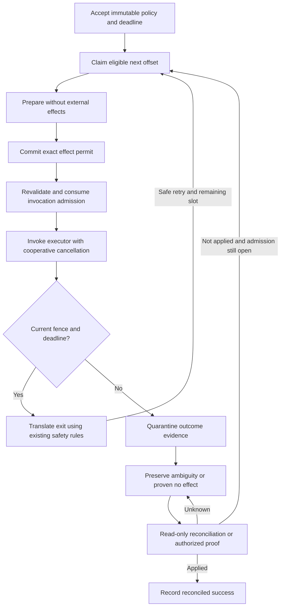

# Design: Deterministic Durable retry plans and execution deadlines

Generated by /office-hours on 2026-10-03 (America/New_York)
Repository: `forge-trust/AppSurface`
Issue: [#765](https://github.com/forge-trust/AppSurface/issues/765)
Inspected branch: `codex/make-it-so-845-runtime-preflight` at `9612cdeb`
Status: APPROVED
Approved: 2026-10-03, user selection D7/A, with the specification-review limitation acknowledged
Mode: Builder, open source
Builds on: [typed Work exits](issue-783-durable-work-exits.md), [immutable typed Work definitions](issue-800-typed-work-definitions.md), and the [executable-contract adoption rail](durable-executable-contract-adoption-rail.md).

## Problem and intended outcome

Durable already freezes retry and lease settings when it accepts Work. The [PostgreSQL Work store](../../Durable/ForgeTrust.AppSurface.Durable.PostgreSql/PostgreSqlDurableWorkStore.cs) nevertheless calculates each retry eligibility time from completion time. Slow execution shifts the recovery circuit. The elapsed retry horizon also does not independently fence a still-current effect permit or normal completion against an immutable application deadline.

An adopter should be able to accept a new Work version with the exact eligibility offsets `0, 5, 20, 60, 180` minutes and a fixed UTC deadline, then inspect why a claim, effect, or retry was refused. Later configuration, duplicate enqueue, operator release, and reconciliation must not move those offsets or extend the deadline.

The reusable capability is a closed execution-policy contract shared by authoring, acceptance, provider execution, observations, and tests. PostgreSQL remains the first implementation and sole persisted authority. This session creates a design; implementation starts from current main in a separate branch, since the inspected branch belongs to #845.

## What makes this useful

An adopter can demonstrate a deadline-bound maintenance window: accept a credential rotation, lose the worker around the external call, stop admitting effects when the approved window closes, and reconcile the provider afterward. A deterministic failure lab can show the five planned offsets and exact permit evidence rather than requiring an operator to infer safety from an exception.

These are generic examples, not product demand measurements. The issue identifies a real gap in the existing execution mechanics; this session established no named adopter or measured time-to-first-completion target.

## Decisions, premises, and scope

- **D1:** User selected “Open Source”; portable contracts, compatibility, documentation, and conformance evidence guide the design.
- **D2:** Build on existing designs. Executors report local facts; providers own transitions, permits, fences, and retry eligibility.
- **D3:** Generalized category research was authorized. Research used official sources because Aside was unavailable.
- **D4:** User accepted additive adoption, fixed earliest eligibility, authoritative admission checks, and preservation of late effect evidence. The literal issue claim that no external invocation can occur after a deadline is qualified below.
- **D5:** User requested an independent opinion; a native `combo/sub` subagent completed it. The configured external review CLI was unavailable. Its advice on overdue slots, late evidence, and database clock tests is incorporated.
- **D6:** User chose **B, shared immutable execution-policy contract**, including sequential offsets, immediate eligibility for an overdue next slot after a safe retry decision, and an exclusive cutoff.
- **D7:** User approved this design with **A**. The specification review remains UNREVIEWED because the reviewer could not complete its required tool contract. Engineering plan review is the proposed next stage.
- Approach A, narrow extensions to existing types, was not selected because it leaves timing composition spread across types. Approach C, materialized slot rows, was not selected because additional slot storage and lifecycle proofs exceed the present need.

Existing Work retains its legacy semantics. Adoption uses a new immutable Work contract version. Scope includes all acceptance and release paths for opted-in Work, diagnostics, test helpers, API references, migration guidance, and packed-consumer proof. It excludes domain retention/source policy, a management UI, new authorization rules, automatic DDL, new executors for other safety classes, and a second effect ledger. No new NuGet package is needed.

## Public contract and compatibility

Types live in [ForgeTrust.AppSurface.Durable](../../Durable/ForgeTrust.AppSurface.Durable/README.md). The following describes proposed API surface, not implemented code.

| Type/member | Contract |
| --- | --- |
| `DurableAttemptPlan(string version, IEnumerable<TimeSpan> elapsedOffsets, TimeSpan maximumCircuitDuration)` | Immutable, defensively copied schedule. Exposes `Version`, `ElapsedOffsets`, `MaximumCircuitDuration`. |
| `DurableExecutionDeadline(DateTimeOffset notAfterUtc)` | Immutable UTC instant. Exposes `NotAfterUtc`; equality compares the normalized instant. |
| `DurableWorkExecutionPolicy.FromRetryPolicy(DurableWorkRetryPolicy retryPolicy)` | Legacy timing projection with no attempt plan. |
| `DurableWorkExecutionPolicy.ForAttemptPlan(DurableWorkRetryPolicy retryPolicy, DurableAttemptPlan attemptPlan)` | Validated composition of existing retry/lease settings and an explicit plan. Exposes `RetryPolicy` and nullable `AttemptPlan`. |
| `DurableWork.DefineWithExecutionPolicy<TWork,TResult>(name, version, workCodec, resultCodec, providerSafety, defaultExecutionPolicy)` | Named additive factory sharing the existing immutable codec/contract snapshot. |
| `DurableWorkDefinition<TWork,TResult>.DefaultExecutionPolicy` | The definition's validated default; existing `DefaultRetryPolicy` projects its `RetryPolicy`. |
| `DurableWorkRequest.CreateWithExecutionPolicy(scopeId, commandId, idempotencyKey, workName, workVersion, payload, providerSafety, executionPolicy, executionDeadline = null, dueAtUtc = null)` | Named direct request factory; policy is required. Adds get-only `ExecutionPolicy` and nullable `ExecutionDeadline` properties. |
| `definition.CreateRequestWithExecutionPolicy(scopeId, commandId, idempotencyKey, work, executionPolicy = null, executionDeadline = null, dueAtUtc = null)` | Encodes input once; null policy selects the definition default. Caller validation precedes encoding, as in the existing typed request API. |

All new policy types are closed, sealed, immutable types with validated construction, structural value equality, and no mutable `init`, unsafe copy constructor, arbitrary dictionary, or provider callback. The plan's collection is a read-only snapshot; neither the input enumerable nor an exposed array can mutate it.

Plan v1 accepts 1–256 offsets, starts at zero, is strictly increasing, and has a positive circuit duration strictly greater than the final offset. Version uses the existing bounded identifier rule (100 characters). Durations and planned deadlines have microsecond precision, matching PostgreSQL storage; reject sub-microsecond input rather than silently rounding fingerprinted values. Require checked arithmetic and timestamps representable by both .NET and PostgreSQL. A one-slot plan permits one execution and no retry.

For a planned policy, `retryPolicy.MaximumAttempts` must equal the offset count, and `retryPolicy.MaximumElapsedTime` must be at least the circuit duration. Reject disagreement rather than silently changing supplied settings. The plan replaces the backoff delay calculation; initial/max retry delay and the legacy algorithm remain available as a compatibility projection, but do not add another wait or jitter. Existing lease settings still govern leases. PostgreSQL accepts only supported policy/plan versions and supported underlying retry policy; unknown versions fail closed before acceptance or invocation.

Preserve the exact existing constructors, methods, virtual seams, and binary signatures. The old request constructor creates a legacy policy and retains its current fingerprint. Existing `Define` captures a legacy default. Existing `CreateRequest` retains exact behavior for legacy definitions. On a planned definition, it uses the planned default when no retry override is supplied; a legacy retry override is rejected with guidance to use the named policy method, rather than discarding the plan. `dueAtUtc` is rejected for planned requests, because slot zero is anchored to acceptance. Deadline-only requests with a legacy policy may retain `dueAtUtc`; their absolute deadline is enforced using the new opt-in path.

The definition default is request-authoring data, not authority to reinterpret accepted Work. Explicit request overrides remain possible through the named policy API. The registration/registry snapshot exposes the default execution policy for derived requests and testing, while the accepted request is authoritative for its actual settings. Keep [ReconcileBeforeRetry registration](../../Durable/ForgeTrust.AppSurface.Durable/README.md) and the existing binding matrix intact; no typed-exit widening to other safety classes is required.

### Derived Work and provider boundaries

[Flow](../../Durable/README.md) child acceptance and Schedule Work materialization must use the resolved registration's captured execution-policy default for the new Work version. Legacy registrations retain their existing construction and fingerprint behavior, including the historical default behavior of these paths. A planned default must never fall back to `DurableWorkRetryPolicy.Default` in a derived request. Each child/occurrence has its own acceptance anchor. This issue adds no Flow/Schedule deadline expression language: an absolute request deadline is supported for direct Work submission; derived Work uses its plan's circuit bound unless an existing request-producing path explicitly supplies a deadline.

In [ForgeTrust.AppSurface.Durable.Provider](../../Durable/ForgeTrust.AppSurface.Durable.Provider/README.md), add a closed `DurableWorkExecutionSnapshot` containing the accepted policy, deadline, acceptance instant, next eligibility, and admission cutoff. Preserve the existing `DurableClaimedWork` and `DurableWorkSnapshot` constructors; add named factories with a required execution snapshot and nullable get-only `Execution` properties for legacy/provider compatibility. Carry it through `DurableWorkExecutionContext` and the prepared invocation without adding metadata to the shared [Workers envelope](../../Workers/ForgeTrust.AppSurface.Workers/DurableWorkerEnvelope.cs). The snapshot describes facts; it grants no execution capability. PostgreSQL still performs authoritative checks.

Add a nullable execution snapshot projection to the existing authorized Work inspection API. A legacy row projects no opt-in snapshot. Planned inspection exposes times and policy identifiers through the scoped API; public diagnostic logs and metrics remain payload-free and do not expose scope IDs, Work IDs, provider keys, input, result, or exception text.

## Timing semantics

Let `A` be the authoritative timestamp stored when acceptance is inserted, `O[i]` the zero-based offset, `C` the circuit duration, and `D` the optional absolute deadline.

```text
slot i earliest eligibility = A + O[i]
execution attempt number   = i + 1
planned admission cutoff   = min(A + C, A + MaximumElapsedTime, D if present)
deadline-only cutoff      = min(A + MaximumElapsedTime, D)
eligible new admission    = due <= authoritative_now < cutoff
```

The example uses offsets `0, 5, 20, 60, 180` minutes and a **240-minute** circuit duration, with `MaximumAttempts = 5` and `MaximumElapsedTime >= 240 minutes`. Choosing 180 minutes as an exclusive circuit cutoff would prevent the last slot from running and is invalid. A deadline before a later slot may intentionally truncate the circuit; acceptance does not require every slot to fit before that deadline.

`AttemptNumber` continues to count actual claims, including reclaimed pre-effect lease failures; an acceptance has zero and the first claim advances it to one. A refusal does not consume a slot. Recovering a lost attempt requires a safe new claim and consumes the next offset; duplicate delivery of the same exact claim does not create another execution. All attempts remain sequential under the Work fence.

After a safe retry decision for attempt `n`, the next due time is `A + O[n]`, not completion time plus backoff. If overdue, it is immediately eligible. Offsets are not skipped and are never rebased to recovery time. Downtime alone does not execute missed slots; each additional claim requires the ordinary safe retry/recovery transition. Existing pump item/time/concurrency bounds still apply. A succession of fast failures can consume several overdue slots quickly; this explicit behavior is the cost of retaining fixed earliest eligibility. Applications needing spaced retries after each failure should choose the existing backoff policy.

The circuit/elapsed cutoff closes new claims, permits, retry releases, and invocation admission. Renewals for an already admitted attempt remain bounded by its original lease lifetime and any absolute execution deadline, rather than the plan circuit cutoff. It does not censor a result from an already admitted attempt solely because the last plan slot is now past: normal completion still requires current fences and, when supplied, `now < D`. Lease validity and absolute execution deadline are separate checks. Side-effect-free reconciliation and authorized proof recording may occur after either cutoff.

### Deadline guarantee and its limit

The linearization point is the provider's post-lock authorization decision using its authoritative clock. A transaction can finish committing after that instant; this is not a guarantee that every transaction completes before the wall-clock cutoff. No new authorization decision may pass at or after the cutoff.

Immediately before entering the prepared executor, PostgreSQL revalidates the current permit/fence/deadline in a short transaction. The runtime also forwards a deadline-bounded cancellation token and performs an advisory local check immediately before invocation. Local timing never substitutes for the store check. Arbitrary code can be paused after the check, ignore cancellation, or start further calls inside an already admitted executor. The generic runtime cannot promise that no network byte is sent after the deadline. A stronger external-effect guarantee requires a provider that enforces the deadline or fencing identity itself.

This qualifies #765's literal provider-invocation acceptance criterion, with the user's D4 approval. Tests prove refusal when authoritative expiry is observed at claim, permit, invocation admission, retry release, and normal-completion boundaries, and include an already-admitted call crossing the cutoff. They do not claim arbitrary-process preemption or rollback of an external effect.

## Authoritative PostgreSQL protocol

Use the [Work protocol's canonical lock order](../../Durable/work-protocol-v1.md): scope → Work → dispatch → permit → history. Preparation and provider I/O stay outside store transactions. All new paths preserve runtime epoch, scope generation, lease owner/generation, attempt identity, and revision checks.



### Acceptance and identity

Freeze the policy and deadline in the caller's existing transaction with domain data. Planned acceptance explicitly uses one database clock sample for `accepted_at`, initial `due_at`, and cutoff calculations; do not let independent defaults give slot zero a different anchor. The anchor is acceptance insertion time, not transaction commit time or request creation time. A long caller transaction consumes part of the window before workers can see Work; document this ordering pitfall.

Retain legacy fingerprint schema `appsurface.durable.work.enqueue.v1` byte-for-byte for a legacy policy without a deadline. Opt-in requests use `appsurface.durable.work.enqueue.v2`, hashing the existing semantic fields, full retry/lease snapshot, plan version/count/ordered offsets/circuit bound, nullable UTC deadline, and permitted initial due time. Canonicalization is closed and culture-independent. Never hash a server-generated acceptance instant into the request identity.

The existing scope/command/idempotency matrix remains authoritative. An identical duplicate returns the original acceptance even after expiry; changed policy, offset, version, duration, due time, or deadline conflicts. Concurrent duplicates still yield one Work and one dispatch record. Do not reject an identical persisted duplicate because today's time is later. A new request whose deadline is already reached fails with the deadline diagnostic and creates no Work/dispatch row. Checked timestamp arithmetic failures return the validation diagnostic before mutation. These domain rejections keep a caller-owned transaction committable; database failures retain its existing rollback requirements.

### Storage and migration

Append one explicit migration after current main's migration catalog. The inspected branch ends at schema 11; do not reserve a migration number across concurrent work. Add nullable opt-in columns on Work: execution-policy schema, attempt-plan version, bounded `bigint[]` offsets in microseconds, circuit duration in microseconds, and UTC `execution_not_after`. Existing retry/lease columns remain their single persisted representation. Validate all-or-none plan fields, precision, ordering, count, policy relationships, and the supported schema. Legacy rows keep null opt-in fields and are not assigned a plan/deadline.

Add nullable `invocation_admitted_at` to the existing effect permit. For opted-in Work, a current, timely admission atomically sets it once. An exact duplicate cannot enter the executor again. A crash after this marker commits is potentially effectful even when the executor had not actually started; conservative uncertainty is required. A permit with no admission marker can be proven pre-invocation only by the matching locked provider transition, not by an arbitrary caller asserting absence. Historical permits preserve legacy handling.

Use existing Work history to quarantine a late/stale encoded result with its exact old fence, codec, digest, classification, and safe reason. Carry its retention-policy identity using an additive history column so a quarantined result does not lose existing payload metadata. Normal Work inspection returns no quarantined payload and Work's terminal result stays unset. This adds no retention engine or alternate result/effect ledger.

The migration establishes a package compatibility floor at its version for readers and writers. Existing older workers must be rejected before processing the new schema, including workers with an identically named registration. The schema manager's current metadata stamping and generated deployment SQL hard-code minimum versions to 1; update both to preserve the migration's floor, and ensure later migrations do not lower it. A Work version name alone is insufficient protection from an old binary that ignores new columns.

Existing [role bootstrap](https://github.com/forge-trust/AppSurface/blob/codex/make-it-so-765-retry-deadlines/Durable/configure-postgresql-roles.sql), forced RLS, schema checksums, and explicit schema manager remain the deployment path. Applying DDL does not start a worker. No row data is backfilled into new timing behavior. After schema upgrade all producers/readers/workers sharing the store must use compatible packages, while legacy rows on those packages retain their previous semantics.

### Checks and transitions

| Boundary | Required opted-in behavior |
| --- | --- |
| Discovery | Remains a payload-free hint; scoped authoritative classification closes expired/exhausted candidates even when their due time is still in the future. Avoid permanently available expired dispatch rows. |
| Claim | Lock, sample time, validate policy/next offset/current safety and cutoff, then advance attempt/fence once. An expired unpermitted item fails terminal with a timing reason. An unresolved prior permit suspends according to safety. |
| Renewal | Revalidate the same fence. Cap lease expiry by original maximum lease lifetime and any absolute execution deadline; never extend the persisted policy. A circuit cutoff alone does not revoke an already admitted attempt. At lease/deadline expiry request cooperative cancellation. |
| Permit, including exact-permit lookup | Recheck active scope/epoch/lease/current attempt and cutoff before returning or granting a permit. Expired cached permits are not usable capabilities. |
| Invocation admission | Recheck after permit commit and acquire the one-use admission marker. On refusal, invoke no executor. Prove no invocation only when the exact marker remains absent; otherwise preserve uncertainty. |
| Safe retry completion/recovery | Use the next stored offset. If slots/cutoff are exhausted and no effect is uncertain, fail terminal; if an effect is uncertain, suspend. |
| Ordinary successful completion | Require current exact fence/permit and a deadline check after lock. At/after the absolute deadline, quarantine the result and preserve effect truth, rather than setting normal success. |
| Stale completion | Append quarantined evidence under the old identity without changing the winning Work, permit, or terminal fact. |
| Operator release | Revalidate immutable cutoff and next slot for retry-safe, recovery release, manual NotApplied, and reconciler NotApplied paths. Never set planned due time to `now` or bypass exhaustion. |

Prefer one closed internal timing decision model with a portable pure evaluator and explicit PostgreSQL mappings. It returns next eligibility/admission cutoff and a bounded decision kind; it cannot set Work state, run a callback, or decide whether an effect happened. The provider applies existing cancellation/safety rules and projects Work, dispatch, history, Flow, and Schedule together in the same transaction. No public method accepts a caller-supplied “current time” as authorization.

### Outcome truth after cutoff

| Evidence | Before cutoff | After cutoff |
| --- | --- | --- |
| No permit, or exact unconsumed admission proven by runtime | Eligible next slot may be claimed. | Terminal timing failure; no provider invocation. |
| Current explicit proven-no-effect exit | Existing safe retry/cancellation rules plus next offset. | Terminal timing failure or cancellation; record the permit proof. |
| Admitted call returned late success | Normal success only if deadline/current fence passes. | Quarantine encoded evidence, mark the permitted outcome uncertain for authoritative completion, and suspend according to safety. |
| Exception/cancellation/lease loss after invocation admission | Existing provider safety applies; no inference of absence. | Same ambiguity preservation; no mutating retry even for safe-repeat classes. |
| Side-effect-free reconciliation: Applied | Reconciled success with validated encoded result. | Reconciled success is allowed to establish existing effect truth; it grants no new execution. |
| Reconciliation or authorized proof: NotApplied | Release for next persisted offset if still eligible; otherwise fail safely. | Record proof and fail timing/cancel as applicable; do not release to retry. |
| Reconciliation: Unknown | Keep suspended with exact ambiguous permit. | Keep suspended; deadline does not turn Unknown into failure/no effect. |

For `ReconcileBeforeRetry`, reuse the registered reconciler and existing command/revision validation. `ManualResolution` retains authorized manual proof. For `Idempotent`/`ProviderKeyed` Work whose admission is permanently closed with an exact ambiguous permit, extend the existing audited manual-resolution eligibility narrowly to this timing-closed state; its current eligibility for those safety classes is cancellation-specific. An authorized Applied/NotApplied proof can close truth without reopening execution. Keep actor/scope authorization application-owned, result-codec validation, and command idempotency unchanged. Do not change the exit-aware registration's ProviderKeyed-only scope.

Precedence is explicit: stale identity never changes current truth; an unresolved admitted effect takes precedence over terminal timing failure; proven absence allows cancellation to win, then absolute deadline, plan exhaustion/circuit cutoff, and legacy elapsed/attempt exhaustion. Safe diagnostic details may record the other timing predicates without conflating them with the lifecycle outcome.

## Clock and failure-injection proof

Add an internal migration-owned SQL function `appsurface_durable.work_execution_now()` returning `clock_timestamp()` in production, declared VOLATILE with a fixed safe search path. It accepts no arguments and reads no session override. Producer, runtime, and dispatcher roles receive only the execution privileges needed by their opted-in operations, never ALTER or control-table write access.

Only opt-in acceptance and protocol paths use this seam; legacy statements retain their direct clock behavior. Existing database locks must be acquired in separate commands before sampling time, then the immediately following decision statement samples once and uses that sample throughout its validation and writes. Do not sample before a row-lock wait or substitute transaction-start `now()`. This defines the authorization decision instant; time can still cross a boundary during the following transaction commit.

The disposable [PostgreSQL integration fixture](../../Durable/ForgeTrust.AppSurface.Durable.PostgreSql.Tests/PostgreSqlIntegrationTestDatabase.cs) owns a test-only administrative clock table and replacement function body. Production migrations create no fake clock table or override switch. Runtime roles can only read the sampled clock through the function. Each test database is isolated; advancing one fixture cannot change another fixture or production. Test actual acceptance, lease predicates, recovery, permit lookup/grant, invocation admission, completion and every retry release with this clock. Prove that runtime/producer/dispatcher credentials cannot alter the function or modify its test clock.

Use an internal injected `TimeProvider` for cooperative runtime waits, lease-renewal scheduling, and cancellation tests. It cannot authorize a database transition. Database tests advance the store clock explicitly at checkpoints and release barriers, without wall-clock sleeps as correctness evidence.

In [ForgeTrust.AppSurface.Durable.Testing](../../Durable/ForgeTrust.AppSurface.Durable.Testing/README.md), add immutable execution-policy observations and a reusable one-shot checkpoint controller for `BeforePermit`, `AfterPermitCommit`, `BeforeInvocationAdmission`, `AfterInvocationAdmission`, `BeforeProviderCall`, `AfterProviderCall`, and `BeforeCompletion`. The controller supports observing, pausing until released, or throwing one deterministic test exception, uses bounded waits/cancellation, and reports safe checkpoint facts. It neither grants permits nor simulates success. Provider-specific hooks are internal no-op seams for real store/pump tests; an adopter's test executor explicitly calls provider-call checkpoints around its fake provider. Core cannot detect arbitrary external calls inside a consumer executor. Document that distinction and prohibit a testing package dependency in production provider packages.

Verification uses a recording provider with a stable ActivityId/provider key and mutation counter. After a simulated provider mutation followed by failure, ReconcileBeforeRetry must yield Applied with no second mutation; NotApplied may release only before cutoff; Unknown stays suspended. Include fresh-process/crash proof around committed permit/admission checkpoints, because an in-process exception does not prove process recovery.

## Diagnostics and documentation

Append stable public problem-code constants for `AttemptPlanExhausted` and `ExecutionDeadlineReached`, provisionally `ASDUR120` and `ASDUR121` (verify no collision on implementation main). Reuse `ASDUR104`/`ASDUR105` for stale claim/lease fences, `ASDUR106` for unresolved external outcomes, and `ASDUR117` when retry requires proof. Do not renumber existing identifiers. Pair a safe timing reason with the existing lifecycle outcome so deadline expiry and reconciliation-required remain distinguishable at the same time. Inspection history should name the refused boundary and immutable plan version without returning raw provider details.

Update the [Work protocol](../../Durable/work-protocol-v1.md), [Durable guide](../../Durable/README.md), all four affected package READMEs, [diagnostic catalog](../../troubleshooting/durable-diagnostics.md), [API budget](../../Durable/api-budget.md), and API baselines. Reference content covers constructors/factories, validation, precision, defaults, compatibility, boundary truth tables, and failure modes. Decision content contrasts backoff with a fixed plan and provider deadline enforcement with cooperative cancellation. Pitfall content covers late transactions, overdue bursts, due-time conflicts, last-offset/cutoff equality, already admitted calls, and immutable Work-version rollout. Add canonical links to named concepts and a complete direct Work plus reconciler example.

## Verification and acceptance criteria

| Proof | Required evidence |
| --- | --- |
| Exact circuit | With store clock fixed at acceptance A, claims occur at A, A+5m, A+20m, A+60m, A+180m, numbers 1–5. One microsecond before each offset refuses without consuming a slot. A sixth claim fails exhaustion. |
| Overdue recovery | Long execution and worker downtime do not rebase offsets; safe sequential retries can claim an overdue slot immediately. Refused/duplicate claims do not increment attempts. |
| Deadline and lock wait | At D−1µs admissible where otherwise eligible; at D and D+1µs refused at every new authority boundary. Hold the Work lock, advance clock across D, then release: post-lock check must refuse. |
| Immutable identity | Definition/config changes cannot alter accepted policy. Same semantic duplicate returns original acceptance after expiry; changed fields conflict; concurrent duplicates create one Work/dispatch. |
| Failure and truth | Pre/post permit, admission and provider-call failures, lease/epoch/scope loss, cancellation, late encoded result quarantine, current-vs-stale results and all safety classes. Assert exact provider mutation counts. |
| Reconciliation/releases | Applied, NotApplied, Unknown before/after cutoff; manual proof, retry-safe, recovery release and replayed operator commands. No planned release changes next due time to now or extends deadline. |
| Integration projection | Direct, caller-owned transaction, Flow child and Schedule target produce equivalent policy snapshots and correct terminal/suspended projections. Expired future-due dispatch is eventually closed. |
| Compatibility/roles | v1 golden fingerprint bytes; old compiled constructor/method consumer; supported/unsupported plan schema; legacy rows after migration; compatibility floor in applied and generated SQL; old binaries refused; role grants/RLS/checksums/clock isolation. |
| Distribution | Packed consumer compiles the new factories/properties and records a deterministic completed/reconciled circuit through real PostgreSQL. Missing PostgreSQL or skipped selected tests fail the gate. |

Pure contract tests cover every validation/equality/copy/overflow branch. Provider integration tests cover success, refusal, and race branches using public APIs or deliberate internal seams, without reflection. Run affected suites and existing Durable [PostgreSQL](https://github.com/forge-trust/AppSurface/blob/codex/make-it-so-765-retry-deadlines/Durable/verify-postgresql.sh) and [packed-consumer](https://github.com/forge-trust/AppSurface/blob/codex/make-it-so-765-retry-deadlines/Durable/verify-packed-consumers.sh) gates. Verify solution-level coverage with [coverage-solution.sh](https://github.com/forge-trust/AppSurface/blob/codex/make-it-so-765-retry-deadlines/scripts/coverage-solution.sh) when practical. Format before pushing and resolve introduced compiler, analyzer, and documentation warnings. No implementation checks have run during this design session.

## Distribution, rollout, and dependencies

Deliver through the existing Durable, Provider, PostgreSql and Testing NuGet packages and repository release workflow. Preserve coordinated package versions, API baselines, machine publication gates, migration resources and signed package verification. Update the existing release/runtime schema preflight proofs for the actual next schema; the #845 branch is context, not a dependency for designing #765.

Rollout sequence: build and prove package/schema support; coordinate all hosts sharing the store; drain old workers and stop new producer submissions during the compatibility-floor change; explicitly apply migration with the migration owner; deploy compatible producers/readers/workers and check schema/epoch health; register a new Work version; then enable acceptance for that version. A version or definition cannot be silently converted in place. Retain registrations for historical Work.

Rollback disables new acceptance and uses compatible code to drain/reconcile remaining Work. Old packages cannot be reintroduced once the schema floor excludes them. Do not drop new columns, clear permits, or extend deadlines to force recovery. Reversing the floor is a separate reviewed migration requiring proof that no opt-in Work can be processed unsafely.

Prerequisites are the landed [#783 Work exits](https://github.com/forge-trust/AppSurface/issues/783) and [#800 typed definitions](https://github.com/forge-trust/AppSurface/issues/800). Related doctor [#801](https://github.com/forge-trust/AppSurface/issues/801) and worker-template [#806](https://github.com/forge-trust/AppSurface/issues/806) designs may later display/demonstrate the policy; neither is expanded here. Coordinate migration numbering, API baseline budget, role bootstrap, and schema-preflight changes with current main during implementation.

## Assignment and next steps

The next concrete assignment is to implement a PostgreSQL vertical slice for a new Work version and show two artifacts: the five acceptance-relative claim timestamps, and a barrier-held claim/permit crossing the deadline that records its refusal with zero provider mutations. Use the disposable authoritative database clock, then extend the same proof through post-effect reconciliation and operator releases. This is a proposed implementation assignment, not authorization to change code in this office-hours session.

1. Start from current main in an isolated implementation branch. Add closed policy types, named authoring APIs, shared snapshot propagation, v1/v2 fingerprints and API documentation.
2. Add migration, compatibility-floor preservation, opt-in clock seam and role proofs. Preserve legacy row/timing behavior.
3. Implement the full boundary matrix, one-use invocation admission, outcome quarantine and next-offset release behavior; update Flow/Schedule projections and request propagation together.
4. Add checkpoint helpers, fake-clock integration and subprocess recovery tests, scoped diagnostics, packed adopter examples and release/schema proof changes.
5. Run formatting, affected verification and coverage; review the implementation and prepare a PR linked to #765 under the repository's normal workflow.

No product decision remains intentionally open in this design. Migration/code numbers must be rebased against implementation main and are coordination details. Engineering review should pressure-test the public API budget, SQL lock/time sampling, compatibility-floor rollout, and bounded discovery of expired future-due Work before coding.

## What I noticed about how you think

- You said “Open Source” and selected the shared contract rather than the smallest extension. The design consequently makes provider/adopter compatibility a first-class requirement.
- You chose to preserve the existing designs and accepted the qualified deadline premise. The design distinguishes expiry of execution authority from knowledge of an external effect.
- Your replies were short selections. This session does not establish named users, personal motivation, or demand measurements, so none are inferred.

## Independent perspective

The native `combo/sub` cold read proposed the maintenance-window example and recommended proving missed-slot semantics and the PostgreSQL clock seam first. It challenged no agreed premise. Its weekend prototype recommendation is an implementation order only: diagnostics and failure helpers remain in the full issue scope. A separate bounded code read confirmed the proposed SQL clock seam is feasible if every opted-in decision uses it after lock acquisition; this is design feasibility advice, not a completed conformance test.

Research supports the existing safety boundary. [Temporal's retry policy](https://docs.temporal.io/encyclopedia/retry-policies) uses backoff intervals and independent total/per-attempt [timeouts](https://docs.temporal.io/encyclopedia/detecting-activity-failures). [Azure durable timers](https://learn.microsoft.com/en-us/azure/durable-task/common/durable-task-timers) can stop waiting without ending activity execution already in progress. [AWS's idempotency guidance](https://docs.aws.amazon.com/durable-execution/patterns/best-practices/idempotency/) distinguishes per-attempt execution semantics from effects repeated across retries. The conclusion drawn here is specific to AppSurface: fixed accepted offsets add auditability, while expiry still requires preserving unknown effect truth.

<!-- gstack:office-hours:concerns:start -->
## Reviewer Concerns

Disposition: UNREVIEWED

Stop: UNREVIEWED

Unavailable reason: "Reviewer tool mismatch: prepared prompt requires Read/Write and forbids Bash/Edit; native Codex subagent lacks those named tools. Round 1 produced no valid verdict."

Findings below are retained from the last completed review; the current document remains unreviewed.

No unresolved findings.
<!-- gstack:office-hours:concerns:end -->
