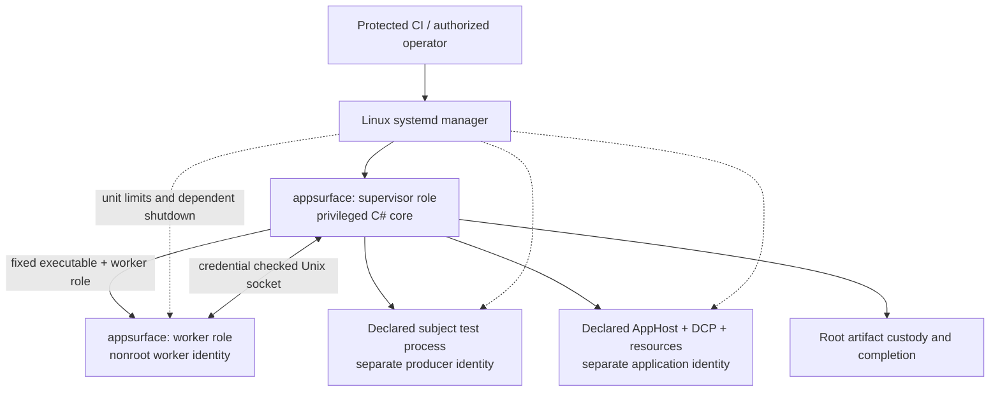
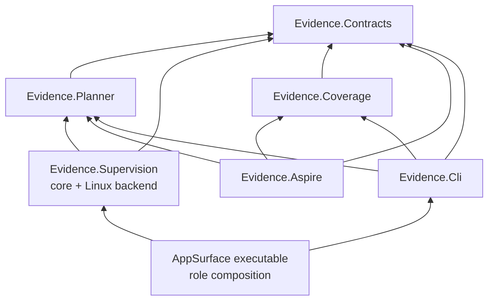

# Design: EvidenceHost supervision with a C# core

- Date: 2026-10-06
- Status: Design reviewed; checkpoint 1 foundation implemented and locally verified; native acceptance pending.
- Case: [#779](https://github.com/forge-trust/AppSurface/issues/779)
- Replaces: the Python runtime architecture and its migration sequence, while retaining the security and claim requirements in the [approved trust boundary design](issue-779-evidencehost-trust-boundary.md).
- Delivery plan: [C# supervision migration](../plans/issue-779-csharp-supervision-migration.md).

## Decision

Ship supervision as C# code in AppSurface. The protected AppSurface executable has explicit supervisor and worker process roles. A privileged supervisor starts another instance of the same deployed executable as an unprivileged worker. Systemd enforces their Linux identities, process containment, resource limits, and emergency termination.

The supervisor and worker use the same contract assembly. Python leaves the production execution path. The first supported backend remains Linux with systemd and cgroup v2; unsupported platforms reject protected execution.

This changes the implementation language and organization. It preserves protected policy ownership, shared admission, closed registrations, subject isolation, bounded output, physical exit verification, and the unchanged coverage gate. Production Trusted admission stays closed until the complete [consumer acceptance requirements](../evidence/issue779-consumer-acceptance.md) pass.

## Why this design

The current C# packages already implement admission, planning, the worker lifecycle, artifact writing, coverage evaluation, and the Aspire adapter. The Python launcher implements the privileged counterpart: accounts, systemd units, control messages, process ownership, output pumps, application supervision, and artifact custody. Maintaining both implementations also requires keeping their JSON shapes, canonical digests, ordering, and failure rules aligned.

Moving that counterpart to C# gives us shared types, one build graph, and ordinary .NET tests for the control server and ownership state. The migration consolidates responsibilities instead of translating each script function into a new class.

Separate processes remain necessary. A blocked callback or hostile subject must not block the supervisor's termination path, and the worker must not inherit the supervisor's privileges. An unprivileged command cannot acquire root simply by starting a copy of itself.

## Runtime shape



All processes run on the selected Linux CI machine. The supervisor is a transient per-run service, not a persistent daemon. The worker, producer, and application use separate units and identities on that machine. The backend generates every unit name and records its cgroup before it can be pruned.

### Executable roles and launch authorization

The reserved grammar is:

```text
appsurface evidence supervise --request <protected-request-file>
appsurface evidence worker --control <root-owned-socket>
```

Early dispatch and fixed help for these roles are implemented. The worker retains its authenticated execution path. Supervisor launch now reaches the guarded empty Observation composition; it requires supported Linux root, protected inputs and actual single-use owner activation before children start. This is the checkpoint candidate, with native acceptance still pending. The supervisor launch must be explicitly authorized by the protected CI workflow or operator. There is no automatic `sudo`, setuid executable, or broad permission for a worker to start privileged units.

Dispatch these roles at the process entry point before the normal console host, configuration providers, plugin discovery, or consumer callbacks. Parse only the fixed role grammar there. Unknown role arguments fail before loading user configuration. The normal CLI path retains its existing command behavior.

The supervisor validates Linux support, its actual effective identity, its systemd service identity, and the protected deployment and request before serving a worker. The request is bounded data from a protected control root; a digest or `--request` argument does not establish that ownership. Subject input cannot select the executable, runtime, account, arbitrary command, environment, unit properties, callback, or assembly.

The backend starts the worker using the pinned deployment path, with the worker UID/GID, cleared supplementary groups, restricted environment, and existing path grants. Worker dispatch requires an authenticated supervisor handshake. Calling the worker role directly issues no admission or output capability.

A single shipped executable still has a trusted dependency surface. Its runtime, DLLs, dependency manifests, and probing locations must be protected from subject writes. Root dispatch must avoid the general CLI service graph. If that separation cannot be maintained at entry, implementation stops at that checkpoint and revises the host composition before native work continues.

The protected launcher clears inherited startup hooks, additional dependency/probing settings, profiler injection, and unrelated credentials **before the .NET runtime starts**. Early managed dispatch cannot undo runtime hooks or module initialization. A qualified instrumented test deployment must explicitly bind any required collector configuration; production never inherits it from the subject environment.

For a framework-dependent tool, the deployment records both the absolute runtime host and managed entry path; `Environment.ProcessPath` alone may identify the runtime host. Child startup uses that protected deployment recipe. PATH lookup, an ambient tool manifest, or project evaluation cannot select another copy of the executable.

## Code organization

Add one library, `ForgeTrust.AppSurface.Evidence.Supervision`, with a Linux implementation inside it. Keep implementation types internal and expose only the narrow composition entry needed by the executable. Assembly access required to reuse existing internal contracts is reviewed production access; it must not create a public lease factory or a testing shortcut to protected authority.



The core does not depend on Aspire, Coverage, console configuration, or consumer code. The protected worker hosts invoke the existing CLI and SDK flows. The SDK's supervised entry uses the same client and core; it does not implement another broker. A consumer using a long-lived application still delegates execution to a worker process.

### Responsibility map

| Component | Owns | Main existing material |
| --- | --- | --- |
| `EvidenceSupervisorHost` | Early privileged entry, protected deployment/request validation, one run, terminal disposition | Launcher entry and protected CI setup |
| `SupervisedRun` | Admission closure, pending ownership, operation state, deadlines, aggregate workload join, final completion | Broker and root application ownership state |
| `ControlServer` | Counted framing, strict request shapes, kernel peer binding, replay guards, typed responses, independent stop requests | Python broker plus [C# client](../../Evidence/ForgeTrust.AppSurface.Evidence.Contracts/EvidenceLinuxWorkerSupervisor.cs) |
| `LinuxSystemdBackend` | Unit creation/start/stop/kill, authenticated process facts, cgroup inspection, account/workspace lifetime | Linux launcher and application module |
| `ArtifactCustody` | Retained directory/file handles, bounded copies/hashes, exclusive final files, strict close ordering | Root collector and [artifact root](../../Evidence/ForgeTrust.AppSurface.Evidence.Contracts/EvidenceLinuxArtifactRoot.cs) |
| `ProcessOutputCollector` | Concurrent stdout/stderr drains, one shared byte quota, bounded private prefixes, EOF/error/join receipts | Launcher/application pumps and [output quota](../../Evidence/ForgeTrust.AppSurface.Evidence.Contracts/EvidenceRunBudgets.cs) |

These are responsibility boundaries, not six public extension interfaces. The backend seam is internal and permits deterministic ownership tests. Production construction selects the supported backend directly and validates actual runtime facts.

### Reuse and consolidation

- Keep [shared admission and claim rules](../../Evidence/ForgeTrust.AppSurface.Evidence.Contracts/README.md), [Planner](../../Evidence/ForgeTrust.AppSurface.Evidence.Planner/README.md), and the compile-owned catalogue authoritative. Empty registration and proof tables continue to reject unsupported admission.
- Keep [worker execution](../../Evidence/ForgeTrust.AppSurface.Evidence.Contracts/EvidenceWorkerExecution.cs) responsible for in-process callbacks, writes, stage budgets, and fail-stop. Root supervision owns OS workloads. Their join predicates describe different scopes.
- Keep the [shared restricted coverage producer](../../Evidence/ForgeTrust.AppSurface.Evidence.Coverage/README.md) and [restricted Aspire adapter](../../Evidence/ForgeTrust.AppSurface.Evidence.Aspire/README.md). They submit declared work through the authenticated client.
- Consolidate Linux filesystem interop around retained `SafeFileHandle` values. One implementation supplies openat2, stat/identity checks, and bounded reads for writer and collector use; callers retain their distinct authorization checks.
- Share strict wire schemas and serialization between client and server. Keep serialized facts separate from unforgeable runtime ownership objects. Existing internal client naming can be clarified during migration without changing public SDK APIs.

## Linux backend

Use systemd's D-Bus manager API for transient unit creation, stop/kill requests, job events, and typed property inspection. The [pinned v255 interface](https://github.com/systemd/systemd/blob/v255/man/org.freedesktop.systemd1.xml) provides the required operations. The foundation pins [Tmds.DBus.Protocol 0.95.1](https://github.com/tmds/Tmds.DBus/tree/rel/0.95.1) behind the internal backend. It authenticates the fixed system bus manager as UID 0 / PID 1 and uses the pinned unique bus name; real Linux startup/termination verification is still pending.

Each start records ownership before issuing asynchronous I/O. The generated unit name, invocation identity, expected account, and cgroup belong to that pending record. A stop closes new starts, joins in-flight starts, and stops a unit that materializes late. A cancelled start call does not erase pending ownership.

Read actual process UID/GID, PID/start identity, and kernel cgroup membership. A successful start job alone is not readiness. A unit's `ControlGroup` property can disappear after exit; retain and verify the previously bound group. Missing or ambiguous facts cannot prove exit.

### Independent termination

The supervisor itself runs under a finite systemd service lifetime with `Restart=no` and no timeout extension. Worker, producer, and application units use generated dependencies on that supervisor, with `BindsTo=` and `After=`, finite runtime/stop bounds, and `KillMode=control-group`. The [v255 unit contract](https://github.com/systemd/systemd/blob/v255/man/systemd.unit.xml) describes inactive-parent propagation. [Runtime and exit semantics](https://github.com/systemd/systemd/blob/v255/man/systemd.service.xml) and [group termination](https://github.com/systemd/systemd/blob/v255/man/systemd.kill.xml) provide the independent enforcement mechanisms.

Use a supervisor service whose active state follows its main process, with `RemainAfterExit=no`. A slice groups accounting; the explicit service dependencies establish shutdown propagation. Native controls must prove supervisor SIGKILL, supervisor freeze/hang until its fixed deadline, a start accepted just before supervisor death, and a surviving descendant. Documentation of these settings is not a passing proof.

`BindsTo=` also has requirement/start semantics. `Restart=no` alone does not prevent a late dependent start from requesting another activation of the owner. The protected bootstrap must give the owner a single-use activation guard, checked by systemd before process execution and consumed before any workload start. Retain the guard and unit generation until all pending starts and units have settled; dependent activation must not reopen a stopped run. The first native checkpoint verifies this specific ordering as well as shutdown propagation.

The C# core requests cooperative stopping with a fresh token and the existing cumulative stopping/cleanup allowance. It then forces termination when necessary and verifies group emptiness plus all output joins. A callback thread cannot prevent that path. If the supervisor disappears, no process may publish a successful completion; the service manager enforces termination and the run remains quarantined.

The backend reserves the final kill allowance inside the original job budget. `RuntimeMaxSec` bounds active runtime; a subsequent stop timeout must also fit that budget. Derive each unit's limits from the remaining original deadline, accounting for startup and stop time, rather than giving every new unit a fresh full job allowance.

`Process.WaitForExitAsync` covers the process being waited on. It is insufficient to certify all descendants: [.NET documents this limitation even with tree kill](https://learn.microsoft.com/en-us/dotnet/api/system.diagnostics.process.kill?view=net-10.0). Positive completion requires the owned cgroups and pumps as well.

## State, deadlines, and completion

The run has one immutable monotonic job deadline. UTC timestamps are descriptive wire facts. Every stage, helper, stop, join, and final recheck is capped by remaining time; entering another phase never resets the job or cleanup reserve.

```text
Prepared -> Armed -> WorkerAuthenticated -> Executing
         -> WorkloadsStopping -> WorkloadsJoined
         -> WorkerFinalizing -> WorkerExited -> Collected -> Completed

Failure closes admission permanently and enters bounded stopping.
Unconfirmed ownership, failed joins, or exhausted teardown -> Quarantined.
```

Arming precedes every verifier, configure, factory, readiness, producer, and disposer callback. The worker can authenticate before admission; subject/application execution and artifact-writer activation require the existing admitted plan and bound output identity.

Two completion scopes are explicit:

1. **Workloads joined:** all application/producer units and their descendants/pumps have stopped, pending starts and active workload operations have settled. The worker is still alive to finish its tracked cleanup and manifest verification. The client wait response proves this scope only.
2. **Run completed:** the worker has also exited, its output drains have joined, all retained bytes/identities were verified, and strict resource/account finalization succeeded. Only the root owner can finish this scope and release the protected output channel.

This avoids asking a live worker to certify its own physical exit. Worker cleanup uses the existing pre-disposer joined phase; global final-completion predicates are checked after disposers have joined. The first failure remains latched through all later cleanup and diagnostics.

Stop requests use an independent authenticated connection and reserved handler capacity. A blocked producer request cannot occupy the only handler or hold a lock needed by stopping. Ownership locks are short and contain no awaited I/O.

Transport authentication checks the same retained root/worker identities and original lifetime independently
of active work admission. Canceling one request closes its socket and leaves no successful inspection; it
must not invalidate a shared kernel identity solely because that caller canceled. Fresh cleanup repeats all
native checks. Actual identity, named-path or descriptor loss remains permanently rejected. The
[control API reference](../../Evidence/ForgeTrust.AppSurface.Evidence.Supervision/README.md#authenticated-control-server-and-cleanup-continuity)
defines this distinction and the one cumulative cleanup allowance. No cleanup method reopens work.

Reply claims commit only after original write and close completion. The client can receive LF before the
root continuation commits, so the server orders READY/WAIT/EXIT replies through commit; STOP may close
work while an already claimed READY is writing. That prior successful write can commit without reopening
work. A failed write consumes its claim and cannot be retried into success.

Track workload operations separately from control handlers. A stop/wait handler remains owned by the server, but it is not a prerequisite of the workload join it is currently waiting to report. At final run completion, stop accepting requests and drain the remaining control handlers as a separate server-close phase. Deterministic controls must catch self-join deadlocks and a blocked operation starving stop.

Before publishing a terminal completion, recheck deadline, failure/cancellation latch, group identities, pump EOF/errors, exact combined output bytes, and retained artifact identities. A missing acknowledgement, stale receipt, late result, or capture failure cannot upgrade the outcome.

## Files, identities, and permissions

The protected workflow supplies the deployment, base policy/catalogue, subject checkout, and initial job context. The supervisor selects fresh work roots and distinct worker, producer, and application identities. Results/resource groups are explicit and cannot alias those identities or root.

The workspace separates protected control state, worker artifact slots, producer results, application scratch/bundle, and root final custody. Ancestors must grant the traversal actually required by each identity. Read-only mounts do not grant missing Unix access rights, and writable mounts do not override ownership checks.

Keep current reviewed write grants. The worker writes only its declared artifact slots and existing bounded scratch; the producer writes its own results; the application writes its own bounded scratch. Protected tooling/control/final publication roots remain unavailable for subject writes. Application bundle bytes, roles, modes, and digests bind to the exact compiled registration before launch and are rechecked through retained handles.

Linux link/alias/substitution checks continue to use openat2 and actual ownership; unsupported syscall/policy combinations reject. A pathname, JSON descriptor, hash, UID request, or test-created receipt cannot issue a lease.

## Diagnostics and evidence

Use a small closed C# terminal record with schema, stage, cause, cleanup disposition, and bounded numeric facts. Public output contains no raw process output, arbitrary exception message, command line, private path, or subject-controlled JSON. Root-retained private diagnostics have fixed names, finite byte/time limits, protected modes, and exclusive copies.

Collect diagnostics as an optional subordinate operation. Preserve the original failure if capture, parsing, retention, or cleanup fails. Keep numerical coverage evaluation and structural Evidence claims separate from runtime admission.

Use one immutable revision and normal build graph for validation. A spawned product process contributes coverage only when the supported collector actually instruments it and emits origin-bound data. Pure tests, uninstrumented process controls, and mechanism receipts remain labeled for their own scope. Private assembly replacement, fabricated reports, or wider worker write grants are not migration steps.

## Alternatives and tradeoffs

| Approach | Decision | Reason |
| --- | --- | --- |
| Same executable, separate supervisor/worker roles | Selected | One product deployment and typed C# core; OS identities remain separate. |
| Separate minimal C# supervisor executable | Reserve if early role isolation fails | Smaller privileged dependency surface, with another deployment artifact. |
| In-process supervision inside the worker | Rejected | Blocking callbacks and worker failure can disable cleanup; privileges cannot be separated there. |
| Python privileged broker with C# client | Retire through migration | Two runtime implementations and contract/lifecycle translations remain. |
| Persistent root daemon or generic sandbox/provider framework | Deferred | Adds installation, authorization, concurrency, and public API scope beyond this case. |

The new managed root process adds a .NET runtime and its startup/dependency behavior to the privileged path. A normal protected deployment and an independently enforced service lifetime are required. C# reduces implementation duplication; native enforcement and real failure controls still require Linux validation.

## Delivery boundary

First prove the [small native vertical slice](../plans/issue-779-csharp-supervision-migration.md#checkpoint-1-one-real-supervised-worker). Then migrate producers, the restricted application, and final custody. Retain Python as a historical reference until the corresponding C# slice passes; each validation job selects one backend explicitly and has no fallback.

The final cutover removes Python from protected runtime startup and security decisions. Thin repository tooling may still prepare test inputs or display results. Update CLI/SDK/operator documentation and rerun the complete acceptance matrix and unchanged coverage gate before enabling any Trusted registration or updating the draft PR as validated.

## Design review record

Bounded independent reviews covered the responsibility/dependency inventory, privileged startup and lifecycle, and test/migration scope. The final design addresses startup injection before CLR execution, single-use owner activation, pending-start ownership, distinct workload/worker completion, control-handler self-join, and a complete named native checkpoint inventory. These are reviewed design requirements. The [implementation record](../plans/issue-779-csharp-supervision-migration.md#implementation-record) distinguishes local foundation checks from the pending native and coverage gates.

### Terminal ownership implementation

The [terminal custody API](../../Evidence/ForgeTrust.AppSurface.Evidence.Supervision/README.md#terminal-root-custody-and-shared-teardown)
now binds actual joined server/worker owners, preflights the complete descriptor-relative run tree,
seals every account-associated inode to root, and retains that tree through strict account deletion.
Live workspace and terminal root policies are separate. Collection and cleanup use the first shared
owner expiry, capped by the unchanged job deadline; no phase restarts it. The associated metadata and
procedure seams issue no native authority. Source validation and N01–N16 Linux custody/cleanup proof
remain separate records in the [migration plan](../plans/issue-779-csharp-supervision-migration.md).

### Complete empty Observation composition

The private [root execution reference](../../Evidence/ForgeTrust.AppSurface.Evidence.Supervision/README.md#empty-observation-root-execution-and-final-files)
connects those native owners to the full checkpoint-one procedure. Normal worker exit follows the final
ACK before forced unit cleanup. Root validates all final files against the actual protected plan, retains
custody through account deletion and checks the original deadline after closing native owners before
returning detached informational data. Account reservation begins before workspace mutation, so failed
pre-worker preparation cannot release reusable IDs while preserved directories still belong to them.
The supervisor role invokes this guarded composition for the checkpoint; native qualification and
runtime cutover remain pending. Its five-field stdout record comes from the actual verified manifest
only after strict account cleanup and all native/local closes return.

Both roles use fixed `env -i` argv before dotnet startup, with no inherited CLR settings.
This still depends on trusted OS env/loader/locale/manager components. Bootstrap paths exclude command
expansion syntax; source matching does not prove installed OS versions or a successful native run.
