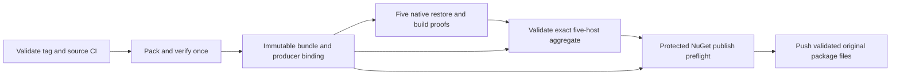

# Design: Native Tailwind Evidence Bound to Published Artifacts

Generated by /office-hours on 2026-09-11
Branch: HEAD (detached planning checkout at `48c6db61`)
Repo: forge-trust/AppSurface
Status: APPROVED
Approved by user: 2026-09-11
Mode: Builder
Design base: `0a9a4213a197533d607904f0cf3c6ec124313335` (`origin/main`, including #791)
Builds on: approved #790 Host-Scoped Tailwind CLI design
Supersedes: andrew-HEAD-design-20260607-issue491-tunit-tailwind-pilot.md for the branch design index only; this document does not change #491's decisions.

## Problem and desired outcome

[Issue #798](https://github.com/forge-trust/AppSurface/issues/798) follows
[#791](https://github.com/forge-trust/AppSurface/pull/791). Each native Tailwind
host currently packs its own Core and Tailwind packages, restores a consumer, and
records a digest of that local package. Separately, release `pack-and-verify`
creates the bundle passed to NuGet publishing. The native results therefore do
not establish that the tested and pushed packages are the same bytes.

The useful outcome is one inspectable chain: the release operator can trace every
native success to the exact package archive passed to `dotnet nuget push`.
Replacing a package while preserving its version must make publication fail.

The approved [#790 issue](https://github.com/forge-trust/AppSurface/issues/790)
established the verified host CLI cache and five supported hosts. The user chose
to **build on** that design and selected **B: a shared typed verifier in the
existing PackageIndex tooling**. The internal verifier owns the meaning of valid
evidence; GitHub Actions continues to own scheduling, artifact storage, and
protected publication. No new public NuGet package or hosted service is needed.

This document describes future implementation against the design base above.
No implementation, package build, native run, or publication was performed in
this office-hours session.

## Settled decisions and boundaries

- Preserve #790's consumer-facing build/watch behavior, CLI overrides, verified
  host cache, and exact host set: `linux-x64`, `linux-arm64`, `osx-x64`,
  `osx-arm64`, and `win-x64`. Preserve the documented Windows Arm64 emulation
  policy in the [Tailwind README](../../Web/ForgeTrust.AppSurface.Web.Tailwind/README.md).
- Pack one release candidate bundle. Native hosts restore from it into fresh,
  isolated caches and validate the actual restored archives and Tailwind release
  metadata before recording success.
- Matching version and source commit is insufficient. Bind evidence to producer
  artifact identity, manifest bytes, and raw package bytes.
- Reject missing, duplicate, failed, stale, or mismatched host evidence before
  any package push. Keep diagnostic artifacts when a proof fails.
- Reuse the existing SHA-512 package manifest contract. SHA-256 remains appropriate
  for document and Tailwind executable digests; every field names its algorithm.
- A new producer artifact requires fresh native proofs. A publishing retry may
  reuse proofs for the unchanged original artifact. After publication starts,
  recovery must reuse the original candidate rather than pack a replacement.
- The trust boundary is the existing protected repository, workflow, producer,
  and native runners. This does not authenticate claims from a compromised
  authorized runner. It also does not claim raw archive equality after
  NuGet.org processing: [NuGet.org repository-signs uploaded packages](https://learn.microsoft.com/en-us/nuget/reference/signed-packages-reference).

Approach A, extending workflow/Bash/jq guards, was not selected: it would spread
the same evidence rules across shell and C#. Both options targeted the complete
guarantee; B was selected for a common implementation and direct failure tests.

## Existing building blocks

All observations in this section refer to the design base, not the older
detached working tree.

| Existing component | Reuse in #798 |
|---|---|
| [PackageArtifactWorkflow](../../tools/ForgeTrust.AppSurface.PackageIndex/PackageArtifactWorkflow.cs) | Packs and validates the package set; writes the artifact manifest only after local consumer proofs succeed. |
| [PackagePublishing](../../tools/ForgeTrust.AppSurface.PackageIndex/PackagePublishing.cs) | Manifest writer/reader, `PackageHash`, plan-to-artifact matching, publication workflow, and command-runner seam. Current raw-file SHA-512 is lowercase hexadecimal. |
| [PackageArtifactValidation](../../tools/ForgeTrust.AppSurface.PackageIndex/PackageArtifactValidation.cs) | Tailwind archive shape, forbidden native payload/dependency checks, release-manifest schema and exact byte comparison against source. Extract the relevant internal validator for reuse without weakening its checks. |
| [DocsPackageConsumerProof](../../tools/ForgeTrust.AppSurface.PackageIndex/DocsPackageConsumerProof.cs) and [PackageProofWorkDirectory](../../tools/ForgeTrust.AppSurface.PackageIndex/PackageProofWorkDirectory.cs) | Isolated consumer configuration, structured command results, graph inspection, and guarded workspace preparation. Reuse focused helpers rather than generalizing a new proof framework. |
| [Native workflow at the design base](https://github.com/forge-trust/AppSurface/blob/0a9a4213a197533d607904f0cf3c6ec124313335/.github/workflows/tailwind-native-host-evidence.yml) | Five-host scheduling, observed-host checks, independent evidence uploads, and aggregation. Remove native self-packing. |
| [Consumer script at the design base](https://github.com/forge-trust/AppSurface/blob/0a9a4213a197533d607904f0cf3c6ec124313335/scripts/verify-tailwind-package-consumer.sh) | Existing invocation and consumer behavior. Retain it as a compatibility entry point to the typed proof workflow so local and native proof behavior cannot drift. |

The local Linux consumer proof precedes final manifest creation today. Preserve
that order: it can operate on a validated in-memory package selection. Only
after all local proofs pass may the producer serialize its release subject.
A local proof report is explicitly not eligible as a five-host release receipt.
Do not introduce a cycle in which packing waits for native proofs that require
the final pack artifact.

## Evidence contract

### Producer subject and transport binding

Keep `package-artifact-manifest.json` v1 as the inventory of the complete bundle.
Add an adjacent `tailwind-proof-subject.json`, schema
`appsurface-tailwind-proof-subject-v1`, generated by the successful producer.
It contains:

| Field | Meaning and validation |
|---|---|
| `repositoryId`, `sourceCommit` | Expected repository identity and full source commit from the validated release context. |
| `producerRunId`, `producerAttempt` | The workflow run and attempt that packed this candidate. These never change when a later job retries it. |
| `packageVersion` | Exact coordinated version, using the existing stable/prerelease validator without build metadata. |
| `artifactManifestSha256` | Hash of the exact serialized package artifact manifest. |
| `packageId`, `artifactFileName`, `packageSha512` | The main Tailwind entry selected uniquely from that manifest; its archive hash must agree with the manifest and the file. |
| `tailwindManifestSha256` | Hash of the exact `build/tailwind.release.json` bytes validated inside the producer archive. |
| `consumerFramework`, `firstPartyPackages` | Fixed `net10.0` proof target and sorted expected first-party package closure, each with ID, version, artifact filename, and raw SHA-512. |

IDs are validated decimal strings, not floating-point JSON numbers. Package
SHA-512 values are 128 lowercase hex characters; SHA-256 values are 64. Artifact
filenames are confined basenames and package identities are unique. Validate
schemas, required types, duplicate fields/identities, and digest encodings.

Upload the complete validated bundle, including these two documents, once.
Expose the upload's immutable artifact ID and the previously computed subject
SHA-256 as `pack-and-verify` job outputs. Native jobs, aggregation, and publishing
receive these outputs and the validated source/repository context explicitly.
They must not derive expected identities from the proof being checked or search
for the latest matching artifact name.

The GitHub artifact ID is assigned after upload, so it is **not** embedded in
the subject whose bytes are uploaded. The final producer binding is the tuple
of expected repository/run, artifact ID, and subject SHA-256. The subject then
binds the package manifest and package bytes. This avoids a circular hash or a
post-upload subject rewrite.

The workflow transport contract is explicit: the pinned download action receives
the single `producer-artifact-id` from the producer output, without `name`,
`pattern`, `merge-multiple`, or a different repository/run. Its successful
`download-path` output becomes the verifier's artifact directory. The same
producer output value is the verifier's required `--producer-artifact-id` and
the receipt's `producerArtifactId`. The action does not return an artifact ID
or digest output; do not invent one. The verifier trusts this protected workflow
handoff for transport identity, then recomputes subject, manifest, archive, and
payload digests. It does not make an independent GitHub authentication claim.
Workflow tests must prove that action input, verifier input, and downstream
receipt use the same producer output. Aggregate download follows the same
pattern with its own explicit ID and expected digest.

The [pinned upload action](https://github.com/actions/upload-artifact/blob/043fb46d1a93c77aae656e7c1c64a875d1fc6a0a/README.md)
returns an immutable ID; replacement creates a different ID. The
[pinned download action](https://github.com/actions/download-artifact/blob/3e5f45b2cfb9172054b4087a40e8e0b5a5461e7c/action.yml)
supports download by ID and already defaults `digest-mismatch` to `error`.
Preserve that setting. Transport integrity complements the package checks.

### Native receipt

Introduce `appsurface-tailwind-native-host-proof-v2`; retain v1 only as historical
diagnostic data and reject it for the new publish gate. Each receipt contains:

- The producer binding, subject SHA-256, artifact-manifest SHA-256, package
  version, and source commit. `producerArtifactId`, `producerRunId`,
  `producerAttempt`, `repositoryId`, and `nativeInvocationId` are mandatory
  serialized fields, not labels inferred from a filename.
- Expected and observed host RID, observed OS/process architecture, runner label
  for diagnosis, and the native proof's own run/attempt. Observed host identity
  must match #790's actual-host mapping; an input RID is not proof of execution.
- Per-restored-first-party-package identity, producer SHA-512, recomputed restored
  archive SHA-512, and payload-verification outcome. The closure includes Core,
  not just Tailwind. Its membership comes from the actual graph and validated
  producer metadata; missing or extra first-party nodes fail.
- The internal and restored Tailwind manifest digests, selected CLI binary name
  and recomputed SHA-256, and outcomes of the existing generated-CSS, no-runtime-
  companion, and no-native-consumer-output assertions.
- Relative paths and hashes for the lock/assets files, consumed first-party
  archives, relevant extracted payload evidence, generated CSS, and structured
  command/failure reports. Cache absolute paths are diagnostic observations,
  never paths the aggregator follows.

Write a success receipt atomically only after all checks pass. A failed receipt
records the failed stage, expected/observed identities when known, and commands
completed so far. Missing data is missing evidence, never an implicit `true`.
Aggregate input is the directory of all available records for the one expected
native invocation. Exactly five records with `status: succeeded`, one per RID,
and no duplicate record per RID are required. A failed record is retained as a
diagnostic and makes that invocation fail; it cannot fill a success slot or be
silently replaced by an older successful record.

## Shared verifier and execution order

The PackageIndex executable remains a non-packable maintainer tool. Add focused
internal records and services for producer subjects, restored-package binding,
native receipts, and aggregate validation. Keep pure parsing/verification
separate from command execution so tests can supply real temporary archives,
graphs, and an injected recording command runner without reflection.

Two maintainer commands expose this component:

- `verify-tailwind-consumer`: release mode requires the downloaded artifact
  directory, producer subject, expected artifact ID/subject hash/repository/run/
  source identity, expected RID, and a fresh proof work directory. Local mode is
  used only by the existing pack-time proof and produces a local-only report.
  The native workflow must explicitly select release mode; missing release
  inputs are errors and never cause a fallback to local mode.
- `verify-tailwind-evidence`: validates the trusted bundle and an exact set of
  five receipts, then writes the aggregate report. The same validation service
  is invoked again by `publish-stable` and `publish-prerelease` before any push.

The release CLI contract uses the following flag groups; names here are the
implementation contract, not executable commands already available today:

| Flags | Requirement |
|---|---|
| `--artifacts-input`, `--artifact-manifest`, `--producer-subject` | The **bundle flags**: required for consumer release mode, aggregate mode, publish-preflight mode, and existing Tailwind publish commands. Files must reside in the exact action-returned producer bundle directory. Evidence inputs never replace the trusted bundle. |
| `--producer-artifact-id`, `--expected-subject-sha256`, `--repository-id`, `--producer-run-id`, `--source-commit` | The **producer identity flags**: required in every mode listed above; no values are inferred from proof JSON. Producer attempt is read from the subject validated against the trusted hash and preserved. |
| `--mode release` | Required native consumer mode in addition to bundle and producer identity flags. Local compatibility mode is `--mode local`; it cannot emit a release receipt. |
| `--native-invocation-id`, `--expected-rid`, `--work-directory`, `--report-directory` | Required native consumer inputs. Only the consumer command accepts expected RID. The invocation ID and directories have no default; report paths must stay in the proof-owned workspace. |
| `--mode aggregate`, `--evidence-input`, `--native-invocation-id`, `--report-directory` | Aggregator mode for `verify-tailwind-evidence`; bundle and producer identity flags are also required. Reads available per-host records and writes an aggregate only on full success. |
| `--mode publish-preflight`, `--aggregate-input`, `--aggregate-artifact-id`, `--expected-aggregate-sha256`, `--publication-directory`, `--report-directory` | Preflight mode for `verify-tailwind-evidence`; bundle and producer identity flags are required. Validates the downloaded evidence bundle and prepares immutable push inputs before credentials. |
| `--publication-start-receipt`, `--publication-start-artifact-id` | Required on the existing Tailwind publish commands in addition to aggregate and producer inputs; points to the successfully uploaded/recovered start receipt, not a newly self-declared local substitute. |

Paths are explicit and resolved from `--repo-root` (existing default: current
checkout). IDs/hashes are command arguments projected from trusted job outputs;
document/receipt contents are files. Keep CLI arguments out of shell evaluation
by passing workflow expressions through environment variables and quoted args.
All missing/invalid inputs return nonzero before execution. Successful commands
return zero and write structured JSON plus a Markdown summary; the established
PackageIndex exit convention remains unchanged. The publisher uses the prepared
publication directory and invokes the shared preflight validator again; it reads
the API key only after validation. Existing local script flags remain supported.

### Expected dependency closure and restored-file projection

The producer records the expected first-party closure from its successful local
consumer proof, before that proof workspace is cleaned up. Package identities
in the validated producer package plan/manifest define first-party membership.
Any resolved `ForgeTrust.*` package absent from that inventory is an error, not
a third-party escape. Check package nodes, exact coordinated versions, package
dependency metadata, archive hashes, and lack of project-reference substitutes
before adding the sorted closure to the subject. At the design base this is
Core plus Tailwind. Every native consumer uses the same `net10.0` project with
no target RID; its first-party package set must equal this frozen set exactly.
Future platform-dependent first-party graphs require an explicit subject-contract
update, rather than allowing a host to redefine the expected set.

For each first-party archive, form the protected payload set from regular-file
entries under `build/`, `buildTransitive/`, `buildMultiTargeting/`, `lib/`, `ref/`,
and `analyzers/`, plus any other managed build asset actually referenced by the
fixed consumer's assets graph. This includes the Tailwind task and its packaged
dependencies. Prefix matching and collision detection use ordinal-ignore-case
comparison consistently across all five hosts; reject case-only duplicates so
Windows and Unix cannot interpret an archive differently. Match filesystem
components with the same rule and reject multiple matches, even on Unix.

Use the existing strict archive path normalizer, extended where necessary:
reject rooted paths, drive prefixes, backslashes, empty/dot/dot-dot components,
and duplicate normalized names. Ignore explicit directory entries only after
stripping their single trailing slash and validating their names; reject
file/directory collisions. Reject ZIP symlinks
and restored symlinks/junctions/reparse points in the protected path or any of
its parent components. Require the resolved NuGet package directory to be below
the designated fresh cache; normalize actual Windows paths with Windows APIs.

Compare decompressed file bytes, not ZIP compression, timestamps, permissions,
or NuGet-generated metadata. Hash all protected entries and require an exact
relative-path/byte set in each protected restored directory. NuGet-generated
`.nupkg.metadata`, `.nupkg.sha512`, normalized nuspec files, and ZIP-only `_rels`,
content-types, and package-metadata entries are outside this payload comparison.
The raw restored archive is checked separately. Any protected byte or membership
change during build is fatal; timestamp-only and generated-metadata changes are
irrelevant. #790 writes generated CSS to the consumer and CLI binaries to its
separate host cache, so it needs no package-directory mutation exception.
Test this projection against real NuGet restores on all five hosts.

For each native host, the typed workflow performs these ordered stages:

1. Validate the expected producer binding, subject bytes, artifact manifest,
   package plan, raw package hashes, and internal Tailwind release contract.
   Compare the archive's release manifest with both its subject hash and the
   checked-out source at the expected commit. Reject a substitute bundle before
   restore or build.
2. Create a new proof-owned directory with isolated global packages, HTTP cache,
   CLI home, and consumer project. Reject unsafe/overlapping paths using the
   existing workspace helper. A pre-existing cache cannot count as fresh; use
   a new directory for each invocation. Explicitly clear fallback folders and
   inherited sources, and create local `Directory.Build.props`,
   `Directory.Build.targets`, and `Directory.Packages.props` boundaries.
3. Restore the consumer with first-party packages mapped only to the downloaded
   producer bundle and the reviewed third-party graph constrained by the
   committed package locks and explicit source policy. Repeat in locked mode.
   Keep the existing third-party boundary; a new dependency requires an explicit
   policy update. Verify the exact resolved first-party graph and versions.
4. Resolve package folders and package paths from `project.assets.json`, verify
   they remain inside the designated private cache, and locate the actual
   restored `.nupkg` for each first-party graph node. Recompute raw-file SHA-512
   and compare it with the producer manifest. Do not treat the NuGet
   `.nupkg.sha512` file, `contentHash`, or source metadata as a substitute for
   hashing the archive. Record them only as supporting diagnostics.
5. Before build, compare extracted first-party build assets and managed payloads
   with the corresponding entries in those verified archives, including targets,
   task assemblies/dependencies, managed libraries, `tailwind.version`, and
   `tailwind.release.json`. Enumerate the relevant `build/`, `buildTransitive/`,
   `lib/`, and referenced managed-asset entries; reject missing/changed files,
   unexpected executable/build assets in those package directories, ambiguous
   archive paths, and paths that escape the cache. NuGet-generated metadata and
   archive packaging metadata are not required to be restored payload files.
6. Build with `--no-restore`. Verify fresh nonempty generated CSS, the expected
   host cache executable and its trusted manifest SHA-256, no companion-package
   edge, and no native Tailwind executable in the consumer's build outputs.
   Recheck the first-party archive and relevant extracted payload digests after
   build before emitting success. This catches stale extraction and accidental
   package mutation without claiming protection from a compromised runner.

[NuGet source mappings are bypassed for existing global-cache packages](https://learn.microsoft.com/en-us/nuget/consume-packages/package-source-mapping),
and [PackageReference uses the expanded files directly](https://learn.microsoft.com/en-us/nuget/consume-packages/managing-the-global-packages-and-cache-folders).
Those documented behaviors are why fresh caches, archive identity, and extracted
payload verification are all part of this proof.

## Workflow, aggregation, and publication

The release dependency graph becomes:

Change both [prerelease](https://github.com/forge-trust/AppSurface/blob/main/.github/workflows/nuget-prerelease-publish.yml)
and [stable](https://github.com/forge-trust/AppSurface/blob/main/.github/workflows/nuget-stable-publish.yml) workflows. Native
evidence depends on `pack-and-verify` and receives its binding; hosts no longer
call `dotnet pack`. Building the maintainer verifier from the exact source
checkout is allowed and does not recreate product package artifacts.

Aggregate exactly one successful receipt per required RID against the producer
subject. Validate all bound files and outcomes, not just the five JSON booleans
or job conclusions. Reject unknown, duplicate, incomplete, or foreign receipts.
Do not merge artifact directories in ways that allow one host to overwrite
another's evidence. Validate relative evidence paths before opening files.

Define `nativeInvocationId` as the tuple of producer artifact ID, workflow run
ID, current `github.run_attempt`, and the fixed native-workflow job key. Every
matrix job and its aggregator receive the same value from workflow expressions.
`producerAttempt` identifies when the frozen package was created;
`nativeInvocationId` identifies a later proof execution. These attempts are not
required to be equal and must not be compared for equality.
Name host artifacts by this identity and RID.
For the initial implementation, rerun the complete five-host proof invocation
after a native failure; do not assemble success from a mixture of partial
native invocations. A publish-only retry can reuse the already successful
aggregate. Scope any artifact lookup to the exact repository/run, producer ID,
and native invocation attempt, and reject duplicates. An aggregate upload
returns its own immutable ID; publish that ID alongside the SHA-256 computed
from the final aggregate JSON before upload. This JSON digest is distinct from
the upload action's transport-archive digest.
GitHub's ordinary "re-run failed jobs" may rerun only one matrix member. In
that case the new invocation has fewer than five matching receipts and must
fail with an actionable instruction to rerun the entire reusable native job
or the entire release workflow. It never imports the other four from the prior
attempt. The full rerun reuses the frozen producer bundle.

`publish-nuget` downloads the producer bundle and aggregate evidence by their
explicit IDs. The aggregate artifact contains its aggregate JSON and the exact
five proof directories with the bound evidence needed for revalidation; a JSON
summary alone is insufficient. Its expected digest is the aggregate JSON hash,
and its file inventory binds the remaining evidence files. Complete both
downloads, all preflight checks, publication-directory preparation, and the
publication-start receipt upload/recovery before requesting the NuGet token or
reading an existing API-key environment variable. Also invoke the
same evidence validator inside `PackagePublishWorkflow.RunAsync`, after
manifest/plan validation and before the first push, so the maintainer command
cannot accidentally bypass native evidence when publishing Tailwind. Its
required-evidence condition is derived from the package plan containing the
Tailwind package, not a caller-controlled skip switch.

Keep the original bundle immutable. Copy only validated push inputs into an
isolated publication directory and recheck the selected raw package hash
immediately before each push. Record the producer binding and aggregate digest
in the publish ledger so a partial result identifies the candidate it used.

### Reruns and partial-publish recovery

[GitHub keeps `run_id` and increments `run_attempt` on reruns](https://docs.github.com/en/actions/reference/workflows-and-actions/contexts).
Therefore the producer's run attempt and a consuming job's attempt are separate
fields. A later attempt may reuse the original immutable bundle and successful
aggregate; a matching version alone never permits reuse.

For release workflows, retain one producer artifact per release run using a
stable run-scoped artifact name with overwrite disabled. On producer retry,
look up that exact name in the same run: zero matches permits the initial pack
only on the first run attempt;
one existing completed artifact means download, fully revalidate, and reuse it;
multiple matches or invalid content fail closed. Lookup is a trusted producer
recovery operation and its resulting exact ID is passed downstream; native and
publish jobs never choose a package by name. An uploaded successful producer
bundle is frozen for the entire release run, even if no push has happened yet.

On a later attempt with no producer artifact, allow packing only when complete
GitHub job/step history for every prior attempt proves that the producer upload
never succeeded and the protected publication job never started. Otherwise
missing artifacts mean unknown history and block the run. Read failures,
incomplete pagination, unavailable history, cancelled/unknown upload outcomes,
or an absent receipt are not evidence that publication never happened. This
allows retry after an ordinary pre-upload failure while preventing repacking
after someone deletes all release artifacts. These bounded history checks run
in the workflow recovery step with `actions: read`, using the documented
[per-attempt workflow-job API](https://docs.github.com/en/rest/actions/workflow-jobs#list-jobs-for-a-workflow-run-attempt);
the C# verifier receives the
resolved producer binding and does not become a GitHub client. Keep the existing
per-tag concurrency group and `cancel-in-progress: false` throughout recovery.

Before any push, upload `publication-start-<run-id>` as a separate immutable
GitHub Actions artifact with overwrite disabled. It contains the producer
binding, aggregate artifact ID/hash, native invocation ID, and the prepared
package-file hash inventory. A receipt becomes authoritative only when its
upload succeeds and returns its artifact ID; a local file does not authorize
publication. Keep this step before token acquisition, so an upload failure or
ambiguous upload outcome means zero pushes. Recover an existing receipt by exact
run-scoped name, require one match, download by its ID, and validate it before
continuing. Concurrent creation conflicts fail and retry by reading, never by
overwriting. Direct maintainer publication must supply this workflow-produced
receipt and identity as required inputs.

On retry, verify the receipt against the original bundle and original successful
aggregate; never overwrite it with a new candidate or aggregate. If the receipt
exists but the bound artifact is missing/expired/unreadable, stop with a recovery
diagnostic. If producer artifacts cannot be recovered, a rerun must not silently
repack the same run/version. If a push returns and the process exits before its
ledger write, the already-uploaded start receipt still freezes the candidate.
Retry that exact candidate with `--skip-duplicate`; report the prior individual
push outcome as unknown until the new attempt supplies an observed result.
Do not infer remote byte identity from a missing ledger or a duplicate response.

When a start receipt exists, publication uses its original bundle and aggregate
IDs even if an operator reran the native proof and created a newer valid
aggregate. Validate the retained original evidence. Missing original evidence
blocks recovery; a fresh native invocation cannot silently rewrite the start
receipt. Before a start receipt exists, any complete successful native invocation
bound to the frozen producer may be selected by its explicit output ID.

`--skip-duplicate` can remain for retrying the original candidate, but the ledger
must not represent `duplicate-reported` as remote byte-equality proof. Keep the
existing fix-forward policy once any coordinated package is accepted. Reusing
expired or deleted artifact identifiers and independently restoring a remote
copy are not supported recovery paths in #798. Update the existing
[release operations guide](https://github.com/forge-trust/AppSurface/blob/main/.github/release-ops.md) with these exact retry
rules and artifact-retention requirements.

## Failure evidence and diagnostics

Use the structured command-runner pattern already used by package proofs.
Capture restore, locked restore, build, and verification failures with exit
codes and bounded/redacted stdout/stderr. Preserve the expected and observed
artifact IDs, file digests, RID, stage, assets/lock files when available, consumed
first-party archives, and relevant extracted payloads. Do not upload whole CLI
homes, credential-bearing configuration, environment dumps, or unrelated caches.

All native jobs upload available diagnostics under `always()`. Aggregation also
downloads available evidence and writes a failed summary when a host failed or
was cancelled, rather than exiting before collecting anything. A failed summary
is never a successful release aggregate. Upload lists are explicit; absent
optional diagnostics do not conceal the original failure. A successful gate
requires every mandatory evidence file and a successful aggregate upload.

## Validation and acceptance

Tests must exercise the shared component and public maintainer entry points with
real temporary `.nupkg` files and graph fixtures. Use injected process runners
for proving that failures prevent restore/build/push calls, plus actual native
consumer execution for platform behavior. Extend workflow-policy tests to
check dependency ordering and required inputs, rather than relying only on the
presence of strings such as `native-host-evidence`.

| Scenario | Required result |
|---|---|
| Complete candidate, all five real hosts | One producer ID; matching downloaded and restored first-party package digests; exact manifest/payload checks; CSS/cache checks pass; publish inputs match. |
| Wrong archive with the same package ID/version | Fail on raw package digest before build; no success receipt or push. |
| Correct downloaded archive, substituted restored archive | Fail restored-archive binding even if metadata claims the expected hash. |
| Correct restored archive, modified extracted target/task/manifest/library | Fail before build; post-build mutation also invalidates the receipt. |
| Wrong Core or extra/missing first-party dependency | Fail graph/digest checks; Tailwind identity alone is insufficient. |
| Prepopulated cache, fallback folder, or inherited source supplies package | Cannot satisfy the isolated proof; unavailable producer package causes failure. |
| Changed internal manifest, including semantically equal different bytes | Fail exact-byte/hash contract; preserve expected and actual values. |
| Foreign run/source/producer ID/subject digest or v1 receipt | Reject regardless of matching package version. |
| Missing, duplicated, wrong, or cancelled RID; malformed or missing evidence | Failed aggregate, retained diagnostics, zero pushes. |
| Evidence path traversal, ambiguous archive entry, cache escape, invalid schema | Reject before opening untrusted outside paths or executing a package build. |
| Publish invoked directly without required aggregate | Fail preflight before the first push; no caller skip flag. |
| Publish-only retry with original bundle and successful aggregate | May proceed; retain producer identity and distinct consumer attempt. |
| Native retry after one failure | Rerun all five for one invocation; reject mixtures and stale host records. |
| Producer retry | Reuse the frozen artifact; no product repack and no overwrite. |
| Partial publication, then missing/replaced producer artifact | Stop; `--skip-duplicate` cannot authorize a replacement candidate. |
| Cancellation or diagnostic-upload failure | No successful release claim; original failure remains visible. |

Before merging, run focused PackageIndex tests, meaningful CLI negative tests,
formatting/analyzers, and the existing package-artifact proof. Use the
[solution coverage workflow](https://github.com/forge-trust/AppSurface/blob/main/scripts/coverage-solution.sh) when practical,
with near-complete branch coverage of new verification paths. Validate the
release workflow using nonpublishing fixtures and prove zero push calls on
each broken-evidence case. A successful five-native-host candidate run is
required release evidence; cross-RID simulation is supplemental only.

## Delivery and implementation sequence

Ship this through the existing repository workflows and non-packable PackageIndex
tool. Document its commands and schemas in the
[PackageIndex README](../../tools/ForgeTrust.AppSurface.PackageIndex/README.md),
operator behavior in [release operations](https://github.com/forge-trust/AppSurface/blob/main/.github/release-ops.md), and
the runner/order implications in [CI critical path](../../eng/ci-critical-path.md).
Update the Tailwind release-proof paragraph and the appropriate
[unreleased entry](../../CONTRIBUTING.md). Keep named concepts linked to their
canonical references. No new public product API or package adoption step results.

1. Extract the existing internal Tailwind contract check and add producer/receipt
   records and pure validators with wrong-package and stale-evidence tests.
2. Connect the typed consumer workflow to the existing local script and native
   invocation, preserving local proof order and making release eligibility explicit.
3. Add frozen producer upload/recovery, download-by-ID, the exact five-host
   aggregate, and failure diagnostics to both release flows.
4. Add mandatory publication preflight, original-candidate retry receipts, and
   ledger linkage. Test ordering before using a real NuGet credential.
5. Complete documentation, formatting, coverage, and the five-host acceptance run.

The release environment must retain the original bundle, successful aggregate,
and publication-start receipt together for the supported retry window. Runner
availability and retained artifacts are operational prerequisites, not reasons
to downgrade evidence requirements. There is no explicit release retention value
in the design-base workflows. Set `retention-days: ${{ github.retention_days }}`
on all candidate, host-evidence, aggregate, start-receipt, and ledger uploads,
using the run's configured retention value rather than inventing a second policy.
`github.retention_days` is a documented string in GitHub's
[workflow context](https://docs.github.com/en/actions/reference/workflows-and-actions/contexts).
Project it into an environment variable, require a nonempty positive decimal
within the action/repository permitted limit before uploading, and pass that
validated value to each upload. Missing/invalid values or an action rejecting
the configured limit fail closed; never silently substitute a shorter lifetime.
The effective retry deadline is the earliest expiry of the artifacts required
by the start receipt, not the newest upload's lifetime. Recovery first reads the
start receipt if present, then validates its original producer and aggregate;
any missing member blocks. Before a start receipt, validate/reuse the producer
and rerun all five native proofs if their aggregate is unavailable. Existing
artifacts cannot extend the lifetime of a missing producer.

## Independent review perspective

A fresh `combo/sub` reviewer supported the premises and the shared typed verifier.
It emphasized the difference between checking a downloaded archive and proving
the archive-to-restored-payload path. The design incorporates its first-party
dependency, isolated-cache, subject-binding, and negative-test recommendations.

The reviewer broadly cautioned against previous-attempt evidence. This document
refines that point: an unchanged frozen producer and complete successful
aggregate may survive a publish-only retry. A new candidate or mixed native
invocation cannot. No agreed premise was reversed.

## The assignment

Before enabling the publish gate, demonstrate one passing candidate and one
same-version package substitution through the verifier without a real publish
credential. Keep a small evidence bundle showing that the passing candidate
reaches the injected push boundary and the substitution makes **zero** push
calls. Then rerun a simulated partial publish and show that it uses the original
artifact ID. This is the concrete acceptance exercise for the implementation.

## What I noticed about the decisions

- “build on” kept #790's consumer behavior settled while the release proof became
  more precise.
- “yes second opinion” brought an independent critique in before the design;
  choosing “B” put the resulting verification rules in one reusable component.

## Design review record

An independent document review found 12 concrete contract gaps in the first
draft, then confirmed all 12 resolved in the second pass. The second pass
requested three final clarifications: producer versus native attempt identity,
required CLI flag groups, and the documented retention-value source. All three
are incorporated above. The third pass returned PASS for completeness,
consistency, clarity, scope, and feasibility, with a reviewer score of 10/10
and no remaining concerns. This is a design-quality assessment, not execution
evidence. Implementation and native acceptance runs remain future work.
