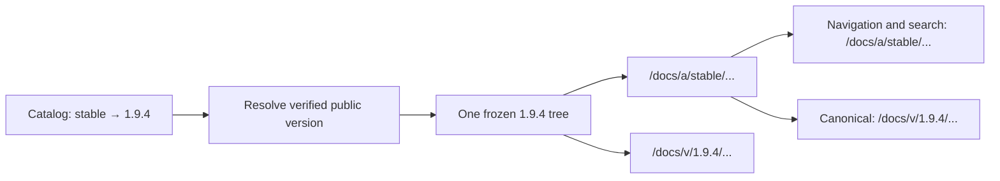
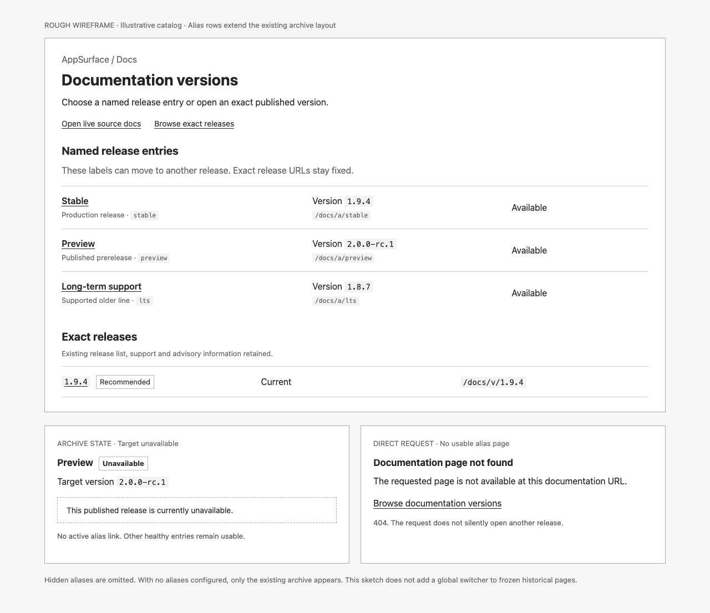

<!-- /autoplan restore point: "/Users/andrew/.gstack/projects/forge-trust-Runnable/main-autoplan-restore-20261007-issue176-001.md" -->
## Implementation plan
# Design: Catalog-managed documentation version aliases

Generated by /office-hours on 2026-10-07
Branch: main
Repo: forge-trust/AppSurface
Issue: [#176](https://github.com/forge-trust/AppSurface/issues/176)
Status: APPROVED
Mode: Builder (open source / research)

## Problem Statement

[AppSurface Docs versioning](../../Web/ForgeTrust.AppSurface.Docs/README.md#published-version-catalog) currently exposes one catalog-selected release at the route-family root, with separate exact release archives and live source docs. Maintainers need any number of named release entries, such as `preview`, `stable`, `lts`, or `v2`, without assigning those words special behavior in the runtime.

The user's central requirement was: “ideally anyone should be able to define any number of labels here right?” Their preferred example conventions are `preview` for the latest published prerelease and `stable` for the latest stable release. Maintainers or their release automation select those exact targets. The runtime does not decide what “latest,” “stable,” or “supported” means.

## What Makes This Useful

A team can publish a moving `v2` entry for the major line its readers run, or a `training` entry used in course material, while preserving the exact version behind every page. Changing a catalog pointer changes the friendly entry after the host restarts; it does not rebuild or modify the older release tree. These are possible uses, not evidence of existing customer demand.

## Approved Decisions and Constraints

- Use Approach B: alias records under `{RouteRootPath}/a/{name}`. Records make targets, display metadata, and visibility explicit; one namespace prevents every alias from becoming a reserved document slug.
- Extend the existing [published-tree and canonical URL contract](../../Web/ForgeTrust.AppSurface.Docs/README.md#route-contract). Serve alias pages at alias URLs, keep navigation and search in that tree, and identify the exact release in canonical metadata.
- Preserve `recommendedVersion` as the independent selector for the route-family root. Defining `stable` does not automatically change `/docs`.
- Preserve live source docs at the configured `DocsRootPath` (`/docs/next` by default), the archive at `{RouteRootPath}/versions`, and exact releases at `{RouteRootPath}/v/{version}`.
- Any number of labels may be authored. There is no built-in label set or alias-count ceiling. Individual names are bounded for safe routing.
- A label targets one exact entry from `versions[]`. No alias chains, semantic-version ranking, runtime Git, network fetches, or fallback to another release.
- Aliases cannot expose a hidden or unavailable release. Existing [archive verification](../../Web/ForgeTrust.AppSurface.Docs/README.md#availability-and-failure-behavior) and trusted-root rules remain the authority.
- Catalogs load once for a host lifetime today. Catalog edits require a restart or redeploy; hot reload is outside this issue.

The user explicitly approved these premises and the archive presentation below. The user approved the complete reviewed design on 2026-10-07 (D8/A).

## Cross-Model Perspective

A fresh Codex subagent supported the general alias-to-exact-version model and suggested `v2` as another useful convention. It recommended an alias-record array, the dedicated namespace, preserving the resolved catalog's existing constructor/deconstruction API, and terminal failure for requests that cannot be served by the selected tree. It challenged none of the approved premises. The URL namespace was an assumption in its opinion and was subsequently chosen by the user.

[mike](https://github.com/jimporter/mike#adding-a-new-version-alias) provides a comparable maintainer-controlled alias concept; its MkDocs publishing machinery is not a dependency to import. [Material for MkDocs](https://squidfunk.github.io/mkdocs-material/setup/setting-up-versioning/#version-alias) supports displaying alias and version together. [Read the Docs](https://docs.readthedocs.com/platform/stable/versions.html#versions-are-git-tags-and-branches) reserves particular label semantics, which AppSurface deliberately leaves to consuming applications.

## Approaches Considered

- A, small name-to-version map: not selected because per-alias display metadata and visibility would require later schema expansion.
- B, alias records in one dedicated namespace: selected for the complete metadata contract and predictable route ownership.
- C, alias records directly under the route root: not selected because arbitrary labels could shadow documents, built-in routes, or custom live roots.

## Catalog and Public API Contract

Add `List<AppSurfaceDocsVersionAlias> Aliases` to [AppSurfaceDocsVersionCatalog](../../Web/ForgeTrust.AppSurface.Docs/AppSurfaceDocsVersionCatalog.cs), defaulting to an empty list. The new public descriptor has these fields:

| JSON / C# property | Behavior and default |
| --- | --- |
| `name` / `Name` | Required URL label. Trim and lowercase invariantly. Length 1–64. Start and end with an ASCII letter or digit; interior characters may also include dot, underscore, or hyphen. Single-character labels are allowed. Reject slashes, backslashes, percent escapes, spaces, query/fragment delimiters, and dot segments. |
| `version` / `Version` | Required exact catalog version identifier, trimmed and matched using the existing ordinal-ignore-case version comparison. It is looked up only in `versions[]`, never in `aliases[]`. |
| `label` / `Label` | Optional reader-facing display text; blank or absent defaults to the normalized name. |
| `summary` / `Summary` | Optional descriptive text; blank or absent means no summary. Render both text fields through normal Razor encoding. |
| `visibility` / `Visibility` | `Public` by default, or `Hidden`, using the existing explicit [version visibility values](../../Web/ForgeTrust.AppSurface.Docs/AppSurfaceDocsVersionCatalog.cs). Hidden means neither mounted nor listed through the alias; it is not an access-control feature. An unknown value invalidates that alias. |

For example, this fragment can be added to a catalog that already contains verified public entries for the referenced versions:

```json
{
  "aliases": [
    {
      "name": "preview",
      "version": "2.0.0-rc.1",
      "label": "Preview",
      "summary": "Latest published prerelease",
      "visibility": "Public"
    },
    {
      "name": "stable",
      "version": "1.9.4",
      "label": "Stable",
      "summary": "Latest stable release",
      "visibility": "Public"
    },
    {
      "name": "lts",
      "version": "1.8.7",
      "label": "Long-term support"
    }
  ]
}
```

These versions are illustrative. The aliases do not manufacture version entries, archive paths, or manifest pins. A label such as `v2` may point to any exact version the maintainer chooses; AppSurface does not validate the semantic meaning of its spelling.

Extend [AppSurfaceDocsResolvedVersionCatalog](../../Web/ForgeTrust.AppSurface.Docs/Services/AppSurfaceDocsVersionCatalogService.cs) with additive, non-positional properties for resolved aliases and whether the alias namespace is active. Keep its existing four-argument constructor, deconstruction, and sentinel behavior available. Old callers obtain an empty alias collection and inactive namespace by default.

Introduce a resolved alias read model with normalized name, display metadata, visibility, configured exact target, resolved public target when eligible, alias root URL, availability, and a stable diagnostic code plus sanitized explanation. Host-side catalog consumers may inspect configuration errors; the reader-facing archive projection must not expose hidden release identifiers or filesystem paths. Preserve authored order among unique names. Alias metadata does not override the target release's support or advisory state.

Add URL-builder methods for an alias root and alias-local document URL, analogous to [BuildVersionRootUrl and BuildVersionDocUrl](../../Web/ForgeTrust.AppSurface.Docs/Services/DocsUrlBuilder.cs). Validate and normalize names using the same helper as the catalog; use the configured route family rather than a literal `/docs`.

### Parsing and resolution

Parse alias declaration state before trusted-root or target verification so a configured namespace remains owned even if every target is unavailable. Resolution rules:

1. Missing `aliases`, `null`, or an empty array means inactive alias routing and an empty alias list.
2. A nonempty array activates namespace ownership, including when every item is invalid or hidden. A non-array payload also activates ownership but disables all alias entries with a collection diagnostic. Existing version parsing and healthy exact/recommended mounts continue independently.
3. A malformed item invalidates only that item. Preserve recoverable valid names in the operator read model; never invent a public visibility value or route for a malformed name. For a fully valid descriptor, omitted or null visibility receives the documented Public default. For an invalid descriptor, that default is not evidence that its recovered fields may be shown publicly; use the archive projection rules below.
4. Duplicate normalized names disable all definitions in that group; catalog order never chooses a winner. Report one conflict for that label and retain operator evidence of the conflicting entries. The archive shows at most one unavailable row for a group containing a valid Public definition, using the name as its display text and omitting target and summary. A group containing only hidden or invalid-visibility definitions is omitted.
5. A public alias mounts only when the exact target is present, Public, available, and verified. A hidden alias is never mounted, even when its target is public.
6. Missing, hidden, or unavailable targets do not become another target. Public aliases with a valid definition remain informational in the archive; hidden-target and unknown-target details are suppressed there. If a public target is known but unavailable, its already-public version identifier may be shown.
7. An exact version identifier may equal an alias name. Resolution still uses the exact-version dictionary only; the namespaces remain separate.

Keep alias validity separate from the existing version catalog status. Bad aliases must not poison otherwise healthy release entries. A completely unreadable catalog has no discoverable alias declarations and follows the existing unavailable-catalog behavior; it mounts no published release tree.

### Public archive projection of invalid entries

An invalid object is eligible for one informational row only when it has both a recoverable name that passes the complete name validator and an explicitly supplied, valid `Public` visibility. Missing, null, unknown, or incorrectly typed visibility does not qualify an invalid object. Non-object items and objects with invalid or unrecoverable names never appear in the public archive; they still produce operator diagnostics. Hidden entries remain omitted.

For that invalid row, display only the normalized name and the generic explanation “This release entry is not configured correctly.” Omit recovered label, summary, configured version, target, support/advisory metadata, and link. Those fields are not trusted merely because another field was recoverable. Razor-encode the name and explanation. Duplicate groups follow rule 4 above: a fully valid Public definition qualifies the group for one name-only conflict row; no conflicting target, label, or summary is displayed. A group with no valid Public definition is omitted, even if an invalid member has explicit Public visibility.

A valid Public descriptor whose target cannot be served is a different case: keep its validated label and summary, show a generic availability explanation, and show the exact identifier and support/advisory metadata only if the target is an existing Public version. Unknown or hidden targets contribute no target metadata. Neither case has a link. These rules determine archive inclusion independently of the namespace remaining active.

## Route Ownership and Failure Behavior

| Surface | Default URL | Behavior |
| --- | --- | --- |
| Recommended entry | `/docs` | Existing `recommendedVersion` behavior, including its archive recovery fallback. |
| Live source docs | `/docs/next` | Mutable source-backed docs; not the published `preview` alias. |
| Alias namespace | `/docs/a/{name}` | Selected frozen public release tree, or a terminal alias failure. |
| Exact release | `/docs/v/{version}` | Existing exact-release behavior. |
| Archive | `/docs/versions` | Existing exact entries plus public alias discovery. |

The whole `a` segment and its descendants are owned once alias routing is active. Match on route segments, so `/docs/apple` is unaffected. Determine ownership before published-mount selection, route/file normalization, or a handler can return control to another endpoint. Ownership is sticky for the rest of that request.

- Healthy GET and HEAD requests reuse the selected published tree. Missing pages, unknown/hidden aliases, and unavailable targets return 404 with no content from another tree. GET receives a generic Docs recovery presentation linking to the family's archive; HEAD has the same status/headers without a body. Error copy does not identify hidden targets.
- Unsupported methods under the active namespace return 405 with `Allow: GET, HEAD`; they do not fall through to another handler.
- The namespace root `/docs/a` also returns the generic 404 recovery presentation; it does not redirect to an inferred preferred alias.
- Missing files and per-request archive-integrity refusals must retain namespace ownership. Existing archive-integrity diagnostics remain in force; an unavailable alias response cannot be replaced by the recommended release.
- Instantiate alias ownership/failure handling even when there are zero healthy mounts. Update both the default web module and [named-instance runtime construction](../../Web/ForgeTrust.AppSurface.Docs/AppSurfaceDocsInstances.cs), whose current zero-mount fast paths would otherwise skip the handler.

### Raw request paths and unsafe requests

ASP.NET Core exposes the received request target through `IHttpRequestFeature.RawTarget`; `Request.Path` is decoded except for encoded slashes. Check both representations rather than relying on the decoded path alone. See the [request-feature contract](https://learn.microsoft.com/en-us/dotnet/api/microsoft.aspnetcore.http.features.ihttprequestfeature?view=aspnetcore-10.0). Reuse the escaped-target extraction pattern in [DocsController](../../Web/ForgeTrust.AppSurface.Docs/Controllers/DocsController.cs) instead of using `Uri.AbsolutePath`, which can erase the evidence that validation needs.

1. Extract the escaped path from the raw origin-form or HTTP(S) absolute-form target without URI normalization; remove the query, retaining path segments exactly as received. Compare in application-relative coordinates, accounting for `PathBase` once. Take a separate, single percent-decoded validation view; it is never a route lookup or filesystem path.
2. If the raw path, its single-decoded view, or `Request.Path` has the active alias namespace as a segment prefix, record ownership. Do this before collapsing dot segments or interpreting a suffix. Thus a raw `/docs/a/stable/../guide` remains owned even when the framework path is `/docs/guide`. A decoded prefix such as `/docs/%61/stable` also identifies an alias candidate; encoding is subsequently checked, not treated as a way around ownership. The equivalent rules apply with custom roots, root mounting, named instances, and `PathBase`.
3. For an owned request, reject malformed percent escapes, encoded `/` or `\\`, backslashes, control characters, literal or decoded `.`/`..` segments, and residual percent escapes after the single decode. Require the raw alias-name segment to use the descriptor's allowed ASCII characters; percent-encoded names fail even if they decode to a valid name. Validate the framework path as well, and reject disagreement between its segments and the accepted raw-path view. Do not recursively decode, trim away unsafe segments, rewrite `Request.Path`, or choose a broader mount. Encoded ordinary document characters may use the established content-path rules only after these checks pass.
4. An unsafe owned GET or HEAD returns the same generic 404 recovery response as an unknown alias, with a family-archive link for GET and no body for HEAD. Do not echo the rejected path or configuration details. Unsupported methods take precedence and return 405 with `Allow: GET, HEAD`, even for an unsafe candidate. If `RawTarget` is absent or its path cannot be recovered but `Request.Path` identifies the alias namespace, fail with that same 404/405 response and an operator diagnostic instead of guessing.

This boundary protects the target received by the application. A client or upstream proxy that removes segments before forwarding them has removed evidence the application cannot recover. Hosts must retain the received raw target until this ownership check; server-level rejection before AppSurface runs retains the server's response.

### Collision checks and compatibility

Enabling aliases is explicit opt-in to the new subtree. Before serving:

- Reject overlap between `{RouteRootPath}/a` and the configured live source root in either ancestor direction.
- Reject existing recommended-tree public routes or handler-servable files that occupy `a` or `a/...` relative to the route root. Check the verified file inventory and frozen route identities, including source-shaped and declared redirect aliases; a directory-existence check alone is insufficient. Routes in exact trees under `/v/{version}/a` remain legitimate.
- A detected Docs-owned collision is a startup configuration failure with the conflicting path and a corrective action. Do not silently give the alias or the older document priority. A later catalog target change reruns these checks after restart.
- The library owns the namespace after opt-in. Hosts must relocate custom endpoints under it before enabling aliases; automatic discovery of every arbitrary host route pattern is not promised.
- Existing named-instance root-overlap validation still applies. Each instance resolves aliases through its own catalog and URL builder; no ambient default-instance state is reused.
- Catalogs with absent, null, or empty aliases do not reserve `a`, so existing content, custom live roots, and host endpoints there retain current behavior.

Custom `RouteRootPath=/foo/bar` produces `/foo/bar/a/stable`; root-mounted Docs produces `/a/stable`. Define and compare app-relative roots without `PathBase`. Browser-facing URLs add the request's `PathBase` once, following existing behavior. Preserve the existing origin-only [PublicOrigin contract](../../Web/ForgeTrust.AppSurface.Docs/README.md#route-contract).

## Mounting, Navigation, and Search

Reuse [BuildPublishedTreeMounts](../../Web/ForgeTrust.AppSurface.Docs/AppSurfaceDocsWebModule.cs), [published-tree handling](../../Web/ForgeTrust.AppSurface.Docs/Services/AppSurfaceDocsPublishedTreeHandler.cs), and the existing content rewriter.



Aliases sharing a target reuse its physical provider and frozen-route cache within the existing instance lifetime. They do not reverify or reexport the same tree per label. Aliases have their own mount roots and use the target's exact root as `CanonicalRootPath`.

Rebase ordinary document links, assets, client configuration, search-index document URLs, and frozen-manifest redirects to the alias mount. Preserve query strings in redirects and existing fragment behavior. Canonical links identify the exact target using the current `PublicOrigin` and `PathBase` rules. Do not canonicalize live source pages to a published alias. Operational archive/live-source links, where present, keep their configured family roots rather than becoming alias-local document URLs.

Retargeting a label changes its mounted content and exact canonical metadata together after restart. Old exact URLs, search payloads, and archive bytes remain untouched. Availability in the archive is the startup-resolved catalog state, not a live health monitor; per-request integrity checks can still refuse a file subsequently changed on disk.

## Reader Presentation

The approved sketch extends the current [version archive](../../Web/ForgeTrust.AppSurface.Docs/Views/Docs/Versions.cshtml):


- Show public aliases before the existing exact-release list, in authored order.
- Show display label, normalized name, optional summary, exact public target when known, and availability together. Carry through the target's existing support/advisory information so an alias does not hide a warning.
- Link only healthy aliases. Invalid or unavailable public definitions are informational rows with sanitized explanations. Hidden aliases are omitted.
- Keep the existing exact-release list and recommended marker independent of alias names.
- Label the source-backed action “Open live source docs,” separating it from a catalog label named `preview`.
- With no public alias rows, omit that section entirely and keep the existing archive.
- Long display text wraps within the archive rather than changing the layout width. All metadata is encoded, and normal links remain keyboard accessible.

This issue updates the existing archive selection surface and alias-local navigation/search. It does not retrofit a new global switcher into historical frozen HTML or modify those archives on disk. The sketch's direct-request recovery state defines the generic 404 presentation, not a link to a different release's page.

## Diagnostics and Documentation

Use a stable new `ASDOCSALIAS###` family for alias collection shape, invalid names/metadata, duplicate names, missing target, hidden target, unavailable target, and namespace collision. Operator logs include the catalog entry/group and corrective action. Reader-facing messages omit physical paths and hidden target details. Preserve existing `ASDOCSARCHIVE###` diagnostics for archive trust failures. Allocate and document exact numeric codes during engineering planning; callers should consume a code and structured state, not parse log prose.

Document every new public descriptor, resolved property, URL-builder method, and internal mounting/ownership seam. Update:

- [Docs package reference](../../Web/ForgeTrust.AppSurface.Docs/README.md#published-version-catalog): fields, defaults, ordering, visibility, target constraints, failure statuses, collision checks, restart requirement, and examples.
- [Consumer guide](../../Web/ForgeTrust.AppSurface.Docs/use-appsurface-docs.md): author `preview` and `stable`, add a custom label, retarget safely, and distinguish aliases from exact URLs and live source docs.
- [Repository package entry](../../README.md): link the feature where consumers discover Docs.
- [Append-only release notes](../../releases/README.md#append-only-unreleased-entries): add a feature entry under `releases/unreleased.entries/` when implementation changes behavior.

Pitfalls must be explicit: alias-hidden does not hide an otherwise public exact release; public aliases do not expose hidden versions; label names are not semantic-version selectors; duplicate names have no winner; enabling aliases reserves `a/`; the catalog is not hot-reloaded; alias URLs move and exact URLs should be used for durable citations.

## Verification and Success Criteria

All checks below are planned for implementation; this design session has not changed or tested production code.

| Area | Required behavioral proof |
| --- | --- |
| Parsing | Omitted/null/empty compatibility; multiple arbitrary labels; case and whitespace normalization; length boundaries; unsafe names; null/non-object items; malformed collection; unknown visibility; optional display defaults; authored ordering. |
| Resolution | Multiple labels to one version and labels to different versions; missing, hidden, unavailable, unpinned, and verified public targets; hidden alias to public target; a version identifier equal to an alias name; duplicate case-normalized definitions disabled regardless of order. |
| Ownership | Unknown/hidden aliases, unavailable target, absent page, unsafe request, and zero healthy mounts return alias-local failures; no recommended-tree or host fallback; GET/HEAD and 405 method behavior; `a` versus `apple` segment boundaries. Test raw dot segments with an already-normalized framework path, encoded namespace/name/separators, malformed and residual escapes, raw/framework disagreement, and absent RawTarget, including custom roots and PathBase. |
| Collisions | Live roots that equal, contain, or sit beneath the namespace; recommended-tree canonical/source/redirect routes and servable files under `a`; no namespace reservation when aliases are disabled; named-instance root isolation. |
| Content | Real exported artifacts through alias and exact mounts: HTML navigation, assets, search results, canonical metadata, manifest redirects, query strings, fragments, custom roots, root mounting, `PublicOrigin`, and `PathBase`. |
| UI | Healthy and unavailable public rows; invalid objects included only with a valid name and explicit Public visibility; invalid-name/non-object/defaulted-visibility rows omitted; name-only invalid/conflict rows; hidden rows and hidden target details suppressed; empty section omitted; encoded hostile display text; long labels; public support/advisory warnings retained; live source wording. |
| Compatibility | Compile/use the old resolved-catalog constructor and deconstruction; existing sentinel defaults and recommended fallback; live source and exact-version routes retain behavior; retarget one alias after restart while previous exact content remains available. |
| Resources | Same-target alias mounts share one provider/cache in the instance; instances remain isolated; normal lifetime disposal includes aliases. |

Use public APIs and the established internal test seams, never reflection into private members. Extend the relevant [Docs tests](https://github.com/forge-trust/AppSurface/tree/main/Web/ForgeTrust.AppSurface.Docs.Tests), especially catalog, URL builder, published handler/rewriter, module regressions, archive controller, options, and named instances. Verify branch coverage near 100% for the new parser/resolver/ownership code, then run [solution coverage](https://github.com/forge-trust/AppSurface/blob/main/scripts/coverage-solution.sh) when practical. Format code and resolve introduced compiler, analyzer, and documentation warnings before pushing.

The acceptance proof is two verified exports with distinct page/search content. Read `stable` and `preview` through the alias URLs; confirm matching exact canonicals and alias-local results. Retarget one alias, restart, and confirm only that moving entry changed. Exercise a missing page that exists in the recommended tree and prove it returns 404 rather than that other page.

## Distribution Plan

Ship the additive API through the existing [ForgeTrust.AppSurface.Docs package](../../Web/ForgeTrust.AppSurface.Docs/ForgeTrust.AppSurface.Docs.csproj) and coordinated release process, using the existing [stable](https://github.com/forge-trust/AppSurface/blob/main/.github/workflows/nuget-stable-publish.yml) or [prerelease](https://github.com/forge-trust/AppSurface/blob/main/.github/workflows/nuget-prerelease-publish.yml) NuGet publication lane. A feature merge does not itself publish a package. [Release Publish](https://github.com/forge-trust/AppSurface/blob/main/.github/workflows/release-publish.yml) remains the docs-artifact publishing path.

Upgrade the Docs runtime before adding aliases to a deployed catalog; an older runtime does not implement the new namespace. Alias-free catalogs need no migration. Publish and verify exact artifacts first, update explicit catalog targets atomically, and restart/redeploy the host. Roll back by restoring a prior catalog and restarting; exact releases stay available under their existing immutable URLs.

Provide examples for convention-driven automation, but this issue does not add automatic `preview`/`stable` promotion or change the existing `recommendedVersion` promotion workflow.

## Next Steps and Assignment

1. Engineering review should lock the additive API names, numeric diagnostics, startup ownership checks, and generic recovery rendering using the behavior above.
2. Implement parser/resolution and compatibility tests; then mount ownership and content behavior; then archive projection/UI and documentation.
3. Run the focused behavioral proof, formatting/warning checks, and coverage before creating the feature PR linked to #176.

**The assignment:** choose one real published stable archive and one real published prerelease archive, and prepare a small acceptance catalog with `stable`, `preview`, and one custom label such as `v2`. Record the expected exact URL, alias-local search result, and missing-page outcome before implementation. That fixture gives the engineering review a concrete reader contract to prove.

## What I noticed about how you think

- You moved from “latest and stable” to “preview = latest pre-release” and “stable = latest stable release.” That separates two reader promises instead of leaving “latest” ambiguous.
- Your question about “any number of labels” changed the design from two named features to a general catalog contract. The same mechanism now supports those examples and consumers' own labels.

## Evidence and Related Work

Source inspected at `40de2ef62ad9e697929ef4bd56f0bfda2d813d72`. On 2026-10-07, GitHub main was `3bce0bdbef5e7ae3137f0bb90dbd3d0ff9f08183`; its one additional commit had no Docs production changes. Recheck relevant source when engineering work begins.

The existing [#355 canonical alias design](https://github.com/forge-trust/AppSurface/issues/355) supplies the implemented mount/canonical separation; [#142](https://github.com/forge-trust/AppSurface/issues/142) supplies versioning's reduced first phase. This is the first design for #176 and extends those contracts rather than replacing unrelated branch designs.

Remaining discovery: no specific external adopter or measured label count was supplied in this session. Neither is needed to commit to the generic API; do not invent demand evidence.

<!-- gstack:office-hours:concerns:start -->
## Reviewer Concerns

Disposition: COMPLETED

Stop: PASS

No unresolved findings.
<!-- gstack:office-hours:concerns:end -->

<!-- autoplan-accepted:ceo -->
- Preserve every original #176 approved requirement, verification and assignment. Fix the copied plan's wireframe URL to ../designs/issue-176-alias-archive-wireframe.png; the source design and image remain intact.
- C1 (provisional Taste): whenever the alias namespace owns a request, set Cache-Control: no-store before any response writes. This covers successful GET/HEAD HTML, search and assets, frozen manifest redirects (retain their existing status/location semantics), terminal 404 and 405, including unavailable aliases and unsafe raw suffixes. Inactive namespace and other route families retain their existing behavior. Do not add must-understand or contradict no-store with cacheable directives. Reuse the existing response pipeline rather than introducing a separate cache.
- Verify C1 through default and named-host public request paths: success/HEAD, asset/search, frozen redirect, missing/refused target, unsupported verb and unsafe suffix all carry no-store when owned. Retarget across two freshly built hosts and assert the second alias points to the new exact release and canonical URL; old exact URLs remain correct. Test that exact/live/recommended unrelated responses are unaffected.
- Document the moving-alias cache tradeoff and host restart requirement. Manual rollout checks must ensure reverse proxies/CDNs respect the header, and drain mixed-version hosts when atomic reader consistency is required. HTTP no-store is not an application-cache purge or cross-host atomicity guarantee; do not promise either. Roll back catalog pointer plus host restart using the previous verified tree.
- C5 is deferred to the actual #176 TODO. Runtime-only #176 must remain independently useful without a validation CLI, hot reload, hardcoded labels, promotion automation or rewriting historical HTML.
- R1 / spec C-1: Use the committed acceptance catalog at docs/plans/issue-176-fixtures/acceptance-catalog.json. Its selected actual GitHub releases are v0.1.0 (stable) and v0.2.0-preview.11 (prerelease). Download assets appsurface-docs-v0.1.0.tar.gz and appsurface-docs-v0.2.0-preview.11.tar.gz from their release pages, validate the recorded archive SHA-256, reject absolute/parent-relative or non-regular extraction entries, and extract into separate releases/{version} directories under one trusted temporary root. Recorded manifest pins are e0cfc160ab116cf13a94b603c665b63115e5db7eece01dfc67634a8b9dfaa30a and 5fbd511d7b66faf49bbadf76b6b412f9f4971671c15ac56b266fbb6eeb319bdd. The archive byte/inventory audit found all 403 and 892 covered files matching manifests and all six required files present; this is artifact evidence, not proof the current runtime or unimplemented aliases serve them. Before implementation, run existing verify-archive on the fixture and record its result; repair the fixture or report an incompatibility without weakening archive trust.
- R1 acceptance expectations (default /docs family): /docs/a/stable/agents returns the stable AGENTS.md page with /docs/v/0.1.0/agents canonical; /docs/a/preview/agents returns the prerelease page with /docs/v/0.2.0-preview.11/agents canonical. Both respective search-index.json responses contain title AGENTS.md with alias-local /agents result; fragment suffixes remain attached. /docs/a/stable/artifacts/issue-728-test-efficiency/candidate-inventory is 404 even though the recommended prerelease tree has that indexed page. /docs/a/preview/artifacts/issue-728-test-efficiency/candidate-inventory succeeds with its exact prerelease canonical. Retarget stable to 0.2.0-preview.11 in a second host and assert stable content/search/canonicals change together; preview and v1 pointers and both exact releases stay correct. Record these expected values before implementation. Deterministic exported synthetic trees supplement this real fixture for adversarial branches; they do not replace it.
- R2 / spec C-2: C1 includes the restart, proxy/CDN header verification, mixed-host limitation and pointer-plus-restart rollback documentation as consequences of moving aliases. C1's combined estimate is human 2 hours / agent 30 minutes across handler, tests and documentation families; it is one S candidate. C6 is an artifact link repair, not a sixth product proposal or additional feature expansion. Counts remain five candidates: one accepted, one deferred, three skipped.
- R3 / spec F-1: No product alias-count or display-metadata length ceiling is introduced. Document inherited filesystem/process-memory constraints and current System.Text.Json parser depth behavior rather than inventing an input-byte limit; names still have the approved 64-character bound. Build exact-version and normalized-alias dictionaries once with expected O(V+A) resolution, no repeated tree verification per alias and no per-request full-catalog scan. Add deterministic 10,000-unique-alias coverage to one verified target: all definitions resolve in authored order, mounts share one provider and one frozen cache, selected beginning/middle/end labels work, and archive projection retains all public rows without fabricated pagination. Record startup/render allocation and elapsed time as observed evidence during implementation; no p99, infinite capacity or performance threshold is claimed by this planning review. Keep malicious/long display wrapping and encoding tests. The large fixture is representative proof, not a supported maximum.
- C7: The selected prerelease's root search-index is 8,741,119 bytes. Fixture hosts and verify-archive invocations must explicitly use MaxRewrittenFileSizeBytes=16777216, following the existing published-tree rewrite-limit reference; the production default remains 4 MiB. Persist this fixture option, exact asset URLs and checksums, and the verifier outcome when available. A build/verification limitation must remain explicit, never substitute a trust bypass or mark aliases tested. Keep deterministic tests runnable without network, and require the selected real-artifact acceptance check before declaring the feature complete.
- C8: Document the end-to-end maintainer workflow: verify public exact releases; author stable/preview/custom explicit targets; keep recommendedVersion independent; restart; read archive target/warnings, alias navigation/search and exact canonical; retarget/restart; use exact URLs for durable citations. The UI promises only a named pointer to the displayed exact release, never inferred quality or freshness. No adopter timing/demand claim is authorized.
- C9: Preserve named-instance endpoint conventions and authorization for alias content and recovery. Raw-path ownership must run before Docs/host fallback, including when Request.Path has normalized away the namespace, without allowing a pre-routing short circuit to bypass named authorization. Required regression pairs authorized/unauthorized callers with healthy, unsafe, unknown and zero-mount alias requests; engineering must bind the dispatch seam and policy evaluation explicitly before implementation.
<!-- /autoplan-accepted:ceo -->

<!-- autoplan-accepted:design -->
- D1: implement the approved archive hierarchy as h1/orientation/actions, conditional named-entry section, then existing exact releases. Preserve authored order and independent recommended marker. Use separated editorial alias rows; healthy rows show validated label/name/summary, exact public target and target support/advisory beside the action. Valid-public unavailable rows have safe metadata and no anchor. Invalid eligible rows show normalized name plus “This release entry is not configured correctly.” only; duplicate eligible rows show normalized name plus “This release entry has conflicting definitions.” only. Neither exposes recovered target/display/support metadata. Hidden/unknown-target details remain redacted. Test every projection state, warnings and hostile metadata.
- D2: all owned GET failures use title/H1 “Documentation page not found”, explanation “The requested page is not available at this documentation URL.” and normal “Browse documentation versions” anchor to this family's archive, reusing Docs shell through one internal rendering seam. Do not echo paths/configuration or suggest another release. HEAD status/headers match without body; unsupported methods return 405 with Allow: GET, HEAD. Named unauthorized callers receive normal host challenge/forbid before content/recovery writes. Already-started responses abort rather than writing recovery or falling through. Verify copy and statuses at public default/named caller paths, custom roots and PathBase.
- D3: use one semantic DOM order name → target/warnings → explanation → action and existing sidebar behavior. Below 640px stack rows with 16px side padding; 640–1279px use one reading column with at most two groups when fitting; >=1280px use the approved three-column row. Wrap arbitrarily long display text/identifiers with no clipping or horizontal page overflow at 320/375/768/1280px and 200% zoom. Healthy anchors have clear label/known-exact-version names; unavailable rows have no focusable pseudo-link. Hit areas >=44px, body/explanations >=16px and contrast >=4.5:1, focus/interactive indicators >=3:1. Use existing text/link/visited/separator/surface/focus tokens, underlines or another non-color cue and scoped focus-visible/visited treatment for new actions. Preserve Inter/DocsTheme and normal script-free anchors. Rendered QA must cover keyboard, screen reader names, light/dark, zoom, long/hostile strings and warnings after implementation; no live region or new widget for static rows.
- D4: absent/null/empty aliases and active catalogs with zero publicly projected rows have the same reader presentation: omit named-entry section, retain exact archive and existing exact empty/availability message plus live-source link. Active namespace failures still terminate 404/405. Operator diagnostics alone distinguish suppressed invalid configuration; hidden entries need no routine info logging. Test all omission causes and zero-mount active dispatch independently.
- D5: record 10,000-label evidence with runtime/OS/build/fixture identifiers, alias count and distinct-target count, startup catalog-resolution elapsed time/allocation, public archive projection elapsed time/allocation and rendered response size/time separately, provider/cache identity counts, row count/order and selected beginning/middle/end request assertions. Measure each named operation once per recorded run after a documented warmup, noting timing methodology and allocation scope; no timing threshold/SLO or supported maximum is implied. Preserve O(V+A) construction and dictionary-based alias lookup.
- D6: actual pre-implementation fixture validation completed successfully by Darwin on 2026-10-07. Safe inventories and existing docs verify-archive CLI with trusted root /private/tmp/issue176-fixture-verification and 16 MiB limit returned exit 0 for 0.1.0 and 0.2.0-preview.11, respectively 403/892 files and the recorded manifest pins. Source of exact asset URLs is https://github.com/forge-trust/AppSurface/releases/download/v0.1.0/appsurface-docs-v0.1.0.tar.gz and https://github.com/forge-trust/AppSurface/releases/download/v0.2.0-preview.11/appsurface-docs-v0.2.0-preview.11.tar.gz; archive checksums are in docs/plans/issue-176-fixtures/published-archive-evidence.json. host-options.json records the local example root; repeat runs must replace it with their own trusted extraction root and align CatalogPath to the fixture location. This verifies existing archive ingestion, not unimplemented alias routes. Require the real alias/exact/retarget acceptance proof from R1 before feature completion.
- D7: archive orientation says “These labels can move to another release. Exact release URLs stay fixed.” The maintainer walkthrough connects explicit labels, displayed exact target/warnings, restart, alias-local navigation/search, retarget and durable exact citations. Never infer latest/stability/support from a label; no-store does not purge application caches or guarantee mixed-host atomicity.
- D8 (provisional Taste): use existing strong text color for the Documentation versions h1 instead of the legacy gradient class on this archive only. Keep existing exact-release layout and the rest of the site's typography/themes intact. Verify visual hierarchy in both themes after implementation; final approval may retain the legacy heading without changing alias semantics.
<!-- /autoplan-accepted:design -->

<!-- autoplan-accepted:dx -->
- X0: DX acceptance clock starts when a maintainer reads the alias quickstart on an already running upgraded net10.0 Docs host with verified exact catalog entries, includes reading/config edit/restart/archive/page/search/exact-canonical inspection, and ends with understanding the result. Target <=5 minutes remains an estimate pending observation, not cold-install promise, automated gate or service guarantee. Record SDK/build/download/export prerequisites separately; arbitrary labels and independent recommendation stay unchanged.
- X1: provide a copy-ready full fixture-backed quickstart in the consumer guide and docs/plans/issue-176-fixtures/README.md linked from package reference/repository discovery. Include versions/pins plus stable/preview/v1, CatalogPath/trusted root placement, 16 MiB option, actual existing verify-archive commands for both exact versions, supported source standalone host or public CLI command with explicit URL, restart, expected AGENTS.md pages/search/exact canonicals/missing-page 404 and second-host retarget. Show portable path substitution and prerequisites. Test/compile snippets and validate links after implementation; existing ingestion passed but alias behavior remains untested.
- X2: pre-deploy guidance uses existing exact verification then staging startup/operator code review/archive/page/search/canonical/404/HEAD/405 checks. Successful exact verification alone does not validate aliases/collisions. Collisions fail startup; other invalid entries degrade individually. Link observed 10,000-label measurements when produced and inherited parser/memory/filesystem constraints without count ceiling/capacity promise. No new CLI, release gate, hosted service or hot reload.
- X3: new package README #alias-diagnostics is canonical; link catalog/route and consumer troubleshooting guidance to it. Every allocated ASDOCSALIAS code includes problem/cause/fix, relevant config/example/restart and safe structured operator fields (instance, entry/group, valid name, reason code, corrective action, DocumentationReference). Logs reference canonical repository section with per-code anchors when implemented/verified, never a fabricated existing destination. Capture proposed invalid-separator/duplicate/missing-target messages after implementation. Preserve ASDOCSARCHIVE trust codes and generic redacted reader recovery.
- X4: document runtime upgrade on all hosts before nonempty aliases, exact verification and Docs/host collision resolution, atomic catalog replace/restart and smoke. Explain empty-catalog compatibility, recommendation independence, snapshot/cache/proxy/mixed-host limits and pointer-plus-restart rollback. Removing aliases may re-enable legacy a/ routes and must be intentional. Add append-only release entry and use actual coordinated version when assigned.
- X5: record one fresh maintainer trial of X0 during acceptance: start/prerequisites, observed human time/help/failures and exact result. Keep cold/automated timing separate; unobserved stays unobserved. Missed target is documented friction, not a timing CI failure/new support policy. Existing docs feedback form only; no new analytics/schedule.
<!-- /autoplan-accepted:dx -->

<!-- autoplan-accepted:eng -->
- E1 (provisional Taste): add AppSurfaceDocsApplicationBuilderExtensions.UseAppSurfaceDocsAliases(IApplicationBuilder), returning the builder. Named hosts place it after PathBase/forwarded-path setup and before UseRouting/authentication/authorization/any owned-namespace writer. Legacy module installs the same selector automatically. Do not register another routing/auth pipeline or manually reconstruct/evaluate policies. Bind per-host ownership state to one actual all-method alias-family endpoint {aliasRoot}/{**path} including root, emitted by existing ConfigureEndpoints/FinalizeMappings and materialized/frozen from the real EndpointDataSource once. Named group metadata/conventions are applied once; preserve AppSurfaceDocsEndpointMetadata and ordered host named/multiple/default/fallback policy, role, scheme, AllowAnonymous and custom metadata. One family endpoint per active instance, not per label. Exact endpoints unchanged. No global unrelated catch-all.
- E1 dispatch: classify raw/framework candidate without body writes, record sticky owner/safety/accepted segments, SetEndpoint to the frozen owner, arm no-store and call next so standard host auth runs before owner delegate. Owned requests bypass legacy published/static/live/other-instance handling even if Request.Path normalized to a recommended file. Unowned requests retain endpoint/verb/header behavior. Delegate after authorization checks unsupported method405 first, then unsafe/unknown/hidden/unavailable/file/integrity404, else alias-specific serving; never choose a broader mount or call next for owned failures. E1b active named FinalizeMappings requires per-builder hook marker or actionable startup ASDOCSALIAS011; inactive aliases require no hook, duplicate hook is idempotent, another builder cannot satisfy the marker. Presence does not prove arbitrary host order; supported sample is documented/tested. Retain terminal finalization failure/provider cleanup.
- E2 raw classification: one shared internal helper, origin-form path cut at query; HTTP(S) absolute authority validation and original-byte path slicing, absent path '/' even query contains slash, no Uri.AbsolutePath. Single strict percent-decoded validation view, no recursive decoding/invalid UTF8. Remove PathBase exactly once on segment boundaries using escaped versus decoded representations; Request.Path already app-relative. Root/custom/named roots match ordinal-ignore-case segments, namespace root owned and apple unowned. Candidate precedence raw escaped, single-decoded raw, framework; raw owner A/framework B retains A and rejects disagreement, never renders B. Missing/unrecoverable raw plus framework ownership is owned unsafe. Establish ownership before dot normalization. Reject malformed/residual escapes, encoded separators/backslashes/controls, literal/decoded dot segments, percent-encoded/invalid ASCII alias names and framework disagreement; established ordinary content-character encoding only after guards. No Request.Path rewrite, wider selection or guessed suffix. Received server rejection/upstream-erased evidence boundary remains explicit.
- E3 additive API: AppSurfaceDocsVersionAlias(Name,Version,Label,Summary,Visibility) and catalog.Aliases as D8; resolved catalog adds non-positional IReadOnlyList<AppSurfaceDocsResolvedVersionAlias> Aliases init=[] and IsAliasNamespaceActive init=false, preserving four-member constructor/deconstruction/status numbers/sentinel defaults/CreateUnavailable signature. Never mutate sentinel objects. New sealed non-positional resolved alias exposes nullable valid Name/Label/Summary/validated Visibility/ConfiguredVersion/TargetVersion(only Public)/RootUrl(only safe name), IsAvailable, IsDefinitionValid, HasExplicitPublicVisibility, IsNameConflict, DiagnosticCode and sanitized AvailabilityIssue. ConfiguredVersion is operator-only configuration; no alias filesystem field; never serialize it directly as archive UI. BuildAliasRootUrl(name)/BuildAliasDocUrl(name,path) share full name validator and existing path encoding; invalid/null names documented ArgumentException/ArgumentNullException. XML/reference/decision/pitfall docs for every external/internal affected member, compiled old/new public consumer compatibility, existing build/analyzers; no new unused Docs PublicAPI text tool.
- E3 diagnostics: ASDOCSALIAS001 collection shape,002 item shape,003 name,004 required target/display/visibility metadata,005 duplicate group,006 unknown exact target,007 hidden exact target,008 unavailable/unverified public target,009 namespace collision startup,010 unvalidated received owned request,011 missing active named hook startup. Valid hidden alias is not an error. Keep ASDOCSARCHIVE trust/integrity codes authoritative. Deterministic descriptor shape→name→metadata precedence, duplicate005 supersedes target resolution and emits once per group with entry indices. Canonical README#alias-diagnostics and verified code anchors explain cause/fix/config/restart. New alias logs use fixed code/reason/action/DocumentationReference, bounded validated instance/name64 ASCII, indices/count; no raw rejected path/malformed name/display/summary/hidden target/physical path. Public collision-route text control-escaped/truncated256 UTF8 bytes with marker (log-only bound). Request010 bounded one-time warning per fixed reason/instance, no retained arbitrary URL/name history. Assert stable fields/codes/action, not human prose. Preserve existing archive logging.
- E4 provenance/projection: retain object/name/type/full metadata validity, explicit visibility presence/value, authored index/group state and target visibility/trust independently of defaults. One startup grouping/exact-only resolution pass. Add independent AppSurfaceDocsVersionAliasArchiveEntryViewModel collection on archive model.Aliases (default empty), deliberately copying safe fields. No ConfiguredVersion/hidden target reference in reader projection. Invalid standalone row requires valid name+explicit valid Public and is name/explanation-only. Conflict row requires fully valid Public group member, appears once at first authored group occurrence, name-only; hidden/invalid-visibility-only groups omit. Valid Public unknown/hidden target rows preserve validated display/summary but no target/warnings/link; known Public unavailable target may show target/warnings without link; healthy Public shows target warnings+alias link. Existing exact entries retain behavior apart from approved hierarchy/local heading.
- E5 load/lifetime: discover alias declaration immediately after JSON root validity, before trusted-root/version early returns. Ordinary load/JSON failure before discoverable declarations retains old unavailable/no partial alias publication; discovered active declaration survives later failure with owned unavailable state. Omitted/null/empty inactive. Typed expected alias failures, no new catch-all/OOM-recovery guarantee. Inherited JSON effective depth64, no new input-byte/count/display cap. O(V+A) temporary/resolved storage, no JsonDocument/JsonElement retained per alias. Document trusted configuration's process/filesystem/depth limits. Verified inventory/frozen identities fixed for host lifetime; no watcher/per-request full collision rescan. Covered mutation refuses via existing trust, unlisted/new a files cannot serve, changed frozen manifest cannot reroute aliases or enable recommended/live fallback. Startup/restart collision009 guards live ancestor/descendant and recommended handler inventory/frozen canonical/source-shaped/declared paths; exact v/x/a valid. Startup failure disposes resources and terminally fails publication. Publish trees before start, no in-place changes, atomic catalog/restart/drain/rollback guidance; read-only OS policy optional, not library guarantee.
- E6 owned response: explicit HandleOwnedAliasAsync(HttpContext, internal selection) completes terminally; reuse small mount-serving outcome with TryHandleAsync without changing old exact/recommended semantics. Before-start owned failure GET always renders fixed Docs HTML404 recovery regardless of Accept; HEAD same status/content-type/cache header contract bodyless; unsupported verbs empty405 Allow GET, HEAD. Disable status-code-page reexecute for owned404/405; host auth challenge/forbid remains host response. If selection arrives after response start, abort/consume. Otherwise set no-store immediately and OnStarting final exactly no-store after downstream callbacks; cover content/assets/search/frozen301/404/405/HEAD and host challenge/forbid for owned requests. Preserve existing validators where present; no new ones. Before-start I/O/integrity/rewrite-limit refusal gives generic recovery; after-start failure or RequestAborted cancellation aborts/consumes with no second body/next/status rewrite. Keep production4MiB and real-fixture16MiB limits and original target bytes. Wrong earlier-writing host order unsupported; no impossible committed-header promise.
- E7 required20 behavior families, all subbranches in the Eng diagram and20 value cards in /Users/andrew/.gstack/projects/forge-trust-Runnable/andrew-main-eng-review-test-plan-20261007-193110.md: T01 compiled API/default compatibility; T02 omitted/null/empty/non-array/nonempty/all-invalid/all-hidden/load/root declaration ownership; T03 grammar/types/default-vs-explicit visibility/depth boundaries; T04 all exact target/trust/hidden/same/different/equal-name cases; T05 complete invalid/duplicate/public-hidden disclosure combinations and authored order; T06 name/root/origin/document URL/PathBase; T07 origin/absolute/no-path/query/malformed/escape/dot/disagreement/absent-raw server plus unit vectors; T08 actual endpoint named/default auth healthy/unsafe/unknown/zero and hook/builder/idempotence/convention-once rules; T09 zero mounts/provider-cache sharing/disposal; T10 live/recommended inventory/frozen startup collisions and inactive/exact/apple compatibility; T11 post-start added/replaced file/identity terminal refusal; T12 HTML/assets/CSP/missing/symlink/integrity; T13 alias nav/assets/search/fragments/exact canonical/og/archive; T14 frozen301 query/fragment/unsafe/ambiguous/hidden; T15 GET/HEAD/405/no-store-at-commit/status-page/challenge/forbid/unowned headers; T16 before/after-start I/O/refusal/limit/cancel no second body/fallback; T17 all row states/hostile-long copy/hierarchy/a11y; T18 actual stable0.1.0/preview0.2.0-preview.11/custom v1 fixture and restart-retarget; T19 10k/20k full rows/order/selected requests/resource observations; T20 compiled whole quickstart/named sample/docs/strict export/analyzers/distribution. Use existing Xunit/FakeItEasy/.NET10 host fixtures and meaningful production internal seams; never reflection or test-only production API. Add table rows rather than duplicate smoke tests. Real raw TCP/Kestrel requests capture sent/received RawTarget/Path because HttpClient may normalize; server pre-app rejects retain status. Authorized/anonymous/forbidden pairs must run through real routing/auth, not only direct delegates. Preserve old four-positional API, inactive a/custom/live/host routing+405, exact/recommended/live canonical/frozen redirects, named metadata/auth/isolation and archive diagnostics as CRITICAL regressions. No tests retired, no product LLM/eval scope.
- E7 manual/fixture proof: v1/agents/nav/search→/docs/a/v1/agents and exact /docs/v/0.1.0/agents, alongside stable/preview assertions. Both immutable exact hashes/pins and16MiB verified archive ingestion remain the real fixture. Stable missing candidate-inventory page stays404 although recommendation/preview contains it; second-host temporary stable retarget moves content/search/canonical while exact/preview/v1 remain unchanged. Keep original fixture catalog intact. Render D3 widths320/375/768/1280 and200%zoom/keyboard/focus/visited/contrast44px targets, safe empty/redacted states and native unavailable no-link rows. Human prepared-host X0/X5 clock target≤5min stays unobserved until actual human trial, misses friction evidence not CI policy. Record executed commands/build/runtime/OS/outcomes separately from ingestion/planned behavior. Required candidate Docs.Tests and MarkdownSnippets.Tests Release, current strict CI docs export/build/analyzers/compiled public API checks, dotnet format/no introduced warnings, near100% changed branch verification and current CI-equivalent solution coverage when practical.
- E8 performance: startup exact-version/alias dictionaries and linear grouping/projection; alias mount identity partitions once, separate name→mount dictionary for owned requests, exclude aliases from legacy sorted exact/recommended scan. O(path length)+expected O(1) owned lookup, old O(V) exact lookup unchanged; output all rows in authored order, no new paging/caps. One provider/frozen cache per physical target per instance, no per-label reverify/reexport. Deterministic10k+20k observations assert all rows/order/first-middle-last requests and target sharing; warmup and scoped resolution/projection/render timings/allocations/response bytes/runtime/OS/build/commands recorded without timing ratios/SLO or supported-capacity claim. Cold verification separate; rewritten-file limits don't claim whole heap bound. No output cache/purge/new infrastructure. Consumer/reference/named sample upgrade X1–X5 includes hook order/missing011, safe numeric diagnostic links and rollback/restart caveats; optional docs lane only after API freeze, integrate before final acceptance. Existing TODO C5 only, no new TODO/monitoring/CLI implementation.
<!-- /autoplan-accepted:eng -->
## Review record

### Autoplan run and provenance

Session: 2748-1791406206-c6dfc59e. Host: Codex. Review depth: implementation-ready. Autoplan status: APPROVED. The user answered “A” (Approve as-is) on 2026-10-09, approving the complete reviewed implementation plan and C1 no-store, design D8 plain archive heading, and E1 explicit named pre-routing hook. The embedded APPROVED status above records the earlier office-hours approval; this sentence records the separate final autoplan approval. Source design remains unchanged. Main HEAD: 40de2ef62ad9e697929ef4bd56f0bfda2d813d72. GitHub default branch: main. No PR or production changes. The pending office-hours next-review menu is superseded by the explicit $autoplan request.

Scope detection: UI archive/rendering/navigation apply; DX 25 matching terms and explicit developer-tool classification apply. Methodology CEO SHA e2b7b6f41786609fcb3fa4cbdc4d1753460214085c9760150873fd5cab0c93ab: successfully read offsets/limits 1/600, 601/600, 1201/600, 1801/600, 2401/61 through line 2461. Runtime /Users/andrew/.codex/skills/gstack; review registry /Users/andrew/gstack/.agents/skills. Aside unavailable; primary web sources used. Claude Code command resolver returned null: outside coverage unavailable, no outside process launched.

### Decision ledger

| ID and owner | Contract and evidence | Current | Proposed | Status | Exact approval and scope |
|---|---|---|---|---|---|
| D8 / user | Office-hours D8/A and accepted design | Arbitrary descriptor labels; /a namespace; explicit verified public versions; approved archive | None | approved | Complete #176 design, 2026-10-07; implementation still unapproved |
| AP-MODE / driver | Autoplan Phase 1 override | SELECTIVE EXPANSION | None | approved | Review mode only, authorized by explicit $autoplan |
| C1 / primary | Existing handler lacks response cache policy; RFC 9111 §5.2.2.5 | Moving alias responses need explicit cache behavior | no-store on owned alias responses | approved provisionally | Taste decision under P1/P2/P5; final gate confirms |
| C2 / primary | Baseline already includes three-label example | Copy-ready preview/stable/lts sample | Duplicate expansion | declined | P4; baseline obligation retained |
| C3 / primary | Baseline already displays exact target/support/advisory | Exact target and warning clarity | Duplicate expansion | declined | P4; baseline retained |
| C4 / primary | Baseline keyboard/long-text requirements | Accessible archive links | Duplicate expansion | declined | P4; baseline retained |
| C5 / primary | New CLI surface exceeds localized runtime work | Runtime validated catalog | Publish-time validation command | deferred | P3; actual TODOS.md entry; no CLI in #176 |

### CEO Step 0 analysis

0A: The real problem is maintainers needing multiple memorable moving entry URLs for frozen published documentation. A generic catalog pointer addresses it directly. Doing nothing forces root recommendation to carry incompatible purposes or manual redirects; no adoption or revenue claim is assumed. Public means publication visibility, not authentication.

0B: Reuse the catalog parser/verification, DocsUrlBuilder root/origin handling, BuildPublishedTreeMounts shared provider/frozen-manifest caches, published HTML/search rewriting and Razor archive. New descriptor/resolved alias data plus one normalization seam are justified; a second publisher, verifier, redirect router or cache is not.

Taste calibration: good examples are shared provider/frozen-manifest cache ownership in AppSurfaceDocsWebModule, root/origin separation in DocsUrlBuilder, and explicit enum validation/sanitized availability in VersionCatalogService. Poor patterns to avoid for aliases are handler fall-through after refused files and default/named zero-mount early returns. The existing generic catalog-read catch must be assessed without enlarging this issue into exception cleanup.

Landscape (primary sources, 2026-10-07): mike demonstrates explicit maintainers updating aliases without rebuilding history; Material displays alias plus version; Read the Docs couples latest/stable to branch/tag semantics. They establish familiar reader conventions, not market demand. AppSurface's advantage is host-owned generic labels integrated with verified .NET archive trees. Do not import another publishing stack. Sources: https://github.com/jimporter/mike ; https://squidfunk.github.io/mkdocs-material/setup/setting-up-versioning/ ; https://docs.readthedocs.com/platform/stable/versions.html .

0C / dream state:
```text
CURRENT: one recommended root + exact archives + live source
   -> #176: many explicit moving entries, frozen exact identity retained
   -> 12 months: adopter release automation promotes verified pointers routinely
```
The ideal reader reaches the intended release in one action and can identify the exact target. This plan supplies the primitive; promotion automation and hot reload need separate evidence.

0D: No unanswered approach choice; approved descriptor approach B remains. A bare map loses metadata, root-level labels collide with documents, and runtime latest inference changes the user contract.

0E: SELECTIVE EXPANSION from autoplan, not a learned preference. Estimated changed files 18–22 including required tests/docs; >8 files challenges complexity but not the necessary contract. Reduce moving parts by reusing mounts/verification, not by omitting named instances, failure paths or docs.

0F/0G: Five candidates reviewed, 1 accepted, 1 deferred, 3 skipped as duplicates. C1 (recommended, S, low complexity, three file families handler/tests/docs) avoids stale moving pointers; tradeoff is uncached alias assets. C2/C3/C4 (S, low risk) remain existing obligations rather than duplicated scope. C5 (M, medium API/CLI drift risk) goes to TODO after adopter need. HOLD checks: shared normalizer and existing handler are minimum viable changes; defer only the new command, keep all baseline invariants. 10x ambition is arbitrary maintainer-controlled release lanes without multiplying publication trees. Platform potential is reusable resolved aliases, not a new promotion platform.

### Audit trail

| Phase | ID | Classification | Principle | Decision and rationale | Rejected alternative |
|---|---|---|---|---|---|
| CEO | AP-MODE | Auto | P6 | Driver selects SELECTIVE EXPANSION, full coverage | Re-asking approved mode/approach |
| CEO | C1 | Taste | P1/P2/P5 | Apply no-store to owned alias responses; simple reliable moving-entry policy | validators/revalidation adds complexity; implicit caching risks stale pointers |
| CEO | C2 | Auto | P4 | Keep original copy-ready sample, reject duplicate addition | Another sample with same contract |
| CEO | C3 | Auto | P4 | Keep original exact target/support presentation | Duplicate banner retrofit |
| CEO | C4 | Auto | P4 | Keep original accessibility requirements | New JS interaction layer |
| CEO | C5 | Auto | P3 | Defer CLI validation pending adopter need | New public command in runtime feature |
| CEO | C6 | Auto | P5 | Repair relative image link in copied plan | Moving/deleting approved wireframe |

<!-- autoplan-accepted:ceo -->
- Preserve every original #176 approved requirement, verification and assignment. Fix the copied plan's wireframe URL to ../designs/issue-176-alias-archive-wireframe.png; the source design and image remain intact.
- C1 (provisional Taste): whenever the alias namespace owns a request, set Cache-Control: no-store before any response writes. This covers successful GET/HEAD HTML, search and assets, frozen manifest redirects (retain their existing status/location semantics), terminal 404 and 405, including unavailable aliases and unsafe raw suffixes. Inactive namespace and other route families retain their existing behavior. Do not add must-understand or contradict no-store with cacheable directives. Reuse the existing response pipeline rather than introducing a separate cache.
- Verify C1 through default and named-host public request paths: success/HEAD, asset/search, frozen redirect, missing/refused target, unsupported verb and unsafe suffix all carry no-store when owned. Retarget across two freshly built hosts and assert the second alias points to the new exact release and canonical URL; old exact URLs remain correct. Test that exact/live/recommended unrelated responses are unaffected.
- Document the moving-alias cache tradeoff and host restart requirement. Manual rollout checks must ensure reverse proxies/CDNs respect the header, and drain mixed-version hosts when atomic reader consistency is required. HTTP no-store is not an application-cache purge or cross-host atomicity guarantee; do not promise either. Roll back catalog pointer plus host restart using the previous verified tree.
- C5 is deferred to the actual #176 TODO. Runtime-only #176 must remain independently useful without a validation CLI, hot reload, hardcoded labels, promotion automation or rewriting historical HTML.
- R1 / spec C-1: Use the committed acceptance catalog at docs/plans/issue-176-fixtures/acceptance-catalog.json. Its selected actual GitHub releases are v0.1.0 (stable) and v0.2.0-preview.11 (prerelease). Download assets appsurface-docs-v0.1.0.tar.gz and appsurface-docs-v0.2.0-preview.11.tar.gz from their release pages, validate the recorded archive SHA-256, reject absolute/parent-relative or non-regular extraction entries, and extract into separate releases/{version} directories under one trusted temporary root. Recorded manifest pins are e0cfc160ab116cf13a94b603c665b63115e5db7eece01dfc67634a8b9dfaa30a and 5fbd511d7b66faf49bbadf76b6b412f9f4971671c15ac56b266fbb6eeb319bdd. The archive byte/inventory audit found all 403 and 892 covered files matching manifests and all six required files present; this is artifact evidence, not proof the current runtime or unimplemented aliases serve them. Before implementation, run existing verify-archive on the fixture and record its result; repair the fixture or report an incompatibility without weakening archive trust.
- R1 acceptance expectations (default /docs family): /docs/a/stable/agents returns the stable AGENTS.md page with /docs/v/0.1.0/agents canonical; /docs/a/preview/agents returns the prerelease page with /docs/v/0.2.0-preview.11/agents canonical. Both respective search-index.json responses contain title AGENTS.md with alias-local /agents result; fragment suffixes remain attached. /docs/a/stable/artifacts/issue-728-test-efficiency/candidate-inventory is 404 even though the recommended prerelease tree has that indexed page. /docs/a/preview/artifacts/issue-728-test-efficiency/candidate-inventory succeeds with its exact prerelease canonical. Retarget stable to 0.2.0-preview.11 in a second host and assert stable content/search/canonicals change together; preview and v1 pointers and both exact releases stay correct. Record these expected values before implementation. Deterministic exported synthetic trees supplement this real fixture for adversarial branches; they do not replace it.
- R2 / spec C-2: C1 includes the restart, proxy/CDN header verification, mixed-host limitation and pointer-plus-restart rollback documentation as consequences of moving aliases. C1's combined estimate is human 2 hours / agent 30 minutes across handler, tests and documentation families; it is one S candidate. C6 is an artifact link repair, not a sixth product proposal or additional feature expansion. Counts remain five candidates: one accepted, one deferred, three skipped.
- R3 / spec F-1: No product alias-count or display-metadata length ceiling is introduced. Document inherited filesystem/process-memory constraints and current System.Text.Json parser depth behavior rather than inventing an input-byte limit; names still have the approved 64-character bound. Build exact-version and normalized-alias dictionaries once with expected O(V+A) resolution, no repeated tree verification per alias and no per-request full-catalog scan. Add deterministic 10,000-unique-alias coverage to one verified target: all definitions resolve in authored order, mounts share one provider and one frozen cache, selected beginning/middle/end labels work, and archive projection retains all public rows without fabricated pagination. Record startup/render allocation and elapsed time as observed evidence during implementation; no p99, infinite capacity or performance threshold is claimed by this planning review. Keep malicious/long display wrapping and encoding tests. The large fixture is representative proof, not a supported maximum.
- C7: The selected prerelease's root search-index is 8,741,119 bytes. Fixture hosts and verify-archive invocations must explicitly use MaxRewrittenFileSizeBytes=16777216, following the existing published-tree rewrite-limit reference; the production default remains 4 MiB. Persist this fixture option, exact asset URLs and checksums, and the verifier outcome when available. A build/verification limitation must remain explicit, never substitute a trust bypass or mark aliases tested. Keep deterministic tests runnable without network, and require the selected real-artifact acceptance check before declaring the feature complete.
- C8: Document the end-to-end maintainer workflow: verify public exact releases; author stable/preview/custom explicit targets; keep recommendedVersion independent; restart; read archive target/warnings, alias navigation/search and exact canonical; retarget/restart; use exact URLs for durable citations. The UI promises only a named pointer to the displayed exact release, never inferred quality or freshness. No adopter timing/demand claim is authorized.
- C9: Preserve named-instance endpoint conventions and authorization for alias content and recovery. Raw-path ownership must run before Docs/host fallback, including when Request.Path has normalized away the namespace, without allowing a pre-routing short circuit to bypass named authorization. Required regression pairs authorized/unauthorized callers with healthy, unsafe, unknown and zero-mount alias requests; engineering must bind the dispatch seam and policy evaluation explicitly before implementation.
<!-- /autoplan-accepted:ceo -->

<!-- autoplan-baseline-edits:ceo {"sourceSha256":"32e464550eec827a2160591ec96dd053856bf6ac703247efad3dca2791b2523a","replacements":[{"oldText":"","newText":""}]} -->

### CEO spec round 1
Aquinas 01a1182c-f6ba-7091-932d-b2dfcd4a6be6 read both full inputs; quality 7/10, C-1 completeness, C-2 consistency, F-1 feasibility; Clarity and Scope PASS. Three findings accepted as R1/R2/R3 under P1/P2/P5. No confirmed fixes until a later independent result. One duplicate reminder turn did not count as another reviewer launch. Both release assets were retrieved read-only into /private/tmp and all covered file hashes audited; runtime acceptance remains untested.

| Phase | ID | Classification | Principle | Decision and rationale | Rejected alternative |
|---|---|---|---|---|---|
| CEO | R1 | Mechanical | P1 | Concrete selected published assets/catalog/expected URLs; use existing verify-archive prerequisite | Leaving the assignment unspecified or substituting synthetic-only proof |
| CEO | R2 | Mechanical | P5 | Rollout guidance belongs to C1, C6 is artifact repair | Miscounted separate expansion |
| CEO | R3 | Mechanical | P1/P4 | 10,000-label resource/lookup proof with inherited limits, preserve arbitrary labels | Invented count/metadata ceilings or repeated verification |

### CEO spec round 2 and temporal interrogation
Ohm 01a1183c-3f86-7090-8627-4bca46a14f3c read both complete current inputs; quality 9/10; every dimension PASS. R1/R2/R3 independently confirmed: 2 actual launches, 3 issues found, 3 fixed, 0 remaining. EOF split-line counting includes the trailing empty segment, not input loss. Intermediate document approval auto-resolved under autoplan; final human approval remains pending.

0I: Hour 1 settle additive read models/shared normalizer and verify concrete release fixture; hours 2–3 parse declaration ownership first and resolve against exact dictionary; hours 4–5 integrate default/named raw ownership, authorization and zero-mount behavior; hour 6+ archive projection/rendering, rewriter/HTTP tests and reference/runbook documentation. Human team ~3–5 days / agent ~6–10h, assumptions: existing export fixtures and local SDK available, no new infrastructure. No feasibility blocker; named authorization must be preserved in engineering planning. Every accepted behavior remains in the CEO obligations block.

### CEO independent voice and consensus
Native Wegener 01a1183d-4e6c-7fb0-bd23-c6be850ff6f6 completed, INPUT ceo ae2af19ed5f9391fe66816ab1593a375db18d449e2180978282e72aa7cb4e47f matches the fresh voice snapshot. Five findings: High breadth of routing/security work; Medium unvalidated consumer workflow; Medium scale-test cost; Medium invalid-entry projection complexity; Medium real-fixture compatibility. Outside Claude Code recheck returned null, unavailable; no process or substitute outside reviewer ran. No model identity beyond combo/sub is invented.

| Finding | Disposition | Evidence/rationale and verification |
|---|---|---|
| N1 High breadth | Keep approved contract | Default/named zero-mount shortcuts and false handler returns are actual fallback paths. Raw namespace escape would defeat no-fallback. Retain D8/A boundary, shared code and tests, no separate security project. Single-voice concern surfaced at final gate. |
| N2 workflow | Apply C8 | Show one explicit maintained workflow; no invented adopter. Archive shows exact target and warning, not a semantic guarantee. |
| N3 scale cost | Keep R3 | 10,000 labels exposes existing mount-scan/provider multiplication regressions cheaply; no new benchmark platform or capacity promise. Treat timings as observations, not release SLOs. |
| N4 simplify invalid rows | Decline | User-approved sanitized row rules are explicit; changing them drops the agreed recovery/discovery contract. Implement one centralized projection and test the branch matrix. |
| N5 real-fixture dependency | Apply C7 | Selected assets are retrievable and hash-audited; known larger prerelease needs 16 MiB. Early verifier check delegated, deterministic tests remain offline; real-artifact acceptance cannot be silently waived. |

CEO DUAL VOICES consensus:
| Dimension | Native | Claude Code | Consensus |
|---|---|---|---|
| Premises valid | Generic labels valid; adopter unknown | unavailable | N/A |
| Right problem | Direct benefit; workflow needs C8 | unavailable | N/A |
| Scope calibration | N1/N3 breadth concern retained | unavailable | N/A |
| Alternatives explored | Projection simplification declined against approval | unavailable | N/A |
| Competitive risk | Conventions known; no demand claim | unavailable | N/A |
| Six-month trajectory | Shared primitive; no promotion stack | unavailable | N/A |

### Section 1: Architecture Review
Current scope: SELECTIVE EXPANSION from AP-MODE; D8/A baseline kept, C1 provisional Taste accepted, C2–C4 duplicate additions skipped while baseline kept, C5 deferred, C6 artifact repair, R1–R3 and C7–C9 mechanical completeness. Dependency reuse retains one verifier, provider/cache per physical target and one content rewriter. Two integration findings are the active-namespace state lost on trusted-root failure and named dispatch/policy convention preservation; D8 parsing-first and C9 address them. At 10x/100x alias count, catalog/mount metadata and server-rendered rows grow; target verification grows with distinct releases, not labels. One malformed entry is isolated, an unreadable whole catalog retains existing behavior; rollout pointer is reversible through restart.
```text
Catalog bytes -> declaration parser -> exact version verifier -> immutable resolved catalog
                                  \-> alias resolver (exact dictionary only)
Resolved catalog -> shared mount builder -> [exact/recommended/alias roots]
                                        -> one provider/cache per target per instance
RawTarget + Path + PathBase -> sticky owner -> instance policy -> published handler
                                                           -> HTML/search rewriter
Resolved catalog -> public projection -> existing archive Razor
```
Before: handler mount list alone decides ownership. After: active alias namespace decides ownership independently, then label dictionary selects a mount; exact/recommended/live paths retain existing contracts. Caller-bound authorization is an implementation gate for named instances, not a reason to weaken alias terminal behavior.

### Section 2: Error & Rescue Map
Every new failure boundary is listed below, including argument APIs, declaration parsing, resolution, namespace dispatch and response writes. The existing catalog catch(Exception) is a smell, but this feature must not add another catch-all or hide programmer faults; expected I/O/path/JSON errors degrade with structured context, while cancellation/programmer errors propagate under normal host handling. Recovery may produce 404 only before headers; a failure after writes aborts the owned response instead of switching trees. Twelve mapped boundaries have planned rescue/assertions; no unmapped silent failure is accepted.

| Method/codepath | Failure / exception | Rescue and reader effect | Proof/log |
|---|---|---|---|
| Alias name helper | null, unsafe/boundary text; no exception Try API | false with stable reason; no route | name matrix, sanitized diagnostic |
| URL-builder alias APIs | invalid name ArgumentException / null ArgumentNullException | caller error, no URL generated | public API boundary tests, XML docs |
| Catalog read | IOException, UnauthorizedAccessException, JsonException / path exceptions | existing unavailable catalog, no discoverable namespace | catalog tests, catalog path operator-only |
| Alias collection parse | wrong JSON kind, no exception | active namespace, no entries | shape diagnostic and healthy-version independence |
| Alias item/duplicate parse | malformed fields/unknown enum/conflict, no exception | only invalid entry/group unavailable | explicit-public projection/duplicate permutations |
| Exact-target resolution | missing/hidden/unverified target, no exception | terminal unavailable alias, redacted UI | availability matrix and stable reason |
| Namespace collision check | overlap, startup configuration exception | host fails with corrective action | live/file/frozen-route collision tests |
| Provider/cache acquisition | path/IO/access errors | target unavailable or existing startup failure, never fallback | injected filesystem/test seam, per-target logs |
| Raw ownership/validation | malformed/absent raw target, no exception | sticky 404 or method-precedence 405 | raw/framework mismatch and PathBase callers |
| Integrity/read/rewrite | IO/access, digest mismatch, rewrite-limit exception | owned 404 before writes; abort after writes | mutate-before-read and oversized tests, archive diagnostic |
| Recovery/body write | request cancellation OperationCanceledException / disconnect IOException | honor cancellation/abort; never retry another tree | controlled disconnect seam; no body for HEAD |
| Host disposal | repeated disposal/programmer misuse | existing host lifetime owns unique providers | provider identity/disposal and named isolation |

### Section 3: Security & Threat Model
No credential or remote dependency is added; maintainers author trusted configuration while arbitrary readers supply alias paths. Hidden-target disclosure (medium likelihood/high impact), traversal/encoding escape (medium/high) and named-policy bypass (medium/high) have explicit controls: sanitized projections, sticky raw ownership with single decode, verified inventories and C9 policy preservation. Display injection is mitigated by Razor encoding, no Html.Raw of metadata, and normal URL-builder output. Authenticated host conventions still govern protected instances; Public enum means publication eligibility, not an authorization bypass. Per-request archive trust diagnostics retain their existing authority and test matrix.

### Section 4: Data Flow & Interaction Edge Cases
The host catalog is a Lazy ExecutionAndPublication snapshot; there is no shared mutable retarget operation or background job. Retargeting means a new host, so no within-host alias/canonical race is promised; mixed hosts may differ and the runbook says so. File drift across awaited reads remains an owned integrity refusal; no alternate mount is allowed. Ten interaction edge cases are mapped with no unhandled contractual branch.
```text
INPUT aliases -> validate kind/name/visibility -> normalize/group -> exact dictionary -> immutable state -> mounts/UI
 nil/null/empty -------- inactive -------------------------> old routing
 wrong collection ----- active + diagnostic --------------> 404/no aliases
 malformed item ------- preserve operator evidence --------> redacted eligible row or omit
 conflict group ------- disable all definitions -----------> at most one name-only public row
 hidden/unverified ---- no public target ------------------> owned failure/redacted UI
 trusted-root error --- retain declaration ownership ------> zero-mount owned failure
 file drift ---------- request integrity refusal ----------> terminal 404/abort
```
| Interaction | Edge case | Outcome/proof |
|---|---|---|
| Open alias | double click | independent immutable GETs, no mutation |
| Reload | stale browser/cache | no-store; no history/application-cache purge promise |
| Navigate | disconnect | cancellation, no cross-tree retry |
| Archive | zero public rows | omit aliases section, keep exact list |
| Archive | large list | 10,000-row projection/order proof; wrapping, no invented pagination |
| Retarget | catalog edited without restart | old snapshot remains; documented restart |
| Retarget | mixed hosts | explicit operational limitation/drain guidance |
| Open | hidden/unknown label | same generic 404, no hidden identifiers |
| Write method | unsupported verb | 405/Allow GET, HEAD, even unsafe path |
| Integrity | file changes after catalog load | owned refusal, startup availability not live health |

### Section 5: Code Quality Review
The new public descriptor, additive resolved properties and shared name helper fit current catalog/URL-builder patterns. One duplication risk is name normalization being implemented separately in parsing and URL building; preserve the same helper and intentionally exposed internal seam. Another is two archive projections drifting on redaction: keep one projection consumed by archive and degraded surface. Do not extend LoadCatalog with one giant branch nest; parse collection, parse descriptor, group duplicates, resolve target, project archive and own request are small named steps. Methods with more than five logical branches need a readability split, not new service layers. Generic catch cleanup beyond touched required rescue behavior is outside this plan.

### Section 6: Test Review
The baseline verification table and R1/R3/C1/C9 assertions cover all new boundaries; no test-method choice is left implicit. Unit cases dominate parsing/normalization/projection, integration cases cover actual public caller dispatch and rewriter behavior, and a small rendered archive/navigation proof covers readers. Friday-night confidence is two release trees plus stable retarget and a missing page present only in recommended; hostile QA is RawTarget/Path disagreement with a normalized-away namespace and a protected named instance; chaos is post-start file drift and a zero-mount catalog. Deterministic tests have no external service/timing gate; real release downloads are a separate pinned acceptance fixture. No LLM/prompt runtime behavior changes.
```text
Descriptor -> [unit name/kind/default/enum/bounds]
Resolver -> [unit valid/hidden/missing/duplicate/order + old constructor/deconstruct]
Ownership -> [handler tests raw + module/named integration no-next, 404/HEAD/405/auth]
Mounts -> [shared provider/cache identity, disposal, 10,000 metadata]
HTML/search/redirect -> [real exports integration root/PathBase/origin/fragment/canonical]
Archive/recovery -> [controller/view rendering encode/redact/wrap/keyboard]
Restart/retarget -> [two-host integration + pinned real-artifact acceptance]
Errors -> [registry row success/failure/edge assertions]
```
Caller assertions reject specifically: served recommended content instead of 404; any hidden identifier in rendered HTML; a HEAD body; missing Allow or no-store; extra provider per alias; canonical still old after retarget; or a public row for invalid defaulted visibility. No reflection, no test-only accessor of private state. Coverage targets changed branches near 100%, including real caller paths; solution coverage and formatting requirements remain.

### Section 7: Performance Review
The existing handler's ordered mount scan would turn an arbitrary alias set into linear work per alias request; R3 requires namespace/label dictionary dispatch. Top three costly paths are startup archive verification by distinct target, rewritten HTML/search bounded by configured bytes, and archive rendering proportional to public aliases. Their p99 latency and maximum process capacity are unknown until measurement; no fabricated estimate is a gate. There is no database, N+1 query, connection pool or new worker. Memory is catalog bytes plus O(V+A) metadata and response rewrite buffers; provider/cache reuse avoids multiplicative file watchers. C1 trades repeated alias asset reads for reliable moving URLs; exact URLs remain available for stable citations and existing caching behavior.

### Section 8: Observability & Debuggability Review
One current planning gap is allocating/documenting ASDOCSALIAS numeric codes and structured fields; engineering must finalize that existing baseline obligation. Alias entry/group, instance, normalized safe name, reason code and corrective action belong in operator diagnostics; physical paths/hidden targets stay out of public pages and URL parameters are not echoed blindly. Logs should identify significant failures and startup resolution, not add noisy info logs on every asset request. Existing request traces remain the correlation boundary. A host may monitor owned 404/405 rates and archive availability, but this issue adds no telemetry backend, alerts or admin UI. Three-week diagnosis uses catalog snapshot plus reason code and the restart/verification runbook.

### Section 9: Deployment & Rollout Review
One concrete risk is the selected prerelease exceeding the existing 4 MiB rewrite default; C7 sets the fixture and example host option to 16 MiB with the same verifier option. Upgrade runtime everywhere before enabling aliases, verify/extract exact artifacts, then atomically replace catalog and restart hosts; opt-in collection state is the feature boundary, so no additional flag is needed. There is no DB migration. First five minutes check stable/preview/custom label status, exact canonicals, search results, headers and missing-page refusal; first hour inspect alias/archive integrity errors and host version consistency. Rollback restores the previous verified catalog and restarts, or removes aliases after confirming legacy a/ route requirements; never alter frozen archives to compensate.
```text
runtime upgrade all hosts -> verify pinned trees (16 MiB fixture) -> collision checks
 -> atomic catalog replace -> restart -> alias/exact/search/404 smoke -> observe errors
rollback: identify last catalog -> restore pointer/config -> restart -> repeat same smoke
```

### Section 10: Long-Term Trajectory Review
The new descriptors/read model can support later maintainer promotion tooling without requiring it today. Naming a label stable does not freeze semantic-version or release automation policy, which keeps the API understandable after a year. New debt is the need to document the subtle redaction/ownership contracts; central helpers and exhaustive branch tests address it. Reversibility is 4/5: config pointers are easy to restore, but published moving URLs become a compatibility promise. No rejected expansion is load-bearing: C5 CLI remains optional and no hot reload/global switcher is needed.

### Section 11: Design & UX Review
The archive places friendly entries before exact history, displays exact targets and support/advisory state, and keeps recommended independent. Success and partial/unavailable rows are concrete; no alias rows means no section, and direct unavailable requests recover to the family archive. Server-rendered archive loading uses ordinary page navigation, with no new dynamic loading state; existing alias-local search loading/failure behavior stays within its archived runtime. The design uses normal encoded text and links, with wrapping/keyboard requirements and existing package tokens rather than a new dashboard. Deep design review follows this CEO close; live design audit remains required after implementation.
```text
archive -> healthy alias -> frozen page -> alias-local search -> exact canonical identity
        -> unavailable row (no link)
direct unknown/unsafe/missing -> generic 404 -> family archive -> select healthy entry
hidden -> omitted; no public metadata or link
```

### Mandatory CEO registries and outputs

Failure Modes Registry (12 rows; all rescue/test entries describe required implementation, not completed tests):
| Codepath | Failure | Rescued? | Test? | User sees | Logged? |
|---|---|---|---|---|---|
| Catalog read | unreadable JSON | planned existing unavailable | planned | degraded archive | yes |
| Collection | non-array | planned active ownership | planned | no alias links/404 | yes |
| Descriptor | malformed metadata | planned isolated row/omit | planned | sanitized message | yes |
| Duplicate | normalized conflict | planned all disabled | planned | one name-only row or omit | yes |
| Target | hidden/missing | planned redaction | planned | generic unavailable | yes operator-only |
| Target | unverified/unavailable | planned no mount | planned | generic unavailable | yes |
| Collision | live/recommended a route | planned startup fail | planned | deployment error/action | yes |
| Raw candidate | normalized/encoded escape | planned sticky refusal | planned caller | 404/405 | yes safe reason |
| Named dispatch | authorization bypass | planned policy preservation | planned caller | normal auth then owned outcome | yes request correlation |
| File read | changed/missing/oversized | planned owned refusal | planned | 404/abort | yes archive family |
| Cache/restart | stale moving pointer | planned no-store/restart | planned | current host snapshot | documented |
| Resources | duplicated providers | planned shared/disposed | planned | no visible change | identity/disposal evidence |

State diagram:
```text
alias collection absent/null/empty -> INACTIVE
nonempty/wrong-kind -> ACTIVE (sticky host lifetime)
 ACTIVE -> descriptor valid -> public + verified target -> AVAILABLE
        -> invalid/conflict/hidden/missing/unverified -> UNAVAILABLE / not publicly projected
No in-host promotion transition: NEW HOST re-resolves; aliases never target aliases.
```
Error flow: input/config/file fault -> stable operator reason -> redacted projection or startup collision exception; request owner -> method check -> safety -> selected target -> response; every rejected owned branch terminates. No fallback arrow exists.

NOT in scope: Deferred C5 publish-time alias validation command, saved in TODOS.md with adopter trigger. Rejected extra hot reload, hardcoded semantics, historical global switcher retrofit, new publisher/verifier/cache/telemetry infrastructure: they change the approved boundaries or duplicate existing work. C2/C3/C4 proposed additions are duplicates, not removal of baseline sample/target/accessibility requirements. N1/N4 cuts are declined against D8/A; N3 proposed scale deferral declined against R3 completeness.

What already exists: catalog verifier/trusted-root guard; DocsUrlBuilder route/origin rules; module provider/frozen cache reuse; content rewrite with CanonicalRootPath; archive controller/model/view; exact-version named endpoints/instance conventions; verify-archive CLI and release asset workflow. Each is reused; no second implementation.

Dream state delta: multiple explicit release lanes with exact identity are ready for host-owned release automation. This plan stops before automatic promotion and in-host reload; that keeps maintainer policy outside the library.

Stale diagram audit: the approved source's mount/canonical diagram remains accurate. No production diagram is changed; any route diagram in touched reference documentation must add /a/{name} without replacing /next, /v or root recommendation.

### CEO Implementation Tasks
Synthesized from specific review findings; no production edits in this run.
- [ ] C-T1 (P1, human 2h / agent 30m): implement C1 no-store for every owned alias response; verify default/named headers and retarget. Files: published handler, handler/module/instance tests, Docs README/guide. Source: C1 and deployment/cache analysis.
- [ ] C-T2 (P1, human 2h / agent 30m): verify concrete selected archives with 16 MiB and record the maintainer acceptance walkthrough. Files: committed #176 fixture, Docs guide, existing CLI command invoked without edits. Source: N2/N5 and Section 9.
- [ ] C-T3 (P1, human 3h / agent 45m): preserve parsed alias ownership on every target/trusted-root failure and zero mounts. Files: catalog service, module, instances and their tests. Source: Section 1 actual early-return paths.
- [ ] C-T4 (P1, human 4h / agent 60m): bind named ownership dispatch to instance policy and raw candidate before fallback. Files: module, instances and regression/instance tests. Source: C9 and Sections 1/3.
- [ ] C-T5 (P2, human 2h / agent 30m): use normalized label dictionary and prove 10,000 labels retain order and share resources. Files: catalog service, published handler, catalog/module/instance tests. Source: R3 and Section 7 existing scan.
- [ ] C-T6 (P1, human 1h / agent 20m): finalize and document stable alias diagnostics with cause/fix and public redaction. Files: catalog/handler code, README/guide, catalog/controller tests. Source: Section 8 baseline numeric-code obligation.
_No new tasks from Sections 2, 4, 5, 6, 10 or 11 beyond these cross-cutting findings and retained baseline._

### CEO Completion Summary
| Field | Result |
|---|---|
| Mode | SELECTIVE EXPANSION |
| System audit | Shared caches/rewriter; zero-mount and false-return dispatch; prerelease rewrite limit |
| Step 0 | D8/A retained, five candidates, full spec loop 2 launches; 3 findings fixed; 9/10 |
| Section 1 Architecture | 2 integration findings addressed by baseline and C9 |
| Section 2 Errors | 12 boundaries, 0 unplanned gaps |
| Section 3 Security | 3 threat paths, 0 unmitigated High threats in plan |
| Section 4 Data/UX | 10 edges, 0 unhandled |
| Section 5 Quality | 2 duplication risks addressed with shared helpers/projection |
| Section 6 Tests | Diagram produced, 0 unplanned assertion gaps |
| Section 7 Performance | 1 linear-dispatch finding addressed by R3 |
| Section 8 Observability | 1 numeric diagnostic planning gap assigned to engineering |
| Section 9 Deployment | 1 concrete fixture-budget risk, C7 |
| Section 10 Future | Reversibility 4/5, 1 documentation debt item planned |
| Section 11 Design | 0 new issues, deep design review follows |
| NOT in scope | 1 deferred + 6 rejected feature families; duplicate additions distinguished |
| What exists / dream delta | Written |
| Error/rescue / failure registry | 12 / 12 rows; 0 unplanned CRITICAL GAP |
| TODO | 1 actual item, C5 |
| Scope candidates | 5 proposed / 1 accepted / 1 deferred / 3 duplicate skipped |
| CEO summary | Saved separately; review record and fixtures saved |
| Outside voice | Claude Code unavailable (resolver null), native 5 findings |
| Lake Score | N/A: no coverage-scored question was asked |
| Diagrams | architecture, shadow data, state, error, deployment/rollback, test, UX |
| Stale diagrams | 0 identified |
| Unresolved decisions | C1 provisional Taste and single-native breadth concern at final gate; no User Challenge |

Approval readiness: baseline D8/A plus autoplan authorized C1/C5/C6/R1–R3/C7–C9; final human gate pending. No hardening/public-projection cuts were approved. Outside voice coverage is missing, six consensus cells N/A. Native reported five concerns; primary dispositions do not erase them.

### CEO close evidence
Fixture validator Darwin 01a1183f-4117-7950-9b3a-243e6ef999f0 returned terminal success: inventory safety check passed; existing local CLI verify-archive exits 0 for both 0.1.0/0.2.0-preview.11, 403/892 files and expected manifest pins. No aliases implemented/tested. Archives safely extracted under /private/tmp/issue176-fixture-verification. Moving-entry cache rationale uses [RFC 9111 response no-store](https://www.rfc-editor.org/rfc/rfc9111.html#section-5.2.2.5). CEO spec input read 1/273 fully; summary fully reconciled five candidate counts, C6 artifact classification, all R1/R2/R3 references/expectations and one actual TODO. Native voice identity matches; outside rechecked unavailable. All required CEO sections and outputs are saved before close preparation.

### Design methodology and Step 0

Methodology /Users/andrew/.gstack/projects/forge-trust-Runnable/autoplan-design-methodology-1SFpuv/methodology.md, SHA df459d31195cbe4c65deff56bcc9632e73c47e69e97cb2580abfb23546a01871: read 1/600, 601/600, 1201/600, 1801/135 through EOF line 1935; the small Context Recovery truncation was repaired by reading 270–290. Review-specific sections were reloaded after recovery. CEO was closed and announced before this phase. All seven dimensions apply under autoplan; no focus question is needed.

System audit: this is a READ surface, the existing archive and generic recovery page. The repository's [DESIGN.md](../../Web/ForgeTrust.AppSurface.Docs/DESIGN.md) is authoritative. Existing version cards, normal anchors, encoded Razor metadata, heading hierarchy, URL builder, theme tokens and response rendering are reusable. CSS inspection found `.docs-action-link` has hover styling but does not itself establish explicit visited/focus states; the new links must specify those states rather than assume them. Existing exact-release layout is retained. The approved wireframe was visually inspected; it gives named rows priority and keeps unavailable recovery separate.

Initial design completeness: 7/10. The reader hierarchy, safe unavailable states and target disclosure are established, but breakpoints, exact accessible link treatment and the recovery writing protocol need build-ready detail. A 10 here means every state is specified in visible copy/semantics, content works at 320px and 200% zoom, keyboard and screen-reader order follow the row order, and the archive shares existing theme tokens. Runtime pixels are not available before implementation; scores assess the plan, not delivered conformance.

### Design voices, evidence and dispositions

Native Jason 01a11893-3675-7ea1-97d0-4b60e0141a80 completed against design INPUT 05440bd7375ab46289c93bd6db58dab6a0cea20ef3ca720c77a6c2dc9cd2bf7d: 7 findings (2 High, 4 Medium, 1 Low). Claude Code SAYS: unavailable; fresh command resolver returned null and no outside process was started. Consensus is N/A for all rows; a primary disposition is not independent confirmation. The design-generation binary was executable, but the first process session became inaccessible. The recovery attempt completed exit 2: 3 requested, 0 saved, all variant-A/B/C failed Rate limited (429). No new image, check, board, feedback or mockup approval is claimed. The existing user-approved wireframe remains authoritative.

| Native finding | Resolution |
|---|---|
| High authorization sequence | Preserve C9; authorized users get the owned response, unauthorized users get host challenge/forbid. Concrete endpoint/policy binding is mandatory in engineering before implementation. |
| High real fixture not evidenced in input | D6: transfer actual verifier outcome and precise fixture references into the accepted implementation, without claiming alias tests. |
| Medium row certainty/hierarchy | D1: explicit four-row state schema below. |
| Medium generic recovery copy | D2: one title/explanation/action shared across all owned GET failures. |
| Medium empty boundary | D4: no reader distinction for suppressed rows; operators use diagnostics. |
| Medium 10,000 observation format | D5: define measured operations and evidence fields, no SLO. |
| Low moving guidance | D7: put pointer-versus-citation explanation in archive orientation and maintainer workflow. |

Design litmus scorecard (native content interpreted against the actual plan, no invented native scores):
| Dimension | Native evidence | Outside | Consensus |
|---|---|---|---|
| Brand unmistakable | AppSurface Docs archive identity retained | unavailable | N/A |
| Visual anchor | Archive hierarchy coherent, rows need certainty | unavailable | N/A |
| Scan headings | Named entries/exact history coherent | unavailable | N/A |
| One job/section | Selection and recovery coherent | unavailable | N/A |
| Necessary cards | No request for new card grid | unavailable | N/A |
| Useful motion | No motion dependency proposed | unavailable | N/A |
| Shadow-free quality | Editorial wireframe is usable without shadows | unavailable | N/A |

### Design Pass 1 — Information architecture (8 → 9)

The current view is a single exact-release stream; the approved sketch adds named rows before it. A reader should find a label, see the actual target and warning, then follow a usable link without scanning unrelated release history. D1 specifies those three priorities in one semantic row; it preserves authored order, no sorting by label meaning, no grid or new selector.
```text
Docs shell / main
  h1 Documentation versions
  orientation: named labels can move; exact release URLs stay fixed
  actions: Open live source docs; existing archive refresh
  h2 Named release entries [only when public projection has rows]
    row: h3 display label + normalized name
         exact public target + support/advisory
         summary + availability / healthy normal anchor
  h2 Exact releases
    existing release list + independent recommended marker
Direct owned failure -> generic recovery -> Browse documentation versions -> same family archive
```
At most three priorities: label, exact target/warning, usable action. No new global historical switcher exists. Exact-release cards remain the existing treatment; named entries use separated editorial rows.

### Design Pass 2 — Interaction states (7 → 9)

This is server-rendered navigation: a new archive skeleton or asynchronous loading overlay would misrepresent the runtime. D2 defines one recovery page and D4 makes omission independent of why no public rows survived. Partial catalogs keep healthy links usable, while invalid and duplicate rows convey lower certainty through name-only metadata and explicit text.
| Feature | Loading | Empty | Error | Success | Partial |
|---|---|---|---|---|---|
| Archive | Normal browser navigation, no new JS spinner | Omit alias section; existing exact empty message/live link retained | Existing unavailable-catalog message plus exact/archive recovery | Label/name, exact public target and warnings; healthy anchor | Healthy rows plus informational unavailable rows |
| Alias row | Rendered with page | No placeholder row | Invalid: name and configuration explanation only; conflict: name and conflict explanation only | Label, name, target, support/advisory, summary, healthy link | Valid public target unavailable: safe metadata and generic unavailable text, no anchor |
| Direct alias | Normal browser load | Namespace root is owned 404 | Shared generic recovery; no hidden target/path echo | Frozen content/navigation/search with exact canonical | Changed/missing/oversized file refuses owned request; no fallback |
| Archived search | Existing frozen client loading state | Existing no-results state | Existing search failure/retry; never switch index | Alias-local results | Per-request index refusal uses existing failure treatment |

Recovery GET copy is fixed: title/H1 “Documentation page not found”; explanation “The requested page is not available at this documentation URL.”; anchor “Browse documentation versions”. Reuse the Docs shell and a small owned rendering seam, not a second layout framework. No inferred label, rejected path, physical path or hidden release is printed. HEAD has status/headers and no body; 405 advertises GET, HEAD and does not claim a missing page. Failures after response headers cannot render a second recovery document: abort instead. Named authentication challenge/forbid remains the host response.

### Design Pass 3 — Journey and emotional arc (8 → 9)

The reader journey is discovery, confidence in the displayed release, and navigation within that one tree. A failure should explain absence without silently taking the reader to content for another release. D7 places the moving-entry statement before rows, reducing the chance a reader mistakes a label for an immutable citation.
| Step | Reader does | Reader may feel (inferred) | Support specified |
|---|---|---|---|
| 1 | Opens archive | Oriented | H1 and live/named/exact distinction |
| 2 | Scans label | Confident or cautious | Exact target, support/advisory beside label |
| 3 | Opens healthy link | Able to proceed | Normal link into verified tree |
| 4 | Searches/reads | Consistent context | Alias-local navigation/index, exact canonical |
| 5 | Opens unavailable path | Disappointed but able to recover | Generic 404 and family archive link |
| 6 | Shares durable citation | Informed | Documentation recommends exact /v URL |

Five seconds: distinguish live, moving and exact entries. Five minutes: browse/search without crossing targets. Five years: exact published URLs remain reproducible; label policy can evolve through catalogs. These are design aims, not measured reader emotions or retention evidence.

### Design Pass 4 — AI slop (8 → 9)

Classifier READ. The approved sketch is intentionally sparse and has no decorative imagery, hero, carousel, mood statement or repeated feature grid; adding them would obstruct release selection. The existing archive gradient title is a concrete legacy mismatch with the sketch's plain heading and DESIGN.md's quiet reading treatment; D8 provisionally uses the strong text token for this archive heading only, not a site-wide typography migration.

Hard rejections: generic first-screen card grid NO (editorial aliases); beautiful weak-brand image NO (no image); headline without action NO (live/healthy/archive actions); busy text imagery NO; repeated mood sections NO; pointless carousel NO; stacked app cards NO (READ surface, existing exact-release cards retained). Litmus: brand YES via shell/title; visual anchor YES via h1 and rows; headlines scan YES; each section one job YES; new cards necessary NO, and none added; motion improves this task NO, none required; shadow-free quality YES. Decorative motion is inapplicable to a release index; normal hover/focus carries interaction. Retain explicit repository Inter typography despite the general skill's font preferences, because changing fonts would violate the applicable design system and enlarge scope.

### Design Pass 5 — Design system (7 → 9)

D3 maps new row/recovery styling to existing `--docs-color-text-strong`, `--docs-color-link`, `--docs-color-link-visited`, `--docs-color-border-muted`, `--docs-color-surface-overlay-soft`, `--docs-focus-outline` and `--docs-focus-ring-inset`. Strong headings, subdued separators and inherited DocsTheme variables give dark/light hosts the same contract without hardcoded palette overrides. Reuse `.docs-action-link` for actions but add scoped visited and focus-visible treatment where absent; no search-only stylesheet dependency, new theme API or JS widget. The exact target and warnings are textual facts, never color-only quality endorsements.

### Design Pass 6 — Responsive/accessibility (6 → 9)

D3 specifies one DOM sequence (name, target/warnings, explanation, action) for every viewport. At <640px, rows stack with 16px horizontal padding and wrap long labels/identifiers; at 640–1279px keep the content column and two visual groups only when they fit; at >=1280px use the approved three-column row with name, target and availability/action. Keep existing global sidebar behavior; no new hamburger, disclosure or duplicated mobile DOM. At 320px, 375px, 768px and 1280px plus 200% zoom, require no page-level horizontal overflow, clipping or lost warning.

Use semantic main/h1/h2/h3/list structure and normal anchors; each healthy row has one clear accessible link name containing its display label and exact version when public. No link, tabindex or disabled button on informational rows. Interactive hit areas at least 44px; body/availability explanations at least 16px with 4.5:1 contrast, and focus/interactive distinctions at least 3:1. Links retain underlines or another non-color cue plus distinct visited color and visible focus. Warnings have visible text; no ARIA live region for a static server-rendered page. Check keyboard order, screen-reader names, light/dark themes, long hostile metadata, zoom and script-disabled navigation after implementation. These checks are required, not completed pixel claims.

### Design Pass 7 — Decision register and audit

| ID | Classification / principle | Resolution | Alternative / consequence |
|---|---|---|---|
| D1 row hierarchy | Mechanical P1/P5 | Specify four row certainty states | Vague cards leave hidden metadata and action placement uncertain |
| D2 recovery | Mechanical P1/P4 | Shared exact copy/rendering seam | Several bespoke error pages drift |
| D3 responsive/a11y/tokens | Mechanical P1/P4 | Concrete viewport/semantic/token requirements | Aspirational “accessible” cannot be verified |
| D4 empty boundary | Mechanical P5 | Same omission for all zero-public-row causes | Reader-facing hidden-configuration distinction leaks information |
| D5 observations | Mechanical P5 | Runtime/environment, counts, measured operations, result fields | Unsupported capacity promise |
| D6 acceptance evidence | Mechanical P1 | Actual verifier outcome transferred | Mistaking byte audit for runtime alias acceptance |
| D7 pointer copy | Mechanical P5 | Moving versus exact orientation above rows | Label mistaken for citation/freshness guarantee |
| D8 archive heading | Taste P5 | Plain strong-text h1 locally | Existing gradient preserved; equally low cost, weaker READ consistency |

Eight decisions resolved provisionally under the invoked autoplan auto-decision authority. No new unanswered controls or font migration; two Taste choices (C1 and D8) remain for final human approval. C9's concrete engineering seam remains mandatory, not deferred debt. NOT in scope: historical switcher, new search experience, infinite-scroll/pagination and site-wide theme/font/gradient cleanup. What already exists: DESIGN.md, approved sketch, Docs shell, archive models/view, URL building, theme CSS, frozen search client. No new TODO proposed; in-scope verification stays a task.

<!-- autoplan-accepted:design -->
- D1: implement the approved archive hierarchy as h1/orientation/actions, conditional named-entry section, then existing exact releases. Preserve authored order and independent recommended marker. Use separated editorial alias rows; healthy rows show validated label/name/summary, exact public target and target support/advisory beside the action. Valid-public unavailable rows have safe metadata and no anchor. Invalid eligible rows show normalized name plus “This release entry is not configured correctly.” only; duplicate eligible rows show normalized name plus “This release entry has conflicting definitions.” only. Neither exposes recovered target/display/support metadata. Hidden/unknown-target details remain redacted. Test every projection state, warnings and hostile metadata.
- D2: all owned GET failures use title/H1 “Documentation page not found”, explanation “The requested page is not available at this documentation URL.” and normal “Browse documentation versions” anchor to this family's archive, reusing Docs shell through one internal rendering seam. Do not echo paths/configuration or suggest another release. HEAD status/headers match without body; unsupported methods return 405 with Allow: GET, HEAD. Named unauthorized callers receive normal host challenge/forbid before content/recovery writes. Already-started responses abort rather than writing recovery or falling through. Verify copy and statuses at public default/named caller paths, custom roots and PathBase.
- D3: use one semantic DOM order name → target/warnings → explanation → action and existing sidebar behavior. Below 640px stack rows with 16px side padding; 640–1279px use one reading column with at most two groups when fitting; >=1280px use the approved three-column row. Wrap arbitrarily long display text/identifiers with no clipping or horizontal page overflow at 320/375/768/1280px and 200% zoom. Healthy anchors have clear label/known-exact-version names; unavailable rows have no focusable pseudo-link. Hit areas >=44px, body/explanations >=16px and contrast >=4.5:1, focus/interactive indicators >=3:1. Use existing text/link/visited/separator/surface/focus tokens, underlines or another non-color cue and scoped focus-visible/visited treatment for new actions. Preserve Inter/DocsTheme and normal script-free anchors. Rendered QA must cover keyboard, screen reader names, light/dark, zoom, long/hostile strings and warnings after implementation; no live region or new widget for static rows.
- D4: absent/null/empty aliases and active catalogs with zero publicly projected rows have the same reader presentation: omit named-entry section, retain exact archive and existing exact empty/availability message plus live-source link. Active namespace failures still terminate 404/405. Operator diagnostics alone distinguish suppressed invalid configuration; hidden entries need no routine info logging. Test all omission causes and zero-mount active dispatch independently.
- D5: record 10,000-label evidence with runtime/OS/build/fixture identifiers, alias count and distinct-target count, startup catalog-resolution elapsed time/allocation, public archive projection elapsed time/allocation and rendered response size/time separately, provider/cache identity counts, row count/order and selected beginning/middle/end request assertions. Measure each named operation once per recorded run after a documented warmup, noting timing methodology and allocation scope; no timing threshold/SLO or supported maximum is implied. Preserve O(V+A) construction and dictionary-based alias lookup.
- D6: actual pre-implementation fixture validation completed successfully by Darwin on 2026-10-07. Safe inventories and existing docs verify-archive CLI with trusted root /private/tmp/issue176-fixture-verification and 16 MiB limit returned exit 0 for 0.1.0 and 0.2.0-preview.11, respectively 403/892 files and the recorded manifest pins. Source of exact asset URLs is https://github.com/forge-trust/AppSurface/releases/download/v0.1.0/appsurface-docs-v0.1.0.tar.gz and https://github.com/forge-trust/AppSurface/releases/download/v0.2.0-preview.11/appsurface-docs-v0.2.0-preview.11.tar.gz; archive checksums are in docs/plans/issue-176-fixtures/published-archive-evidence.json. host-options.json records the local example root; repeat runs must replace it with their own trusted extraction root and align CatalogPath to the fixture location. This verifies existing archive ingestion, not unimplemented alias routes. Require the real alias/exact/retarget acceptance proof from R1 before feature completion.
- D7: archive orientation says “These labels can move to another release. Exact release URLs stay fixed.” The maintainer walkthrough connects explicit labels, displayed exact target/warnings, restart, alias-local navigation/search, retarget and durable exact citations. Never infer latest/stability/support from a label; no-store does not purge application caches or guarantee mixed-host atomicity.
- D8 (provisional Taste): use existing strong text color for the Documentation versions h1 instead of the legacy gradient class on this archive only. Keep existing exact-release layout and the rest of the site's typography/themes intact. Verify visual hierarchy in both themes after implementation; final approval may retain the legacy heading without changing alias semantics.
<!-- /autoplan-accepted:design -->

### Design Implementation Tasks
- [ ] D-T1 (P1, human 2h / agent 25m): render four alias row states and exact warnings with omission/redaction. Source D1/D4/native row concern. Files archive model/controller, Versions.cshtml, archive controller/rendering tests. Verify public projection and encoded output matrix.
- [ ] D-T2 (P1, human 2h / agent 25m): implement generic recovery copy/seam and HEAD/405 behavior after policy. Source D2/native recovery concern. Files published handler, module/instances, recovery view or render seam, handler/module/instance tests. Verify all owned failure caller paths.
- [ ] D-T3 (P1, human 2h / agent 30m): apply responsive row layout, focus/visited/body/touch tokens and local plain heading. Source D3/D8/CSS audit. Files Versions.cshtml, app.css, rendered checks. Verify 320/375/768/1280px, zoom, keyboard/names/themes and hostile long text.
- [ ] D-T4 (P2, human 1h / agent 15m): record large-catalog operations and fixture evidence in acceptance report. Source D5/D6. Files fixture README/report, catalog/module tests and Docs guide. Verify explicit operation labels and no capacity claims.
_No separate task for D7: its copy belongs to D-T1 and the existing C8 guide task._

### Design Completion Summary
| Field | Result |
|---|---|
| System audit | READ archive/recovery; DESIGN.md and actual view/CSS examined |
| Step 0 | 7/10, all seven dimensions |
| Pass 1 / 2 / 3 | 8→9 / 7→9 / 8→9 |
| Pass 4 / 5 / 6 | 8→9 / 7→9 / 6→9 |
| Pass 7 | 8 provisional auto-decisions, 0 deferred feature decisions |
| NOT in scope / reuse | 4 families / existing components recorded |
| TODO | 0 new proposals |
| New generated / approved mockups | 0 / 0; rate limits, prior user sketch retained |
| Decisions made / deferred | 8 / 0; D8 Taste goes to final gate |
| Overall (minimum of six passes) | 6→9; planned completeness, visual QA still required |
| Voices / consensus | Native 7 concerns completed; outside unavailable; N/A |
| Remaining | C9 implementation binding required in Eng; C1/D8 final Taste approval |

### DX methodology and Step 0 evidence

Methodology /Users/andrew/.gstack/projects/forge-trust-Runnable/autoplan-dx-methodology-yEZZhA/methodology.md, SHA 5a3c4130261526bdbeb952ce5858bf905d2457cc948cae2f02c2616544dc3774: full successful reads 1/600, 601/600, 1201/600, 1801/311 through EOF 2111. Runtime Hall-of-Fame alias was missing; resolved canonical /Users/andrew/gstack/plan-devex-review/dx-hall-of-fame.md and loaded Pass 1 for Step 0D. Base remains origin/main; unchanged code HEAD. Documentation and actual public sample are evidence; none demonstrate new aliases yet. Aside readiness reused from this run: unavailable, primary web sources used.

0A product/persona: Library/SDK plus Documentation, auto-selected under P6 from README's modular .NET libraries and consumer guide's .NET product/internal-platform examples. Target is a .NET maintainer integrating Docs in an existing host, comfortable with appsettings, catalog JSON and explicit deploy/restart. Their context is choosing frozen release entry points for readers; expected prerequisites are a supported net10.0 SDK/host, upgraded Docs runtime and verified exact trees. No measured abandonment tolerance; the desired alias-integration target is <=5 minutes once those prerequisites exist. Alternative beginner-from-zero and OSS-contributor personas are secondary; no broader onboarding overhaul is added.

0B Developer Perspective (inferred narrative grounded in existing docs, not observed human behavior):

“I maintain a .NET repository and want readers to land on documentation for the release they use. The consumer guide gives me a one-line module host and a source-root setting, so I can see where Docs fits. The package reference introduces a published version catalog, manifest pins and a trusted release root. I already have those verified trees, but today I have only one recommended root plus exact history. I want a stable entry, a prerelease entry and a label for the older line my team still supports. I expect one catalog edit, rather than another publisher or redirects maintained elsewhere. The proposed aliases array makes sense, but I need to know that preview is my policy, not a magic selector. I also need to know when an edit takes effect. A restart is acceptable if it is stated before the example. If my link fails, the archive and operator code should tell me what to fix without exposing internal release details to readers. I would check a real page, search result and exact canonical before publishing the URL. I would keep an exact URL for an audit citation, then change the friendly label only when the next verified release is ready.”

0C competitive benchmark: clock starts when this maintainer opens the alias quickstart on an already running supported Docs host with a verified catalog; includes reading, editing three explicit labels, restart and checking archive/page/search/exact canonical. Ends only when the maintainer understands that result. Existing setup/download/export/SDK prerequisites are recorded separately, never silently included in a warm timer. Observed human TTHW is unavailable; current estimate 5–10 minutes without an integrated alias walkthrough, target <=5 minutes with it. Cold from-zero time is unknown and no champion claim is made.

| Tool | Start → useful result | Time / evidence | DX choice | Primary source |
|---|---|---|---|---|
| mike | Existing MkDocs/Git setup → deployed version + explicit alias | Unmeasured; documentation only | Explicit CLI alias update; publication workflow | [mike usage](https://github.com/jimporter/mike#usage) |
| Material | Existing site/mike setup → version/alias selector | Unmeasured; documentation only | Alias with underlying version display | [Material versioning](https://squidfunk.github.io/mkdocs-material/setup/setting-up-versioning/) |
| Read the Docs | Configured project/build → active latest/stable version | Unmeasured; documentation only | Platform-defined version conventions | [Read the Docs versions](https://docs.readthedocs.com/platform/stable/versions.html) |
| AppSurface #176 | Existing host/verified catalog → three labels + correct page/search/canonical | 5–10 min estimate; <=5 min target, unobserved | Explicit pointers, no new publishing stack | Package route/catalog reference and this plan |

Boundaries differ, so times are not ranked. The comparison supports explicit maintainers and understandable version identity, not another service or claims of faster adoption. Target gate auto-resolved Competitive under P1/P5; this selects a target, not an automated release-time gate or telemetry policy.

0D magical moment: one existing host serves stable, preview and custom v1 entries from two unchanged verified trees, with alias-local search and exact canonicals; moving stable after restart updates only that pointer. Vehicle is a copy-ready catalog/options snippet plus the existing verify-archive command and reader assertions. Alternative new hosted playground/CLI exceeds DX POLISH and C5 remains deferred; another minimal snippet without pins would fail the useful-result boundary. This choice is auto-resolved under P4/P5 and C8, not a separate API expansion.

0E mode DX POLISH from driver. Preserve approved API and behavior; improve documentation/evidence only within that scope. No hardcoded presets, install wizard, automatic promotion, hot reload or new diagnostics backend.

0F developer journey (six stages, checked against actual sources):
| Stage | Developer does / source | Evidence and friction | Disposition |
|---|---|---|---|
| Discover | README package chooser → Docs README / consumer guide | Catalog reference exists, aliases do not yet | Add first-meaningful alias cross-link under retained documentation obligation |
| Install | Upgrade coordinated Docs package in existing net10.0 host | Package version to contain #176 is unknown; must not invent one | Use release version when implemented; no second alias package/dependency |
| Hello World | Fastest-path host, configure catalog/roots and labels | Approved fragment alone lacks whole pinned setup and restart | X1 complete prepared-host example and route assertions |
| Real Usage | Named products, policy, PathBase, retarget | Guide already maps handles before finalize and applies host auth | X2 documented alias integration extends that actual sample; no new auth setup |
| Debug | Existing verify-archive command/operator codes | Stable ASDOCSARCHIVE codes documented; new alias code numbers pending | X3 problem/cause/fix diagnostic examples, finalize numbers in Eng |
| Upgrade | Release guidance/changelog → runtime upgrade before catalog | Old runtimes ignore unknown JSON aliases and do not reserve /a | X4 explicit opt-in order, collisions, restart and rollback guidance |

0G FIRST-TIME DEVELOPER REPORT — simulated timestamps, no elapsed measurements:
T+0:00 open consumer guide Fastest path; actual existing WebApp module/source settings are visible.
T+0:30 find published-version reference; actual exactTreePath/pin/trusted-root contract requires a verified archive, not a label alone.
T+1:00 read proposed aliases; predicted confusion whether preview follows a prerelease automatically is corrected by C8's explicit target wording.
T+2:00 edit labels; predicted “why didn't it move?” confusion is corrected by restart requirement before snippet (X1).
T+3:00 use archive and AGENTS.md/search; alias result cannot be observed yet, real-artifact assertions remain required. A missing page must be 404 even when recommended contains it.
T+5:00 cite exact URL and retarget only after verification; this is the useful-result target, not a claim it happened.

Preliminary ledger: X0 persona/clock/target/vehicle are separately auto-decided under driver P1/P4/P5/P6; all other user choices fixed. X1 complete example, X2 named setup extension, X3 diagnostic guidance and X4 upgrade note are candidate routine follow-through of D8/A/C8/C9, to be assessed in the eight passes. Unknown actual adoption, human timing and feature pixels remain unknown. No score assigned before this evidence.

### DX independent voices and dispositions

Sartre 01a11899-4b67-7b81-8abf-e8d263f7b852 returned a read failure; no review/completion credit. A retry hit the open-thread limit, so completed watchers/reviewers were closed before dispatching the one allowed input-read retry. Avicenna 01a1189a-4778-7b32-b147-f3319b99d1a1 completed matching INPUT dx ebe7327d3d6fdbddd8ef16e554001e0be4aed118988aacd3bc998501732f5d71: 9 concerns (2 High, 7 Medium). Underlying combo/sub model identity unknown. Claude Code SAYS: unavailable, fresh resolver null, no process. Consensus N/A for every dimension; no outside fallback is credited.

| Native concern | Disposition |
|---|---|
| First alias assembly / High illustrative example | X1 complete catalog/options/host/verifier/expected results; two reports of one gap |
| Direct alias validation | X2 exact verifier plus staging startup/archive/operator checks; no new CLI |
| Arbitrary-count guidance | Retain R3/D5; X2 resource explanation without capacity promise |
| High diagnostic reference / diagnostic docs | X3 canonical package reference with problem/cause/fix; two reports of one gap |
| Generic 404 cannot distinguish causes | Keep D2 privacy; archive/operator guidance, no differential public response |
| Copied wireframe might be broken | C6 already repaired; current ../designs file exists |
| Cache escape path | Retain C1/C8 exact URLs, restart/rollback/proxy guidance; no override API |

| Consensus dimension | Native | Outside | Consensus |
|---|---|---|---|
| Getting started <5m | 15–30m newcomer estimate, not measured | unavailable | N/A |
| API naming | Additive descriptors/exact targets coherent | unavailable | N/A |
| Errors | High reference destination gap | unavailable | N/A |
| Docs | High full-example gap | unavailable | N/A |
| Upgrade | Runtime-first/collision policy sound | unavailable | N/A |
| Environment | Verified-tree prerequisites/size option needed | unavailable | N/A |

### DX Pass 1 — Getting started (7 → 8)

Pass 1 Hall-of-Fame was read at Step 0D and reloaded. The approved useful result requires a full catalog/options example and route assertions, not just the illustrative fragment. X1 defines three prepared-host steps: read/paste explicit catalog/options (~1–2m), restart supported host (~1m excluding cold build), inspect archive/page/search/canonical and negative route (~1–2m). Budgets are estimates; a true newcomer-from-zero may take the native 15–30m estimate and remains unmeasured. Prerequisites/path replacement precede the snippet; a 10 requires an observed fresh maintainer completing this whole clock without help. No hosted sandbox or new credentials flow is necessary.

### DX Pass 2 — API design (8 → 8)

Pass 2 Hall-of-Fame read. New URL methods should follow BuildVersionRootUrl/BuildVersionDocUrl grammar; records and empty defaults are additive, explicit targets/recommendation remain independent and old constructor/deconstruction must compile. No alias HTTP mutation API, retry/idempotency or another-language SDK is needed because catalog replacement plus restart owns changes. The safety/projection contract is detailed by design; reference examples and one shared normalizer make it usable without a fluent wrapper. A 10 requires demonstrated comprehension and working XML/reference examples. No new naming remedy beyond engineering finalization.

### DX Pass 3 — Errors/debugging (6 → 9)

Pass 3 Hall-of-Fame read. Alias runtime output does not exist, so these are proposed messages, never captured text. X3 binds canonical README.md#alias-diagnostics, corrective actions and structured fields; engineering must allocate codes. Public 404 stays generic for privacy; archive eligibility and operator read model provide diagnosis.
| Path | Current evidence | Proposed problem / cause / fix |
|---|---|---|
| stable/beta | New alias unimplemented; slash forbidden | Invalid entry / name contains separator / use documented ASCII grammar and restart |
| Stable plus padded stable | New alias unimplemented; normalized duplicate | Conflicting group / both normalize to stable / remove or rename definitions and restart |
| stable to missing exact version | New alias unimplemented; exact dictionary only | Missing target / version absent from versions[] / add verified public pinned version or correct target, restart |

Operator fields are instance/index/group, valid normalized name, code, corrective action and DocumentationReference. Trust failures retain ASDOCSARCHIVE codes. A 10 requires captured actual messages and verified destinations after implementation; 9 assesses planned completeness.

### DX Pass 4 — Docs/learning (7 → 9)

Pass 4 Hall-of-Fame read. Package reference owns schema/routes/diagnostics, consumer guide owns tasks and repository entry owns discovery. X1 supplies a whole fixture-backed example; X3 links troubleshooting from guide and logs, including default/named setup and the selected prerelease's 16 MiB requirement. Reference, decision and pitfalls plus XML/internal seam docs are required by AGENTS; first meaningful mentions link canonical pages. These new examples/destinations are planned, not currently published. A 10 requires copied snippets that work and a maintainer finding guidance within two minutes.

### DX Pass 5 — Upgrade (8 → 9)

Pass 5 Hall-of-Fame and actual coordinated pre-1.0 upgrade policy read. X4 makes runtime-first deployment, exact verification, namespace collision checks, atomic catalog replacement, restart and smoke explicit. Alias-free users retain existing behavior; an old runtime ignoring unknown aliases is not a successful opt-in. Removing aliases may re-enable legacy a/ content/host endpoints and must be intentional; normal rollback restores pointers and restarts. No removed API needs codemods/deprecation warnings. One append-only release entry uses the actual coordinated release version when assigned.

### DX Pass 6 — Environment (7 → 8)

Pass 6 Hall-of-Fame read. Reuse existing net10.0 package/standalone builder, JSON/filesystem and tests; no new runtime dependency or TypeScript API. Immutable catalogs require restart locally as well as production; no watch/hot reload promise. X1/X2 require portable repo/sample paths and task-specific trusted temporary root, matching verifier limit and explicit cold build/download prerequisites. Fixture paths follow TestPathUtils.PathUnder with exposed internal seams, no reflection. A 10 requires actual cross-platform snippets and policy proofs, not a new editor plugin/CI service.

### DX Pass 7 — Community (7 → 7)

Pass 7 Hall-of-Fame read. CONTRIBUTING has bug/feature/docs feedback forms and private security reporting; licensing.md points to actual PolyForm Small Business terms. Do not call it permissive or promise monitored support, response times, free commercial use or an established adopter community. Use the existing docs feedback path and real examples. A 10 requires supported adopter/feedback evidence outside this feature. No new task/TODO or channel/commercial policy change.

### DX Pass 8 — Measurement (5 → 8)

Pass 8 Hall-of-Fame read. X5 records one fresh-maintainer acceptance try: documented prerequisites, human reading/config/restart/inspection time, help/failed steps and understood exact useful result. Cold setup/download/build and automated fixture timing are separate; neither is human TTHW. If the <=5m target is missed, report friction and correct guidance where evidenced, without a timing CI gate, analytics collection or recurring process. Existing docs issue form remains the feedback vehicle; D5 runtime scale timings measure another operation. A 10 needs the actual observation, unavailable today.

### DX decision audit and required outputs

| ID | Evidence/current → proposal | Scope / principle | Alternative rejected |
|---|---|---|---|
| X0 | Maintainer on existing host → <=5m understood alias result | Separate persona/clock/target/vehicle auto-decisions at Step 0, P6/P1/P5 | Fabricated cold champion ranking |
| X1 | Fragment → whole fixture/catalog/options/source-host example | C8/R1/D6 follow-through P1/P4 | Hosted playground or unpinned snippet |
| X2 | Exact verifier alone → staging checks | Existing capabilities P1/P4 | New CLI/release gate |
| X3 | Codes without destination → canonical problem/cause/fix reference | In-scope docs/logs P1/P5 | Reader detailed errors/error service |
| X4 | Upgrade order implicit → explicit runtime-first opt-in/rollback | Retained distribution P5 | Automatic migration/promotion engine |
| X5 | Target unmeasured → one human acceptance observation | Modest evidence P1/P3 | Recurring audits/telemetry/CI timer |

NOT in scope: CLI/playground/telemetry, recurring audits, promotion policy, new SDK languages and commercial/support promises. What exists: fastest path, named public/internal sample and policy, verify-archive, reference/upgrade/release guidance, feedback forms, test fixtures, standalone builder. No new deferred TODO (earlier C5 remains).

DX Scorecard: planned completeness. Prior feature scores differ, so same-feature Prior/Trend N/A.
| Dimension | Before | After | Remaining proof |
|---|---|---|---|
| Getting started | 7 | 8 | Human clock |
| API/CLI/SDK | 8 | 8 | Compilation/comprehension |
| Errors | 6 | 9 | Actual codes/messages/links |
| Docs | 7 | 9 | Snippets/findability |
| Upgrade | 8 | 9 | Runtime-first/rollback smoke |
| Environment | 7 | 8 | Portability |
| Community | 7 | 7 | Adopter/support evidence unknown; no feature blocker |
| Measurement | 5 | 8 | Human acceptance observation |
| Overall arithmetic mean | 6.875 | 8.375 | Planned quality, not adoption proof |

TTHW observed unavailable → target <=5m existing-host integration; Competitive target, actual rank unmeasured. Vehicle fixture-backed quickstart; Library/SDK + Documentation, DX POLISH. DX principles: bounded existing-host start, pinned learn-by-doing, code/reference/action debugging, empty defaults/explicit override, real named/default context and retarget moment. No adoption guarantee.
Checklist required: [ ] human target-clock record; [ ] one coordinated package upgrade; [ ] useful page/search/canonical; [ ] fixture vehicle; [ ] every code problem/cause/fix/reference; [ ] consistent XML/names/defaults; [ ] copied examples work; [ ] actual stable/prerelease use; [ ] upgrade/rollback; [ ] deterministic offline tests; [ ] append-only release entry; [ ] alias-local search; [ ] existing feedback link. Inapplicable: TypeScript types, service credit-card/free-tier flow, removed-API codemods. Monitored community unknown.

<!-- autoplan-accepted:dx -->
- X0: DX acceptance clock starts when a maintainer reads the alias quickstart on an already running upgraded net10.0 Docs host with verified exact catalog entries, includes reading/config edit/restart/archive/page/search/exact-canonical inspection, and ends with understanding the result. Target <=5 minutes remains an estimate pending observation, not cold-install promise, automated gate or service guarantee. Record SDK/build/download/export prerequisites separately; arbitrary labels and independent recommendation stay unchanged.
- X1: provide a copy-ready full fixture-backed quickstart in the consumer guide and docs/plans/issue-176-fixtures/README.md linked from package reference/repository discovery. Include versions/pins plus stable/preview/v1, CatalogPath/trusted root placement, 16 MiB option, actual existing verify-archive commands for both exact versions, supported source standalone host or public CLI command with explicit URL, restart, expected AGENTS.md pages/search/exact canonicals/missing-page 404 and second-host retarget. Show portable path substitution and prerequisites. Test/compile snippets and validate links after implementation; existing ingestion passed but alias behavior remains untested.
- X2: pre-deploy guidance uses existing exact verification then staging startup/operator code review/archive/page/search/canonical/404/HEAD/405 checks. Successful exact verification alone does not validate aliases/collisions. Collisions fail startup; other invalid entries degrade individually. Link observed 10,000-label measurements when produced and inherited parser/memory/filesystem constraints without count ceiling/capacity promise. No new CLI, release gate, hosted service or hot reload.
- X3: new package README #alias-diagnostics is canonical; link catalog/route and consumer troubleshooting guidance to it. Every allocated ASDOCSALIAS code includes problem/cause/fix, relevant config/example/restart and safe structured operator fields (instance, entry/group, valid name, reason code, corrective action, DocumentationReference). Logs reference canonical repository section with per-code anchors when implemented/verified, never a fabricated existing destination. Capture proposed invalid-separator/duplicate/missing-target messages after implementation. Preserve ASDOCSARCHIVE trust codes and generic redacted reader recovery.
- X4: document runtime upgrade on all hosts before nonempty aliases, exact verification and Docs/host collision resolution, atomic catalog replace/restart and smoke. Explain empty-catalog compatibility, recommendation independence, snapshot/cache/proxy/mixed-host limits and pointer-plus-restart rollback. Removing aliases may re-enable legacy a/ routes and must be intentional. Add append-only release entry and use actual coordinated version when assigned.
- X5: record one fresh maintainer trial of X0 during acceptance: start/prerequisites, observed human time/help/failures and exact result. Keep cold/automated timing separate; unobserved stays unobserved. Missed target is documented friction, not a timing CI failure/new support policy. Existing docs feedback form only; no new analytics/schedule.
<!-- /autoplan-accepted:dx -->

### DX Implementation Tasks
- [ ] X-T1 (P1, human 3h / agent 40m): complete/test fixture-backed default/named quickstart and portable setup. Source X1/native High example. Files consumer guide/package README/fixture README and snippet proofs. Verify both targets/search/canonical/missing/retarget, snippet compilation and links.
- [ ] X-T2 (P1, human 2h / agent 25m): structured alias diagnostics + canonical reference/staging checks. Source X2/X3/native High reference. Files catalog/handler diagnostics, README/guide, logging tests. Verify codes/safe fields/reference anchors/redaction.
- [ ] X-T3 (P2, human 1h / agent 15m): runtime-first opt-in/rollback in append-only guidance. Source X4. Files guide/README/releases/unreleased.entries. Verify old-runtime/collision/rollback semantics and release naming.
- [ ] X-T4 (P2, human 45m / agent 15m plus human participant): record defined human clock separately from cold/automated timings. Source X5. Files acceptance report and evidenced guide corrections. Verify start/result, no fabricated timing or telemetry gate.
_No new tasks from Passes 2/6/7 beyond retained API/portability/feedback obligations._

### Eng preparation and Step 0 scope challenge

Methodology: autoplan-eng-methodology-pDaupd/methodology.md, SHA-256 cf2ad1264b76cdccaca64d71c012cfa9f88c9fca9660cc120aa4e80fb759b470. Read 1–600 (Voice gap repaired 262–289), 601–1200, 1201–1800, 1801–2216 through EOF. Full engineering sections apply; parent owns final approval/navigation/telemetry.

Fixed target: this active #176 plan; baseline office-hours D8/A, all closed CEO/Design/DX requirements retained. No feature cuts. Scope accepted as-is; MODE FULL_REVIEW. Estimate 16–22 changed authored files including tests/docs/public API baselines, 3–5 additive types (descriptor, resolved alias, internal owner model/selector as needed), no new external service/package/runtime concurrency. Counts are estimates, not measured implementation changes. Complexity threshold trips. Authorized autoplan structure decision E0/A: keep cohesive Docs package arrangement, existing catalog/handler/runtime/view seams; avoid a separate routing subsystem or package. Original arrangement wins because fewer externally coupled components preserves all approved security/error/test contracts. Pending remedies E1–E5 remain undecided here. Human architecture effort ~half day; agent review ~20 minutes, estimates only. Feature answers: exact D8/A plus autoplan P2 never reduce; structure answer: E0/A under P5 explicit over clever. This is scope approval, not permission to implement.

Reuse mapped to authored source: catalog parsing/lazy startup snapshot and version verification in Services/AppSurfaceDocsVersionCatalogService.cs; frozen mounts/provider dedup in AppSurfaceDocsWebModule.BuildPublishedTreeMounts; MountRootPath/CanonicalRootPath and bounded rewrite/integrity checks in Services/AppSurfaceDocsPublishedTreeHandler.cs; raw-target escaped extraction in Controllers/DocsController.cs:2262; named conventions/endpoint metadata in AppSurfaceDocsInstances.cs:319,501; existing archive model/view and DocsTheme primitives for rows/recovery. Proposed callers are default ConfigureWebApplication and named FinalizeMappings; actual callers are existing exact/recommended mount paths. Minimum complete work extends those seams and adds one named pre-routing ownership entrypoint if needed for raw/auth ordering. CLI validation, semver ranking, hot reload, new UI switcher and paging remain out of scope. No source behavior is claimed implemented.

Runtime evidence: WebStartup.cs:591–619 runs feature ConfigureWebApplication before routing, then host endpoint-aware authentication/authorization. Named consumers control that pipeline themselves. Existing zero-mount early returns (module:174 and instances:765) would leave an active alias namespace unowned. Existing handler:92–119 returns false for unsupported/missing/refused files. Exact route endpoints retain group conventions. These facts motivate E1 owned dispatch; they are gaps in a proposed feature, not observed alias regressions.

Research [Layer 1]: built-in HttpContext.SetEndpoint plus ordinary ASP.NET Core endpoint authorization; EndpointRoutingMiddleware skips matching when an endpoint is already selected. An explicit pre-routing selection seam is safer than a global catch-all MatcherPolicy which can alter unrelated 405 routing. Sources: https://github.com/dotnet/aspnetcore/blob/v10.0.0/src/Http/Routing/src/EndpointRoutingMiddleware.cs and https://learn.microsoft.com/en-us/aspnet/core/security/authorization/policies?view=aspnetcore-10.0 . Current primary-source research uses Web fallback; same-run Aside readiness NEEDS_ASIDE. No framework/package import proposed.

Prior learnings read: apply appsurface_ci_release_coverage_contract (confidence10, 2026-10-06) for candidate CI-equivalent Release coverage, and appsurface-docs-nonharvested-source-link-export (confidence10, 2026-10-07) for canonical documentation links/strict export. git history shows existing catalog/handler ownership work and #763 named products; no relevant revert found. Future alias paths have no history; absence proves nothing. TODOS read completely in prior phases and relevant current rows reread; only C5 offline validation remains deferred, no blocker. Distribution stays existing Docs package/static assets/standalone host and existing release CI; no archive reexport or new install channel. Existing source trees and release fixtures are retained.

### Eng dual voices and completed independent findings

Native retry Locke completed INPUT: eng b3c9b5b6ba97281f205e17f2c4e7ade3d0050295aac5a6c33ab8c48317c3eb26. First Dalton attempt was read-truncated, receives no review credit. Outside preflight enabled, resolveClaudeCommand=null, no external process started; outside_status unavailable, repair is install/repair configured Claude Code. Native routed model requested combo/sub; underlying model identity unknown. Outside absence is not a clean pass.

| Dimension | Codex in-host | Claude Code | Consensus |
|---|---|---|---|
| Architecture sound | P1 dispatch/raw path, clarify | Unavailable | N/A |
| Test coverage sufficient | Require public pipeline/raw server proofs | Unavailable | N/A |
| Performance risks addressed | Clarify fixture limits/linear paths | Unavailable | N/A |
| Security threats covered | P1 authorization/provenance | Unavailable | N/A |
| Error paths handled | Define committed/partial responses | Unavailable | N/A |
| Deployment risk manageable | Immutable trees, diagnostics | Unavailable | N/A |

Ten independent findings retained with dispositions: N1 P1 dispatch order → E1; N2 P1 precise raw algorithm/server proof → E2; N3 P1 post-start collision/trust lifetime → E5; N4 P2 catalog resources/depth → E5/E8; N5 P2 all-row allocation → E8 and existing R3; N6 P2 committed no-store → E6; N7 P2 provenance → E4; N8 P2 partial response/HTML negotiation → E6; N9 P3 custom fixture allegedly absent → factual correction: checked-in catalog already has v1→0.1.0, add explicit page/navigation/search assertions under E7; N10 P3 structured diagnostic bounds → E3. These are proposed implementation risks. Single-voice P1 findings resolved in the plan, not claimed tested. No agreed two-voice User Challenge. Native suggested scope concern remains a final risk disclosure, not authority to cut D8 scope.

### Eng Section 1: Architecture

[P1] (confidence:9/10) docs/designs/issue-176-version-aliases.md:125: “Ownership is sticky for the rest of that request.” Existing AppSurfaceDocsWebModule.cs:174: “if (mounts.Count == 0)” returns before ownership; handler:92: “return false;” for unsupported methods. Existing WebStartup.cs:591 registers module middleware before UseRouting. An early alias body would skip host authorization. This is a proposed implementation gap. E1 resolves necessary dispatch; zero mounts still create owner state/handler.

E1/A authorized autoplan Taste (P5/P3): introduce one additive named-host extension, AppSurfaceDocsApplicationBuilderExtensions.UseAppSurfaceDocsAliases(IApplicationBuilder) returning IApplicationBuilder. Register it after host PathBase/forwarded-path setup and before UseRouting, authentication, authorization and any middleware that could serve the owned namespace. Existing legacy module ConfigureWebApplication installs the same internal selector automatically; no extra legacy consumer call. Named sample order becomes UsePathBase if needed → UseAppSurfaceDocsAliases → UseRouting → UseAuthentication → UseAuthorization → UseEndpoints(Map handles + Finalize). Never register another UseRouting inside the extension. No custom policy evaluator or manual authorization reconstruction.

Bind a per-host internal alias ownership state to the actual all-method alias endpoint emitted by ConfigureEndpoints/default or FinalizeMappings/named. Use one family endpoint pattern {aliasRoot}/{**path} (including namespace root); materialize the real EndpointDataSource endpoints once after mapping/conventions, identify by internal ownership metadata, and freeze references. Named endpoint is built in its existing route group and retains AppSurfaceDocsEndpointMetadata, all ordered host conventions, named/multiple policies, roles, schemes, authorization/allow-anonymous/custom metadata. Do not rebuild only IAuthorizeData or invoke stateful host convention callbacks twice. One owner endpoint per active instance, not one endpoint per label. Exact-version endpoints keep their existing mapper and semantics. Internal per-host state is not a new external service/package; updated estimated additive types 5–7 including view projection/state, with one internal DI state holder if needed, versus initial 3–5 estimate.

The selector checks received paths without writes, binds a sticky request feature with owner, safety result and accepted raw segments, sets the frozen owning Endpoint with HttpContext.SetEndpoint, arms owned headers, then calls next. ASP.NET Core routing preserves that selected endpoint; the host's existing authorization middleware evaluates its full metadata before UseEndpoints invokes its delegate. Legacy exact/recommended middleware must bypass requests carrying the sticky alias feature, even when Request.Path now points at a valid recommended file. Static/live/other instance fallback may not execute an owned request. Ordinary unowned requests keep their endpoint/route/verb semantics. Owner delegate checks unsupported verb first (405), then safety/label availability/file/integrity (404), then serves that alias mount. No global unrelated catch-all, path mutation, route normalization or wider-mount fallback.

E1b/A authorized autoplan Mechanical (P1/P5): an active named catalog requires this extension to have registered its selector before finalization; validate a per-builder registry marker during FinalizeMappings and fail startup ASDOCSALIAS011 with actionable ordering guidance if absent. Omitted/null/empty aliases require no hook and retain existing named setup. Presence validation is not a proof of arbitrary host middleware ordering; document the order and prove the supported sample through real requests. Duplicate hook registration is idempotent per builder; finalization on another builder must not satisfy the marker. Map handles/finalize once and retain terminal-finalization failure/disposal behavior. Do not silently switch to raw early response when the hook is missing.

Comparison E1: A explicit endpoint selection (human~half day/agent~30min, one public hook, explicit ordering maintenance); B global catch-all matcher (same behavior intended, more framework coupling/unrelated-405 risk); C early short-circuit rejected because it violates approved named authorization. All options retain D8+C9 raw ownership, authorization, aliases, cache C1 and all tests. Chosen A provisional final Taste; no reduced feature list. Comparison E1b: A fail startup on missing active hook; B silently omit raw protection rejected, violates fixed C9. Accepted A; no independently selectable new release gate.

[P1] (confidence:9/10) design:138: “a raw /docs/a/stable/../guide remains owned even when the framework path is /docs/guide.” E2/A Mechanical P1: define a single internal raw candidate/classification helper used by default/named selector and handler, not two parsers. Extract origin-form path by cutting first query; HTTP(S) absolute-form validates scheme/authority only then slices original bytes at authority end, with absent path '/' even when the query contains '/'. Do not read Uri.AbsolutePath. Reject malformed absolute targets where path cannot be recovered. Recover a single strict percent-decoded validation view (reject malformed escapes, invalid UTF-8, never recursively decode). Compute application-relative coordinates separately for escaped raw and decoded validation views: strip current PathBase once on a segment boundary using its escaped representation for the raw view and decoded representation for decoded view. Request.Path is already app-relative and never strips PathBase again. PathBase mismatch is unsafe when any view identifies ownership.

Candidate precedence: raw escaped prefix, then single-decoded raw prefix, then framework prefix; compare configured roots ordinal-ignore-case on segment boundaries. Disjoint named roots make each view unique. If raw chooses instance A but framework chooses B, retain A ownership, reject the disagreement and evaluate A's endpoint policy, never render B. Missing/unrecoverable raw plus framework-owned prefix is owned unsafe, not guessed. No candidate in any view means unchanged host routing. Determine ownership before collapsing dot segments. For owned requests reject encoded separators/backslashes/control characters, literal/decoded '.'/'..', residual escapes, percent-encoded alias names and invalid ASCII alias-name grammar; compare accepted decoded raw segments with framework segments without a second decode. Encoded ordinary suffix characters use existing content-path rules only after all guards. Namespace-only root is owned unknown; apple is unowned. Unsafe method still 405 after authorization; safe/unsafe GET 404 use identical generic recovery. Root/custom/named/PathBase vectors run through the same helper. Server-rejected requests retain the server status; upstream-normalized-away evidence is unrecoverable and no application guarantee is claimed.

Architecture dependency/data flow (PROPOSED):

    catalog JSON → alias declaration state/provenance → exact version dictionary
         | parse/read fail → existing unavailable catalog, no discoverable aliases
         | inactive → existing mounts/routes
         | active → duplicate groups + public verified target resolution
         v
    startup collision inventory/frozen identity guard → mounts/provider/cache sharing
         | collision → fail startup/dispose; no partially published route family
         v
    default module / named FinalizeMappings → real convention-bearing owner endpoint
         | named active + missing hook → startup ASDOCSALIAS011
         v
    PathBase → UseAppSurfaceDocsAliases selector (raw/framework ownership)
         | unowned → unchanged host pipeline
         | owned → sticky feature + SetEndpoint + OnStarting no-store
         v
    skip legacy published handling → UseRouting → host authentication/authorization
         | challenge/forbid → host response, no alias content/recovery
         v
    UseEndpoints → owned delegate → method → safety → alias dictionary
         | 405 / 404 → terminal response; GET recovery / HEAD bodyless
         | healthy → frozen redirect or verified file → alias-local rewrite/search
         | partial/cancel/write failure → abort/consume, never next/fallback

ASCII diagrams belong inline at internal ownership selection and catalog provenance/duplicate grouping, and are updated with actual function names when implemented. Coupling stays Docs→ASP.NET Core built-ins and existing Web/theming boundaries. No network, DB or single external dependency is added. Startup snapshot is the owner of all label state; multiple hosts may disagree until restart/rollout, as documented. Deployment/release uses existing Docs NuGet/static assets/standalone packaging and CI, compiled additive public API consumer checks, append-only actual version release notes. Never rewrite or upgrade archived files.

Dispositions: E1 provisional A, E1b A, E2 A; scope E0 already resolved, no unanswered architecture choice. No scope cuts, hidden release exposure or weaker fallback permitted.

### Eng Section 2: Code Quality

[P2] (confidence:9/10) design:87 requires “additive, non-positional properties”; existing service:779 has a four-positional-member record. E3/A Mechanical P1/P5: bind additive names now. Public descriptor remains AppSurfaceDocsVersionAlias with Name, Version, Label, Summary, Visibility and AppSurfaceDocsVersionCatalog.Aliases. Resolved catalog adds IReadOnlyList<AppSurfaceDocsResolvedVersionAlias> Aliases { get; init; } = [] and bool IsAliasNamespaceActive { get; init; } = false. Keep four-argument constructor/deconstruction, Status enum numbers, sentinel defaults and CreateUnavailable signature unchanged; internal construction may attach discovered alias ownership/provenance to unavailable trusted-root results. Do not mutate static sentinel instances. New public sealed non-positional record AppSurfaceDocsResolvedVersionAlias uses Name (nullable valid recovered normalized name), Label, Summary, nullable validated Visibility, ConfiguredVersion, TargetVersion (only existing Public target), RootUrl (only safe name), IsAvailable, IsDefinitionValid, HasExplicitPublicVisibility, IsNameConflict, DiagnosticCode and sanitized AvailabilityIssue. Document null/default/invalid/duplicate states for every member; ConfiguredVersion is operator configuration, not public archive data. No filesystem-path property is added to alias read model. Public archive projection never serializes the operator record. URL methods BuildAliasRootUrl(string name) and BuildAliasDocUrl(string name,string path) share the complete name validator with catalog parsing and established document path encoding; invalid names throw ArgumentException, null names ArgumentNullException, supported roots/PublicOrigin/PathBase follow existing URL-builder contract. Add compiled old/new public API consumer tests, XML and reference/decision/pitfall docs.

Allocate ASDOCSALIAS001 collection shape; 002 non-object/null descriptor; 003 invalid name; 004 invalid required target/display metadata/visibility; 005 duplicate normalized-name group; 006 unknown exact target; 007 hidden exact target; 008 unavailable/unverified public target; 009 namespace collision (startup); 010 owned request cannot be validated from raw/framework coordinates; 011 active named routing missing the required pre-routing hook (startup). Valid hidden aliases receive no error merely for being hidden. Existing ASDOCSARCHIVE codes stay authoritative for trust/integrity failures; alias008 can describe unavailable selection without replacing archive evidence. In multiple descriptor faults, stable precedence shape→name→metadata; duplicate005 supersedes target resolution for the complete group and emits one group diagnostic retaining entry indices. Document every code under canonical Docs README#alias-diagnostics with verified per-code anchors, reason/fix/config example/restart and stable structured fields. Per-config code logs at startup; request010 uses the existing one-time-warning pattern per instance/reason category rather than retaining unbounded raw requests. No raw rejected request, malformed name, display/summary, hidden target identifier or physical path is emitted by the new alias logger. Safe fields: fixed code/reason/action/DocumentationReference, bounded validated instance/name (64 ASCII), entry indices/group count. Collision public route text is escaped/control-safe and truncated at 256 UTF-8 bytes with a truncation marker; full authored data stays in operator configuration, not log prose. This bound applies to log display only, never label count/display input. Tests observe logger fields/codes and safe action, not complete human prose. Existing archive operator exception/path handling is not rewritten.

[P1] (confidence:9/10) design:109 says invalid rows require “explicitly supplied, valid Public visibility”; resolved service:807 filters only version.Visibility. E4/A Mechanical P1/P4: preserve internal parse provenance independently of effective default visibility: descriptor object/type validity, valid normalized name, explicit visibility presence/value, full metadata validity, authored entry index, duplicate-group membership, known target and target visibility/trust state. One startup grouping/resolution pass, with no aliases-to-aliases lookup. Produce an independent AppSurfaceDocsVersionAliasArchiveEntryViewModel collection on AppSurfaceDocsVersionArchiveViewModel.Aliases (empty by default), using only deliberately copied safe fields; no direct references to ConfiguredVersion or hidden target. Invalid standalone public rows use only name/explanation; conflict row requires at least one fully valid public definition, once at first authored group occurrence; hidden/invalid-visibility-only groups omit. Valid public missing/hidden-target rows keep validated label/summary but no target/support/advisory/link. Known public unavailable-target rows may show target metadata without link. Healthy public rows show exact target/warnings and alias link. Existing exact archive entries remain unchanged except approved heading hierarchy. No defaulted Public value can establish invalid-row disclosure eligibility.

[P2] (confidence:9/10) service:152 resolves trusted root before reading versions; the source design requires aliases before that early return. E5/A Mechanical P1/P5: parse discoverable alias declaration state first after JSON root validation, then trusted-root/version resolution. Ordinary read/JSON failures before discoverable declarations preserve existing catalog-unavailable/no-published-tree semantics with no partial label publication. A discoverable active declaration survives later root/target failure with unavailable aliases and owned namespace. Missing/null/empty stays inactive. Use typed expected failures, no new catch-all recovery, no attempt to guarantee recovery from process OOM. Inherited JsonDocumentOptions.MaxDepth=0 means effective depth64 (Microsoft .NET10 MaxDepth reference); no added byte/count/display ceilings. Parsing/projection storage O(V+A), no retained JsonDocument/JsonElement per alias after startup resolution. Large trusted configuration is bounded by normal process memory/filesystem/JSON depth, not a new supported capacity promise.

Exact release trees and verified inventory/frozen identities are immutable for a host lifetime. Collision checks use the startup verified inventory and frozen route identities; do not add a tree watcher or revalidate all directories per request. The enforcement already comes from servable-file inventory and per-request integrity refusal plus fixed frozen route snapshots. A new/replaced a/... file or modified frozen identity after startup must never steal alias ownership or become a recommended/live fallback. Covered-file mutation remains ASDOCSARCHIVE refusal; unlisted files remain unservable. Validate aliases/collisions afresh on restart. Document publish-before-start, avoid in-place replacement, atomically replace catalog and restart/drain hosts, and fixture mutation regressions. Read-only filesystem permissions are an operator option, not claimed library enforcement. Initial startup collision fails with public conflicting route/action, disposes providers and leaves finalization terminal; unrelated exact-tree v/{version}/a remains valid.

[P2] (confidence:9/10) handler:122 calls WriteResponseAsync after file resolution while failure branches return different outcomes; source design:140 requires identical generic recovery. E6/A Mechanical P1/P5 (carries C1 Taste): add an explicit owned handling method HandleOwnedAliasAsync(HttpContext, internal selection), returning completed terminal Task rather than the old false-means-fallback contract. Factor only the small specific-mount serving/write outcome needed by existing TryHandleAsync and the new method; preserve existing exact/recommended return/status behavior. Before writes, a typed unavailable/missing/unsafe outcome becomes Docs HTML recovery for GET regardless of Accept, or same status/content-type/cache headers with no body for HEAD. Unsupported verbs return empty405 with Allow GET, HEAD; no raw path echo. Disable status-code-page reexecution only for owned alias404/405 so a host status renderer cannot replace recovery or add a HEAD body. Host authentication challenge/forbid stays host-owned.

At selection, Response.HasStarted means abort and consume; otherwise set no-store immediately and register OnStarting to set exactly no-store at header commit after downstream callbacks. Thus authorized bodies, assets/search, frozen301,404/405, HEAD and host challenge/forbid responses for owned requests receive the directive. No ETag/Last-Modified/header validators are invented for aliases; preserve existing ones where present and still send no-store. Later body-read/write integrity/I/O/limit failure before response starts uses generic recovery; already-started failure or RequestAborted cancellation aborts/consumes, appends nothing, cannot call next or wider mount. Do not clear/rewrite committed headers or pretend to deliver a404 after commitment. Reuse bounded existing rewrite policy (fixture16MiB, production4MiB). Include a downstream cache-header override test at actual commitment; route-local callback is armed before auth/writers. Arbitrary earlier host middleware that writes before the documented hook is unsupported order, not an asserted impossible guarantee.

Shared-code rubric: existing authored BuildPublishedTreeMounts and handler rewrite/cache helpers are reuse targets. Existing default ConfigureWebApplication and named CreateNamedPublishedTree both call the mount builder (actual module:166, instances:758), so provider/cache/collision extension belongs there, not two copied builders. Proposed owner delegates both call one owned path classifier/handler. Inputs preserve per-instance roots/metadata; shared failure affects default and named, so test each boundary. Keep path helper in Docs internal services; do not change protected Markdown-download exactness or extract a cross-package URI framework merely because controller:2262 looks similar. Estimated implementation removal0–30 lines/addition100–220 (net growth70–220), tests/docs add250–600 more; ranges only, not net-savings claim. Tests may grow because behavior is new. No separate dedup PR, alternate parser, new test-only export or reflection.

Dispositions: E3/E4/E5/E6 accepted A as necessary code/proof for existing approved contracts; no pending code-quality choice. Four findings mapped, no speculative bug claimed. Suppressed findings: none; OOM recovery and arbitrary host misuse are explicitly outside guarantees, not low-confidence security claims.

### Engineering Decision Audit Trail

| ID | Phase | Decision | Classification | Principle | Rationale | Rejected |
|---|---|---|---|---|---|---|
| E0 | Eng scope | Keep cohesive Docs arrangement and full D8 scope | Mechanical | P2/P5 | Existing catalog/handler/runtime seams | Feature cuts/new package |
| E1 | Architecture | One named pre-routing hook, real endpoint selection | Taste | P5/P3 | Preserve full host authorization without a global routing policy | Early body/global catch-all |
| E1b | Architecture | Missing active named hook fails startup | Mechanical | P1/P5 | No silent raw-boundary gap; inactive compatibility | Silent omission |
| E2 | Architecture | One exact raw/PathBase classification algorithm | Mechanical | P1 | Required sticky boundary, public server proofs | Uri.AbsolutePath/recursive decode |
| E3 | Code quality | Additive API names,001–011 diagnostic contract | Mechanical | P1/P5 | Implement D8 API/diagnostic assignment | Positional rewrite/freeform logs |
| E4 | Code quality | Preserve provenance then safe archive projection | Mechanical | P1/P4 | Prevent defaulted visibility/hidden-data leak | Operator record as view model |
| E5 | Code quality | Parse declaration early; immutable inventory lifetime | Mechanical | P1/P5 | Zero-mount ownership and retained snapshot trust | Tree watchers/partial publication |
| E6 | Code quality | Owned terminal Task, committed headers, partial abort | Mechanical | P1/P5 | Carry D2/C1 through every response path | false/fallback or second body |

Approval records above are authorized /autoplan auto-decisions, retain exact D8 and prior phase decisions. E1 and C1/D8 remain provisional tastes for the final human gate. No implementation is authorized by these plan edits.

### Eng Section 3: Test Review (five steps)

Framework detection: AGENTS has tests/coverage guidance without framework command; the authored Docs.Tests csproj targets net10.0 with xunit, FakeItEasy, Microsoft.NET.Test.Sdk and coverlet.collector, and established internal friend seams. Use these and the existing host fixtures; no new framework or production test-only API. Dedicated source/test reads completed before tracing: catalog resolver125–234/779–949, handler1–125 and638–655, module1–260/959–1000, instances366–404/795–838; actual catalog tests1–210, archive controller tests1–187, named exact tests990–1048, handler bypass tests1093–1145, rewriter28–72, URL methods265–334 and Versions view1–64/viewmodel1–135. Existing tests protect exact behavior but do not implement aliases or prove new routing/auth. Alias feature current executed coverage is 0/20 required behavior families; 20 gaps, each with required inputs/assertions below. This is a plan-family count, not measured branch percentage or a test-suite failure.

Step1 code paths and Step2 user flows combined (every branch under each family is required, not a smoke assertion):

    [GAP T01] API compatibility/defaults
      old constructor/deconstruct/sentinels → empty/inactive; new properties/methods → compiled consumer
    [GAP T02] LoadCatalog → alias declaration → trusted-root/version verification
      disabled/no path/unreadable/non-object root → old sentinel
      omitted/null/empty → inactive; nonempty/all-invalid/all-hidden/non-array → active
      later bad root/no healthy target → active unavailable owner; healthy exact entries stay healthy
    [GAP T03] ParseAlias → complete name guard/metadata/provenance
      null/non-object →002; name null/type/1/64/65/start/end/unsafe →003
      required version/display type/visibility omitted/null/known/unknown → valid defaults or004
      comments/trailing comma/depth64/depth65 → inherited parse contract, no partial publication
    [GAP T04] ResolveAlias via exact dictionary
      exact-name-equals-label / same-target / different-target → exact only
      unknown006 / hidden007 / unavailable-unpinned008 / verified-public → unavailable or healthy
      hidden alias → unmounted and omitted; support/advisory copied only from public target
    [GAP T05] GroupDuplicates + archive projection → reader rows [→E2E]
      case/trim conflict → all disabled, one005; order reverse → no winner
      valid Public group member → one name-only conflict at first occurrence
      invalid-only/hidden-only group → omitted; invalid standalone explicit Public only → name-only
      valid public unknown/hidden target → no target metadata; public unavailable → target/no link
    [GAP T06] BuildAliasRootUrl/DocUrl
      invalid/null/name normalization / custom/root/PublicOrigin / suffix encoding
      browser URL PathBase once, app-relative root excludes PathBase
    [GAP T07] Classify raw/framework paths [→E2E raw Kestrel + unit vectors]
      origin/absolute no path/query slash / malformed authority / absent raw
      raw/single-decoded/framework prefix → owner before suffix normalization
      PathBase once/custom/root/named / raw A + framework B → raw A unsafe
      encoded separator/name/control/dot/residual/malformed/invalid UTF8/backslash/disagreement → unsafe
      namespace root owned / apple unowned / ordinary escaped suffix allowed
    [GAP T08] Select actual endpoint → host auth → delegate [→E2E]
      inactive→unchanged; active named missing hook→011 startup; duplicate hook→one registration
      correct builder marker/conventions materialization once → named metadata preserved
      authorized/anonymous/forbidden + multiple/default/fallback policies/roles/schemes/AllowAnonymous
      healthy/unsafe/unknown/zero-mount paired → auth response before any body/recovery
      normalized-away raw alias → bypass legacy published/static/live/other named fallback
    [GAP T09] Owner construction/disposal
      0 mounts active→terminal owner; inactive→old fast path
      repeated aliases→one provider/cache per physical target per instance
      failed startup/normal shutdown → disposal once; distinct instances isolated
    [GAP T10] Startup collision guard [→E2E]
      live root ancestor/descendant; recommended inventory a/a.ext where route a is servable,
      a/... files + frozen canonical/source-shaped/declared identities →009 fail/action
      route apple or exact /v/x/a valid; inactive no reservation; restart reruns checks
    [GAP T11] Post-start inventory mutation [→E2E]
      add unlisted a/... / replace covered bytes / change frozen manifest
      → no new route identity, no alias priority drift, integrity refusal terminal, no fallback
    [GAP T12] ServeSpecificMount/HandleOwnedAlias
      verified HTML/CSS/JS/SVG/image/text → alias-local path/type/CSP, no archive byte change
      missing candidate/unservable extension/symlink/trust refusal → owned404
      existing exact/recommended paths retain old behavior
    [GAP T13] Rewriter/navigation/search [→E2E]
      HTML/nav/local assets/search results → same alias; search fragments retained
      canonical/og:url → target exact (with origin/PathBase); archive link→family /versions
      recommended/exact/live roots independent; search malformed/limit → terminal failure
    [GAP T14] Frozen route redirect [→E2E]
      source-shaped/declared → alias-local301, query/fragment rules preserved + no-store
      ambiguous/unsafe/hidden frozen identities → no exposure/fallback
    [GAP T15] Owned response contract [→E2E]
      GET404 HTML generic fixed copy/family archive / HEAD same headers/status body0
      unsupported including unsafe method →405 Allow GET, HEAD after auth
      content/assets/search/301/404/405/HEAD/challenge/forbid → no-store at commitment
      downstream cache directive override → still no-store; unowned headers unchanged
      status pages cannot reexecute owned404/405; no hidden config/path echoed
    [GAP T16] Write/partial/cancellation
      missing/read/verify/rewrite-limit before start → generic recovery
      HasStarted before selection / mid-stream I/O/refusal / RequestAborted → abort+consume
      no second body/no next; unrelated unexpected exceptions not falsely reported as404
    [GAP T17] Archive UX/a11y [→E2E + manual]
      h1/actions/h2 named/h3 rows/h2 exact; healthy/degraded/invalid/conflict/hidden/empty
      long hostile text encoded/wrapped, warnings visible, unavailable no anchor
      native keyboard/focus/visited/44px targets/contrast/200% zoom,320/375/768/1280
    [GAP T18] Real fixture + restart/retarget [→E2E]
      verify two pinned archives→stable/preview/v1 page, nav, search, exact canonical
      stable missing page404 although recommended has it; preview same page200
      stable retarget restart→content/search/canonical move together; exact/preview/v1 unchanged
    [GAP T19] Scale observations
      deterministic10k then20k labels→all rows authored order; first/middle/last requests correct
      dictionary resolution and target provider/cache sharing; measured resources no SLO
    [GAP T20] Documentation/distribution
      compiled whole quickstart/named sample/API baseline → valid links and startup
      exact citation/restart/trust/diagnostics/rollback pitfalls and strict docs export

Existing comparable coverage: catalog status numerics/defaults and verified version/root failures (catalog tests:25,45); exact archive recommendation/PathBase/degraded privacy (archive tests:28,58,93,118); direct named exact missing/HEAD response (instances tests:990); exact/recommended bypass roots (handler tests:1108,1125); existing HTML search/asset rebasing (rewriter tests:28). These are behavior tests, generally★★★ for failure families or★★ for happy paths. Named direct-delegate tests do NOT cover host auth/routing and cannot substitute for T08. Extend their table/fixture for T01–T06/T09–T14 rather than duplicating nearly identical tests. New whole-pipeline cases T07/T08/T15/T18 are necessary because mocks hide middleware order and real raw-path normalization. No existing test is made obsolete.

Step3 branch-to-file map and Step4 coverage: T01–T05 extend AppSurfaceDocsVersionCatalogServiceTests, T06 DocsUrlBuilderTests, T09/T10 AppSurfaceDocsWebModuleTests + AppSurfaceDocsInstancesTests, T11/T12/T14/T16 AppSurfaceDocsPublishedTreeHandlerTests, T13 AppSurfaceDocsPublishedTreeContentRewriterTests, T05/T17 AppSurfaceDocsVersionArchiveControllerTests plus host-rendered Versions DOM. T07/T08/T15/T18 extend AppSurfaceDocsWebModuleRegressionTests with named host integration fixtures; use existing auth handlers and a raw TCP/Kestrel request helper in tests only, record sent target and received RawTarget/Path locally. HttpClient alone may erase dot segments; explicit feature-vector unit tests remain essential. Server400 before app is allowed and recorded, not disguised as alias404. T19 reuse fixture generation in catalog/host tests; T20 existing MarkdownSnippets.Tests plus Docs package analyzer/build/export checks. New test files only if fixture ownership requires a focused AppSurfaceDocsVersionAliasIntegrationTests file, not an artificial production seam.

Step5 required assertions: all listed branches are required proof for exact D8, C1/C9, D1–D7, X1–X5 and E1–E6; E7/A Mechanical P1 auto-add complete coverage to the plan. CRITICAL regression contracts: unchanged four-member resolved-catalog construction/deconstruction; inactive a-content/custom live root/host endpoint routing and405; exact/recommended/live routes, canonical and frozen redirects; complete named endpoint conventions/auth and cross-instance isolation; existing archive numeric trust diagnostics. Intentional changes are active alias ownership, alias rows/copy, provisional C1 and local D8 heading. No retirement or weakening of existing contract tests. LLM/prompt/eval scope N/A: no product prompt/model/tool changes in #176.

Every new test must fail for a credible regression listed in its value card; prefer adding rows to an existing table/fixture, assert public status/body/header/metadata/disclosure/output, never private structure/reflection or dictionary implementation. Internal helpers are production boundaries, not exports solely to inspect tests. Nearly100% changed branch verification sought; uncovered branches explained, actual coverage measured at implementation, not fabricated here. Required candidate commands: dotnet test Web/ForgeTrust.AppSurface.Docs.Tests/ForgeTrust.AppSurface.Docs.Tests.csproj --configuration Release; dotnet test tools/ForgeTrust.AppSurface.MarkdownSnippets.Tests/ForgeTrust.AppSurface.MarkdownSnippets.Tests.csproj --configuration Release; current strict CI Docs export; dotnet format with repo editorconfig; Release build/analyzers/compiled API consumers with no introduced warnings; ./scripts/coverage-solution.sh with current CI Release/base/parallelism guidance when practical. These are future validation, not run against nonexistent alias code. E7 is not a new CI/release policy.

Dispositions: 20 new behavior-family gaps accepted complete proof E7/A. Missing rendered human/a11y/real-server/scale evidence remains implementation acceptance work. No unanswered Test choice. Test-plan artifact supplies one value card per critical/edge entry; no tests retired.

| ID | Phase | Decision | Classification | Principle | Rationale | Rejected |
|---|---|---|---|---|---|---|
| E7 | Tests | Require all20 families and real HTTP/named authorization proof | Mechanical | P1 | Catch genuine regressions at owning boundaries | Smoke/reflection/direct-delegate-only coverage |


### Eng Section 4: Performance

[P2] (confidence:9/10) handler:96: “foreach (var mount in _mounts)” would become a per-request alias-count scan if new mounts were blindly appended. E8/A Mechanical P3/P5 carries R3: keep a separate normalized-name→alias-mount dictionary for owned dispatch and exclude alias mounts from the legacy sorted exact/recommended scan. BuildMounts may retain its existing tuple signature, but mark alias mounts with additive internal identity and partition once at handler construction. Existing exact/recommended O(V) lookup remains unchanged; alias request O(path length) safety classification plus expected O(1) lookup, not O(A) scan. Startup parse/group/resolve/project O(V+A) expected, output rendering O(A+output bytes); precompute validated roots/projection once where existing snapshot permits. No DB/network/N+1 query exists. Dictionaries and lists grow with trusted catalog data, no silent count/row truncation, no paging/cap introduced.

E8 includes deterministic20k observations in addition to approved10k to expose mistaken quadratic work, with no pass/fail timing/allocation ratio or new capacity promise. Assert all rows/order/selected requests and per-instance physical-target provider/frozen-cache reuse; separately record warmup, operation boundaries, timings, allocation measurement method, response bytes, distinct targets and exact command/build/runtime/OS. Measure cold verification separately from alias resolution/HTML rendering. Whole-file HTML/search parse allocations remain subject to existing rewrite input limit and concurrency/process memory, not an invented total heap ceiling. Long display text stays encoded/wrapped with no display-length cap. One bounded request010 warning state per fixed reason/instance avoids retaining unbounded names/URLs; no application output cache added. C1 no-store affects HTTP caching only, not immutable frozen inventory reuse. Proxy compliance and old copies still require rollout guidance; no purge/strong cross-host consistency claimed.

Comparison E8: A two finite observations plus dictionary partition (human~2h/agent~15min, no infra, no timing SLO); B retain10k only is viable but misses the native concern's growth comparison; C paging/count ceiling violates D8. Choose A P1/P3; resource numbers remain unknown until candidate execution. Existing rewritten16MiB fixture/prod4MiB independent. No resource recovery from process OOM promised.

Dispositions: one performance finding accepted E8/A, mapped to existing R3 implementation/proof; no pending performance decision. No measured throughput, latency or allocation results claimed.

| ID | Phase | Decision | Classification | Principle | Rationale | Rejected |
|---|---|---|---|---|---|---|
| E8 | Performance | Partition alias dictionary;10k+20k finite observations | Mechanical | P1/P3/P5 | Avoid O(A) request scans; measure growth without SLO | Count cap/paging/output cache |

### Eng failure modes registry

| Path | Realistic failure | Handling/user outcome | Required proof | Critical gap after planning |
|---|---|---|---|---|
| Catalog load | unreadable/invalid JSON/depth failure | existing unavailable catalog, no partial aliases | T02/T03 | None; OOM recovery not promised |
| Declaration after load | bad shape/all invalid + root unavailable | active namespace retained; generic404 | T02/T09 | None |
| Alias resolution | typo/hidden/unpinned/broken target | safe informational row; owned404 | T04/T05 | None |
| Duplicate projection | defaulted visibility leaks recovered fields | explicit provenance + safe view-model copy | T05/T17 | None |
| Collision | recommended a/... or live overlap | actionable009 startup fail, dispose | T10 | None |
| Mutable inventory | post-start extra/tampered file/identity | fixed snapshot + trust refusal, owned terminal | T11 | None |
| Named integration | missing hook or wrong instance policy |011 startup fail; actual endpoint host auth | T08 | None; arbitrary wrong host order unsupported |
| Raw coordinate input | traversal normalized away/PathBase mismatch | sticky owner, authorized generic404/405 | T07/T08 | None; prior upstream/server evidence loss stated |
| Rewrite/search | limit/read/trust failure | before start generic404; after start abort | T12/T13/T16 | None |
| Frozen redirect | unsafe/hidden/ambiguous identity | no exposure/wider fallback | T14 | None |
| Cache commitment | host callback cacheable header | owner OnStarting final no-store | T15 | None; proxy ignore beyond app boundary |
| Recovery | second body/status-page reexecute/HEAD body | disable owned reexecute; abort if started | T15/T16 | None |
| Rollout | stale host catalog/CDN/missing hook | runtime-first checks, restart/drain, rollback pointer | T18/T20 + X4 | None; mixed-host atomicity not claimed |
| Scale | large labels inflate startup/HTML heap | expected linear operations, honest measured fixture limits | T19 | None; no total heap/SLO guarantee |

14 failure modes have planned handling and value-bearing proof; 0 silent unhandled critical gaps flagged in this review. Required candidate evidence is pending, so this does not claim production risk eliminated.

### Eng NOT in scope

Offline alias validation CLI remains deferred C5 in TODOS. Runtime semver/latest ranking, alias chains, hot reload/refresh service, new infrastructure/package, archive reexport/migration, persistent output cache, CDN purge and cross-host atomicity are excluded by D8/C1. Version switcher, archive pagination/count ceilings and global typography migration are excluded; archive rows/recovery are the approved UI. Arbitrary middleware order, undiscoverable custom endpoint collisions and upstream-erased raw evidence cannot be guaranteed; documented supported pipeline remains required. No monitoring or rollout job is created by this review.

### Eng What already exists

Reuse [catalog resolver](../../Web/ForgeTrust.AppSurface.Docs/Services/AppSurfaceDocsVersionCatalogService.cs), [mount builder](../../Web/ForgeTrust.AppSurface.Docs/AppSurfaceDocsWebModule.cs), [published handler](../../Web/ForgeTrust.AppSurface.Docs/Services/AppSurfaceDocsPublishedTreeHandler.cs), [named runtime/conventions](../../Web/ForgeTrust.AppSurface.Docs/AppSurfaceDocsInstances.cs), [URL builder](../../Web/ForgeTrust.AppSurface.Docs/Services/DocsUrlBuilder.cs), [archive model](../../Web/ForgeTrust.AppSurface.Docs/Models/AppSurfaceDocsVersionArchiveViewModel.cs), [Docs theme guidance](../../Web/ForgeTrust.AppSurface.Docs/DESIGN.md), [existing tests](https://github.com/forge-trust/AppSurface/tree/main/Web/ForgeTrust.AppSurface.Docs.Tests) and [verified fixture](./issue-176-fixtures/README.md). Preserve their trust/auth/lifetime and exact-route differences. E1/E4 add cohesive state/projection where existing false-fallback/operator records cannot express the new boundary; E6/E8 reuse handlers, not a new rendering/routing framework. See code-quality rubric for actual/proposed callers, growth estimates and shared failure coverage.

### Eng workstreams and implementation tasks

Sequential implementation, no parallelization opportunity for core catalog, ownership, mounting and archive behavior: all touch the single Docs module and its tests. Once contracts are frozen, documentation/fixture assertions can be developed independently in a separate permitted worktree, then integrated after the core API names compile. No worktree is created by this review.

| Step | Modules touched | Depends on |
|---|---|---|
| Catalog/API/provenance + collision guard | Web/ForgeTrust.AppSurface.Docs and Docs.Tests | existing D8 plan |
| Raw owner/actual endpoint/auth seam | same Docs and Docs.Tests modules | catalog/API and E1/E2 |
| Owned content/recovery/cache + archive view | same Docs and Docs.Tests modules | owner seam and safe projection |
| Consumer/reference/fixture documentation | docs + Docs README/consumer guide + README + release entries | frozen API/order, final integration waits runtime |
| Public acceptance/coverage/format/export | all changed modules | integrated behavior/docs |

Lane A catalog→ownership→response/view sequential shared Docs module. Lane B docs/fixture may run after Lane A contract freeze; README edits coordinated. Merge both before acceptance. Core has0 independent parallel implementation steps; optional docs lane1 with dependency,4 sequential runtime/acceptance stages. No automatic execution authorization.

- [ ] **E-T1 (P1,human~1 day/agent~1h)** Catalog/API/diagnostics — implement E3–E5 with immutable dictionaries/provenance and safe projection. Surfaced by code-quality API/visibility/early-return findings. Files: catalog/service/URL builder/view model/compiled API consumer/catalog+archive+URL tests. Verify T01–T06, T09–T11 and diagnostic fields/docs.
- [ ] **E-T2 (P1,human~1 day/agent~2h)** Routing/auth — implement E1/E1b/E2 actual-endpoint selector and named hook, legacy skip and zero-mount owner. Surfaced by architecture P1 raw/auth findings. Files: module/instances/new application-builder extension/internal state plus existing host tests. Verify T07–T11 real Kestrel/named/default policy pairs and inactive405 preservation.
- [ ] **E-T3 (P1,human~half day/agent~1h)** Owned responses — implement E6/E8 terminal handling, recovery/status-page suppression/no-store commitment and partitioned alias lookup. Surfaced by code quality partial-response and performance findings. Files: handler/internal helper/recovery view and host/handler/rewriter tests. Verify T12–T16, downstream header overwrite, no partial second body/fallback.
- [ ] **E-T4 (P1,human~half day/agent~45min)** Acceptance — close E7 all20 value-bearing families including real stable/preview/v1, restart/mutation/auth and UI/manual requirements. Files: existing Docs.Tests/fixture README/Docs view and snippets tests. Verify T01–T20, actual branch coverage/format/strict export/analyzers; record unknown human timing honestly.
- [ ] **E-T5 (P2,human~2h/agent~20min)** Developer integration — document and compile the E1 named sample/order/missing-hook011 plus E3 diagnostic numeric reference; preserve X1–X5 quickstart/upgrade/feedback clock. Files: Docs README/consumer guide/repo README/API XML/release entry. Verify T20 and named startup sample; link canonical per-code docs.

Estimates assume existing fixture/theme/host reuse; routing architecture remains more human-sensitive than table-driven test expansion. JSONL will serialize these five tasks with jq; tasks overlap prior phases intentionally and final aggregator deduplicates.

### Eng TODO disposition and approval readiness

Collect prior deferred expansions: only CEO C5 offline alias validation CLI is accepted as a P3 TODO; existing TODOS row already contains What/Why/Pros/Cons/Context/effort/dependency. Read and preserve it, do not duplicate or build it now. Design/DX have no new deferred expansion; explicit out-of-scope alternatives are not silently scheduled. TODO proposals this phase0, prior collected1. No new environment/scheduling/telemetry work.

Approval readiness: PASS for E0/E1/E1b/E2/E3/E4/E5/E6/E7/E8 under explicit /autoplan auto-decision authority, with exact D8 and C/D/X approval references. All prerequisites, conditions/manual tests carried forward; E1/C1/local D8 are provisional tastes awaiting final human approval. No unresolved engineering remedy; final workflow approval pending. No new product code is edited.

### Eng Completion Summary

Step0 scope accepted as-is (FULL_REVIEW). Architecture2 issues; Code Quality4 issues; Test diagram produced,20 new behavior-family gaps; Performance1 issue. Four-section issues_found27 includes resolved/mapped requirements, not observed deployed bugs. NOT in scope/What already exists/14 failure modes written,0 critical gaps. Test artifact and five task rows required before close. TODOS:0 new items proposed,1 prior deferred expansion collected. Unresolved decisions0 in this phase; final approval separate. Outside Claude Code unavailable (resolver null, no process); one completed native retry10 concerns, first read-failed receives no credit; consensus N/A all6 dimensions. Parallelization one optional docs lane after contract freeze, core sequential, no worktrees launched. Lake Score N/A (0 completeness-scored answer menus; contracts mechanically carried, one method Taste).


### Eng factual source correction and saved artifacts

Docs has no PublicAPI.Shipped/Unshipped text files or PublicApi analyzer registration; those text contracts belong to Durable packages. E3 uses compiled old/new public consumers plus existing package build/analyzers, not a new Docs text-baseline tool. Any generic “API baseline” mention here means compatibility proof; do not create an unconsumed text file. Source checked with rg across authored csproj/Directory.Build.props/Directory.Packages.props. This correction changes no public contract or test depth.

Saved QA artifact: /Users/andrew/.gstack/projects/forge-trust-Runnable/andrew-main-eng-review-test-plan-20261007-193110.md; read completely after save (20 value cards,8 critical/12 edge, no retirement). Task artifact: /Users/andrew/.gstack/projects/forge-trust-Runnable/tasks-eng-review-20261007-193110.jsonl,5 jq-serialized rows. Fixture README now explicitly records v1/agents/nav/search/exact canonical; catalog/pins untouched. All Section1/2 decision contracts/audit rows read back against authorized choices. Final packet verification still required.

<!-- autoplan-accepted:eng -->
- E1 (provisional Taste): add AppSurfaceDocsApplicationBuilderExtensions.UseAppSurfaceDocsAliases(IApplicationBuilder), returning the builder. Named hosts place it after PathBase/forwarded-path setup and before UseRouting/authentication/authorization/any owned-namespace writer. Legacy module installs the same selector automatically. Do not register another routing/auth pipeline or manually reconstruct/evaluate policies. Bind per-host ownership state to one actual all-method alias-family endpoint {aliasRoot}/{**path} including root, emitted by existing ConfigureEndpoints/FinalizeMappings and materialized/frozen from the real EndpointDataSource once. Named group metadata/conventions are applied once; preserve AppSurfaceDocsEndpointMetadata and ordered host named/multiple/default/fallback policy, role, scheme, AllowAnonymous and custom metadata. One family endpoint per active instance, not per label. Exact endpoints unchanged. No global unrelated catch-all.
- E1 dispatch: classify raw/framework candidate without body writes, record sticky owner/safety/accepted segments, SetEndpoint to the frozen owner, arm no-store and call next so standard host auth runs before owner delegate. Owned requests bypass legacy published/static/live/other-instance handling even if Request.Path normalized to a recommended file. Unowned requests retain endpoint/verb/header behavior. Delegate after authorization checks unsupported method405 first, then unsafe/unknown/hidden/unavailable/file/integrity404, else alias-specific serving; never choose a broader mount or call next for owned failures. E1b active named FinalizeMappings requires per-builder hook marker or actionable startup ASDOCSALIAS011; inactive aliases require no hook, duplicate hook is idempotent, another builder cannot satisfy the marker. Presence does not prove arbitrary host order; supported sample is documented/tested. Retain terminal finalization failure/provider cleanup.
- E2 raw classification: one shared internal helper, origin-form path cut at query; HTTP(S) absolute authority validation and original-byte path slicing, absent path '/' even query contains slash, no Uri.AbsolutePath. Single strict percent-decoded validation view, no recursive decoding/invalid UTF8. Remove PathBase exactly once on segment boundaries using escaped versus decoded representations; Request.Path already app-relative. Root/custom/named roots match ordinal-ignore-case segments, namespace root owned and apple unowned. Candidate precedence raw escaped, single-decoded raw, framework; raw owner A/framework B retains A and rejects disagreement, never renders B. Missing/unrecoverable raw plus framework ownership is owned unsafe. Establish ownership before dot normalization. Reject malformed/residual escapes, encoded separators/backslashes/controls, literal/decoded dot segments, percent-encoded/invalid ASCII alias names and framework disagreement; established ordinary content-character encoding only after guards. No Request.Path rewrite, wider selection or guessed suffix. Received server rejection/upstream-erased evidence boundary remains explicit.
- E3 additive API: AppSurfaceDocsVersionAlias(Name,Version,Label,Summary,Visibility) and catalog.Aliases as D8; resolved catalog adds non-positional IReadOnlyList<AppSurfaceDocsResolvedVersionAlias> Aliases init=[] and IsAliasNamespaceActive init=false, preserving four-member constructor/deconstruction/status numbers/sentinel defaults/CreateUnavailable signature. Never mutate sentinel objects. New sealed non-positional resolved alias exposes nullable valid Name/Label/Summary/validated Visibility/ConfiguredVersion/TargetVersion(only Public)/RootUrl(only safe name), IsAvailable, IsDefinitionValid, HasExplicitPublicVisibility, IsNameConflict, DiagnosticCode and sanitized AvailabilityIssue. ConfiguredVersion is operator-only configuration; no alias filesystem field; never serialize it directly as archive UI. BuildAliasRootUrl(name)/BuildAliasDocUrl(name,path) share full name validator and existing path encoding; invalid/null names documented ArgumentException/ArgumentNullException. XML/reference/decision/pitfall docs for every external/internal affected member, compiled old/new public consumer compatibility, existing build/analyzers; no new unused Docs PublicAPI text tool.
- E3 diagnostics: ASDOCSALIAS001 collection shape,002 item shape,003 name,004 required target/display/visibility metadata,005 duplicate group,006 unknown exact target,007 hidden exact target,008 unavailable/unverified public target,009 namespace collision startup,010 unvalidated received owned request,011 missing active named hook startup. Valid hidden alias is not an error. Keep ASDOCSARCHIVE trust/integrity codes authoritative. Deterministic descriptor shape→name→metadata precedence, duplicate005 supersedes target resolution and emits once per group with entry indices. Canonical README#alias-diagnostics and verified code anchors explain cause/fix/config/restart. New alias logs use fixed code/reason/action/DocumentationReference, bounded validated instance/name64 ASCII, indices/count; no raw rejected path/malformed name/display/summary/hidden target/physical path. Public collision-route text control-escaped/truncated256 UTF8 bytes with marker (log-only bound). Request010 bounded one-time warning per fixed reason/instance, no retained arbitrary URL/name history. Assert stable fields/codes/action, not human prose. Preserve existing archive logging.
- E4 provenance/projection: retain object/name/type/full metadata validity, explicit visibility presence/value, authored index/group state and target visibility/trust independently of defaults. One startup grouping/exact-only resolution pass. Add independent AppSurfaceDocsVersionAliasArchiveEntryViewModel collection on archive model.Aliases (default empty), deliberately copying safe fields. No ConfiguredVersion/hidden target reference in reader projection. Invalid standalone row requires valid name+explicit valid Public and is name/explanation-only. Conflict row requires fully valid Public group member, appears once at first authored group occurrence, name-only; hidden/invalid-visibility-only groups omit. Valid Public unknown/hidden target rows preserve validated display/summary but no target/warnings/link; known Public unavailable target may show target/warnings without link; healthy Public shows target warnings+alias link. Existing exact entries retain behavior apart from approved hierarchy/local heading.
- E5 load/lifetime: discover alias declaration immediately after JSON root validity, before trusted-root/version early returns. Ordinary load/JSON failure before discoverable declarations retains old unavailable/no partial alias publication; discovered active declaration survives later failure with owned unavailable state. Omitted/null/empty inactive. Typed expected alias failures, no new catch-all/OOM-recovery guarantee. Inherited JSON effective depth64, no new input-byte/count/display cap. O(V+A) temporary/resolved storage, no JsonDocument/JsonElement retained per alias. Document trusted configuration's process/filesystem/depth limits. Verified inventory/frozen identities fixed for host lifetime; no watcher/per-request full collision rescan. Covered mutation refuses via existing trust, unlisted/new a files cannot serve, changed frozen manifest cannot reroute aliases or enable recommended/live fallback. Startup/restart collision009 guards live ancestor/descendant and recommended handler inventory/frozen canonical/source-shaped/declared paths; exact v/x/a valid. Startup failure disposes resources and terminally fails publication. Publish trees before start, no in-place changes, atomic catalog/restart/drain/rollback guidance; read-only OS policy optional, not library guarantee.
- E6 owned response: explicit HandleOwnedAliasAsync(HttpContext, internal selection) completes terminally; reuse small mount-serving outcome with TryHandleAsync without changing old exact/recommended semantics. Before-start owned failure GET always renders fixed Docs HTML404 recovery regardless of Accept; HEAD same status/content-type/cache header contract bodyless; unsupported verbs empty405 Allow GET, HEAD. Disable status-code-page reexecute for owned404/405; host auth challenge/forbid remains host response. If selection arrives after response start, abort/consume. Otherwise set no-store immediately and OnStarting final exactly no-store after downstream callbacks; cover content/assets/search/frozen301/404/405/HEAD and host challenge/forbid for owned requests. Preserve existing validators where present; no new ones. Before-start I/O/integrity/rewrite-limit refusal gives generic recovery; after-start failure or RequestAborted cancellation aborts/consumes with no second body/next/status rewrite. Keep production4MiB and real-fixture16MiB limits and original target bytes. Wrong earlier-writing host order unsupported; no impossible committed-header promise.
- E7 required20 behavior families, all subbranches in the Eng diagram and20 value cards in /Users/andrew/.gstack/projects/forge-trust-Runnable/andrew-main-eng-review-test-plan-20261007-193110.md: T01 compiled API/default compatibility; T02 omitted/null/empty/non-array/nonempty/all-invalid/all-hidden/load/root declaration ownership; T03 grammar/types/default-vs-explicit visibility/depth boundaries; T04 all exact target/trust/hidden/same/different/equal-name cases; T05 complete invalid/duplicate/public-hidden disclosure combinations and authored order; T06 name/root/origin/document URL/PathBase; T07 origin/absolute/no-path/query/malformed/escape/dot/disagreement/absent-raw server plus unit vectors; T08 actual endpoint named/default auth healthy/unsafe/unknown/zero and hook/builder/idempotence/convention-once rules; T09 zero mounts/provider-cache sharing/disposal; T10 live/recommended inventory/frozen startup collisions and inactive/exact/apple compatibility; T11 post-start added/replaced file/identity terminal refusal; T12 HTML/assets/CSP/missing/symlink/integrity; T13 alias nav/assets/search/fragments/exact canonical/og/archive; T14 frozen301 query/fragment/unsafe/ambiguous/hidden; T15 GET/HEAD/405/no-store-at-commit/status-page/challenge/forbid/unowned headers; T16 before/after-start I/O/refusal/limit/cancel no second body/fallback; T17 all row states/hostile-long copy/hierarchy/a11y; T18 actual stable0.1.0/preview0.2.0-preview.11/custom v1 fixture and restart-retarget; T19 10k/20k full rows/order/selected requests/resource observations; T20 compiled whole quickstart/named sample/docs/strict export/analyzers/distribution. Use existing Xunit/FakeItEasy/.NET10 host fixtures and meaningful production internal seams; never reflection or test-only production API. Add table rows rather than duplicate smoke tests. Real raw TCP/Kestrel requests capture sent/received RawTarget/Path because HttpClient may normalize; server pre-app rejects retain status. Authorized/anonymous/forbidden pairs must run through real routing/auth, not only direct delegates. Preserve old four-positional API, inactive a/custom/live/host routing+405, exact/recommended/live canonical/frozen redirects, named metadata/auth/isolation and archive diagnostics as CRITICAL regressions. No tests retired, no product LLM/eval scope.
- E7 manual/fixture proof: v1/agents/nav/search→/docs/a/v1/agents and exact /docs/v/0.1.0/agents, alongside stable/preview assertions. Both immutable exact hashes/pins and16MiB verified archive ingestion remain the real fixture. Stable missing candidate-inventory page stays404 although recommendation/preview contains it; second-host temporary stable retarget moves content/search/canonical while exact/preview/v1 remain unchanged. Keep original fixture catalog intact. Render D3 widths320/375/768/1280 and200%zoom/keyboard/focus/visited/contrast44px targets, safe empty/redacted states and native unavailable no-link rows. Human prepared-host X0/X5 clock target≤5min stays unobserved until actual human trial, misses friction evidence not CI policy. Record executed commands/build/runtime/OS/outcomes separately from ingestion/planned behavior. Required candidate Docs.Tests and MarkdownSnippets.Tests Release, current strict CI docs export/build/analyzers/compiled public API checks, dotnet format/no introduced warnings, near100% changed branch verification and current CI-equivalent solution coverage when practical.
- E8 performance: startup exact-version/alias dictionaries and linear grouping/projection; alias mount identity partitions once, separate name→mount dictionary for owned requests, exclude aliases from legacy sorted exact/recommended scan. O(path length)+expected O(1) owned lookup, old O(V) exact lookup unchanged; output all rows in authored order, no new paging/caps. One provider/frozen cache per physical target per instance, no per-label reverify/reexport. Deterministic10k+20k observations assert all rows/order/first-middle-last requests and target sharing; warmup and scoped resolution/projection/render timings/allocations/response bytes/runtime/OS/build/commands recorded without timing ratios/SLO or supported-capacity claim. Cold verification separate; rewritten-file limits don't claim whole heap bound. No output cache/purge/new infrastructure. Consumer/reference/named sample upgrade X1–X5 includes hook order/missing011, safe numeric diagnostic links and rollback/restart caveats; optional docs lane only after API freeze, integrate before final acceptance. Existing TODO C5 only, no new TODO/monitoring/CLI implementation.
<!-- /autoplan-accepted:eng -->

### Final pre-gate verification and audit reconciliation

All four current invocations closed via complete immutable packet reads/semantic comparison and visible parent completion announcements in CEO→Design→DX→Eng order. Last Eng packet autoplan-eng-fxQFbV/close-packet.md read1–350, transport gap repaired204–296; complete implementation preserves original D8 and every C/D/X/E condition. Source design SHA remains32e464550eec827a2160591ec96dd053856bf6ac703247efad3dca2791b2523a; original is unchanged. Current HEAD40de2ef62ad9e697929ef4bd56f0bfda2d813d72/main; only planning artifacts and actual TODO changed, no production code/commit/push.

CEO all11 sections, Error/Rescue12 paths, Failure Modes, reuse/out-of-scope/dream delta/spec2rounds/summary/consensus verified. Design all7 passes and litmus examined: six scored passes min6→9, pass7 explicitly unscored decision register per full methodology; no invented seventh numeric score. Designer rate-limit yielded0 new images, approved prior wireframe retained; rendered proof is future work. DX all8 score dimensions/journey/empathy/TTHW/checklist/consensus verified; arithmetic mean6.875→8.375, human clock unobserved. Eng code-grounded scope/all4 sections/architecture/test diagrams/20-card disk artifact/14 failure paths/reuse/out-of-scope/tasks/summary/consensus verified. Four native completions5/7/9/10 concerns; failed first DX/Eng attempts not counted. Claude Code unavailable all phases; zero confirmed consensus, no two-voice User Challenge. Required outputs present; no remaining output repair or implementation claim.

This consolidated audit adds explicit rows for already-recorded C7/C8/C9 and separates the grouped X0 persona/clock/target/vehicle decisions. It changes no accepted requirement.40 decisions total:37 mechanical auto-decisions,3 provisional tastes (C1, design D8, E1),0 User Challenges. Office-hours user D8 baseline excluded from this count. Earlier audit/history retained, not double-counted. A native CEO breadth concern remains visible: substantial routing/security work, no independent outside coverage; do not trim the user's approved features without approval.

<!-- AUTONOMOUS DECISION LOG -->
### Decision Audit Trail (consolidated this invocation)

| # | Phase/ID | Decision | Classification | Principle | Rationale | Rejected |
|---|---|---|---|---|---|---|
| 1 | CEO AP-MODE | SELECTIVE EXPANSION, retain approved approach | Mechanical | P6 | Authorized /autoplan; exact phase record above | Re-ask mode |
| 2 | CEO C1 | no-store on every owned alias response | Taste | P1/P2/P5 | Authorized /autoplan; exact phase record above | Implicit caching or validators policy |
| 3 | CEO C2 | Keep existing complete three-label sample | Mechanical | P4 | Authorized /autoplan; exact phase record above | Duplicate expansion |
| 4 | CEO C3 | Keep target/support/advisory presentation | Mechanical | P4 | Authorized /autoplan; exact phase record above | Duplicate expansion |
| 5 | CEO C4 | Keep baseline a11y obligations | Mechanical | P4 | Authorized /autoplan; exact phase record above | Duplicate expansion |
| 6 | CEO C5 | Defer offline alias validator to actual TODO | Mechanical | P3 | Authorized /autoplan; exact phase record above | New CLI now |
| 7 | CEO C6 | Repair copied wireframe relative link | Mechanical | P5 | Authorized /autoplan; exact phase record above | Move approved source/image |
| 8 | CEO R1 | Select actual pinned release fixture/expected requests | Mechanical | P1 | Authorized /autoplan; exact phase record above | Synthetic-only or unspecified assignment |
| 9 | CEO R2 | Count rollout guidance as C1 consequence | Mechanical | P5 | Authorized /autoplan; exact phase record above | Miscount extra expansion |
| 10 | CEO R3 | 10k dictionary/resource/full-row proof | Mechanical | P1/P4 | Authorized /autoplan; exact phase record above | Count/metadata ceiling |
| 11 | CEO C7 | Explicit16MiB fixture, production4MiB preserved | Mechanical | P1 | Authorized /autoplan; exact phase record above | Trust bypass/default change |
| 12 | CEO C8 | Complete verify/config/restart/read/retarget/cite journey | Mechanical | P1/P4 | Authorized /autoplan; exact phase record above | Fabricated demand/speed claim |
| 13 | CEO C9 | Preserve named authorization during raw ownership | Mechanical | P1 | Authorized /autoplan; exact phase record above | Early body bypass |
| 14 | Design D1 | Four safe row states and authored hierarchy | Mechanical | P1/P5 | Authorized /autoplan; exact phase record above | Unspecified projection |
| 15 | Design D2 | One generic owned recovery copy/seam | Mechanical | P1/P4 | Authorized /autoplan; exact phase record above | Several error variants |
| 16 | Design D3 | Concrete responsive/a11y/theme proof | Mechanical | P1/P4 | Authorized /autoplan; exact phase record above | Aspirational accessible claim |
| 17 | Design D4 | Omit any zero-public-row named section | Mechanical | P5 | Authorized /autoplan; exact phase record above | Hidden configuration distinction |
| 18 | Design D5 | Scoped resource evidence format | Mechanical | P5 | Authorized /autoplan; exact phase record above | Capacity/SLO promise |
| 19 | Design D6 | Record actual existing archive verifier result | Mechanical | P1 | Authorized /autoplan; exact phase record above | Claim new aliases tested |
| 20 | Design D7 | Moving label versus exact citation copy | Mechanical | P5 | Authorized /autoplan; exact phase record above | Freshness inferred from names |
| 21 | Design D8 | Plain strong-text archive h1 locally | Taste | P5 | Authorized /autoplan; exact phase record above | Keep legacy gradient |
| 22 | DX X0-Persona | Existing .NET Docs maintainer persona | Mechanical | P6/P1 | Authorized /autoplan; exact phase record above | Cold newcomer ranking |
| 23 | DX X0-Clock | Prepared-host reading→restart→understood result | Mechanical | P1/P5 | Authorized /autoplan; exact phase record above | Cold or automated timing conflation |
| 24 | DX X0-Target | Unobserved≤5min target, no CI policy | Mechanical | P1/P3 | Authorized /autoplan; exact phase record above | Measured speed claim |
| 25 | DX X0-Vehicle | Existing fixture-backed quickstart | Mechanical | P4/P5 | Authorized /autoplan; exact phase record above | Playground/service |
| 26 | DX X1 | Whole catalog/host/default+named example | Mechanical | P1/P4 | Authorized /autoplan; exact phase record above | Fragment-only docs |
| 27 | DX X2 | Exact verifier then staging alias checks | Mechanical | P1/P4 | Authorized /autoplan; exact phase record above | New release gate/CLI |
| 28 | DX X3 | Canonical safe numeric diagnostic reference | Mechanical | P1/P5 | Authorized /autoplan; exact phase record above | Freeform prose parsing |
| 29 | DX X4 | Runtime-first opt-in/restart/rollback | Mechanical | P5 | Authorized /autoplan; exact phase record above | Automatic promotion/migration |
| 30 | DX X5 | One fresh human acceptance observation | Mechanical | P1/P3 | Authorized /autoplan; exact phase record above | Analytics/recurring timing gate |
| 31 | Eng E0 | Cohesive Docs structure/full scope | Mechanical | P2/P5 | Authorized /autoplan; exact phase record above | Feature cuts/new package |
| 32 | Eng E1 | Explicit named pre-routing hook/real endpoint selection | Taste | P5/P3 | Authorized /autoplan; exact phase record above | Global matcher or body before auth |
| 33 | Eng E1b | Missing active named hook011 startup failure | Mechanical | P1/P5 | Authorized /autoplan; exact phase record above | Silent omission |
| 34 | Eng E2 | One received-path/PathBase classification | Mechanical | P1 | Authorized /autoplan; exact phase record above | Uri path normalization/recursive decode |
| 35 | Eng E3 | Additive names/001–011/safe fields | Mechanical | P1/P5 | Authorized /autoplan; exact phase record above | Positional break/raw logs |
| 36 | Eng E4 | Explicit provenance/safe separate projection | Mechanical | P1/P4 | Authorized /autoplan; exact phase record above | Operator record as UI |
| 37 | Eng E5 | Early declaration/immutable inventory lifetime | Mechanical | P1/P5 | Authorized /autoplan; exact phase record above | Tree watcher/OOM guarantee |
| 38 | Eng E6 | Owned terminal handler/header commit/partial abort | Mechanical | P1/P5 | Authorized /autoplan; exact phase record above | Fallback/second body |
| 39 | Eng E7 | 20 value-bearing families/real HTTP/auth | Mechanical | P1 | Authorized /autoplan; exact phase record above | Smoke/reflection/direct delegate only |
| 40 | Eng E8 | Separate alias dictionary and10k/20k observations | Mechanical | P1/P3/P5 | Authorized /autoplan; exact phase record above | Per-request O(A)/paging/caps |

### Cross-phase themes

1. Raw ownership plus named authorization (CEO C9, Design high concern, Eng N1/E1): bind actual instance endpoint before routing, host authorization before body, public pairs prove it.
2. Fixture and complete workflow (CEO R1/C7/C8, Design D6/D7, DX X1/X4, Eng T18/T20): exact archive ingestion passed, new alias acceptance and human understanding remain unobserved.
3. Arbitrary-count scalability (CEO R3, Design D5, DX X2, Eng N4/N5/E8): startup dictionaries/shared physical targets, all-row behavior;10k/20k finite resource observations without SLO.
4. Safe row/error disclosure (CEO projection/security, Design D1/D2/D4, DX X3, Eng E3/E4/E6): explicit provenance, generic recovery and useful operator diagnostics without hidden reader metadata.
5. Moving pointer/cache/restart limits (CEO C1, Design D7, DX X4, Eng N6/E6): explicit no-store and final header proof, exact citations/rollout caveats.

### Final choices for human approval

C1 (CEO): recommend Cache-Control:no-store on every owned alias response including assets/search/redirects/auth failures. Alternative conditional revalidation/cache policy may improve repeat asset load but needs explicit retarget freshness and more tests; inactive/exact/live/recommended behavior unchanged. No-store does not purge old caches or make mixed hosts atomic.

D8 (Design): recommend plain strong-text Documentation versions heading locally. Alternative retains current gradient; equally low implementation effort and alias semantics unchanged. Keep all row hierarchy/a11y requirements either way.

E1 (Eng): recommend one explicit named UseAppSurfaceDocsAliases hook before routing/auth; legacy hosts automatic. Alternative global raw-routing matcher could avoid a consumer call but adds framework coupling and unrelated405 risk. Both must preserve complete raw/named authorization/failure contract. Active named setup omission fails011 startup under recommended arrangement; empty aliases keep old composition.

### Deferred to TODOS.md

Only C5 publish-time catalog validation CLI, P3, waits #176 adoption and concrete pipeline need. Reuse the runtime parser/resolver/verification rather than a second implementation. No hot reload/promotion/switcher/telemetry/monitor added. Existing actual TODO preserved.

### Implementation Tasks (aggregated across phases)

Exact driver aggregator ran for current main/last5 commits/latest run per phase. All19 retained rows belong to this #176 invocation (6CEO+4Design+5Eng+4DX),0 exact component/sorted-files/title duplicates. Keep nonexact rows separately with possible-overlap annotations; efforts are per-source estimates, not additive staffing totals. Implement them through the dependency order already defined; these are repeated viewpoints on five core work areas, not19 independent features.

Possible overlap groups: C-T3/E-T1/E-T2 catalog/owner; C-T4/E-T2 authorization; C-T1/D-T2/E-T3 response/cache/recovery; C-T6/E-T1/E-T5/X-T2 diagnostics; C-T2/D-T4/E-T4/X-T1 real fixture/workflow; C-T5/D-T4/E-T3/E-T4 scale; X-T1/E-T5 docs integration; X-T3/E-T5 rollout. No row deleted solely for similarity. D-T1/D-T3 UI and X-T4 human clock are distinct acceptance obligations.

- [ ] **C-T3 (P1, human: 3h / CC: 45m) — catalog** — Retain alias namespace ownership on root failures and zero mounts
  - Surfaced by: ceo-review — Section 1 early-return paths
  - Files: Web/ForgeTrust.AppSurface.Docs/Services/AppSurfaceDocsVersionCatalogService.cs, Web/ForgeTrust.AppSurface.Docs/AppSurfaceDocsWebModule.cs, Web/ForgeTrust.AppSurface.Docs/AppSurfaceDocsInstances.cs
- [ ] **C-T6 (P1, human: 1h / CC: 20m) — diagnostics** — Finalize stable alias diagnostic codes and redaction
  - Surfaced by: ceo-review — Section 8
  - Files: Web/ForgeTrust.AppSurface.Docs/README.md, Web/ForgeTrust.AppSurface.Docs/Services/AppSurfaceDocsVersionCatalogService.cs
- [ ] **C-T2 (P1, human: 2h / CC: 30m) — fixture** — Verify selected release assets and maintainer walkthrough
  - Surfaced by: ceo-review — N2/N5 and Section 9
  - Files: docs/plans/issue-176-fixtures/acceptance-catalog.json, Web/ForgeTrust.AppSurface.Docs/use-appsurface-docs.md
- [ ] **C-T1 (P1, human: 2h / CC: 30m) — handler** — Apply no-store on owned alias responses
  - Surfaced by: ceo-review — C1 cache and rollout review
  - Files: Web/ForgeTrust.AppSurface.Docs/Services/AppSurfaceDocsPublishedTreeHandler.cs
- [ ] **C-T4 (P1, human: 4h / CC: 60m) — routing** — Preserve named policy in raw ownership dispatch
  - Surfaced by: ceo-review — C9 and Sections 1/3
  - Files: Web/ForgeTrust.AppSurface.Docs/AppSurfaceDocsWebModule.cs, Web/ForgeTrust.AppSurface.Docs/AppSurfaceDocsInstances.cs
- [ ] **D-T1 (P1, human: 2h / CC: 25m) — Archive** — Render four alias states and redact omitted metadata
  - Surfaced by: design-review — D1 D4 native row concern
  - Files: Web/ForgeTrust.AppSurface.Docs/Views/Docs/Versions.cshtml, Web/ForgeTrust.AppSurface.Docs/Models/AppSurfaceDocsVersionArchiveViewModel.cs, Web/ForgeTrust.AppSurface.Docs.Tests/AppSurfaceDocsVersionArchiveControllerTests.cs
- [ ] **D-T3 (P1, human: 2h / CC: 30m) — Archive styling** — Apply responsive accessible links and local plain heading
  - Surfaced by: design-review — D3 D8 CSS audit
  - Files: Web/ForgeTrust.AppSurface.Docs/Views/Docs/Versions.cshtml, Web/ForgeTrust.AppSurface.Docs/wwwroot/css/app.css
- [ ] **D-T2 (P1, human: 2h / CC: 25m) — Recovery** — Implement shared owned failure presentation after policy
  - Surfaced by: design-review — D2 generic recovery gap
  - Files: Web/ForgeTrust.AppSurface.Docs/Services/AppSurfaceDocsPublishedTreeHandler.cs, Web/ForgeTrust.AppSurface.Docs/AppSurfaceDocsWebModule.cs, Web/ForgeTrust.AppSurface.Docs/AppSurfaceDocsInstances.cs
- [ ] **E-T4 (P1, human: half day / CC: 45min) — Acceptance** — Verify all20 families with real fixture, HTTP, mutation, UI and coverage
  - Surfaced by: eng-review — E7 complete branch/user-flow gaps
  - Files: Web/ForgeTrust.AppSurface.Docs.Tests, docs/plans/issue-176-fixtures/README.md, tools/ForgeTrust.AppSurface.MarkdownSnippets.Tests
- [ ] **E-T1 (P1, human: 1 day / CC: 1h) — Catalog/API** — Implement additive alias API, provenance and numeric diagnostics
  - Surfaced by: eng-review — E3–E5 API, visibility and early-return findings
  - Files: Web/ForgeTrust.AppSurface.Docs/AppSurfaceDocsVersionCatalog.cs, Web/ForgeTrust.AppSurface.Docs/Services/AppSurfaceDocsVersionCatalogService.cs, Web/ForgeTrust.AppSurface.Docs/Services/DocsUrlBuilder.cs, Web/ForgeTrust.AppSurface.Docs/Models/AppSurfaceDocsVersionArchiveViewModel.cs
- [ ] **E-T3 (P1, human: half day / CC: 1h) — Owned response** — Handle owned paths terminally, commit no-store and partition alias lookup
  - Surfaced by: eng-review — E6/E8 partial-response, fallback and scan findings
  - Files: Web/ForgeTrust.AppSurface.Docs/Services/AppSurfaceDocsPublishedTreeHandler.cs, Web/ForgeTrust.AppSurface.Docs/Views/Docs, Web/ForgeTrust.AppSurface.Docs.Tests/AppSurfaceDocsPublishedTreeHandlerTests.cs
- [ ] **E-T2 (P1, human: 1 day / CC: 2h) — Ownership/auth** — Select actual convention-bearing endpoint before routing with named hook
  - Surfaced by: eng-review — E1/E1b/E2 raw-path authorization order
  - Files: Web/ForgeTrust.AppSurface.Docs/AppSurfaceDocsWebModule.cs, Web/ForgeTrust.AppSurface.Docs/AppSurfaceDocsInstances.cs, Web/ForgeTrust.AppSurface.Docs/AppSurfaceDocsApplicationBuilderExtensions.cs, Web/ForgeTrust.AppSurface.Docs.Tests/AppSurfaceDocsWebModuleRegressionTests.cs
- [ ] **X-T2 (P1, human: 2h / CC: 25m) — Diagnostics** — Link safe diagnostic codes to canonical reference and staging checks
  - Surfaced by: devex-review — X2 X3 High diagnostic destination
  - Files: Web/ForgeTrust.AppSurface.Docs/Services/AppSurfaceDocsVersionCatalogService.cs, Web/ForgeTrust.AppSurface.Docs/README.md, Web/ForgeTrust.AppSurface.Docs/use-appsurface-docs.md
- [ ] **X-T1 (P1, human: 3h / CC: 40m) — Quickstart** — Complete fixture-backed default and named quickstart
  - Surfaced by: devex-review — X1 High illustrative example
  - Files: Web/ForgeTrust.AppSurface.Docs/use-appsurface-docs.md, Web/ForgeTrust.AppSurface.Docs/README.md, docs/plans/issue-176-fixtures/README.md
- [ ] **C-T5 (P2, human: 2h / CC: 30m) — lookup** — Use alias dictionary and verify 10,000 label resource reuse
  - Surfaced by: ceo-review — R3 and Section 7
  - Files: Web/ForgeTrust.AppSurface.Docs/Services/AppSurfaceDocsVersionCatalogService.cs, Web/ForgeTrust.AppSurface.Docs/Services/AppSurfaceDocsPublishedTreeHandler.cs
- [ ] **D-T4 (P2, human: 1h / CC: 15m) — Evidence** — Record large-catalog operations and real fixture evidence
  - Surfaced by: design-review — D5 D6 native evidence concerns
  - Files: docs/plans/issue-176-fixtures/README.md, Web/ForgeTrust.AppSurface.Docs.Tests/AppSurfaceDocsVersionCatalogServiceTests.cs, Web/ForgeTrust.AppSurface.Docs/use-appsurface-docs.md
- [ ] **E-T5 (P2, human: 2h / CC: 20min) — Developer integration** — Document and compile named pipeline hook and diagnostic reference
  - Surfaced by: eng-review — E1 and E3 required new public integration
  - Files: Web/ForgeTrust.AppSurface.Docs/README.md, Web/ForgeTrust.AppSurface.Docs/use-appsurface-docs.md, README.md, releases/unreleased.entries
- [ ] **X-T4 (P2, human: 45m / CC: 15m plus human) — DX evidence** — Record human clock separately from cold and automated timings
  - Surfaced by: devex-review — X5 unobserved target
  - Files: docs/plans/issue-176-fixtures/README.md
- [ ] **X-T3 (P2, human: 1h / CC: 15m) — Upgrade** — Document runtime-first opt-in and reversible restart rollout
  - Surfaced by: devex-review — X4 upgrade choreography
  - Files: Web/ForgeTrust.AppSurface.Docs/use-appsurface-docs.md, releases/unreleased.entries

### Final human approval and handoff

**Autoplan status: APPROVED — 2026-10-09.** The human user answered “A” to the final gate, selecting Approve as-is. This approves all40 decisions:37 mechanical choices and the3 provisional tastes C1, design D8, E1. No overrides, feature cuts, or User Challenges. Earlier pending/provisional statements are historical; this final approval supersedes them. The original office-hours design/restore and all accepted implementation obligations remain unchanged.

Approved choices: Cache-Control:no-store on every owned alias response; plain strong-text Documentation versions heading locally; explicit named UseAppSurfaceDocsAliases hook after PathBase and before routing/auth/writers, with legacy automatic installation and active named missing-hook011 failure.

All19 aggregated implementation tasks and20 test families remain required. Existing exact-release archive ingestion passed; new alias public HTTP/authorization/retarget/rendering/accessibility/scale and human onboarding evidence remains pending. The <=5min human target is unobserved. Outside Claude Code unavailable all4 phases, native reviews completed5/7/9/10 findings, consensus N/A. No implementation, commit, push, PR or deployment performed by this approval step.

Review logging completed under the parent's ON APPROVAL rule:4 phase reviews,4 phase voice records and6 separate unavailable/read-failed attempt records saved and read back under run issue176-autoplan-approval-20261009T143051Z at 2026-10-09T14:30:51Z. The final approval question was recorded. All phase status values are issues_open because outside coverage and implementation acceptance remain incomplete; unresolved decisions0 and critical planned gaps0. Native completed findings5/7/9/10 are separate from engineering issues_found27 mapped implementation requirements. No dashboard CLEAR or runtime validation is implied. Operational review: no new durable learnings in this approval bookkeeping step; existing phase findings remain recorded.

Next: implement this approved plan and its acceptance criteria, then use /ship when ready to create the PR.

## GSTACK REVIEW REPORT

| Review | Trigger | Why | Runs | Status | Findings |
|---|---|---|---|---|---|
| CEO Review | /autoplan → /plan-ceo-review | Scope and strategy |108 (1current logged) | APPROVED; logged partial coverage |5 proposals:1accepted,1deferred,3duplicates; native5; approved scope retained |
| Outside Review | Claude Code preflight, phasesCEO/Design/DX/Eng | Independent outside challenge |4phase probes,0completed external | UNAVAILABLE; partial coverage | Native5/7/9/10 do not supply outside coverage |
| Eng Review | /autoplan → /plan-eng-review | Architecture/tests |184 (1current logged) | ISSUES OPEN; plan APPROVED; logged partial coverage |27 mapped requirements:2architecture+4quality+20test families+1performance;0critical gaps |
| Design Review | /autoplan → /plan-design-review | Archive/recovery UI |55 (1current logged) | APPROVED; logged partial coverage |6→9/10 planned minimum;8decisions; native7; rendered proof pending |
| DX Review | /autoplan → /plan-devex-review | Maintainer integration |110 (1current logged) | APPROVED; logged partial coverage |6.875→8.375 planned; TTHW unobserved→≤5min estimate; native9 |

**OUTSIDE COVERAGE:** Codex host; Claude Code provider unavailable inCEO/Design/DX/Eng, resolver null, no external process; four native reviews completed31 concerns, requested combo/sub underlying model unknown. All consensus N/A. Failed first DX/Eng reads get no credit. Design mockup generation0/3 due429, original sketch retained.

**VERDICT:** All four plan reviews complete; human approved as-is on2026-10-09. Implementation/public request/rendered/scale/human evidence remains required. No saved dashboard CLEAR is claimed; eng review required before shipping implemented changes.

Final human approval recorded as A; C1, design D8 and E1 approved. Implementation acceptance remains pending.

NO UNRESOLVED DECISIONS
